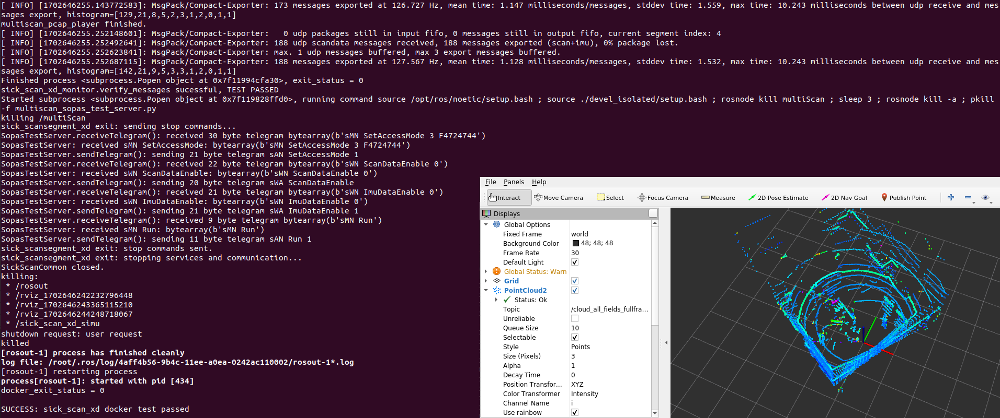
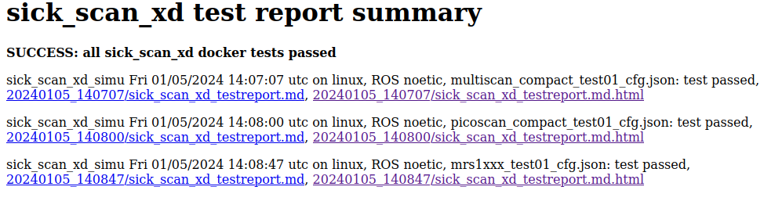
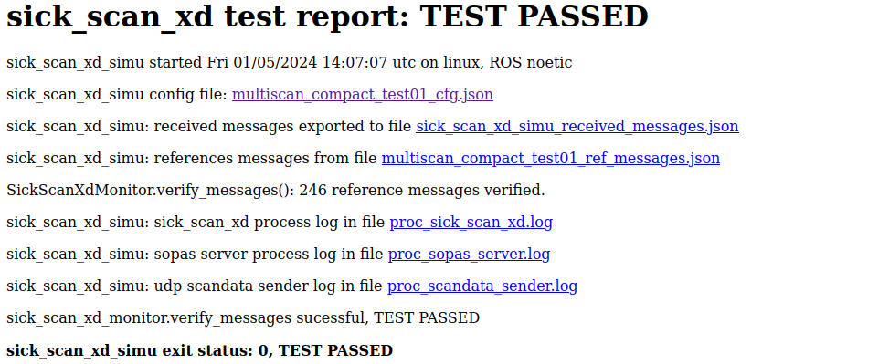
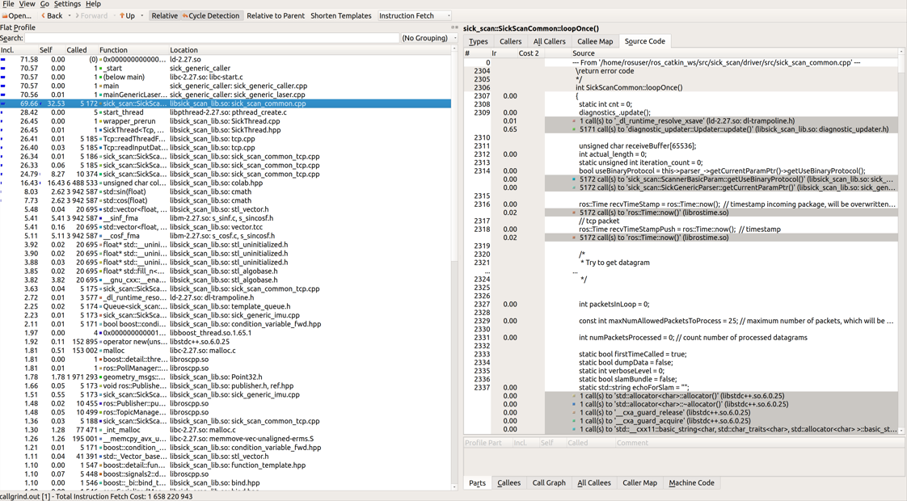
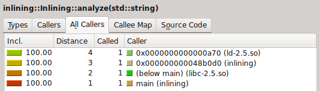

Executive Summary
---

This documentation is intended to provide background information on the maintenance and extension of the repository.

Table of Contents
---

- [Adding a new device to the driver](#adding-a-new-device-to-the-driver)
  - [Naming convention](#naming-convention)
  - [Launch files](#launch-files)
  - [Code modification](#code-modification)
- [Bloom releases](#bloom-releases)
  - [First time installation of toolchain](#first-time-installation-of-toolchain)
  - [Release build for ROS 1](#release-build-for-ros-1)
  - [Release build for ROS 2](#release-build-for-ros-2)
  - [Check status](#check-status)
  - [Useful links and information](#useful-links-and-information)
- [Unit tests](#unit-tests)
- [Docker testing](#docker-testing)
  - [Docker on Linux](#docker-on-linux)
      - [Build and run all sick\_scan\_xd docker tests on Linux](#build-and-run-all-sick_scan_xd-docker-tests-on-linux)
      - [Build and run sick\_scan\_xd for ROS 1 noetic](#build-and-run-sick_scan_xd-for-ros-1-noetic)
        - [Build and run with sick\_scan\_xd from local sources](#build-and-run-with-sick_scan_xd-from-local-sources)
        - [Build and run with sick\_scan\_xd sources from a git repository](#build-and-run-with-sick_scan_xd-sources-from-a-git-repository)
        - [Build and run with prebuilt sick\_scan\_xd binaries](#build-and-run-with-prebuilt-sick_scan_xd-binaries)
  - [Docker on Windows](#docker-on-windows)
    - [Build and run sick\_scan\_xd dockertests on Windows](#build-and-run-sick_scan_xd-dockertests-on-windows)
  - [Docker configuration](#docker-configuration)
    - [Test configuration](#test-configuration)
    - [Configuration of error test cases](#configuration-of-error-test-cases)
    - [Data export from docker container](#data-export-from-docker-container)
    - [Test reports](#test-reports)
    - [Data preparation](#data-preparation)
- [Simulation](#simulation)
  - [Simulation on Linux](#simulation-on-linux)
  - [Simulation on Windows](#simulation-on-windows)
- [Profiling](#profiling)
  - [Installation](#installation)
  - [Usage](#usage)

# Adding a new device to the driver

This driver is designed to support several sensor families from SICK. This documentation describes how to add additional devices to the driver.

## Naming convention

For each device type a name pattern is assigned as follows:
``
sick_<device family>_<identifier>
``

The name type is used in the code to decide which scanner-specific parameters are set.
The name type is passed as a parameter as follows:
```
<param name="scanner_type" type="string" value="sick_lms_5xx" />
```

## Launch files

A launch file is created for each device type, which usually has the same naming convention as the scanner type. To create a new device, it is recommended to copy, rename and edit an existing launch file.

## Code modification

1. Hint: Construction of parser:
    ```
    sick_scan_xd::SickGenericParser *parser = new sick_scan_xd::SickGenericParser(scannerName);
    ```
2. Add string constant like the constant SICK_SCANNER_RMS_XXXX_NAME

3. Append this constant to allowedScannerNames
   like allowedScannerNames.push_back(SICK_SCANNER_RMS_XXXX_NAME);
   in the file sick_generic_parser.cpp

4. Add new parameter block like
	```
	if (basicParams[i].getScannerName().compare(SICK_SCANNER_MRS_1XXX_NAME) == 0)
	{...
	} in the file sick_generic_parser.cpp
	```

5. Copy the file sick_generic_radar.cpp and add a new class following the structure
of this file.

# Bloom releases

Summary of bloom release build:

* Update release repositories for rosdistros noetic, humble, iron and jazzy with `bloom-release` on Linux:
   ```
   cd /tmp
   bloom-release --rosdistro noetic -d sick_scan_xd # update release repository https://github.com/SICKAG/sick_scan_xd-release.git, argument -d enables debug infos
   bloom-release --rosdistro humble -d sick_scan_xd # update release repository https://github.com/ros2-gbp/sick_scan_xd-release.git, argument -d enables debug infos
   bloom-release --rosdistro iron   -d sick_scan_xd # update release repository https://github.com/ros2-gbp/sick_scan_xd-release.git, argument -d enables debug infos
   bloom-release --rosdistro jazzy  -d sick_scan_xd # update release repository https://github.com/ros2-gbp/sick_scan_xd-release.git, argument -d enables debug infos
   ```
   Confirm "push to release" and "open pull request" with Y.
   If `bloom-release` is not installed, then install it by `sudo apt-get install python-bloom`.

* Check that the new version is committed in the release repositories https://github.com/SICKAG/sick_scan_xd-release.git (ROS 1) and https://github.com/ros2-gbp/sick_scan_xd-release.git (ROS 2).

* Check Jenkins build status (new Jenkins build after 0-3 days):
   * ROS 1 noetic jenkins build status: https://build.ros.org/job/Ndev__sick_scan_xd__ubuntu_focal_amd64/lastBuild/
   * ROS 2 humble jenkins build status: https://build.ros2.org/job/Hdev__sick_scan_xd__ubuntu_jammy_amd64/lastBuild/
   * ROS 2 iron jenkins build status: https://build.ros2.org/job/Idev__sick_scan_xd__ubuntu_jammy_amd64/lastBuild/
   * ROS 2 jazzy jenkins build status: https://build.ros2.org/job/Jdev__sick_scan_xd__ubuntu_noble_amd64/lastBuild/


* Check apt version after 4-6 weeks with `sudo apt show ros-<distro>-sick-scan-xd`:
   ```
   cd /tmp
   sudo apt update
   sudo apt show ros-noetic-sick-scan-xd
   sudo apt show ros-humble-sick-scan-xd
   sudo apt show ros-iron-sick-scan-xd
   sudo apt show ros-jazzy-sick-scan-xd
   ```

## First time installation of toolchain

1. Install on Linux:
    * Install bloom:
        ```
        sudo apt-get update
        sudo apt-get install python3-bloom python3-catkin-pkg
        ```
    * Install docker:
        ```
        pushd /tmp
        curl -fsSL https://get.docker.com -o get-docker.sh
        sudo sh get-docker.sh
        sudo usermod -aG docker $USER
        popd
        shutdown -r now # reboot
        # short quicktest
        docker --version
        docker info
        docker run hello-world
        ```
    * Install ros-buildfarm:
        ```
        # sudo apt-get install python3-ros-buildfarm # not successfully, unable to locate
        pip3 install ros-buildfarm # installs ros-buildfarm 3.0 successfully
        ```

2. Build the prerelease:
    * Short version to build a prerelease:
        * Run the following commands:
            ```
            mkdir -p ./ws_sick_scan_xd_bloom/src
            cd ./ws_sick_scan_xd_bloom/src
            git clone -b master https://github.com/SICKAG/sick_scan_xd.git
            cd ./sick_scan_xd/test/scripts
            ./run_linux_ros1_bloom.bash
            ```
        * Fix any errors during the prerelease build and check in
        * Repeat `./run_linux_ros1_bloom.bash` until the prerelease build finishes without errors
    * Alternative version:
        * Open http://prerelease.ros.org/noetic in the browser
        * Add a custom repository: `sick_scan_xd` , `https://github.com/SICKAG/sick_scan_xd` , `master` (or `feature/bloom_pretest` or any other branch to test)
        * Add a custom repository: `msgpack11` , `https://github.com/SICKAG/msgpack11` , `master`
        * Add a custom repository: `libsick_ldmrs` , `https://github.com/SICKAG/libsick_ldmrs` , `master`
        * Confirm next steps (i.e. URL of build farm: https://raw.githubusercontent.com/ros-infrastructure/ros_buildfarm_config/production/index.yaml, Ubuntu focal)
        * Click on `Generate command`
        * Run the generated command, i.e.:
            ```
            source /opt/ros/noetic/setup.bash
            mkdir -p /tmp/prerelease_job
            cd /tmp/prerelease_job
            generate_prerelease_script.py \
              https://raw.githubusercontent.com/ros-infrastructure/ros_buildfarm_config/production/index.yaml \
              noetic default ubuntu focal amd64 \
              --custom-repo \
                sick_scan_xd:git:https://github.com/SICKAG/sick_scan_xd:master \
                msgpack11:git:https://github.com/SICKAG/msgpack11:master \
                libsick_ldmrs:git:https://github.com/SICKAG/libsick_ldmrs:master \
              --level 1 \
              --output-dir ./
            ```
        * Run `printf "\033c" ; rm -rf ~/.ccache ; mkdir -p ~/.ccache ; ./prerelease.sh` in folder `/tmp/prerelease_job`
        * In case of error message `/usr/lib/ccache/cc is not able to compile a simple test program`:
            * Remove folder `~/.ccache` before running `./prerelease.sh`
            * See https://answers.ros.org/question/347063/error-pre-release-melodic/
        * Fix any errors during the prerelease build and check in
        * Remove the temporary build folder by `rm -rf /tmp/prerelease_job`
        * Repeat until `prerelease.sh` finishes without errors.

3. Submit package sick_scan_xd for indexing (noetic)
    * Fork `https://github.com/ros/rosdistro` -> `https://github.com/<username>/rosdistro.git`
    * `git clone https://github.com/<username>/rosdistro.git`
    * Edit file `rosdistro/noetic/distribution.yaml` and add after `sick_scan`:
        ```
        sick_scan_xd:
          doc:
            type: git
            url: https://github.com/SICKAG/sick_scan_xd.git
            version: master
        ```
    * `cd rosdistro ; source /opt/ros/noetic/setup.bash ; rosdistro_reformat file://"$(pwd)"/index.yaml`
    * git commit: `git commit -m "Adding sick_scan_xd to documentation index for distro noetic" distribution.yaml`
    * git push: `git push origin master`
    * Submit a pull request on `https://github.com/<username>/rosdistro`

4. For ROS 2 humble: Follow instructions on https://docs.ros.org/en/humble/How-To-Guides/Releasing/Releasing-a-Package.html

**_NOTE:_** Bloom releases for ROS 2 foxy are no longer supported (Pull request failed, "This pull request changes files for a ROS distribution that is no longer supported (End Of Life)")

* Submit package sick_scan_xd for indexing (ROS 2 humble)
  * Reset fork `https://github.com/<username>/rosdistro.git` to origin/master or delete the fork and create a new one -> `https://github.com/<username>/rosdistro.git`
  * `git clone https://github.com/<username>/rosdistro.git`
  * Edit file `rosdistro/humble/distribution.yaml` and add after `sick_safevisionary_ros2`:

      ```
      sick_scan_xd:
        doc:
          type: git
          url: https://github.com/SICKAG/sick_scan_xd.git
          version: develop
        status: developed
      ```

  * git commit and push ("Adding sick_scan_xd to documentation index for distro humble")
  * Submit a pull request on `https://github.com/<username>/rosdistro`
  * Do the same for any new ROS 2 version, e.g. iron and jazzy (`rosdistro/iron/distribution.yaml`, `rosdistro/jazzy/distribution.yaml`)
* [Start a new release team](https://github.com/ros2-gbp/ros2-gbp-github-org/issues/new?assignees=&labels=&template=new_release_team.md&title=Add+release+team)
  * ROS 2 sick_scan_xd team: https://github.com/orgs/ros2-gbp/teams/sick_scan_xd
  * ROS 2 sick_scan_xd release repository: https://github.com/ros2-gbp/sick_scan_xd-release

## Release build for ROS 1

* Build a prerelease (dry run in a docker container):
    * Run the following commands:
        ```
        git clone -b master https://github.com/SICKAG/sick_scan_xd.git
        cd ./sick_scan_xd/test/scripts
        sudo dos2unix ./*.bash ; sudo chmod a+x ./*.bash
        ./run_linux_ros1_bloom.bash
        ```
    * Fix any errors during the prerelease build and check in
    * Repeat `./run_linux_ros1_bloom.bash` until the prerelease build finishes without errors

* Build a binary release: follow https://wiki.ros.org/bloom/Tutorials/FirstTimeRelease
    * Update version number in package.xml, minor version number should be incremented at least
    * Create resp. update CHANGELOG.rst:
        ```
        source /opt/ros/noetic/setup.bash
        cd ./src/sick_scan_xd
        rm ./CHANGELOG.rst
        catkin_generate_changelog --all # create CHANGELOG.rst
        ```
    * Commit and pull all changes incl. CHANGELOG.rst and package.xml:
        ```
        git add CHANGELOG.rst package.xml
        git commit -m "Update CHANGELOG.rst and package version"
        git push
        ```
    * Run `catkin_prepare_release` and `bloom-release` in folder `src/sick_scan_xd`:
        ```
        source /opt/ros/noetic/setup.bash
        catkin_prepare_release -y
        bloom-release --rosdistro noetic --track noetic sick_scan_xd # at first time: call with option --edit for configuration
        ```
    * For the initial release (first time): Run `bloom-release` in folder `src/sick_scan_xd` with option `--edit`:
        ```
        source /opt/ros/noetic/setup.bash
        catkin_prepare_release -y
        bloom-release --rosdistro noetic --track noetic sick_scan_xd --edit
        Release repository url: https://github.com/SICKAG/sick_scan_xd-release.git
        upstream: <default, i.e. press ENTER>
        Upstream Repository URI: https://github.com/SICKAG/sick_scan_xd.git
        Upstream VCS Type: <default: git, i.e. press ENTER>
        Version: <default: auto, i.e. press ENTER>
        Release Tag: <default: version, i.e. press ENTER>
        Upstream Devel Branch: feature/bloom_pretest
        ROS Distro: noetic
        Patches Directory: <default: none, i.e. press ENTER>
        Release Repository Push URL:  <default: none, i.e. press ENTER>
        ```
    * Check status: https://index.ros.org/p/sick_scan_xd/#noetic
    * Install binary release: `sudo apt update ; sudo apt-get install ros-noetic-sick-scan-xd`. Note from https://wiki.ros.org/bloom/Tutorials/FirstTimeRelease : Packages built are periodically synchronized over to the shadow-fixed and public repositories, so it might take as long as a month before your package is available on the public ROS Debian repositories (i.e. available via apt-get).

## Release build for ROS 2

For ROS 2 follow the instructions on https://docs.ros.org/en/humble/How-To-Guides/Releasing/Releasing-a-Package.html :
* Checkout the sick_scan_xd version to be released and run:

    ```
    git clone -b master https://github.com/SICKAG/sick_scan_xd.git
    cd ./sick_scan_xd
    rm ./CHANGELOG.rst
    catkin_generate_changelog --all # create CHANGELOG.rst
    ```

* Commit CHANGELOG.rst and optional modifications:

    ```
    git add CHANGELOG.rst
    git commit -m "Update CHANGELOG.rst"
    git push
    ```

* Run `catkin_prepare_release` and `bloom-release`:

    ```
    bloom-release --rosdistro humble --track humble sick_scan_xd # at first time: call with option --new-track
    ```

    For the initial release (i.e. at the first time): Run bloom-release configuration with option --new-track:
    `bloom-release --new-track --rosdistro humble --track humble sick_scan_xd`
    * Release repository url: https://github.com/ros2-gbp/sick_scan_xd-release.git
    * Upstream: <default>
    * Upstream Repository URI: https://github.com/SICKAG/sick_scan_xd.git
    * Upstream Devel Branch: develop
    * ROS Distro: humble
    After the initial release has been approved: Run

    ```
    sudo rosdep init
    rosdep update
    ```

## Check status

Jenkins build status:
* ROS 1 noetic jenkins build status: https://build.ros.org/job/Ndev__sick_scan_xd__ubuntu_focal_amd64/lastBuild/
* ROS 2 humble jenkins build status: https://build.ros2.org/job/Hdev__sick_scan_xd__ubuntu_jammy_amd64/lastBuild/
* ROS 2 iron   jenkins build status: https://build.ros2.org/job/Idev__sick_scan_xd__ubuntu_jammy_amd64/lastBuild/
* ROS 2 jazzy  jenkins build status: https://build.ros2.org/job/Jdev__sick_scan_xd__ubuntu_noble_amd64/lastBuild/
* ROS 1 jenkins: https://build.ros.org/search/?q=sick_scan_xd
* ROS 2 jenkins: https://build.ros2.org/search/?q=sick_scan_xd

Release repositories:
* ROS 1 release repository: https://github.com/SICKAG/sick_scan_xd-release
* ROS 2 release repository: https://github.com/ros2-gbp/sick_scan_xd-release.git

Show version and list information about prebuilt binaries:

```
sudo apt update
sudo apt show ros-noetic-sick-scan-xd
sudo apt show ros-humble-sick-scan-xd
sudo apt show ros-iron-sick-scan-xd
sudo apt show ros-jazzy-sick-scan-xd
```

Installation of prebuilt binaries:

```
sudo apt update
sudo apt-get install ros-noetic-sick-scan-xd
sudo apt-get install ros-humble-sick-scan-xd
sudo apt-get install ros-iron-sick-scan-xd
sudo apt-get install ros-jazzy-sick-scan-xd
sudo apt-get remove ros-noetic-sick-scan-xd
sudo apt-get remove ros-humble-sick-scan-xd
sudo apt-get remove ros-iron-sick-scan-xd
sudo apt-get remove ros-jazzy-sick-scan-xd
```

## Useful links and information

* http://wiki.ros.org/bloom
* https://wiki.ros.org/bloom/Tutorials/FirstTimeRelease
* https://docs.ros.org/en/humble/How-To-Guides/Releasing/Releasing-a-Package.html

**Bloom builds an old sick_scan_xd version (ROS 1)**

Check `devel_branch` in https://github.com/SICKAG/sick_scan_xd-release/blob/master/tracks.yaml . If devel_branch is an old branch, replace it with e.g. `develop` or `master`, or update the `<devel_branch>` to a new version.

**Bloom builds an old sick_scan_xd version (ROS 2)**

Check `devel_branch` in https://github.com/ros2-gbp/sick_scan_xd-release/blob/master/tracks.yaml . If devel_branch is an old branch, replace it with e.g. `develop` or `master`, or update the `<devel_branch>` to a new version.

**Bloom builds a new sick_scan_xd version, but apt still installs an old version**

  * Check the sick_scan_xd version in the release repositories https://github.com/SICKAG/sick_scan_xd-release.git (ROS 1) and https://github.com/ros2-gbp/sick_scan_xd-release.git (ROS 2)
  * Install bloom (if not yet done) using `sudo apt-get install python-bloom` on Linux or `pip install -U bloom` on Windows
  * Run
        ```
        bloom-release --rosdistro noetic -d sick_scan_xd # release repository: https://github.com/SICKAG/sick_scan_xd-release.git, argument -d enables debug infos
        bloom-release --rosdistro humble -d sick_scan_xd # release repository: https://github.com/ros2-gbp/sick_scan_xd-release.git, argument -d enables debug infos
        bloom-release --rosdistro iron   -d sick_scan_xd # release repository: https://github.com/ros2-gbp/sick_scan_xd-release.git, argument -d enables debug infos
        bloom-release --rosdistro jazzy  -d sick_scan_xd # release repository: https://github.com/ros2-gbp/sick_scan_xd-release.git, argument -d enables debug infos
        ```
  * In case of GitHub 2FA errors: Follow http://wiki.ros.org/bloom/Tutorials/GithubManualAuthorization to create a 2FA token and configure the token in file `~/.config/bloom`.
  * Note: Updates of release repository https://github.com/SICKAG/sick_scan_xd-release.git require GitHub authentication via SSH. See https://docs.github.com/en/authentication/connecting-to-github-with-ssh and https://wiki.ros.org/bloom/Tutorials/GithubManualAuthorization for details.

# Unit tests

For a quick unit test after installation without the sensor hardware, a test server is provided to simulate a scanner. It implements a simple TCP server, which responds to binary cola messages and sends predefined LMDscandata to a TCP client. The sick_scan_xd driver can connect to the local test server instead of the lidar device for offline-tests. Please note, that this test server does not emulate a Lidar sensor. It just sends some simple scan data and response messages to a TCP client. It can be used for a quick unit test after build and install. To build the test server, activate cmake option `ENABLE_EMULATOR` in CMakeLists.txt and rebuild sick_scan_xd. By default, option `ENABLE_EMULATOR` is switched off.

For a unit test of LMS1xx, run the following commands in different terminals:

```
cd sick_scan_xd
source ./install/setup.bash

# Start sick_scan_xd emulator
roslaunch sick_scan_xd emulator_lms1xx.launch &
sleep 1

# Start rviz
rosrun rviz rviz -d ./src/sick_scan_xd/test/emulator/config/rviz_lms1xx.rviz &
sleep 1

# Start sick_scan_xd driver
roslaunch sick_scan_xd sick_lms_1xx.launch hostname:=127.0.0.1
```

For a unit test of LMS5xx, run the following commands in different terminals:

```
cd sick_scan_xd
source ./install/setup.bash

# Start sick_scan_xd emulator
roslaunch sick_scan_xd emulator_lms5xx.launch &
sleep 1

# Start rviz
rosrun rviz rviz -d ./src/sick_scan_xd/test/emulator/config/rviz_lms5xx.rviz &
sleep 1

# Start sick_scan_xd driver
roslaunch sick_scan_xd sick_lms_5xx.launch hostname:=127.0.0.1
```

For a unit test of LMS7xx, run the following commands in different terminals:

```
cd sick_scan_xd
source ./install/setup.bash

# Start sick_scan_xd emulator
roslaunch sick_scan_xd emulator_01_default.launch &
sleep 1

# Start rviz
rosrun rviz rviz -d ./src/sick_scan_xd/test/emulator/config/rviz_emulator_cfg.rviz &
sleep 1

# Start sick_scan_xd driver
roslaunch sick_scan_xd sick_tim_7xx.launch hostname:=127.0.0.1
```

For a unit test of LMS7xxS, run the following commands in different terminals:

```
cd sick_scan_xd
source ./install/setup.bash

# Start sick_scan_xd emulator
roslaunch sick_scan_xd emulator_01_default.launch &
sleep 1

# Start rviz
rosrun rviz rviz -d ./src/sick_scan_xd/test/emulator/config/rviz_emulator_cfg.rviz &
sleep 1

# Start sick_scan_xd driver
roslaunch sick_scan_xd sick_tim_7xxS.launch hostname:=127.0.0.1
```

Alternatively, you can just run the test scripts provided in folder `sick_scan_xd/test/scripts`:

```
cd sick_scan_xd/test/scripts
./makeall.bash
./run_simu_lms1xx.bash
./run_simu_lms5xx.bash
./run_simu_tim7xx_tim7xxS.bash
```

Make sure to finish all sick_scan_xd nodes after a test. All nodes can be killed by
```
rosnode kill -a ; sleep 1
killall sick_generic_caller ; sleep 1
killall sick_scan_emulator ; sleep 1
```

**Examples**

rviz example screenshots using sick_scan_xd with LMS1xx and LMS5xx test server:


rviz example screenshots using sick_scan_xd with LMS7xx and LMS7xxS test server:


Further examples are provided in folder `test/scripts`.

# Docker testing

## Docker on Linux

Run the following steps to install and run docker on Linux:

1. Install Docker: 
   * Follow the instructions on https://docs.docker.com/desktop/install/ubuntu/
   * or (more recommended) install Docker without Docker Desktop by running
  
      ```
      pushd /tmp
      curl -fsSL https://get.docker.com -o get-docker.sh
      sudo sh get-docker.sh
      sudo usermod -aG docker $USER
      popd
      ```

2. Reboot
3. Quicktest: Run 
   
    ```
    docker --version
    docker info
    docker run hello-world
    ```

4. Optionally install pandoc to generate html reports:
   
    ```
    sudo apt-get install pandoc
    ```

5. Optionally start "Docker Desktop" if installed (not required). Note:
   * "Docker Desktop" is not required to build and run sick_scan_xd in docker container, and
   * depending on your system, it runs qemu-system-x86 with high cpu and memory load.

#### Build and run all sick_scan_xd docker tests on Linux 

Script `run_all_dockertests_linux.bash` in folder `sick_scan_xd/test/docker` builds docker images for x64, ROS1 and ROS2 on Linux und runs all dockertests:

Create a workspace folder (e.g. sick_scan_ws or any other name) and clone the sick_scan_xd repository:

```
mkdir -p ./sick_scan_ws/src
cd ./sick_scan_ws/src
git clone -b develop https://github.com/SICKAG/sick_scan_xd.git```
```

Build and run all sick_scan_xd docker images and tests:

```
cd sick_scan_xd/test/docker
sudo chmod a+x ./*.bash
./run_all_dockertests_linux.bash
echo -e "docker test status = $?"
```

After successful build and run, the message **SUCCESS: sick_scan_xd docker test passed** will be displayed. Otherwise an error message **ERROR: sick_scan_xd docker test FAILED** is printed.

Dockerfiles to create linux docker images are provided in folder sick_scan_xd/test/docker/dockerfiles:

| Dockerfile                           | System                                      |
| ------------------------------------ | ------------------------------------------- |
| dockerfile_linux_x64_develop         | ubuntu 22.04 + cmake + python modules       |
| dockerfile_linux_ros1_noetic_develop | ubuntu 20.04 + ROS1 noetic + python modules |
| dockerfile_linux_ros2_humble_develop | ubuntu 22.04 + ROS2 humble + python modules |
| dockerfile_sick_scan_xd/linux_x64    | linux_x64_develop + sick_scan_xd            |
| dockerfile_sick_scan_xd/ros1_noetic  | linux_ros1_noetic_develop + sick_scan_xd    |
| dockerfile_sick_scan_xd/ros2_humble  | linux_ros2_humble_develop + sick_scan_xd    |

The following chapter gives a more detailed description of the build and run process for ROS1/Linux. The same process applies accordingly for dockertests of the C++ API, the Python API and ROS-2.

#### Build and run sick_scan_xd for ROS 1 noetic

This section describes how to
* build a docker image with ROS1 noetic on Linux
* build sick_scan_xd in the docker image
* run and test sick_scan_xd in the docker container

sick_scan_xd can be build from local sources, from git sources or it can be installed from prebuilt binaries.

##### Build and run with sick_scan_xd from local sources

The following instructions
* build a docker image with ROS1 noetic on Linux,
* build sick_scan_xd in the docker image from local sources, and
* run and test sick_scan_xd in the docker container against a multiScan100 emulator.

This is the recommended way for
* testing locally modified sick_scan_xd sources (e.g. pre-release tests), or 
* testing sick_scan_xd with sources cloned from a public gitlab or github repository (e.g. branch tests), or
* testing sick_scan_xd with sources cloned from a git repository requiring authentification.

Run the following steps to build and run sick_scan_xd for ROS1 noetic in a docker container on Linux:

1. Create a workspace folder, e.g. `sick_scan_ws` (or any other name):
   ```
   mkdir -p ./sick_scan_ws
   cd ./sick_scan_ws
   ```

2. Clone repository https://github.com/SICKAG/sick_scan_xd:
   ```
   mkdir ./src
   pushd ./src
   git clone -b master https://github.com/SICKAG/sick_scan_xd.git
   popd
   ```
   If you want to test sources from a different branch or repository, just replace the git call resp. the git url. If you want to test sources not yet released, just provide the modified sources in the src-folder.

2. Unzip `test/docker/data.zip` into folder `test/docker/data` 
   
3. Create a docker image named `sick_scan_xd/ros1_noetic` from dockerfile [src/sick_scan_xd/test/docker/dockerfiles/dockerfile_linux_ros1_noetic_sick_scan_xd](dockerfiles/dockerfile_linux_ros1_noetic_sick_scan_xd) with local sources in folder `./src/sick_scan_xd`:
   
   ```
   docker build --progress=plain -t sick_scan_xd/ros1_noetic -f ./src/sick_scan_xd/test/docker/dockerfiles/dockerfile_linux_ros1_noetic_sick_scan_xd .
   docker images -a # list all docker images
   ```

4. Run docker image `sick_scan_xd/ros1_noetic` and test sick_scan_xd with a simulated multiScan100 lidar:
5. Allow docker to display rviz
   
   ```
   xhost +local:docker
   ```

   Run sick_scan_xd simulation in docker container sick_scan_xd/ros1_noetic

   ```
   docker run -it --name sick_scan_xd_container -v /tmp/.X11-unix:/tmp/.X11-unix --env=DISPLAY -w /workspace sick_scan_xd/ros1_noetic python3 ./src/sick_scan_xd/test/docker/python/sick_scan_xd_simu.py --ros=noetic --cfg=./src/sick_scan_xd/test/docker/data/multiscan_compact_test01_cfg.json
   ```

   Check docker exit status (0: success, otherwise error)

   ```
   docker_exit_status=$?
   echo -e "docker_exit_status = $docker_exit_status"
   if [ $docker_exit_status -eq 0 ] ; then echo -e "\nSUCCESS: sick_scan_xd docker test passed\n" ; else echo -e "\n## ERROR: sick_scan_xd docker test FAILED\n" ; fi
   ```

   If all tests were passed, i.e. all expected Pointcloud-, Laserscan- and IMU-messages have been verified, docker returns with exit status 0 and the message `SUCCESS: sick_scan_xd docker test passed` is displayed. Otherwise docker returns with an error code and the message `## ERROR: sick_scan_xd docker test FAILED` is displayed.

6. To optionally cleanup and uninstall all containers and images, run the following commands:
   ```
   docker ps -a -q # list all docker container
   docker stop $(docker ps -a -q)
   docker rm $(docker ps -a -q)
   docker system prune -a -f
   docker volume prune -f
   docker images -a # list all docker images 
   ```
   
   Remove all docker images if needed.
   As a general rule, the images do not need to be deleted. Therefore, the following point should be skipped by default.
   
   ```
   docker rmi -f $(docker images -a)  # Usually not needed. Therefore skip it by default.
   ```
   
   This will remove **all** docker logfiles, images, containers and caches.

##### Build and run with sick_scan_xd sources from a git repository

By default, sick_scan_xd sources are provided in the local folder `./src/sick_scan_xd`. This source folder is just copied into the docker image and used to build sick_scan_xd. This step is executed by the COPY command in the [dockerfile](dockerfiles/dockerfile_linux_ros1_noetic_sick_scan_xd):

```
COPY ./src/sick_scan_xd /workspace/src/sick_scan_xd
```

This docker command copies the local folder `./src/sick_scan_xd` into the docker image (destination folder in the docker image is `/workspace/src/sick_scan_xd`). This default option is useful to test new sick_scan_xd versions or release candidates before check in, or to test a local copy of sick_scan_xd from sources requiring authorization.

Alternatively, docker can build sick_scan_xd from a public git repository like https://github.com/SICKAG/sick_scan_xd. A git repository can be set by docker build option `--build-arg SICK_SCAN_XD_GIT_URL=<sick_scan_xd-git-url>`, e.g. `--build-arg SICK_SCAN_XD_GIT_URL=https://github.com/SICKAG/sick_scan_xd`. Replace the `docker build ....` command in step 3 by:

Create a docker image named "sick_scan_xd/ros1_noetic" from dockerfile "./sick_scan_xd/test/docker/dockerfiles/dockerfile_linux_ros1_noetic_sick_scan_xd" with github sources from https://github.com/SICKAG/sick_scan_xd

```
docker build --build-arg SICK_SCAN_XD_GIT_URL=https://github.com/SICKAG/sick_scan_xd --progress=plain -t sick_scan_xd/ros1_noetic -f ./src/sick_scan_xd/test/docker/dockerfiles/dockerfile_linux_ros1_noetic_sick_scan_xd .
```

If option `SICK_SCAN_XD_GIT_URL` is set, the docker build command in the [dockerfile](dockerfiles/dockerfile_linux_ros1_noetic_sick_scan_xd) clones the given repository:

```
RUN /bin/bash -c "if [ $SICK_SCAN_XD_GIT_URL != $NONE ] ; then ( pushd /workspace/src ; rm -rf ./sick_scan_xd ; git clone -b master $SICK_SCAN_XD_GIT_URL ; popd ) ; fi"
```

After a successful build, run and test sick_scan_xd in the docker container as described above in step 4:
```
xhost +local:docker
docker run -it --name sick_scan_xd_container -v /tmp/.X11-unix:/tmp/.X11-unix --env=DISPLAY -w /workspace sick_scan_xd/ros1_noetic python3 ./src/sick_scan_xd/test/docker/python/sick_scan_xd_simu.py --ros=noetic --cfg=./src/sick_scan_xd/test/docker/data/multiscan_compact_test01_cfg.json
```

##### Build and run with prebuilt sick_scan_xd binaries

Alternatively, docker can install a prebuild sick_scan_xd binary using apt-get, e.g. `apt-get install -y ros-noetic-sick-scan-xd`. Use docker build options `--build-arg SICK_SCAN_XD_APT_PKG=ros-noetic-sick-scan-xd --build-arg SICK_SCAN_XD_BUILD_FROM_SOURCES=0` to install a prebuild sick_scan_xd binary in the docker image, e.g.

Create a docker image named "sick_scan_xd/ros1_noetic" from dockerfile "./sick_scan_xd/test/docker/dockerfiles/dockerfile_linux_ros1_noetic_sick_scan_xd" with "apt-get install ros-noetic-sick-scan-xd"


```
docker build --build-arg SICK_SCAN_XD_APT_PKG=ros-noetic-sick-scan-xd --build-arg SICK_SCAN_XD_BUILD_FROM_SOURCES=0 --progress=plain -t sick_scan_xd/ros1_noetic -f ./src/sick_scan_xd/test/docker/dockerfiles/dockerfile_linux_ros1_noetic_sick_scan_xd .
```

After a successful build, run and test sick_scan_xd in the docker container as described above in step 4:
```
xhost +local:docker
docker run -it --name sick_scan_xd_container -v /tmp/.X11-unix:/tmp/.X11-unix --env=DISPLAY -w /workspace sick_scan_xd/ros1_noetic python3 ./src/sick_scan_xd/test/docker/python/sick_scan_xd_simu.py --ros=noetic --cfg=./src/sick_scan_xd/test/docker/data/multiscan_compact_test01_cfg.json
```

To install other prebuilt sick_scan_xd binaries, replace command `apt-get install -y $SICK_SCAN_XD_APT_PKG` in the [dockerfile](dockerfiles/dockerfile_linux_ros1_noetic_sick_scan_xd) by a customized procedure.

## Docker on Windows

Download and install the Docker Desktop https://desktop.docker.com/win/main/amd64/Docker%20Desktop%20Installer.exe and run "Docker Desktop" as admin.

Note:
* The windows version of the docker container must match the windows version on the docker host.
* Hyper-V must be enabled, see https://learn.microsoft.com/en-us/virtualization/hyper-v-on-windows/quick-start/enable-hyper-v
* Docker must be set to use Windows containers, not the default Linux containers:
   * Open Settings in Docker Desktop and disable WSL ("Use the WSL 2 based engine": OFF)
   * Run `"%ProgramFiles%\Docker\Docker\DockerCli.exe" -SwitchDaemon .`
* If you encounter errors during windows or package installation, check or disable anti-virus software and try again.
* Docker commands `docker system prune -a` and `docker volume prune -f` remove all container and might help in case of problems.
* Building a Windows docker image incl. Visual Studio Compiler may take several hours. Take care of your newly created docker image, do not delete it if you do not have to!
* Use `docker image save -o images.tar image1 [image2 ...]` to save any images you want to keep to a local tar file.
* Use `use docker image load -i images.tar` to restore previously saved images.
* Docker uploads a complete copy of the working directory to the docker daemon when running `docker build`. Exclude large folders using a `.dockerignore` file. The `.dockerignore` file must be in the current working directory when running `docker build`. Copy `sick_scan_xd\.dockerignore` if you are executing `docker build` in another folder.

Dockerfiles to create a windows docker image are provided in folder sick_scan_xd/test/docker/dockerfiles:

| Dockerfile                                    | System                                                                                                                  |
| --------------------------------------------- | ----------------------------------------------------------------------------------------------------------------------- |
| dockerfile_windows_x64_buildtools             | Windows core (mcr.microsoft.com/windows) + build tools incl. Visual Studio compiler (vs_buildtools)                     |
| dockerfile_windows_x64_develop                | windows_x64_buildtools + vcpkg + jsoncpp + cmake + python                                                               |
| dockerfile_windows_x64_sick_scan_xd           | windows_x64_develop + sick_scan_xd                                                                                      |
| dockerfile_windows_dotnet48_buildtools        | Windows core with .NET 4.8 (required by chocolatey and ROS2) + build tools incl. Visual Studio compiler (vs_buildtools) |
| dockerfile_windows_dotnet48_develop           | windows_dotnet48_buildtools + chocolatey + cmake + python                                                               |
| dockerfile_windows_dotnet48_ros2_foxy         | windows_dotnet48_develop + ROS2 foxy                                                                                    |
| dockerfile_windows_dotnet48_ros2_humble       | windows_dotnet48_develop + ROS2 humble                                                                                  |
| dockerfile_windows_dotnet48_ros2_sick_scan_xd | windows_dotnet48_ros2_humble + sick_scan_xd                                                                             |

### Build and run sick_scan_xd dockertests on Windows

Start docker desktop and load docker images windows_x64_develop.tar and windows_dotnet48_ros2_humble.tar:
```
docker image load -i windows_x64_develop.tar
docker image load -i windows_dotnet48_ros2_humble.tar
```
If you do not have these docker images, run `build_dockerimage_windows_x64_sick_scan_xd.cmd` in folder `sick_scan_xd/test/docker` to build them. Note that the Windows docker build process is very timeconsuming; using existing docker images is therefore recommended.

Script `run_all_dockertests_windows.cmd` in folder `sick_scan_xd/test/docker` builds the docker image for Windows und runs all dockertests:

```
REM Create a workspace folder (e.g. sick_scan_ws or any other name) and clone the sick_scan_xd repository:
mkdir sick_scan_ws\src
cd sick_scan_ws\src
git clone -b develop https://github.com/SICKAG/sick_scan_xd.git
REM Build and run all sick_scan_xd docker images and tests:
cd sick_scan_xd\test\docker
run_all_dockertests_windows.cmd
```

After successful build and run, the message **SUCCESS: sick_scan_xd docker test passed** will be displayed. Otherwise an error message **ERROR: sick_scan_xd docker test FAILED** is printed.

##  Docker configuration

The docker container currently supports sick_scan_xd testing with ROS 1 noetic on Linux with a multiScan100, picoScan100 and MRS1000 emulators. Python script [sick_scan_xd_simu.py](python/sick_scan_xd_simu.py) runs the following steps to verify sick_scan_xd:

* starts a tiny SOPAS test server to emulate SOPAS responses of a multiScan100, picoScan100 or MRS1000,
* launches sick_scan_xd,
* starts rviz to display pointclouds and laserscan messages,
* replays UDP packets with scan data, which previously have been recorded and converted to json-file,
* receives the pointcloud-, laserscan- and IMU-messages published by sick_scan_xd,
* compares the received messages to predefined reference messages,
* checks against errors and verifies complete and correct messages, and
* returns status 0 for success or an error code in case of any failures.

The following screenshot shows an example of a successful sick_scan_xd multiScan100 test in a docker container:



### Test configuration

Test cases are configured by a json file. Currently sick_scan_xd provides configuration files for docker tests for the following lidars:
* multiScan100 docker test: [multiscan_compact_test01_cfg.json](test/docker/data/multiscan_compact_test01_cfg.json)
* picoScan100 docker test: [picoscan_compact_test01_cfg.json](test/docker/data/picoscan_compact_test01_cfg.json)
* LMS1xx docker test: [lms1xx_test01_cfg.json](test/docker/data/lms1xx_test01_cfg.json)
* LMS1000 docker test: [lms1xxx_test01_cfg.json](test/docker/data/lms1xxx_test01_cfg.json)
* LMS4000 docker test: [lms4xxx_test01_cfg.json](test/docker/data/lms4xxx_test01_cfg.json)
* LMS5xx docker test: [lms5xx_test01_cfg.json](test/docker/data/lms5xx_test01_cfg.json)
* LD-LRS36x0 docker test: [lrs36x0_test01_cfg.json](test/docker/data/lrs36x0_test01_cfg.json)
* LD-LRS36x1 docker test: [lrs36x1_test01_cfg.json](test/docker/data/lrs36x1_test01_cfg.json)
* LRS4000 docker test: [lrs4xxx_test01_cfg.json](test/docker/data/lrs4xxx_test01_cfg.json)
* MRS1000 docker test: [mrs1xxx_test01_cfg.json](test/docker/data/mrs1xxx_test01_cfg.json)
* MRS6000 docker test: [mrs6xxx_test01_cfg.json](test/docker/data/mrs6xxx_test01_cfg.json)
* NAV2xx/3xx docker test: [nav350_test01_cfg.json](test/docker/data/nav350_test01_cfg.json)
* LD-OEM15xx docker test: [oem15xx_test01_cfg.json](test/docker/data/oem15xx_test01_cfg.json)
* RMS1000/RS2000 docker test: [rmsxxxx_test01_cfg.json](test/docker/data/rmsxxxx_test01_cfg.json)
* TiM240 docker test: [tim240_test01_cfg.json](test/docker/data/tim240_test01_cfg.json)
* TiM4xx docker test: [tim4xx_test01_cfg.json](test/docker/data/tim4xx_test01_cfg.json)
* TiM5xx docker test: [tim5xx_test01_cfg.json](test/docker/data/tim5xx_test01_cfg.json)
* TiM7xx docker test: [tim7xx_test01_cfg.json](test/docker/data/tim7xx_test01_cfg.json)
* TiM7xxS docker test: [tim7xxs_test01_cfg.json](test/docker/data/tim7xxs_test01_cfg.json)

To execute these test cases in a Linux noetic docker container, run the following commands:

Test sick_scan_xd against multiScan100 emulator

```
docker run -it --name sick_scan_xd_container_multiscan_compact_test01 -v /tmp/.X11-unix:/tmp/.X11-unix --env=DISPLAY -w /workspace sick_scan_xd/ros1_noetic python3 ./src/sick_scan_xd/test/docker/python/sick_scan_xd_simu.py --ros=noetic --cfg=./src/sick_scan_xd/test/docker/data/multiscan_compact_test01_cfg.json
```

Test sick_scan_xd against multiScan100 emulator

```
docker run -it --name sick_scan_xd_container_picoscan_compact_test01 -v /tmp/.X11-unix:/tmp/.X11-unix --env=DISPLAY -w /workspace sick_scan_xd/ros1_noetic python3 ./src/sick_scan_xd/test/docker/python/sick_scan_xd_simu.py --ros=noetic --cfg=./src/sick_scan_xd/test/docker/data/picoscan_compact_test01_cfg.json
```

Test sick_scan_xd against MRS1000 emulator

```
docker run -it --name sick_scan_xd_container_mrs1xxx_test01 -v /tmp/.X11-unix:/tmp/.X11-unix --env=DISPLAY -w /workspace sick_scan_xd/ros1_noetic python3 ./src/sick_scan_xd/test/docker/python/sick_scan_xd_simu.py --ros=noetic --cfg=./src/sick_scan_xd/test/docker/data/mrs1xxx_test01_cfg.json
```

Use the configuration files as a template for new test cases resp. different devices if required. Visualization with rviz is deactivated by default. Use sick_scan_xd_simu.py option `--run_rviz=1` to activate rviz visualization for development or debugging.

### Configuration of error test cases

In addition to the test cases above, some exemplary error test cases are provided for docker tests:
* multiScan100 error test: [multiscan_compact_errortest01_cfg.json](test/docker/data/multiscan_compact_errortest01_cfg.json) - this test case simulates a multiScan100 error (lidar does not send scan data)
* picoScan100 error test: [picoscan_compact_errortest01_cfg.json](test/docker/data/picoscan_compact_errortest01_cfg.json) - this test case simulates a network error (picoScan100 not reachable, no tcp connection and lidar does not respond to SOPAS requests)

Note that these configurations causes the docker test to fail and result in the status **TEST FAILED**.

### Data export from docker container

Use command `docker cp <container_id>:<src_path> <local_dst_path>` to export all sick_scan_xd logfiles from the docker container:

Export sick_scan_xd output folder from docker container to local folder ./log/sick_scan_xd_simu

```
docker ps -a # list all container
mkdir -p ./log
docker cp $(docker ps -aqf "name=sick_scan_xd_container_multiscan_compact_test01"):/workspace/log/sick_scan_xd_simu ./log
docker cp $(docker ps -aqf "name=sick_scan_xd_container_picoscan_compact_test01"):/workspace/log/sick_scan_xd_simu ./log
docker cp $(docker ps -aqf "name=sick_scan_xd_container_mrs1xxx_test01"):/workspace/log/sick_scan_xd_simu ./log
```

After successful test and data export, the sick_scan_xd container can be deleted by

```
docker rm $(docker ps -aqf "name=sick_scan_xd_container_multiscan_compact_test01")
docker rm $(docker ps -aqf "name=sick_scan_xd_container_picoscan_compact_test01")
docker rm $(docker ps -aqf "name=sick_scan_xd_container_mrs1xxx_test01")
```

Alternatively, use command `docker rm $(docker ps -aq)` to delete all docker container.

### Test reports

Each docker test saves logfiles and json files and generates a test report in log folder `/workspace/log/sick_scan_xd_simu/<date_time>` with `<date_time>` in format `<YYYYMMDD_hhmmss>`. Script `run_dockerfile_linux_ros1_noetic_sick_scan_xd.bash` runs all docker tests and converts the test reports to html with pandoc. Use the commands above to copy the log folder from the docker container to your local host and open file `log/sick_scan_xd_simu/sick_scan_xd_testreport.md.html` in a browser. The following screenshot shows a test summary and a test report of a successful multiScan100 docker test:





### Data preparation

Both scan data and reference messages must be prepared and provided for testing sick_scan_xd. Scan data is typically captured by Wireshark and converted to json. They are replayed by [multiscan_pcap_player.py](../python/multiscan_pcap_player.py) resp.[sopas_json_test_server.py](../python/sopas_json_test_server.py) during testing to emulate a lidar. Reference messages are used to verify the poin tcloud-, laserscan- and optional IMU-messages published by sick_scan_xd. They can be generated by saving the messages of a successful test. In this case the messages must be manually checked e.g. by using rviz. Make sure that the messages saved as a reference are correct, i.e. rviz displays the point clouds and laserscans correctly and consistent with the real scene observed by the lidar. This section describes how to record and convert these data.

**Scan data preparation**

Run the following steps to prepare scan data for sick_scan_xd testing:

1. Record scan data using Wireshark:
   * Install sick_scan_xd
   * Connect the device, e.g. multiScan100
   * Start Wireshark
   * Run sick_scan_xd, e.g. on Linux with ROS-1 by `roslaunch sick_multiscan.launch hostname:="192.168.0.1" udp_receiver_ip:="192.168.0.100"`
   * Check point clouds and laserscans with `rviz`
   * Save the network traffic in a pcapng-file by Wireshark

2. For multiScan100 and picoScan100: Play the pcapng-file for a short time (e.g. 1 second) using [multiscan_pcap_player.py](test/docker/python/multiscan_pcap_player.py) and save UDP packets in a json file.
   Example to convert the recorded pcapng-file `20231009-multiscan-compact-imu-01.pcapng` to json-file `multiscan_compact_test01_udp_scandata.json`:
   ```
   python3 ./src/sick_scan_xd/test/python/multiscan_pcap_player.py --pcap_filename=./src/sick_scan_xd/test/emulator/scandata/20231009-multiscan-compact-imu-01.pcapng --udp_port=-1 --repeat=1 --verbose=0 --filter=pcap_filter_multiscan_hildesheim --max_seconds=1 --save_udp_jsonfile=./src/sick_scan_xd/test/docker/data/multiscan_compact_test01_udp_scandata.json
   ```
   Example to convert the recorded pcapng-file `20230911-picoscan-compact.pcapng` to json-file `picoscan_compact_test01_udp_scandata.json`:
   ```
   python3 ./src/sick_scan_xd/test/python/multiscan_pcap_player.py --pcap_filename=./src/sick_scan_xd/test/emulator/scandata/20230911-picoscan-compact.pcapng --udp_port=-1 --repeat=1 --verbose=0 --filter=pcap_filter_multiscan_hildesheim --max_seconds=1 --save_udp_jsonfile=./src/sick_scan_xd/test/docker/data/picoscan_compact_test01_udp_scandata.json
   ```
3. For lidars using SOPAS LMDscandata over TCP (e.g. MRS1000): Convert the pcapng-file to json file with [pcap_json_converter.py](test/docker/pcap_json_converter/pcap_json_converter.py).
   Example for MRS1000:
   ```
   python3 ./src/sick_scan_xd/test/pcap_json_converter/pcap_json_converter.py --pcap_filename=./src/sick_scan_xd/test/emulator/scandata/20211201_MRS_1xxx_IMU_with_movement.pcapng
   mv ./src/sick_scan_xd/test/emulator/scandata/20211201_MRS_1xxx_IMU_with_movement.pcapng.json ./src/sick_scan_xd/test/docker/data/mrs1xxx_test01_tcp_data.json
   ```

**Generation of reference messages**

Run the following steps to generate reference messages for sick_scan_xd testing:

1. Build sick_scan_xd for ROS1 as described in "Build on Linux ROS1" and start environment:
   ```
   source /opt/ros/noetic/setup.bash
   source ./devel_isolated/setup.bash
   roscore &
   rviz &
   ```

2. Run [sick_scan_xd_simu.py](test/docker/python/sick_scan_xd_simu.py) and save messages in a json-file.
   Example for a multiScan100 test case:
   ```
   python3 ./src/sick_scan_xd/test/docker/python/sick_scan_xd_simu.py --ros=noetic --save_messages_jsonfile=received_messages.json --cfg=./src/sick_scan_xd/test/docker/data/multiscan_compact_test01_cfg.json
   ```
   Example for a picoScan100 test case:
   ```
   python3 ./src/sick_scan_xd/test/docker/python/sick_scan_xd_simu.py --ros=noetic --save_messages_jsonfile=received_messages.json --cfg=./src/sick_scan_xd/test/docker/data/picoscan_compact_test01_cfg.json
   ```
   Example for a MRS1000 test case:
   ```
   python3 ./src/sick_scan_xd/test/docker/python/sick_scan_xd_simu.py --ros=noetic --save_messages_jsonfile=received_messages.json --cfg=./src/sick_scan_xd/test/docker/data/mrs1xxx_test01_cfg.json --run_seconds=5
   ```
3. Make sure that the messages saved as a reference are correct, i.e. rviz displays the point clouds and laserscans correctly and consistent with the real scene observed by the lidar. For lidars with IMU data support, use `rostopic echo <imu topic>` to verify plausible IMU data. Use parameter `--run_seconds=<sec>` to run the simulation as long as needed for the manual verification. For multiScan100 and picoScan100, increase parameter `./src/sick_scan_xd/test/python/multiscan_pcap_player.py --repeat=<number of repetitions> ...` in the configuration file to run longer simulations.
4. After manual verification, rename the generated json-file `received_messages.json` and use it as reference messages in your test configuration, e.g. [multiscan_compact_test01_ref_messages.json](data/multiscan_compact_test01_ref_messages.json) for the multiScan100 test case.

# Simulation

For unit tests without sensor hardware, a simple test server is provided. To build the test server, call either cmake with option `-DCMAKE_ENABLE_EMULATOR=1`, or activate cmake option `ENABLE_EMULATOR` in CMakeLists.txt. Then rebuild sick_scan_xd. By default, option `ENABLE_EMULATOR` is switched off. Please note that this just builds a simple test server for basic unit tests of sick_scan_xd drivers. Its purpose is to run basic tests and to help with diagnosis in case of issues. It does not emulate a real scanner. Simulation requires jsoncpp. Install with `sudo apt-get install libjsoncpp-dev` on Linux and with `vcpkg install jsoncpp:x64-windows` on Windows. You can find examples to test and run sick_scan_xd in offline mode in folder `test/scripts`. Their purpose is to demonstrate the usage of the sick_scan_xd driver. Please feel free to customize the scripts or use them as a starting point for own projects.
On Windows, add -DCMAKE_TOOLCHAIN_FILE=C:/vcpkg/scripts/buildsystems/vcpkg.cmake to instruct CMake to search for installed packages in the vcpkg environment.
Adjust this path if you have not installed `vcpkg` in `C:/vcpkg`.

## Simulation on Linux

Run script `run_simu_lms_5xx.bash` in folder `test/scripts` or execute the following commands:

1. Start the test server:
    ```
    python3 ./test/emulator/test_server.py --scandata_file=./test/emulator/scandata/20210302_lms511.pcapng.scandata.txt --scandata_frequency=20.0 --tcp_port=2112 &
    sleep 1
    ```

2. Run sick_generic_caller.
    - On native Linux:
         ```
        ./build/sick_generic_caller ./launch/sick_lms_5xx.launch hostname:=127.0.0.1 sw_pll_only_publish:=False &
        ```
    - On Linux with ROS 1:
         ```
        roslaunch sick_scan_xd sick_lms_5xx.launch hostname:=127.0.0.1 sw_pll_only_publish:=False &
        ```
    - On Linux with ROS 2:
         ```
        ros2 run sick_scan_xd sick_generic_caller ./src/sick_scan_xd/launch/sick_lms_5xx.launch hostname:=127.0.0.1 sw_pll_only_publish:=False &
        ```

3. View the point cloud.
    - On native Linux:
         Open file `image_viewer.html` in folder `demo` in a browser (f.e. firefox) to view a jpg-image of the current scan.
    - On Linux with ROS 1:
         ```
        rosrun rviz rviz -d ./src/sick_scan_xd/test/emulator/config/rviz_emulator_cfg_lms5xx.rviz &
        ```
    - On Linux with ROS 2:
         ```
        rviz2 -d ./src/sick_scan_xd/test/emulator/config/rviz2_lms5xx.rviz &
        ```

Further examples are provided in folder `test/scripts`.

## Simulation on Windows

Run script `run_simu_lms_5xx.cmd` in folder `test/scripts` or execute the following commands:

1. Start the test server:
    ```
    cd .\build
    start "testserver" cmd /k python ../test/emulator/test_server.py --scandata_file=../test/emulator/scandata/20210302_lms511.pcapng.scandata.txt --scandata_frequency=20.0 --tcp_port=2112
    @timeout /t 1
    ```

2. Run sick_generic_caller. On native Windows:
    ```
    .\Debug\sick_generic_caller.exe ../launch/sick_lms_5xx.launch hostname:=127.0.0.1 sw_pll_only_publish:=False
    ```
    On Windows with ROS 2:
    ```
    ros2 run sick_scan_xd sick_generic_caller ./src/sick_scan_xd/launch/sick_lms_5xx.launch hostname:=127.0.0.1 sw_pll_only_publish:=False
    ```

3. Open file `image_viewer.html` in folder `demo` in your browser to view a jpg-image of the current scan.

Note, that python version 3 incl. runtime dlls must be accessible, f.e. by extending the PATH environment variable:
```
set PYTHON_DIR=%ProgramFiles(x86)%/Microsoft Visual Studio/Shared/Python37_64
set PATH=%PYTHON_DIR%;%PYTHON_DIR%/Scripts;c:\vcpkg;%PATH%
```

Further examples are provided in folder `test/scripts`.

# Profiling

Since the existing node can basically be used on different platforms, bottlenecks can occur with weak hardware. To better analyze these bottlenecks, software profiling can be performed.
The following example shows how to perform profiling. For further details on profiling, please refer to https://baptiste-wicht.com/posts/2011/09/profile-c-application-with-callgrind-kcachegrind.html, for example.

## Installation

First of all, you need to install Callgrind and KCachegrind.
You also need to install graphviz in order to view the call graph in KCachegrind. The applications are already packaged for the most important Linux distributions. You can just use apt-get to install them:

```
sudo apt-get install valgrind kcachegrind graphviz
```

## Usage

We have to start by profiling the application with Callgrind. To profile an application with Callgrind, you just have to prepend the Callgrind invocation in front of your normal program invocation:

```
valgrind --tool=callgrind program [program_options]
```

In order to establish a reference to the source code during profiling, the program must be compiled with debug symbols, this can be done with catkin_make

```
catkin_make install -DCMAKE_BUILD_TYPE=Debug
```

It is necessary to create a rosmaster so that the sick_scan_xd node can connect to it because we can't use roslaunch during profiling.

```
roscore
```

To set the parameters we start a node as usual with roslaunch.

```
roslaunch sick_scan_xd sick_lms_5xx.launch hostname:=192.168.0.151
```

While this node is running we can use ```ps -aef| grep sick_scan_xd``` to determine the program path and the call parameters.

```
rosuser@ROS-NB:~$ ps -aef|grep sick_scan_xd
rosuser   4839  2443  0 14:43 pts/1    00:00:00 /usr/bin/python /opt/ros/melodic/bin/roslaunch sick_scan_xd sick_lms_5xx.launch hostname:=192.168.0.151
rosuser   4854  4839  1 14:43 ?        00:00:03 /home/rosuser/ros_catkin_ws/devel/lib/sick_scan_xd/sick_generic_caller __name:=sick_lms_5xx __log:=/home/rosuser/.ros/log/f9861670-304c-11e9-9839-54e1ad2921b6/sick_lms_5xx-1.log
rosuser   4910  4875  0 14:46 pts/6    00:00:00 grep --color=auto sick_scan_xd
```

now we can close the node and restart with callgrid

```
valgrind --tool=callgrind program /home/rosuser/ros_catkin_ws/devel/lib/sick_scan_xd/sick_generic_caller __name:=sick_lms_5xx
```

The result will be stored in a callgrind.out.XXX file where XXX will be the process identifier. You can read this file using a text editor, but it won't be very useful because it's very cryptic. That's why KCacheGrind will be useful. You can launch KCacheGrind using command line or in the program menu if your system installed it here. Then, you have to open your profile file. The first view present a list of all the profiled functions. You can see the inclusive and the self cost of each function and the location of each one.



Once you click on a function, the other views are filled with information. The view in upper right part of the window gives some information about the selected function.



The view have several tabs presenting different information:

* Types : Present the types of events that have been recorded. In our case, it's not really interesting, it's just the number of instructions fetch
* Callers : List of the direct callers.
* All Callers : List of all the callers, it seems the callers and the callers of the callers.
* Callee Map : A map of the callee, personally, I do not really understand this view, but it's a kind of call graph representing the cost of the functions.
* Source code : The source code of the function if the application has been compiled with the debug symbol.

And finally, you have another view with data about the selected function.


Again, several tabs:

* Callees : The direct callees of the function
* Call Graph : The call graph from the function to the end
* All Callees : All the callees and the callees of the callees
* Caller Map : All functions are represented as blocks the size corresponds to their CPU time. Callees are stacked on the callers.
* Machine Code : The machine code of the function if the application has been profiled with --dump-instr=yes option

You have also several display options and filter features to find exactly what you want and display it the way you want.

The information provided by KCacheGrind can be very useful to find which functions takes too much time or which functions are called too much. This text is an adopted version of https://baptiste-wicht.com/posts/2011/09/profile-c-application-with-callgrind-kcachegrind.html. Thanks to Baptiste Wicht.
