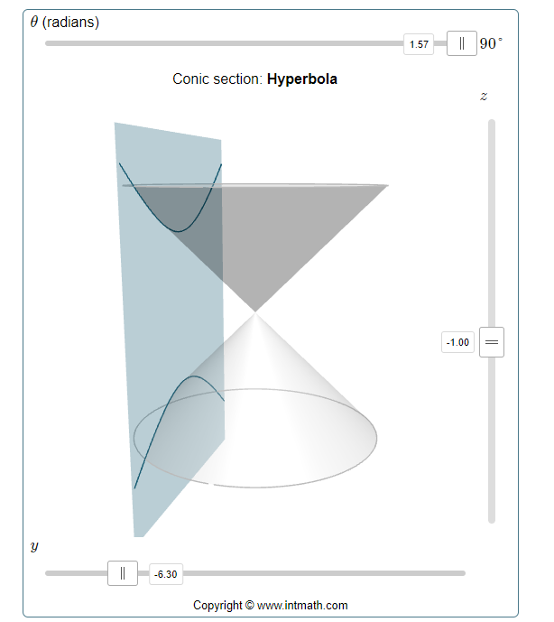

# sick_scan_xd FAQ

## How to run multiple sensors concurrently?

:question: How can I run multiple sensors concurrently with sick_scan_xd ?

:white_check_mark: To support multiple sensors, sick_scan_xd has to be started multiple times, with one sick_scan_xd-node for each sensor. By default, each sick_scan_xd-node connects to "192.168.0.1" and publishes its pointcloud on topic "cloud". Therefore both the node name, the ip-address of the sensor and the pointcloud topic have to be configured differently for each node. 

Node name, ip-address and pointcloud topic can be configured in the launch-file or by commandline argument:

* Topic, nodename and ip configuration in a launch-file (example for TiM7xx):
    ```
    <launch>
        <arg name="nodename" default="sick_tim_7xx"/>
        <arg name="hostname" default="192.168.0.1"/>
        <arg name="cloud_topic" default="cloud"/>
        <node name="$(arg nodename)" pkg="sick_scan_xd" type="sick_generic_caller" respawn="false" output="screen">
            <param name="scanner_type" type="string" value="sick_tim_7xx"/>
            <param name="nodename" type="string" value="$(arg nodename)"/>
            <param name="hostname" type="string" value="$(arg hostname)"/>
            <param name="cloud_topic" type="string" value="$(arg cloud_topic)"/>
    ```

* Topic, node name and ip configuration by commandline (ROS1-example for TiM7xx):
    ```
    roslaunch sick_scan_xd sick_tim_7xx.launch nodename:=sick_tim_7xx_1 hostname:=192.168.0.1 cloud_topic:=cloud_1
    roslaunch sick_scan_xd sick_tim_7xx.launch nodename:=sick_tim_7xx_2 hostname:=192.168.0.2 cloud_topic:=cloud_2
    ```

* Topic, node name and ip configuration by commandline (ROS2-example for TiM7xx):
    ```
    ros2 run sick_scan_xd sick_generic_caller ./src/sick_scan_xd/launch/sick_tim_7xx.launch nodename:=sick_tim_7xx_1 hostname:=192.168.0.1 cloud_topic:=cloud_1
    ros2 run sick_scan_xd sick_generic_caller ./src/sick_scan_xd/launch/sick_tim_7xx.launch nodename:=sick_tim_7xx_2 hostname:=192.168.0.2 cloud_topic:=cloud_2
    ```

Scripts [run_linux_ros1_simu_tim7xx_twin.bash](./test/scripts/run_linux_ros1_simu_tim7xx_twin.bash) and [run_linux_ros2_simu_tim7xx_twin.bash](./test/scripts/run_linux_ros2_simu_tim7xx_twin.bash) show a complete example with emulation of two TiM7xx sensors and two sick_scan_xd nodes running concurrently using different nodenames and topics.

## Driver restarts again and again after "sFA" message

:question: The sick_scan_xd driver restarts again and again after an error message "sFA".

:white_check_mark: The behaviour is intentional. The error message "sFA" can be caused by faulty configuration or errors in the lidar. Correct operation after this error message is not guaranteed. In this case, the driver restarts itself. It is recommended to identify and correct the error using its error number ("`sFA<hexcode>`"). The SOPAS error codes are listed in the manual.

## Driver restarts after timeout error

:question: The sick_scan_xd driver changes the communication protocol and restarts after a timeout error.

:white_check_mark: The use of binary communication (Cola-B) is highly recommended due to better compatibility, lower network traffic and general support.
Recommendation:
1. Set parameter "use_binary_protocol" to "true" in the launch file, and
2. Set the lidar communication mode with the SOPAS ET software to binary and save this setting in the scanner's EEPROM.

## Changes in launchfiles are ignored

:question: roslaunch still uses an old version after modifying the launch-file.

:white_check_mark: After modifying a launch-file, it has to be installed by running `catkin_make_isolated --install --cmake-args -DROS_VERSION=1`
to be located and used by `roslaunch`.

## ROS-2 launchfile support

:question: How can I create a ROS-2 node in python to run sick_generic_caller from a launch.py-file in ROS-2?

:white_check_mark: Example to launch a TiM-7xx node in ROS-2:
```
    sick_scan_pkg_prefix = get_package_share_directory('sick_scan_xd')
    tim_launch_file_path = os.path.join(sick_scan_pkg_prefix, 'launch/sick_tim_7xx.launch')
    tim_top_node = Node(
        package='sick_scan_xd',
        executable='sick_generic_caller',
        output='screen',
        arguments=[
            tim_launch_file_path,
            'nodename:=/lidars/tim_top',
            'hostname:=192.168.0.110',
            'cloud_topic:=/lidars/tim_top/cloud',
            'frame_id:=tim_top'
        ]
    )
```
Thanks to user JWhitleyWork.

## Timestamps

:question: What timestamp is provided in the pointcloud and laserscan messages?

:white_check_mark: Details about timestamps are given in [timing.md](doc/timing.md) and [software_pll.md](doc/software_pll.md).

In a nutshell:
The lidars do not work with absolute time stamps but with "ticks". There are two types of tick timestamps:
* Tick timestamps for the generation
* Tick timestamps for sending the message
To match the tick timestamps against the system time, a straight line equation is estimated via the so-called software PLL, which can be used to calculate from the system time to the ticks in the lidar (and vice versa). The assumption is that the tick timestamp for sending the message corresponds to the system time when receiving the message. In reality there will be a tiny delay here. This delay can be ignored.

With the help of this straight line equation, one can now calculate the system time at which the data is generated in the lidar.

Summary:
1. lidar: stamp with ticks the generation (first shot in the scan) (TICK_GEN)
2. lidar: stamp with ticks the sending of the scan message (TICK_TRANSMIT)
3. PC: Stamp with system time the receiving of the message
4. PC: Calculate back to system time of generation:
System time of generation = System time of receiving - (TICK_TRANSMIT - TICK_GEN)/TICK_FREQUENCY

## Laserscan messages with multiple frame ids

:question: sick_scan_xd publishes laserscan messages for multiScan and picoScan with multiple frame ids and possibly inconsistent data. Which frame id is correct?

:white_check_mark: By default, an echo filter is activated in the multiScan and picoScan launchfile. This echo filter suppresses multiple echos, e.g. echos from an object and a protective glass pane. The default configuration is "last echo only". In this case (i.e. one echo only), the fullframe laserscan messages on topic scan_fullframe all have identical frame ids for each layer, i.e. "world_\<layer\>". For the multiScan lidars with 16 layers, sick_scan_xd publishes laserscan messages with frame ids "world_1", "world_2" up to "world_16". For picoScan lidars with 1 layer, there is just one frame id "world_1".

In case of multiple echos (i.e. echo filter is deactivated), each echo is published by a laserscan message with different frame ids "world_\<layer\>_\<echo_idx\>". For picoScan lidars with 3 echos, there are 3 frame ids "world_1_0", "world_1_1", "world_1_2" published. For multiScan lidars with 16 layers and 3 echos, there are 48 different frame ids published "world_1_0", "world_1_1", "world_1_2", "world_2_0", "world_2_1", "world_2_2", ... , "world_16_0", "world_16_1", "world_16_2". 

This behaviour is intended, since a laserscan message can not contain multiple ranges for a single scan point at one azimuth angle. Therefore, there have to be different laserscan messages for each layer and each echo. Layer and echo of a laserscan message are identified by the frame id.

## Compilation errors

:question: Compiler reports errors in file `/opt/ros/<distro>/include/sick_scan`

:white_check_mark: If sick_scan was previously installed using `apt-get install ros-<distro>-sick-scan`, you have to remove previous versions using `apt-get purge ros-<distro>-sick-scan`. Run the following steps for a complete rebuild:
1. Run `sudo apt-get purge ros-<distro>-sick-scan` (e.g. `sudo apt-get purge ros-noetic-sick-scan`) to remove previously installed sick_scan-packages
2. Remove the folders sick_scan_xd/build, sick_scan_xd/build_isolated, sick_scan_xd/devel, sick_scan_xd/devel_isolated, sick_scan_xd/install and sick_scan_xd/install_isolated
3. Rebuild

:question: cmake cannot find diagnostic_updater

:white_check_mark: On ROS-2 foxy, package diagnostic_updater needs to be installed by
```
sudo apt-get update
sudo apt-get install ros-$ROS_DISTRO-diagnostic-updater # install diagnostic_updater
# E.g. to install diagnostic_updater on foxy, run
# sudo apt-get install ros-foxy-diagnostic-updater
```

:question: catkin gives me the following error message:
`By not providing "FindSICKLDMRS.cmake" in CMAKE_MODULE_PATH this project ..., but CMake did not find one."`

:white_check_mark:  One problem with ROS is that it doesn't automatically rebuild everything if you just append "-DLMRRS=0".
If you accidentally did the following call before

```
catkin_make_isolated --install --cmake-args -DROS_VERSION=1
```
you must remove the build/devel/install-directories created by the ROS build process.
For this please run the following commands to remove the directories, which holds the previous build results:
```
cd ~/ros_catkin_ws
rm -rf build_isolated
rm -rf devel_isolated
rm -rf install_isolated
rm -rf devel
```
It is possible that not all directories are present in this list. But that does not matter.
The only subdirectory left should be "src".
You can check this with the following command:

```
ls */ -d
```
The output should be:
```
src/
```
After doing this please rerun the command
catkin_make_isolated --install --cmake-args -DROS_VERSION=1 -DLDMRS=0

## rviz shows a grey point cloud

:question: rviz shows a grey point cloud. The size of points can be adjusted.

:white_check_mark: Check in the launch file that the intensity flag is set to True.

:question: rviz shows a grey point cloud and the size of points can not be adjusted.

:white_check_mark: Probably in this case you are running Linux in a virtual machine. In this case, OpenGL may not work correctly in the VM. rviz then chooses a kind of "fallback solution" and deactivates the colors.
Also, changing the "Size" and "Style" display in rviz has no effect on the display of the pointcloud data.

The problem can be avoided by starting rviz with the following sequence:

```
export LIBGL_ALWAYS_SOFTWARE=1
rosrun rviz rviz
```

## Angular resolution and scan frequency

:question: The angular resolution/ number of shots is too small

:white_check_mark: Possibly Mean or Median filters are activated. Use Sopas ET to deactivate them and store this settings permanent on the device, see picture.

Further information can be found at http://wiki.ros.org/rviz/Troubleshooting.

:question: The scanner and message frequency is lower than expected

:white_check_mark: Mean or median filters decrease the scanner frequency. Check and configure filter settings with SOPAS ET or deactivate them in the launchfile (MRS1xxx, LMS1xxx, LMS4xxx, LRS4xxx only):
```
<param name="lfp_meanfilter" type="int" value="-1" /> <!-- MRS1xxx, LMS1xxx, LMS4xxx, LRS4xxx: lfp_meanfilter<0: do not apply, lfp_meanfilter==0: deactivate LFPmeanfilter, lfp_meanfilter>0: activate LFPmeanfilter with lfp_meanfilter = number of scans -->
<param name="lfp_medianfilter" type="int" value="-1" /> <!-- MRS1xxx, LMS1xxx, LMS4xxx, LRS4xxx: lfp_medianfilter<0: do not apply, lfp_medianfilter==0: deactivate LFPmedianfilter, lfp_medianfilter==1: activate LFPmedianfilter -->
```
By default, filter settings are not overwritten, i.e. the filter settings stored in the lidars EEPROM apply (factory defaults resp. SOPAS ET filter settings).

## LMS1xxx angular resolution

:question: Independent of the configuration, the LMS1xxx pointcloud always displays 0.75 [deg] angular resolution

:white_check_mark: Using higher resolutions, the LMS1xxx sends scan data interlaced. See [interlacing.md](doc/interlacing.md) for details.

## "ERROR: Tcp::open: Failed to open TCP connection to 192.168.0.1, aborting."

:question: Question:
sick_generic_caller gives you an answer like:
```bash
"ERROR: Tcp::open: Failed to open TCP connection to 192.168.0.1, aborting."
```

:white_check_mark: Answer:
1. Try to ping your device:
   ```bash
   ping 192.168.0.1
   ```
2. Disconnect your scanner and retry ping

   ```bash
   ping 192.168.0.1
   ```
   The result of ping contains a pattern like
   ```bash
    ... Destination Host Unreachable
   ```
3. Reconnect your device and try to ping:
   ```bash
   ping 192.168.0.1
   ```

If you do not know the ip address, try to find the ip address in your subnet:
```bash
apt-get install fping
```

scan your network (for example, subnet 192.168.10.0/24):
```bash
192.168.0.1/24
```
search for all ip addresses from 192.168.0.0 to 192.168.0.255

The result is similar to:
```bash
192.168.0.4 is alive
192.168.0.22 is alive
```
and a lot of unreachable entries.
In the example the ip address 192.168.0.4 is the laserscanner MRS1104 and the ip address 192.168.0.22 is the computer running linux. Check this with

```bash
ifconfig|grep 192.168.0.22
```
## IP Address of Lidar

:question: Question:
My scanner does not use the default ip address. What shall I do?


:white_check_mark: Answer:
There are two options doing this:

* Permanently:  
Replace the following entry with your ip address.
```bash
  <param name="hostname" type="string" value="192.168.0.1" />
```
* Temporarily  
Use a command line argument in addition to the launch file argument:
```bash
   hostname:=192.168.0.2
```

## Timeout Warning

:question: Question:
During start phase the are warning/error message like

```bash
no answer received after 5000 ms. Maybe sopas mode is wrong.
```
and some more warning/error messages:

:white_check_mark: Answer:
In this case the driver tries to start the scanner in binary mode. If this is not possible, warnings and error messages are generated.
The driver switches the scanner from ASCII mode to binary mode and then restarts communication. The messages can therefore be ignored.
For a long-term solution, we recommend switching from ASCII to binary communication with SOPAS ET under Windows.

## Own Data Handling

:question: Question:
I would like to process data with my own methods.

:white_check_mark: Answer:
Search for keyword "PUBLISH_DATA:" in the code and replace the code for writing
jpeg-files and CSV-files with your own source code.

## Occasionally missing scan data

:question: Question:
Occasionally, no scan data appear, but the scanner is still reachable using `ping <ip-address>` or `nc -z -v <ip-address> <port>`

:white_check_mark: Answer:
This is likely to be a data capture issue. In any case it's recommend (if not already set) to use SOPAS-Binary instead of SOPAS-ASCII, because here the data rate is lower.

In addition, the following measures can help to determine the source of the problems:
a) Exchange the cables to the lidar(s) incl. the network cables
b) Exchange the power supply to the lidar(s)
c) avoidance of interconnection of other components (like switch etc.)
d) upgrade hardware and firmware of devices (if new versions available)

If it is not a hardware problem (e.g. cable), check if there are other software components using the network interface.

If there are still problems, use Wireshark to see if there are any communication problems reported. Wireshark can export the recorded network traffic as text (see screenshot). Search for entries like "LMDscandata" in the generated text file. This marks the beginning of a new scan message. You can then compare the order of the timestamps of these packets to see if there were any failures.


## python_d.exe not found

:question: Question:
On Windows with ROS, cmake complains "python_d.exe not found" when running rosidl generator

:white_check_mark: Answer:
Workaround: Copy python.exe to python_d.exe in the python folder.

## Debugging

:question: Question:
How can I debug sick_generic_caller on ROS-1?

:white_check_mark: Answer:
Build with compiler option `-g` and run sick_generic_caller as described using a launchfile. Stop sick_generic_caller (Ctrl-C or kill) and save the current ros parameter using `rosparam dump <dumpfile>.yaml`. Load these parameter with `rosparam load <dumpfile>.yaml` and restart sick_generic_caller in gdb or in your IDE. 

## Curved lines on a straight wall

:question: Question:
The X,Y points of the lidar show a curved line even though the lidar is scanning a straight wall. How can this be?

:white_check_mark: Answer:
This effect occurs when the lidar has multiple planes that are tilted up or down. In this case, the laser beams of this plane do not lie on a flat plane. Rather, the beams lie on a cone. If the laser beams then hit a wall, the result is a curved course of the lidar points. If the lidar is horizontal and the wall is vertical, this is a hyperbola (see following figure):




This image is generated using the website https://www.intmath.com/plane-analytic-geometry/conic-sections-summary-interactive.php 

Thus, the mathematical laws for a conic section apply, as they are explained e.g. at Wikipedia at https://en.wikipedia.org/wiki/Conic_section.

## Interlacing

:question: Question:
How should I interpret the scan rate and lidar resolution from the manual? What is the relationship between ROS point cloud publishing rate and scan frequency here?

:white_check_mark: Answer:

The angular resolution and scan frequency is configurable in many lidars such as the LRS-4xxx or MRS-1xxx. Depending on the lidar type, angular resolution and scan frequency can be set in the launch file either via the parameter "scan_cfg_list_entry" or the parameters "ang_res" and "scan_freq". Angular resolution and scan frequency are not independent of each other. If no default settings are used, the values must be selected according to the manual for the respective lidar and set in launch file.

An increase in resolution is achieved by interlacing by a factor of N. This means that N consecutive scans are rotated by a constant angular offset. Each scan in itself still has the physically given angular resolution and frequency. By concatenating N interlaced scans, the angular resolution is increased by the factor N.

Example: The default setting of an MRS-1xxx is 0.25 degrees horizontal angular resolution at 50 Hz scan frequency without interlacing and an angular range of 275 degrees in total. I.e. each scan measures the distance at the hor. angles [ ..., 0.000, 0.250, 0.500, 0.750, ... ].

If 0.125 degrees horizontal angular resolution is configured at 25 Hz scan frequency, the scans are performed with 2 times interlacing (N=2). Every 2nd scan is horizontally shifted by 0.125 degrees. I.e. each scan measures alternately at the hor. angles [ ..., 0.000, 0.250, 0.500, 0.750, ... ] and [ ... , 0.125, 0.375, 0.625, 0.875 ... ]. 50 single scans per second resp. 25 interlaced scans per second are sent.

If 0.0625 degrees horizontal angular resolution at 12.5 Hz scan frequency is configured, the scans are performed with 4 times interlacing (N=4). Successive scans are shifted horizontally by 0.0625 degrees each. That is, each scan measures alternately at the hor. angles [ ..., 0.000, 0.250, 0.500, 0.750, ... ], [... , 0.0625, 0.3125, 0.5625, 0.8125 ... ], [... , 0.125, 0.375, 0.625, 0.875 ... ] and [... , 0.1875, 0.4375, 0.6875, 0.9375 ... ]. 50 single scans per second resp. 12.5 interlaced scans per second are sent.

In interlacing mode, laser scan and point cloud messages are published interlaced, too. In rviz, the higher angular resolution is clearly visible when the decay time is increased. 

With a scan frequency of 50 Hz and 4 active layers, the lidar will send a new scan line each 0.02 seconds. Each layer is scanned after 0.08 seconds resp. with 12.5 Hz (4 layers multiplied by 12.5 Hz = 50 Hz scan frequency). The point cloud accumulates all active layers and is therefore published with 12.5 Hz (i.e. scan frequency divided by number of layers).

If you check the publishing rate of the point cloud messages of a MRS-1104, you will measure 12.4 Hz, since the scans of 4 layers are accumulated in 1 point cloud message (50 hz scan frequency divided by 4 layers = 12.5 Hz point cloud publishing frequency). The resolution of each single point cloud message is 0.125 [deg]. Only by interleaving 4 consecutive messages you get the high resolution of 0.0625 [deg].

