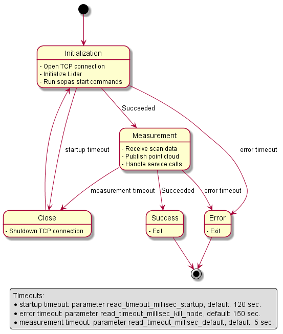
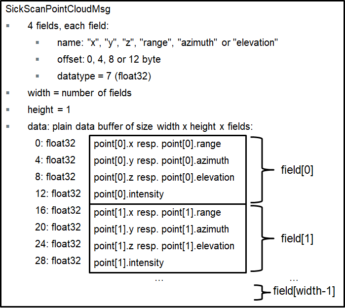
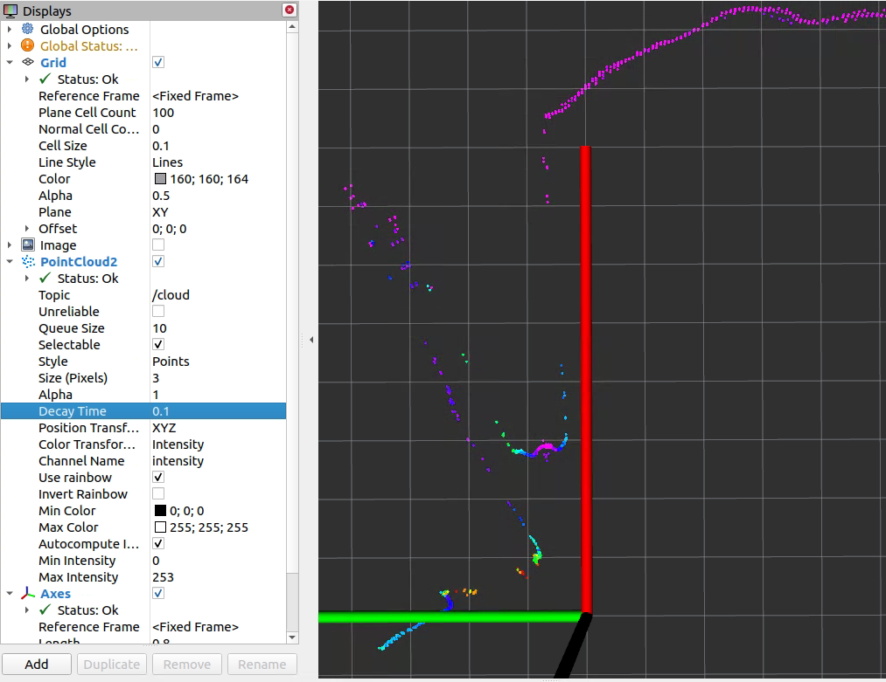
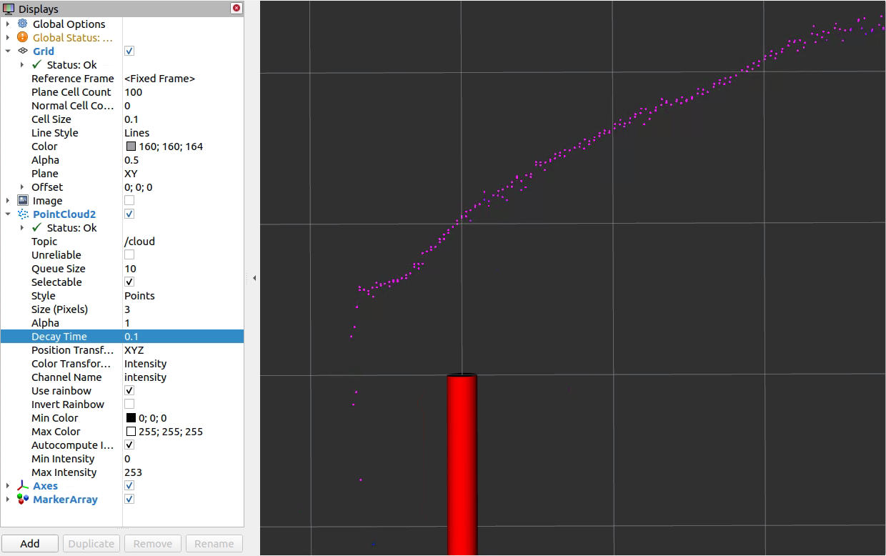

# sick_scan_xd - Driver and tools for SICK LiDAR and RADAR devices


This project provides a driver for SICK LiDARs and Radar sensors mentioned [here](#supported-sick-devices). The driver supports both Linux (native, ROS 1, ROS 2) and Windows (native and ROS 2). See the [CHANGELOG.md](CHANGELOG.md) for the latest updates.

Main features and characteristics:

* Support of ROS 1 (Linux), ROS 2 (Linux and Windows)
* Generic C/C++ and Python API for usage without ROS (Linux and Windows)
* SLAM support
* Compatible with x64 and ARM64 architecture (incl. Raspberry Pi)
* No dependencies to 3rd party libraries like boost

## Table of contents

<details>
  <summary>Expand to full table of contents </summary>

* [Repository organization](#repository-organization)
* [Supported SICK devices](#supported-sick-devices)
* [Getting started](#getting-started)
  * [Starting with a new SICK device](#starting-with-a-new-sick-device)
  * [Detecting SICK devices in the network](#detecting-sick-devices-in-the-network)
  * [Change IP address](#change-ip-address)
  * [Test connection (Linux)](#test-connection-linux)
* [Building the driver](#building-the-driver)
  * [ROS 1 on Linux](#ros-1-on-linux)
    * [ROS 1: Install prebuilt binaries](#ros-1-install-prebuilt-binaries)
    * [ROS 1: Build from sources](#ros-1-build-from-sources)
  * [ROS 2 on Linux](#ros-2-on-linux)
    * [ROS 2: Install prebuilt binaries](#ros-2-install-prebuilt-binaries)
    * [ROS 2: Build from sources](#ros-2-build-from-sources)
  * [ROS 2 on Windows](#ros-2-on-windows)
  * [Without ROS on Linux](#without-ros-on-linux)
  * [Without ROS on Windows](#without-ros-on-windows)
* [Running the driver](#running-the-driver)
  * [Starting device with specific IP address](#starting-device-with-specific-ip-address)
  * [Start multiple devices / nodes](#start-multiple-devices--nodes)
  * [Parameters](#parameters)
  * [ROS services](#ros-services)
  * [ROS 2 example for messages and services](#ros-2-example-for-messages-and-services)
  * [SOPAS mode](#sopas-mode)
  * [Example startup sequence](#example-startup-sequence)
* [Driver features and additional information](#driver-features-and-additional-information)
  * [Software overview and structure](#software-overview-and-structure)
    * [Message handling](#message-handling)
    * [Driver states and timeouts](#driver-states-and-timeouts)
    * [sick\_scansegment\_xd](#sick_scansegment_xd)
    * [Files and folders](#files-and-folders)
  * [Generic driver API](#generic-driver-api)
    * [Build and test shared library](#build-and-test-shared-library)
      * [Build the shared library on Linux](#build-the-shared-library-on-linux)
      * [Build the shared library on Windows](#build-the-shared-library-on-windows)
      * [Test the shared library](#test-the-shared-library)
    * [Usage examples](#usage-examples)
      * [Minimalistic usage example in C](#minimalistic-usage-example-in-c)
      * [Minimalistic usage example in C++](#minimalistic-usage-example-in-c-1)
      * [Minimalistic usage example in Python](#minimalistic-usage-example-in-python)
      * [Complete usage example in C++](#complete-usage-example-in-c)
      * [Complete usage example in Python](#complete-usage-example-in-python)
    * [Diagnostic](#diagnostic)
  * [Simulation and unit test](#simulation-and-unit-test)
  * [Timestamps and synchronization (Software PLL)](#timestamps-and-synchronization-software-pll)
  * [Coordinate transforms](#coordinate-transforms)
  * [IMU support (LRS4000, MRS6000 and MRS1000)](#imu-support-lrs4000-mrs6000-and-mrs1000)
  * [Encoder support](#encoder-support)
  * [Field evaluation information](#field-evaluation-information)
    * [Visualization with rviz](#visualization-with-rviz)
    * [Cola commands](#cola-commands)
    * [Emulation](#emulation)
    * [Unit tests](#unit-tests)
    * [Pcapng converter tool](#pcapng-converter-tool)
  * [Raspberry Pi support](#raspberry-pi-support)
    * [Performance limitations](#performance-limitations)
    * [Build without internet or GitHub access](#build-without-internet-or-github-access)
  * [Docker support](#docker-support)
    * [Build and run on Linux ROS 1 (short cut)](#build-and-run-on-linux-ros-1-short-cut)
    * [Build and run from local sources](#build-and-run-from-local-sources)
    * [Build and run from a git repository](#build-and-run-from-a-git-repository)
    * [Build and run from prebuilt binaries](#build-and-run-from-prebuilt-binaries)
  * [Hector SLAM support](#hector-slam-support)
    * [NAV350 ROS 1 SLAM example](#nav350-ros-1-slam-example)
    * [NAV350 ROS 2 SLAM example](#nav350-ros-2-slam-example)
    * [picoScan100 ROS 1 SLAM example](#picoscan100-ros-1-slam-example)
    * [MRS1000 SLAM support](#mrs1000-slam-support)
  * [Google cartographer support](#google-cartographer-support)
  * [OctoMap support](#octomap-support)
  * [RTAB-Map support](#rtab-map-support)
    * [Install RTAB-Map on ROS 1](#install-rtab-map-on-ros-1)
    * [Run RTAB-MAP and multiScan100 on ROS 1](#run-rtab-map-and-multiscan100-on-ros-1)
    * [Install RTAB-Map on ROS 2](#install-rtab-map-on-ros-2)
    * [Run RTAB-MAP and multiScan100 on ROS 2](#run-rtab-map-and-multiscan100-on-ros-2)
  * [More tools](#more-tools)
* [Device specific information](#device-specific-information)
  * [picoScan100/multiScan100](#picoscan100multiscan100)
    * [Configuration](#configuration)
    * [SOPAS support for sick\_scan\_segment\_xd](#sopas-support-for-sick_scan_segment_xd)
    * [Start and stop sequence](#start-and-stop-sequence)
    * [IMU support](#imu-support)
    * [Point cloud memory layout](#point-cloud-memory-layout)
    * [Customized point clouds](#customized-point-clouds)
    * [Customized point clouds on a Raspberry Pi](#customized-point-clouds-on-a-raspberry-pi)
    * [MSGPACK validation](#msgpack-validation)
    * [Firewall configuration](#firewall-configuration)
    * [Reflector detection](#reflector-detection)
    * [TF frame IDs and layer suffixes (picoScan / multi-layer devices)](#tf-frame-ids-and-layer-suffixes-picoscan--multi-layer-devices)
  * [TiMxxx](#timxxx)
  * [NAV350](#nav350)
    * [Process loop](#process-loop)
    * [Initialization and setup](#initialization-and-setup)
    * [Messages](#messages)
    * [Angle compensation](#angle-compensation)
      * [Example](#example)
      * [Comparing compensated vs. raw values](#comparing-compensated-vs-raw-values)
      * [Coordinate systems](#coordinate-systems)
      * [Check compensation function](#check-compensation-function)
  * [MRS6124](#mrs6124)
  * [LMS1000 / MRS1000](#lms1000--mrs1000)
  * [RMS1000](#rms1000)
    * [Raw targets](#raw-targets)
    * [Tracking objects](#tracking-objects)
    * [ROS message for Radar](#ros-message-for-radar)
    * [Visualization](#visualization)
    * [Launch files](#launch-files)
    * [Parameter for Radar usage](#parameter-for-radar-usage)
    * [Radar datagram](#radar-datagram)
  * [Combination of devices](#combination-of-devices)
    * [multiScan100 and picoScan100](#multiscan100-and-picoscan100)
    * [RMS1000 and MRS6000](#rms1000-and-mrs6000)
    * [RMS1000 and LMS1000](#rms1000-and-lms1000)
* [FAQ](#faq)
  * [How to fix "Failed to open TCP connection"?](#how-to-fix-failed-to-open-tcp-connection)
  * [How to run multiple sensors concurrently?](#how-to-run-multiple-sensors-concurrently)
  * [What to do if the driver restarts again and again after "sFA" message?](#what-to-do-if-the-driver-restarts-again-and-again-after-sfa-message)
  * [What to do if the driver restarts after a timeout error?](#what-to-do-if-the-driver-restarts-after-a-timeout-error)
  * [Why are my changes in launch files are ignored?](#why-are-my-changes-in-launch-files-are-ignored)
  * [How can I create a ROS 2 node in python to run sick\_generic\_caller from a launch.py file?](#how-can-i-create-a-ros-2-node-in-python-to-run-sick_generic_caller-from-a-launchpy-file)
  * [What timestamp is provided in the point cloud and laserscan messages?](#what-timestamp-is-provided-in-the-point-cloud-and-laserscan-messages)
  * [Why does sick\_scan\_xd publish laserscan messages for with multiple frame ids?](#why-does-sick_scan_xd-publish-laserscan-messages-for-with-multiple-frame-ids)
  * [The compiler reports errors in file `/opt/ros/<distro>/include/sick_scan_xd`. What can I do?](#the-compiler-reports-errors-in-file-optrosdistroincludesick_scan_xd-what-can-i-do)
  * [cmake cannot find diagnostic\_updater. What can I do?](#cmake-cannot-find-diagnostic_updater-what-can-i-do)
  * [catkin reports "By not providing "FindSICKLDMRS.cmake" ..." . What can I do?](#catkin-reports-by-not-providing-findsickldmrscmake---what-can-i-do)
  * [rviz only shows a grey point cloud. What can i do?](#rviz-only-shows-a-grey-point-cloud-what-can-i-do)
  * [rviz shows a grey point cloud and the size of points can not be adjusted. What can I do?](#rviz-shows-a-grey-point-cloud-and-the-size-of-points-can-not-be-adjusted-what-can-i-do)
  * [rviz2 on Ubuntu 24 with ROS 2 jazzy crashes immediately after start. How to fix this?](#rviz2-on-ubuntu-24-with-ros-2-jazzy-crashes-immediately-after-start-how-to-fix-this)
  * [The angular resolution or the scanning frequency is lower than expected. Any ideas?](#the-angular-resolution-or-the-scanning-frequency-is-lower-than-expected-any-ideas)
  * [Independent of the configuration, the LMS1000 point cloud always displays 0.75 \[deg\] angular resolution?](#independent-of-the-configuration-the-lms1000-point-cloud-always-displays-075-deg-angular-resolution)
  * [My device does not use the default IP address. What shall I do?](#my-device-does-not-use-the-default-ip-address-what-shall-i-do)
  * [During start the error "no answer received after 5000 ms" appears. What can I do?](#during-start-the-error-no-answer-received-after-5000-ms-appears-what-can-i-do)
  * [How to process data with my own methods?](#how-to-process-data-with-my-own-methods)
  * [Occasionally, no scan data appear, but the lidar is still reachable (ping). What can I do?](#occasionally-no-scan-data-appear-but-the-lidar-is-still-reachable-ping-what-can-i-do)
  * [On Windows with ROS, cmake complains "python\_d.exe not found" when running rosidl generator. How to fix this?](#on-windows-with-ros-cmake-complains-python_dexe-not-found-when-running-rosidl-generator-how-to-fix-this)
  * [How can I debug sick\_generic\_caller on ROS 1?](#how-can-i-debug-sick_generic_caller-on-ros-1)
  * [I see curved lines on a straight wall. Why?](#i-see-curved-lines-on-a-straight-wall-why)
  * [How should I interpret the scan rate and lidar resolution from the manual?](#how-should-i-interpret-the-scan-rate-and-lidar-resolution-from-the-manual)
  * [In Windows debug version the compiler does not stop at breakpoints. What to do?](#in-windows-debug-version-the-compiler-does-not-stop-at-breakpoints-what-to-do)
  * [sick\_scan\_xd seems to drop packages, when sending msgpacks. What to do?](#sick_scan_xd-seems-to-drop-packages-when-sending-msgpacks-what-to-do)
  * [How can I convert a pcapng-file with scan data to a msgpack- or json-file?](#how-can-i-convert-a-pcapng-file-with-scan-data-to-a-msgpack--or-json-file)
* [Troubleshooting and technical support](#troubleshooting-and-technical-support)
* [Creators and contribution](#creators-and-contribution)
* [License](#license)
* [Keywords](#keywords)

</details>

## Repository organization

The repository supports two main branches. The **"master"** branch is the branch that contains official releases that are tagged and versioned and also included in the ROS distribution. If you want to work with this official branch, you must explicitly specify this branch in the 'git clone' command by adding "-b master". The "develop" branch is the default branch and contains the latest development status.

Checking out the latest revision (usually older than the develop version, but officially released):

```sh
git clone -b master https://github.com/SICKAG/sick_scan_xd.git
```

Checking out the latest development status:

```sh
git clone https://github.com/SICKAG/sick_scan_xd.git
```

## Supported SICK devices

The driver supports Ethernet-IPv4-based communication with all of the following SICK products.

| 2D LiDAR sensors | Part no. | 3D LiDAR sensors | Part no.| RADAR sensors   | Part no.|
| ----------------------------------------------------------------------------------------------------------- | -------------------------------------------------------------- | ------------ | -------------------------------------------------------------- | ------- | -------------------------------------------------------------- |
| picoScan100 [(supports native ROS 2 as well)](https://support.sick.com/sick-knowledgebase/article/?code=KA-09438) | [e.g. 1134610](https://www.sick.com/de/en/search?text=1134610) | multiScan100 | [e.g. 1131164](https://www.sick.com/de/en/search?text=1131164) | RMS1000 | [e.g. 1107598](https://www.sick.com/de/en/search?text=1107598) |
| LRS4000                                                                                                     | [e.g. 1098855](https://www.sick.com/de/en/search?text=1098855) | MRS1000      | [e.g. 1081208](https://www.sick.com/de/en/search?text=1081208) | RMS2000 | [e.g. 1129088](https://www.sick.com/de/en/search?text=1129088) |
| TiM2xx                                                                                                      | [1104981](https://www.sick.com/de/en/search?text=1104981)      | MRS6124      | [6065086](https://www.sick.com/de/en/search?text=6065086)      |         |                                                                |
| TiM5xx                                                                                                      | [e.g. 1060445](https://www.sick.com/de/en/search?text=1060445) | LD-MRS       | [e.g. 1115128](https://www.sick.com/de/de/p/p662073)           |         |                                                                |
| TiM7xxS                                                                                                     | [e.g. 1105052](https://www.sick.com/de/en/search?text=1105052) |              |                                                                |         |                                                                |
| TiM7xx                                                                                                      | [e.g 1096807](https://www.sick.com/de/en/search?text=1096807)  |              |                                                                |         |                                                                |
| LMS5xx                                                                                                      | [e.g. 1046135](https://www.sick.com/de/en/search?text=1046135) |              |                                                                |         |                                                                |
| LMS1000                                                                                                     | [1092445](https://www.sick.com/de/en/search?text=1092445)      |              |                                                                |         |                                                                |
| LMS1xx                                                                                                      | [e.g. 1041114](https://www.sick.com/de/en/search?text=1041114) |              |                                                                |         |                                                                |
| LMS4000                                                                                                     | [e.g. 1091423](https://www.sick.com/de/en/search?text=1091423) |              |                                                                |         |                                                                |
| LD-LRS                                                                                                      | [e.g. 1060831](https://www.sick.com/de/en/search?text=1060831) |              |                                                                |         |                                                                |
| LD-OEM                                                                                                      | [e.g. 1060828](https://www.sick.com/de/en/search?text=1060828) |              |                                                                |         |                                                                |
| NAV3xx                                                                                                      | [e.g. 1060834](https://www.sick.com/de/en/search?text=1060834) |              |                                                                |         |                                                                |
| NAV2xx                                                                                                      | [e.g. 1074308](https://www.sick.com/de/en/search?text=1074308) |              |                                                                |         |                                                                |

> **_NOTE:_**
>
> * It is recommended to run multiple devices simultaneously in a ROS environment. The C++ driver (non-ROS) does not support single or multi-threaded use of two or more devices in one process.
> * ROS services require installation of ROS 1 or ROS 2.
> * ROS services are  not available for LD-MRS.
> * LD-MRS is not supported on Windows.
> * Publishing point cloud data requires ROS 1 or ROS 2. On native Linux and native Windows, point cloud data are exported via API.
> * The driver is not tested on macOS.

## Getting started

Run the following steps for a quick start:

1. Create a workspace (e.g. folder `sick_scan_ws`), clone the sick_scan_xd repository and build sick_generic_caller and shared library:

   * For **Linux without ROS**: Follow the [build instructions for Linux generic without ROS](#without-ros-on-linux)
   * For **Linux with ROS 1**: Follow the [build instructions for Linux ROS 1](#ros-1-on-linux)
   * For **Linux with ROS 2**: Follow the [build instructions for Linux ROS 2](#ros-2-on-linux)
   * For **Windows without ROS**: Follow the [build instructions for Windows without ROS](#without-ros-on-windows)
   * For **Windows with ROS 2**: Follow the [build instructions for Windows with ROS 2](#ros-2-on-windows)

2. Connect your lidar. Check the network connection by `ping <lidar-ip-address>`.

3. Run the sick_scan_xd driver:

   For **Linux without ROS**: Use the sick_scan_xd API and run `sick_scan_xd_api_test <launchfile> hostname:=<lidar-ip-address>`, e.g.:

      ```sh
      cd ./sick_scan_ws
      export LD_LIBRARY_PATH=.:`pwd`/build:$LD_LIBRARY_PATH  # append absolute path to the build folder
      ./build/sick_scan_xd_api_test ./sick_scan_xd/launch/sick_tim_7xx.launch hostname:=192.168.0.1
      ```

   For **Linux with ROS 1**: Launch sick_scan_xd: `roslaunch sick_scan_xd <launchfile> hostname:=<lidar-ip-address>`, e.g.:

      ```sh
      cd ./sick_scan_ws
      source ./devel_isolated/setup.bash
      roslaunch sick_scan_xd sick_tim_7xx.launch hostname:=192.168.0.1
      ```

   For **Linux with ROS 2**: Run `ros2 launch sick_scan_xd <launchfile> hostname:=<lidar-ip-address>`, e.g.:

      ```sh
      cd ./sick_scan_ws
      source ./install/setup.bash
      ros2 launch sick_scan_xd sick_tim_7xx.launch.py hostname:=192.168.0.1
      ```

   For **Windows without ROS**: Use the sick_scan_xd API and run `sick_scan_xd_api_test <launchfile> hostname:=<lidar-ip-address>`, e.g.:

      ```sh
      cd .\sick_scan_ws\sick_scan_xd
      set PATH=.;.\build;..\build\Debug;%PATH%
      .\build\Debug\sick_scan_xd_api_test.exe launch/sick_tim_7xx.launch hostname:=192.168.0.1
      ```

   For **Windows with ROS 2**: Run `ros2 launch sick_scan_xd <launchfile> hostname:=<lidar-ip-address>`, e.g.:

      ```sh
      cd .\sick_scan_ws
      call .\install\setup.bat
      ros2 launch sick_scan_xd sick_tim_7xx.launch.py hostname:=192.168.0.1
      ```

### Starting with a new SICK device

The SICK device is delivered with a standard IP address `192.168.0.1`. Devices like picoScan100, multiScan100, LRS4000 and RMS1/2000 can be accessed through a web browser: [192.168.0.1](http://192.168.0.1/#/). Make sure the Ethernet interface is part of the same subnet. The Ethernet setting can be changed on this page [http://192.168.0.1/#/configuration/ethernet](http://192.168.0.1/#/configuration/ethernet).

For other devices, please use [SICK SOPAS ET](https://www.sick.com/de/de/sopas-engineering-tool-2018/p/p367244) for Windows. When the tool is started, a search is performed which lists all Ethernet based SICK devices available in the network.


Double-click to select the device for the project.


Double-click the icon to open the configuration menu of the device. Select the network configuration menu and set the parameters by clicking the save icon (red arrow).


To ensure that the settings are stored even after a power cycle, click on the EEPROM icon and confirm the save.


To test the settings under Windows use the commands `ipconfig` and `ping` in the ```cmd.exe```. Make sure that the SICK device and host PC have different IP addresses e.g. 192.168.0.1 for the PC and 192.168.0.2 for the SICK device.

### Detecting SICK devices in the network

The [Python script](sick_scan_xd/tools/sick_generic_device_finder/sick_generic_device_finder.py) sends a UDP broadcast to which all available devices respond with a device description. The variable `UDP_IP = "192.168.0.255"` defines the broadcast address used by the script. If you are using a different IP address configuration on your host pc you have to change this variable according to the broadcast address of your network card. `ifconfig` shows the broadcast address for every network adapter. This method works for the device families: TiMxxx, LMS100 and LMS500.

### Change IP address

The IP address of the device can be changed with a customized launch file. The following launch sequence is an example:

```sh
roslaunch sick_scan_xd sick_new_ip.launch hostname:=192.168.0.1 new_IP:=192.168.0.100
```

The launch file restarts the lidar after the address change and stops the sick_scan_xd node. After a few seconds of boot time the device is reachable at the new IP address. The Python script is experimental. It is known that some Ethernet adapters are not fully supported. As a fallback you can always use the SOPAS ET software under Windows.

### Test connection (Linux)

To test the settings on Linux you can use netcat to check whether a TCP connection to the device can be established: `nc -z -v -w5 $SCANNERIPADDRESS 2112`. The connection should be successfully established.

```sh
@ubuntu:~S nc -z -v -w5 192.168.0.71 2112
Connection to 192.168.0.71 2112 port [tcp/*] succeeded!
```

Unlike a ping, the connection attempt to the host PC will fail.

```sh
@ubuntu: ~$ nc -z-v -w5 192.168.0.110 2112
nc: connect to 192.168.0.110 port 2112 (tcp) failed: Connection refused
```

## Building the driver

sick_scan_xd can be build on 64-bit Linux and Windows, with and without ROS, with and without the dependencies for the SICK LiDAR LD-MRS. The following table shows the allowed combinations and how to build. sick_scan_xd supports 64 bit Linux and Windows, 32 bit systems are not supported.

| **Target**                 | **Cmake settings**           | **Build script**                                                       |
| -------------------------- | ---------------------------- | ---------------------------------------------------------------------- |
| Linux, native, LD-MRS      | BUILD_WITH_LDMRS_SUPPORT ON  | `cd test/scripts && chmod a+x ./*.bash && ./makeall_linux.bash`          |
| Linux, native, no LD-MRS   | BUILD_WITH_LDMRS_SUPPORT OFF | `cd test/scripts && chmod a+x ./*.bash && ./makeall_linux_no_ldmrs.bash` |
| Linux, ROS 1, LD-MRS       | BUILD_WITH_LDMRS_SUPPORT ON  | `cd test/scripts && chmod a+x ./*.bash && ./makeall_ros1.bash`           |
| Linux, ROS 1, no LD-MRS    | BUILD_WITH_LDMRS_SUPPORT OFF | `cd test/scripts && chmod a+x ./*.bash && ./makeall_ros1_no_ldmrs.bash`  |
| Linux, ROS 2, LD-MRS       | BUILD_WITH_LDMRS_SUPPORT ON  | `cd test/scripts && chmod a+x ./*.bash && ./makeall_ros2.bash`           |
| Linux, ROS 2, no LD-MRS    | BUILD_WITH_LDMRS_SUPPORT OFF | `cd test/scripts && chmod a+x ./*.bash && ./makeall_ros2_no_ldmrs.bash`  |
| Windows, native, no LD-MRS | BUILD_WITH_LDMRS_SUPPORT OFF | `cd test\\scripts && make_win64.cmd`                                     |
| Windows, ROS 2, no LD-MRS  | BUILD_WITH_LDMRS_SUPPORT OFF | `cd test\\scripts && make_ros2.cmd`                                      |

If you're using ROS, set your ROS-environment before running one of these scripts, e.g.

* `source /opt/ros/noetic/setup.bash` for ROS 1 noetic, or
* `source /opt/ros/foxy/setup.bash` for ROS 2 foxy, or
* `source /opt/ros/humble/setup.bash` for ROS 2 humble.

### ROS 1 on Linux

To build resp. install sick_scan_xd on Linux with ROS 1, you can build sick_scan_xd from sources or install prebuilt binaries.

#### ROS 1: Install prebuilt binaries

Run the following steps to install sick_scan_xd on Linux with ROS 1 noetic:

```sh
sudo apt update
sudo apt-get install ros-noetic-sick-scan-xd
```

After successful installation, you can run sick_scan_xd using `roslaunch sick_scan_xd <launchfile>`, e.g. `roslaunch sick_scan_xd sick_picoscan.launch` for picoScan. sick_scan_xd can be removed by `sudo apt-get remove ros-noetic-sick-scan-xd`.

#### ROS 1: Build from sources

Run the following steps to build sick_scan_xd on Linux with ROS 1:

1. Create a workspace folder, e.g. `sick_scan_ws` (or any other name):

   ```sh
   mkdir -p ./sick_scan_ws
   cd ./sick_scan_ws
   ```

2. Clone repositories <https://github.com/SICKAG/libsick_ldmrs> and <https://github.com/SICKAG/sick_scan_xd>:

   ```sh
   mkdir ./src
   pushd ./src
   git clone https://github.com/SICKAG/libsick_ldmrs.git
   git clone -b master https://github.com/SICKAG/sick_scan_xd.git
   popd
   rm -rf ./build ./build_isolated/ ./devel ./devel_isolated/ ./install ./install_isolated/ ./log/ # remove any files from a previous build
   ```

3. Build sick_generic_caller:

   ```sh
   source /opt/ros/noetic/setup.bash # replace noetic by your ros distro
   catkin_make_isolated --install --cmake-args -DROS_VERSION=1 -Wno-dev
   source ./devel_isolated/setup.bash
   # source ./install_isolated/setup.bash
   ```

   For ROS versions other than noetic, please replace `source /opt/ros/noetic/setup.bash` with your ROS distribution.

LD-MRS sensors are currently not supported on Raspberry. Build with cmake flag `-DLDMRS=0 -DRASPBERRY=1` on Raspberry:

```sh
catkin_make_isolated --install --cmake-args -DROS_VERSION=1 -DLDMRS=0 -DRASPBERRY=1 -Wno-dev
```

libsick_ldmrs is only required to support LD-MRS sensors. If you do not need or want to support LD-MRS, you can skip building libsick_ldmrs. To build sick_generic_caller without LD-MRS support, switch off option `BUILD_WITH_LDMRS_SUPPORT` in [CMakeLists.txt](./CMakeLists.txt) or call catkin_make_isolated with option `-DLDMRS=0`:

```sh
catkin_make_isolated --install --cmake-args -DROS_VERSION=1 -DLDMRS=0 -Wno-dev
```

To build sick_generic_caller without multiScan100/picoScan100/sick_scansegment_xd support, switch off option `BUILD_WITH_SCANSEGMENT_XD_SUPPORT` in [CMakeLists.txt](./CMakeLists.txt) or call cmake with option `-DSCANSEGMENT_XD=0`:

```sh
catkin_make_isolated --install --cmake-args -DROS_VERSION=1 -DSCANSEGMENT_XD=0 -Wno-dev
```

cmake flags can be combined. Use flags `-DLDMRS=0 -DSCANSEGMENT_XD=0` to build **without LD-MRS** and **without multiScan100/picoScan100 support**:

```sh
catkin_make_isolated --install --cmake-args -DROS_VERSION=1 -DLDMRS=0 -DSCANSEGMENT_XD=0 -Wno-dev
```

By default, sick_scan_xd builds with compiler flag `-O3` (optimization level for max speed). The optimization level can be overwritten (e.g. for debugging) by cmake flag `-DO=0` (compiler flags `-g -O0`), `-DO=1` (for compiler flags `-O1`) or `-DO=2` (for compiler flags `-O2`).

The sick_scan_xd driver requires C++14 and gcc version 5 or newer.

Build options:

| **LD-MRS support** | **multiScan100 / picoScan100 support** | **Build command** |
|--------------------|--------------------------------------|-------------------|
| no | no | ``` catkin_make_isolated --install --cmake-args -DROS_VERSION=1 -DLDMRS=0 -DSCANSEGMENT_XD=0 -Wno-dev ``` |
| no | yes | ``` catkin_make_isolated --install --cmake-args -DROS_VERSION=1 -DLDMRS=0 -Wno-dev ``` |
| yes | no | ``` catkin_make_isolated --install --cmake-args -DROS_VERSION=1 -DSCANSEGMENT_XD=0 -Wno-dev ``` |
| yes | yes | ``` catkin_make_isolated --install --cmake-args -DROS_VERSION=1 -DSCANSEGMENT_XD=1 -Wno-dev ``` |

To create source code documentation by doxygen, run

```sh
cd ./doxygen
doxygen ./docs/Doxyfile
```

### ROS 2 on Linux

To build resp. install sick_scan_xd on Linux with ROS 2, you can build sick_scan_xd from sources or install prebuilt binaries.

#### ROS 2: Install prebuilt binaries

Run the following steps to install sick_scan_xd on Linux with ROS 2 humble:

```sh
sudo apt update
sudo apt-get install ros-humble-sick-scan-xd
```

After successful installation, you can run sick_scan_xd using `ros2 launch sick_scan_xd <launchfile>.py`, e.g. `ros2 launch sick_scan_xd sick_multiscan.launch.py` for multiScan. sick_scan_xd can be removed by `sudo apt-get remove ros-humble-sick-scan-xd`.

> **_NOTE:_** ROS 2 humble Debian packages require Ubuntu 22 or newer, see <https://docs.ros.org/en/humble/Installation/Ubuntu-Install-Debians.html> for system requirements.

#### ROS 2: Build from sources

Run the following steps to build sick_scan_xd on Linux with ROS 2:

1. Create a workspace folder, e.g. `sick_scan_ws` (or any other name):

   ```sh
   mkdir -p ./sick_scan_ws
   cd ./sick_scan_ws
   ```

2. Clone repositories <https://github.com/SICKAG/libsick_ldmrs> and <https://github.com/SICKAG/sick_scan_xd>:

   ```sh
   mkdir ./src
   pushd ./src
   git clone https://github.com/SICKAG/libsick_ldmrs.git
   git clone -b master https://github.com/SICKAG/sick_scan_xd.git
   popd
   rm -rf ./build ./build_isolated/ ./devel ./devel_isolated/ ./install ./install_isolated/ ./log/ # remove any files from a previous build
   ```

3. Build sick_generic_caller:

   ```sh
   source /opt/ros/humble/setup.bash # replace humble by your ros distro
   colcon build --packages-select libsick_ldmrs --event-handlers console_direct+
   source ./install/setup.bash
   colcon build --packages-select sick_scan_xd --cmake-args " -DROS_VERSION=2" --event-handlers console_direct+
   source ./install/setup.bash
   ```

   For ROS versions other than humble, please replace `source /opt/ros/humble/setup.bash` with your ROS distribution.

LD-MRS sensors are currently not supported on Raspberry. Build with cmake flag `-DLDMRS=0 -DRASPBERRY=1` on Raspberry:

```sh
colcon build --packages-select sick_scan_xd --cmake-args " -DROS_VERSION=2" " -DLDMRS=0" " -DRASPBERRY=0" --event-handlers console_direct+
```

libsick_ldmrs is only required to support LD-MRS sensors. If you do not need or want to support LD-MRS, you can skip building libsick_ldmrs. To build sick_generic_caller without LD-MRS support, switch off option `BUILD_WITH_LDMRS_SUPPORT` in [CMakeLists.txt](./CMakeLists.txt) or call colcon with option `-DLDMRS=0`:

```sh
colcon build --packages-select sick_scan_xd --cmake-args " -DROS_VERSION=2" " -DLDMRS=0" --event-handlers console_direct+
```

To build sick_generic_caller without multiScan100/picoScan100/sick_scansegment_xd support, switch off option `BUILD_WITH_SCANSEGMENT_XD_SUPPORT` in [CMakeLists.txt](./CMakeLists.txt) or call cmake with option `-DSCANSEGMENT_XD=0`:

```sh
colcon build --packages-select sick_scan_xd --cmake-args " -DROS_VERSION=2" " -DSCANSEGMENT_XD=0" --event-handlers console_direct+
```

cmake flags can be combined. Use flags `-DLDMRS=0 -DSCANSEGMENT_XD=0` to build **without LD-MRS** and **without multiScan100/picoScan100 support**:

```sh
colcon build --packages-select sick_scan_xd --cmake-args " -DROS_VERSION=2" " -DLDMRS=0" " -DSCANSEGMENT_XD=0" --event-handlers console_direct+
```

Depending on the ROS 2 distribution, package diagnostic_updater might not be found (compiler error: `diagnostic_updater.hpp not found`). In this case package diagnostic_updater has to be installed by

```sh
sudo apt install ros-${ROS_DISTRO}-diagnostic-updater
sudo apt install ros-${ROS_DISTRO}-diagnostic-msgs
# E.g. to install diagnostic_updater on humble, run
# sudo apt-get install ros-humble-diagnostic-updater
# sudo apt install ros-humble-diagnostic-msgs
```

By default, sick_scan_xd builds with compiler flag `-O3` (optimization level for max speed). The optimization level can be overwritten (e.g. for debugging) by cmake flag `-DO=0` (compiler flags `-g -O0`), `-DO=1` (for compiler flags `-O1`) or `-DO=2` (for compiler flags `-O2`). More  build options:

| **LD-MRS support** | **multiScan100 / picoScan100 support** | **Build command**                                                                                                                                       |
| ------------------ | -------------------------------------- | ------------------------------------------------------------------------------------------------------------------------------------------------------- |
| no                 | no                                     | ``` colcon build --packages-select sick_scan_xd --cmake-args " -DROS_VERSION=2" " -DLDMRS=0" " -DSCANSEGMENT_XD=0" --event-handlers console_direct+ ``` |
| no                 | yes                                    | ``` colcon build --packages-select sick_scan_xd --cmake-args " -DROS_VERSION=2" " -DLDMRS=0" --event-handlers console_direct+ ```                         |
| yes                | no                                     | ``` colcon build --packages-select sick_scan_xd --cmake-args " -DROS_VERSION=2" " -DSCANSEGMENT_XD=0" --event-handlers console_direct+ ```              |
| yes                | yes                                    | ``` colcon build --packages-select sick_scan_xd --cmake-args " -DROS_VERSION=2" " --event-handlers console_direct+ ```                                  |

> **_NOTE:_** To create source code documentation by doxygen, run

```sh
cd ./doxygen
doxygen ./docs/Doxyfile
```

### ROS 2 on Windows

To install sick_scan_xd on Windows with ROS 2, follow the steps below:

1. If not yet done, install Visual Studio. Visual Studio 2019 Community or Professional Edition is recommended.

2. Create a workspace folder, e.g. `sick_scan_ws` (or any other name):

   ```sh
   mkdir sick_scan_ws
   cd sick_scan_ws
   ```

3. Clone repository <https://github.com/SICKAG/sick_scan_xd>:

   ```sh
   mkdir .\src
   pushd .\src
   git clone -b master https://github.com/SICKAG/sick_scan_xd.git
   popd
   ```

4. Set the ROS 2 and Visual-Studio environment:

   ```sh
   call "%ProgramFiles(x86)%\Microsoft Visual Studio\2019\Community\Common7\Tools\VsDevCmd.bat" -arch=amd64 -host_arch=amd64
   call C:\opt\ros\humble\x64\setup.bat
   ```

   This step depends on your local ROS 2 and Visual-Studio installation. Please replace `C:\opt\ros\humble\x64\setup.bat` with your ROS 2 version and adapt the path to the Visual Studio folder if your installation is different.

5. Cleanup to insure a complete rebuild:

   ```sh
   rmdir /s/q .\build
   rmdir /s/q .\install
   rmdir /s/q .\log
   del /f/q .\src\CMakeLists.txt
   ```

   This step is only required for a complete rebuild. A complete rebuild is recommended e.g. after an update of the sick_scan_xd sources.

6. Build sick_generic_caller:

   ```sh
   colcon build --packages-select sick_scan_xd --cmake-args " -DROS_VERSION=2" --event-handlers console_direct+
   call .\install\setup.bat
   ```

> **_NOTE:_**
>
> * LD-MRS sensors are currently not supported on Windows.
> * To build sick_generic_caller without multiScan100/picoScan100/sick_scansegment_xd support, switch off option `BUILD_WITH_SCANSEGMENT_XD_SUPPORT` in [CMakeLists.txt](./CMakeLists.txt) or call cmake with option `-DSCANSEGMENT_XD=0`:

```sh
colcon build --packages-select sick_scan_xd --cmake-args " -DROS_VERSION=2" " -DSCANSEGMENT_XD=0" --event-handlers console_direct+
```

### Without ROS on Linux

Run the following steps to build sick_scan_xd on Linux (no ROS required):

1. Create a workspace folder, e.g. `sick_scan_ws` (or any other name):

   ```sh
   mkdir -p ./sick_scan_ws
   cd ./sick_scan_ws
   ```

2. Clone repositories <https://github.com/SICKAG/libsick_ldmrs> and <https://github.com/SICKAG/sick_scan_xd>:

   ```sh
   git clone https://github.com/SICKAG/libsick_ldmrs.git
   git clone -b master https://github.com/SICKAG/sick_scan_xd.git
   ```

3. Build libsick_ldmrs (required only once for LD-MRS sensors):

   ```sh
   pushd libsick_ldmrs
   mkdir -p ./build
   cd ./build
   cmake -G "Unix Makefiles" ..
   make -j4
   sudo make -j4 install
   popd
   ```

4. Build sick_generic_caller and libsick_scan_xd_shared_lib.so:

   ```sh
   mkdir -p ./build
   pushd ./build
   rm -rf ./*
   export ROS_VERSION=0
   cmake -DROS_VERSION=0 -G "Unix Makefiles" ../sick_scan_xd
   make -j4
   sudo make -j4 install
   popd
   ```

LD-MRS sensors are currently not supported on Raspberry. Build with cmake flag `-DLDMRS=0 -DRASPBERRY=1` on Raspberry:

   ```sh
   cmake -DROS_VERSION=0 -DLDMRS=0 -DRASPBERRY=1 -G "Unix Makefiles" ../sick_scan_xd
   ```

libsick_ldmrs is only required to support LD-MRS sensors. If you do not need or want to support LD-MRS, you can skip building libsick_ldmrs. To build sick_generic_caller without LD-MRS support, switch off option `BUILD_WITH_LDMRS_SUPPORT` in [CMakeLists.txt](./CMakeLists.txt) or call cmake with option `-DLDMRS=0`:

   ```sh
   cmake -DROS_VERSION=0 -DLDMRS=0 -G "Unix Makefiles" ../sick_scan_xd
   ```

To build sick_generic_caller without multiScan100/picoScan100 support, switch off option `BUILD_WITH_SCANSEGMENT_XD_SUPPORT` in [CMakeLists.txt](./CMakeLists.txt) or call cmake with option `-DSCANSEGMENT_XD=0`:

   ```sh
   cmake -DROS_VERSION=0 -DSCANSEGMENT_XD=0 -G "Unix Makefiles" ../sick_scan_xd
   ```

cmake flags can be combined. Use flags `-DLDMRS=0 -DSCANSEGMENT_XD=0` to build without LD-MRS and scansegment_xd support:

   ```sh
   cmake -DROS_VERSION=0 -DLDMRS=0 -DSCANSEGMENT_XD=0 -G "Unix Makefiles" ../sick_scan_xd
   ```

By default, sick_scan_xd builds with compiler flag `-O3` (optimization level for max speed). The optimization level can be overwritten (e.g. for debugging) by cmake flag `-DO=0` (compiler flags `-g -O0`), `-DO=1` (for compiler flags `-O1`) or `-DO=2` (for compiler flags `-O2`).

> **_NOTE:_** To create source code documentation by doxygen, run

```sh
cd ./doxygen
doxygen ./docs/Doxyfile
```

### Without ROS on Windows

To install sick_scan_xd on Windows, follow the steps below:

1. If not yet done, install Visual Studio. Visual Studio 2019 Community or Professional Edition is recommended.

2. Create a workspace folder, e.g. `sick_scan_ws` (or any other name):

   ```sh
   mkdir sick_scan_ws
   cd sick_scan_ws
   ```

3. Clone repository <https://github.com/SICKAG/sick_scan_xd>:

   ```sh
   git clone -b master https://github.com/SICKAG/sick_scan_xd.git
   ```

4. Build sick_generic_caller and sick_scan_xd_shared_lib.dll with cmake and Visual Studio 2019:

   ```sh
   cd sick_scan_xd
   set _os=x64
   set _cmake_string=Visual Studio 16 2019
   set _msvc=Visual Studio 2019
   set _cmake_build_dir=build
   if not exist %_cmake_build_dir% mkdir %_cmake_build_dir%
   pushd %_cmake_build_dir%
   cmake -DROS_VERSION=0 -G "%_cmake_string%" ..
   cmake --build . --clean-first --config Debug
   cmake --build . --clean-first --config Release
   REM open sick_scan_xd.sln in Visual Studio 2019 for development and debugging
   popd
   ```

   For development or debugging, open file `sick_scan_xd\build\sick_scan_xd.sln` in Visual Studio. To install the library and header in the system folder, run `cmake --build . --target install` with admin privileges.

   Replace `_cmake_string` and `_msvc` by

   ```sh
   set _cmake_string=Visual Studio 17 2022
   set _msvc=Visual Studio 2022
   ```

   for Visual Studio 2022:

   ```bat
   cd sick_scan_xd
   REM Set environment variables
   set _os=x64
   set _cmake_string=Visual Studio 17 2022
   set _msvc=Visual Studio 2022
   set _cmake_build_dir=build
   REM Create the build directory if it doesn't exist
   %_cmake_build_dir% mkdir %_cmake_build_dir%
   REM Navigate to the build directory
   pushd %_cmake_build_dir%
   REM Run CMake to configure the project (using Visual Studio 2022)
   cmake -DROS_VERSION=0 -G "%_cmake_string%" ..
   REM Build the project in Debug and Release modes
   cmake --build . --clean-first --config Debug
   cmake --build . --clean-first --config Release
   REM Note: Open sick_scan_xd.sln in Visual Studio 2022 for development and debugging
   REM Return to the previous directory
   popd
   ```

After successful build, binary files `sick_generic_caller.exe` and `sick_scan_xd_shared_lib.dll` are created in folders `sick_scan_xd\build\Debug` and `sick_scan_xd\build\Release`.

> **_NOTE:_**
>
> * LD-MRS sensors are currently not supported on Windows.
> * To build sick_generic_caller without multiScan100/picoScan100 support, switch off option `BUILD_WITH_SCANSEGMENT_XD_SUPPORT` in [CMakeLists.txt](./CMakeLists.txt) or call cmake with option `-DSCANSEGMENT_XD=0`:

```sh
cmake -DROS_VERSION=0 -DSCANSEGMENT_XD=0 -G "%_cmake_string%" ..
```

## Running the driver

The sick_scan_xd driver can be started on the command line by `sick_generic_caller <launchfile> [hostname:=<ip-address>]`. The start process varies slightly depending on the target OS:

On native Linux without ROS, call

```sh
sick_generic_caller <launchfile>
```

On Linux with ROS 1, call

```sh
./devel_isolated/setup.bash
roslaunch sick_scan_xd <launchfile>
```

On Linux with ROS 2, call

```sh
source ./install/setup.bash
ros2 run sick_scan_xd sick_generic_caller ./src/sick_scan_xd/launch/<launchfile>
```

On native Windows without ROS, call

```sh
sick_generic_caller <launchfile>
```

On Windows with ROS 2, call

```sh
call .\install\setup.bat
ros2 run sick_scan_xd sick_generic_caller ./src/sick_scan_xd/launch/<launchfile>
```

Use the following commands to run the sick_scan_xd driver for a specific device type:

* For MRS6124:
  * Linux native:   `sick_generic_caller sick_mrs_6xxx.launch`
  * Linux ROS 1:    `roslaunch sick_scan_xd sick_mrs_6xxx.launch`
  * Linux ROS 2:    `ros2 run sick_scan_xd sick_generic_caller ./src/sick_scan_xd/launch/sick_mrs_6xxx.launch`
  * Windows native: `sick_generic_caller sick_mrs_6xxx.launch`
  * Windows ROS 2:  `ros2 run sick_scan_xd sick_generic_caller ./src/sick_scan_xd/launch/sick_mrs_6xxx.launch`
* For MRS1104:
  * Linux native:   `sick_generic_caller sick_mrs_1xxx.launch`
  * Linux ROS 1:    `roslaunch sick_scan_xd sick_mrs_1xxx.launch`
  * Linux ROS 2:    `ros2 run sick_scan_xd sick_generic_caller ./src/sick_scan_xd/launch/sick_mrs_1xxx.launch`
  * Windows native: `sick_generic_caller sick_mrs_1xxx.launch`
  * Windows ROS 2:  `ros2 run sick_scan_xd sick_generic_caller ./src/sick_scan_xd/launch/sick_mrs_1xxx.launch`
* For LMS1104 with firmware 1.x:
  * Linux native:   `sick_generic_caller sick_lms_1xxx.launch`
  * Linux ROS 1:    `roslaunch sick_scan_xd sick_lms_1xxx.launch`
  * Linux ROS 2:    `ros2 run sick_scan_xd sick_generic_caller ./src/sick_scan_xd/launch/sick_lms_1xxx.launch`
  * Windows native: `sick_generic_caller sick_lms_1xxx.launch`
  * Windows ROS 2:  `ros2 run sick_scan_xd sick_generic_caller ./src/sick_scan_xd/launch/sick_lms_1xxx.launch`
* For LMS1104 with firmware 2.x:
  * Linux native:   `sick_generic_caller sick_lms_1xxx_v2.launch`
  * Linux ROS 1:    `roslaunch sick_scan_xd sick_lms_1xxx_v2.launch`
  * Linux ROS 2:    `ros2 run sick_scan_xd sick_generic_caller ./src/sick_scan_xd/launch/sick_lms_1xxx_v2.launch`
  * Windows native: `sick_generic_caller sick_lms_1xxx_v2.launch`
  * Windows ROS 2:  `ros2 run sick_scan_xd sick_generic_caller ./src/sick_scan_xd/launch/sick_lms_1xxx_v2.launch`
* For TiM240-prototype:
  * Linux native:   `sick_generic_caller sick_tim_240.launch`
  * Linux ROS 1:    `roslaunch sick_scan_xd sick_tim_240.launch`
  * Linux ROS 2:    `ros2 run sick_scan_xd sick_generic_caller ./src/sick_scan_xd/launch/sick_tim_240.launch`
  * Windows native: `sick_generic_caller sick_tim_240.launch`
  * Windows ROS 2:  `ros2 run sick_scan_xd sick_generic_caller ./src/sick_scan_xd/launch/sick_tim_240.launch`
* For TiM5xx-family:
  * Linux native:   `sick_generic_caller sick_tim_5xx.launch`
  * Linux ROS 1:    `roslaunch sick_scan_xd sick_tim_5xx.launch`
  * Linux ROS 2:    `ros2 run sick_scan_xd sick_generic_caller ./src/sick_scan_xd/launch/sick_tim_5xx.launch`
  * Windows native: `sick_generic_caller sick_tim_5xx.launch`
  * Windows ROS 2:  `ros2 run sick_scan_xd sick_generic_caller ./src/sick_scan_xd/launch/sick_tim_5xx.launch`
* For TiM7xx-family (no safety device):
  * Linux native:   `sick_generic_caller sick_tim_7xx.launch`
  * Linux ROS 1:    `roslaunch sick_scan_xd sick_tim_7xx.launch`
  * Linux ROS 2:    `ros2 run sick_scan_xd sick_generic_caller ./src/sick_scan_xd/launch/sick_tim_7xx.launch`
  * Windows native: `sick_generic_caller sick_tim_7xx.launch`
  * Windows ROS 2:  `ros2 run sick_scan_xd sick_generic_caller ./src/sick_scan_xd/launch/sick_tim_7xx.launch`
* For TiM7xxS-family (safety device):
  * Linux native:   `sick_generic_caller sick_tim_7xxS.launch`
  * Linux ROS 1:    `roslaunch sick_scan_xd sick_tim_7xxS.launch`
  * Linux ROS 2:    `ros2 run sick_scan_xd sick_generic_caller ./src/sick_scan_xd/launch/sick_tim_7xxS.launch`
  * Windows native: `sick_generic_caller sick_tim_7xxS.launch`
  * Windows ROS 2:  `ros2 run sick_scan_xd sick_generic_caller ./src/sick_scan_xd/launch/sick_tim_7xxS.launch`
* For LMS1xx-family:
  * Linux native:   `sick_generic_caller sick_lms_1xx.launch`
  * Linux ROS 1:    `roslaunch sick_scan_xd sick_lms_1xx.launch`
  * Linux ROS 2:    `ros2 run sick_scan_xd sick_generic_caller ./src/sick_scan_xd/launch/sick_lms_1xx.launch`
  * Windows native: `sick_generic_caller sick_lms_1xx.launch`
  * Windows ROS 2:  `ros2 run sick_scan_xd sick_generic_caller ./src/sick_scan_xd/launch/sick_lms_1xx.launch`
* For LMS5xx-family:
  * Linux native:   `sick_generic_caller sick_lms_5xx.launch`
  * Linux ROS 1:    `roslaunch sick_scan_xd sick_lms_5xx.launch`
  * Linux ROS 2:    `ros2 run sick_scan_xd sick_generic_caller ./src/sick_scan_xd/launch/sick_lms_5xx.launch`
  * Windows native: `sick_generic_caller sick_lms_5xx.launch`
  * Windows ROS 2:  `ros2 run sick_scan_xd sick_generic_caller ./src/sick_scan_xd/launch/sick_lms_5xx.launch`
* For LMS4000-family:
  * Linux native:   `sick_generic_caller sick_lms_4xxx.launch`
  * Linux ROS 1:    `roslaunch sick_scan_xd sick_lms_4xxx.launch`
  * Linux ROS 2:    `ros2 run sick_scan_xd sick_generic_caller ./src/sick_scan_xd/launch/sick_lms_4xxx.launch`
  * Windows native: `sick_generic_caller sick_lms_4xxx.launch`
  * Windows ROS 2:  `ros2 run sick_scan_xd sick_generic_caller ./src/sick_scan_xd/launch/sick_lms_4xxx.launch`
* For LRS4000:
  * Linux native:   `sick_generic_caller sick_lrs_4xxx.launch`
  * Linux ROS 1:    `roslaunch sick_scan_xd sick_lrs_4xxx.launch`
  * Linux ROS 2:    `ros2 run sick_scan_xd sick_generic_caller ./src/sick_scan_xd/launch/sick_lrs_4xxx.launch`
  * Windows native: `sick_generic_caller sick_lrs_4xxx.launch`
  * Windows ROS 2:  `ros2 run sick_scan_xd sick_generic_caller ./src/sick_scan_xd/launch/sick_lrs_4xxx.launch`
* For LD-MRS-family (Note that LD-MRS are currently not supported on Windows):
  * Linux native:   `sick_generic_caller sick_ldmrs.launch`
  * Linux ROS 1:    `roslaunch sick_scan_xd sick_ldmrs.launch`
  * Linux ROS 2:    `ros2 run sick_scan_xd sick_generic_caller ./src/sick_scan_xd/launch/sick_ldmrs.launch`
* For LRS36x0:
  * Linux native:   `sick_generic_caller sick_lrs_36x0.launch`
  * Linux ROS 1:    `roslaunch sick_scan_xd sick_lrs_36x0.launch`
  * Linux ROS 2:    `ros2 run sick_scan_xd sick_generic_caller ./src/sick_scan_xd/launch/sick_lrs_36x0.launch`
  * Windows native: `sick_generic_caller sick_lrs_36x0.launch`
  * Windows ROS 2:  `ros2 run sick_scan_xd sick_generic_caller ./src/sick_scan_xd/launch/sick_lrs_36x0.launch`
* For LRS36x0 mounted upside down:
  * Note: For upside down mounted devices, the point cloud is rotated by 180 deg about the x axis (180 deg roll angle). This additional rotation is configured in the launch file using parameter `add_transform_xyz_rpy` with value `"0,0,0,3.141592,0,0"`
  * Linux native:   `sick_generic_caller sick_lrs_36x0_upside_down.launch`
  * Linux ROS 1:    `roslaunch sick_scan_xd sick_lrs_36x0_upside_down.launch`
  * Linux ROS 2:    `ros2 run sick_scan_xd sick_generic_caller ./src/sick_scan_xd/launch/sick_lrs_36x0_upside_down.launch`
  * Windows native: `sick_generic_caller sick_lrs_36x0_upside_down.launch`
  * Windows ROS 2:  `ros2 run sick_scan_xd sick_generic_caller ./src/sick_scan_xd/launch/sick_lrs_36x0_upside_down.launch`
* For LRS36x1:
  * Linux native:   `sick_generic_caller sick_lrs_36x1.launch`
  * Linux ROS 1:    `roslaunch sick_scan_xd sick_lrs_36x1.launch`
  * Linux ROS 2:    `ros2 run sick_scan_xd sick_generic_caller ./src/sick_scan_xd/launch/sick_lrs_36x1.launch`
  * Windows native: `sick_generic_caller sick_lrs_36x1.launch`
  * Windows ROS 2:  `ros2 run sick_scan_xd sick_generic_caller ./src/sick_scan_xd/launch/sick_lrs_36x1.launch`
* For LRS36x1 mounted upside down:
  * Note: For upside down mounted devices, the point cloud is rotated by 180 deg about the x axis (180 deg roll angle). This additional rotation is configured in the launch file using parameter `add_transform_xyz_rpy` with value `"0,0,0,3.141592,0,0"`.
  * Linux native:   `sick_generic_caller sick_lrs_36x1_upside_down.launch`
  * Linux ROS 1:    `roslaunch sick_scan_xd sick_lrs_36x1_upside_down.launch`
  * Linux ROS 2:    `ros2 run sick_scan_xd sick_generic_caller ./src/sick_scan_xd/launch/sick_lrs_36x1_upside_down.launch`
  * Windows native: `sick_generic_caller sick_lrs_36x1_upside_down.launch`
  * Windows ROS 2:  `ros2 run sick_scan_xd sick_generic_caller ./src/sick_scan_xd/launch/sick_lrs_36x1_upside_down.launch`
* For LD-OEM15xx:
  * Linux native:   `sick_generic_caller sick_oem_15xx.launch`
  * Linux ROS 1:    `roslaunch sick_scan_xd sick_oem_15xx.launch`
  * Linux ROS 2:    `ros2 run sick_scan_xd sick_generic_caller ./src/sick_scan_xd/launch/sick_oem_15xx.launch`
  * Windows native: `sick_generic_caller sick_oem_15xx.launch`
  * Windows ROS 2:  `ros2 run sick_scan_xd sick_generic_caller ./src/sick_scan_xd/launch/sick_oem_15xx.launch`
* For NAV210 and NAV245:
  * Linux native:   `sick_generic_caller sick_nav_2xx.launch`
  * Linux ROS 1:    `roslaunch sick_scan_xd sick_nav_2xx.launch`
  * Linux ROS 2:    `ros2 run sick_scan_xd sick_generic_caller ./src/sick_scan_xd/launch/sick_nav_2xx.launch`
  * Windows native: `sick_generic_caller sick_nav_2xx.launch`
  * Windows ROS 2:  `ros2 run sick_scan_xd sick_generic_caller ./src/sick_scan_xd/launch/sick_nav_2xx.launch`
* For NAV310:
  * Linux native:   `sick_generic_caller sick_nav_31x.launch`
  * Linux ROS 1:    `roslaunch sick_scan_xd sick_nav_31x.launch`
  * Linux ROS 2:    `ros2 run sick_scan_xd sick_generic_caller ./src/sick_scan_xd/launch/sick_nav_31x.launch`
  * Windows native: `sick_generic_caller sick_nav_31x.launch`
  * Windows ROS 2:  `ros2 run sick_scan_xd sick_generic_caller ./src/sick_scan_xd/launch/sick_nav_31x.launch`
* For NAV350:
  * Linux native:   `sick_generic_caller sick_nav_350.launch`
  * Linux ROS 1:    `roslaunch sick_scan_xd sick_nav_350.launch`
  * Linux ROS 2:    `ros2 run sick_scan_xd sick_generic_caller ./src/sick_scan_xd/launch/sick_nav_350.launch`
  * Windows native: `sick_generic_caller sick_nav_350.launch`
  * Windows ROS 2:  `ros2 run sick_scan_xd sick_generic_caller ./src/sick_scan_xd/launch/sick_nav_350.launch`
* For RMS1009 and RMS2000:
  * Linux native:   `sick_generic_caller sick_rms_xxxx.launch`
  * Linux ROS 1:    `roslaunch sick_scan_xd sick_rms_xxxx.launch`
  * Linux ROS 2:    `ros2 run sick_scan_xd sick_generic_caller ./src/sick_scan_xd/launch/sick_rms_xxxx.launch`
  * Windows native: `sick_generic_caller sick_rms_xxxx.launch`
  * Windows ROS 2:  `ros2 run sick_scan_xd sick_generic_caller ./src/sick_scan_xd/launch/sick_rms_xxxx.launch`
* For multiScan100:
  * Linux native:   `sick_generic_caller sick_multiscan.launch hostname:=<ip-address> udp_receiver_ip:=<ip-address>`
  * Linux ROS 1:    `roslaunch sick_scan_xd sick_multiscan.launch hostname:=<ip-address> udp_receiver_ip:=<ip-address>`
  * Linux ROS 2:    `ros2 launch sick_scan_xd sick_multiscan.launch.py hostname:=<ip-address> udp_receiver_ip:=<ip-address>`
  * Windows native: `sick_generic_caller sick_multiscan.launch hostname:=<ip-address> udp_receiver_ip:=<ip-address>`
  * Windows ROS 2:  `ros2 launch sick_scan_xd sick_multiscan.launch.py hostname:=<ip-address> udp_receiver_ip:=<ip-address>`
  * `hostname` is the IP address of the lidar, `udp_receiver_ip` is the IP address of the receiver (i.e. the IP of the computer running sick_generic_caller).
* For picoScan120:
  * Linux native:   `sick_generic_caller sick_picoscan_120.launch hostname:=<ip-address> udp_receiver_ip:=<ip-address>`
  * Linux ROS 1:    `roslaunch sick_scan_xd sick_picoscan_120.launch hostname:=<ip-address> udp_receiver_ip:=<ip-address>`
  * Linux ROS 2:    `ros2 launch sick_scan_xd sick_picoscan_120.launch.py hostname:=<ip-address> udp_receiver_ip:=<ip-address>`
  * Windows native: `sick_generic_caller sick_picoscan_120.launch hostname:=<ip-address> udp_receiver_ip:=<ip-address>`
  * Windows ROS 2:  `ros2 launch sick_scan_xd sick_picoscan_120.launch.py hostname:=<ip-address> udp_receiver_ip:=<ip-address>`
  * `hostname` is the IP address of the lidar, `udp_receiver_ip` is the IP address of the receiver (i.e. the IP of the computer running sick_generic_caller).
* For picoScan150:
  * Linux native:   `sick_generic_caller sick_picoscan.launch hostname:=<ip-address> udp_receiver_ip:=<ip-address>`
  * Linux ROS 1:    `roslaunch sick_scan_xd sick_picoscan.launch hostname:=<ip-address> udp_receiver_ip:=<ip-address>`
  * Linux ROS 2:    `ros2 launch sick_scan_xd sick_picoscan.launch.py hostname:=<ip-address> udp_receiver_ip:=<ip-address>`
  * Windows native: `sick_generic_caller sick_picoscan.launch hostname:=<ip-address> udp_receiver_ip:=<ip-address>`
  * Windows ROS 2:  `ros2 launch sick_scan_xd sick_picoscan.launch.py hostname:=<ip-address> udp_receiver_ip:=<ip-address>`
  * `hostname` is the IP address of the lidar, `udp_receiver_ip` is the IP address of the receiver (i.e. the IP of the computer running sick_generic_caller).

Common command is `hostname:=<ip-address>` to connect to a sensor with a given IP address. Default value is always the factory default IP address of the device. Further (common and device specific) options can be set via launch file, see [Parameters](#parameters) and configure the settings in the launch file corresponding to the device type.

> **_NOTE:_** After modifying a launch file, it has to be installed by running `catkin_make_isolated --install --cmake-args -DROS_VERSION=1 -Wno-dev`
to be located and used by `roslaunch`.

On ROS 2 you can launch sick_generic_caller by python launch files, too. Use

```sh
ros2 launch sick_scan_xd <name>.launch.py <param>:=<value>
```

E.g. for LMS5xx: `ros2 launch sick_scan_xd sick_lms_5xx.launch.py hostname:=192.168.0.1`. The launch.py-files on ROS 2 passes the corresponding launch file to the driver: [sick_lms_5xx.launch.py](launch/sick_lms_5xx.launch.py) gives an example for LMS5xx. Parameter can be overwritten:

* either by command line, e.g. `ros2 launch sick_scan_xd sick_lms_5xx.launch.py hostname:=192.168.0.1`,
* or by passing additional arguments in the launch.py-file, e.g. `node = Node(package='sick_scan_xd', executable='sick_generic_caller', arguments=[launch_file_path, 'hostname:=192.168.0.1'])`

### Starting device with specific IP address

To start the device with a specific IP address, option `hostname:=<ip-address>` can be used.
The hostname is the IP address of the device, e.g.

```sh
sick_generic_caller sick_tim_5xx.launch hostname:=192.168.0.71                         # Linux native
roslaunch sick_scan_xd sick_tim_5xx.launch hostname:=192.168.0.71                      # Linux ROS 1
ros2 run sick_scan_xd sick_generic_caller sick_tim_5xx.launch hostname:=192.168.0.71   # Linux ROS 2
sick_generic_caller sick_tim_5xx.launch hostname:=192.168.0.71                         # Windows native
ros2 run sick_scan_xd sick_generic_caller sick_tim_5xx.launch hostname:=192.168.0.71   # Windows ROS 2
```

### Start multiple devices / nodes

Multiple nodes can be started to support multiple devices. In this case, multiple instances of sick_scan_xd have to be started, each node with different name and topic. ROS 1 example to run two TiM 7xx devices with IP address `192.168.0.1` and `192.168.0.2`:

```sh
roslaunch sick_scan_xd sick_tim_7xx.launch nodename:=sick_tim_7xx_1 hostname:=192.168.0.1 cloud_topic:=cloud_1 &
roslaunch sick_scan_xd sick_tim_7xx.launch nodename:=sick_tim_7xx_2 hostname:=192.168.0.2 cloud_topic:=cloud_2 &
```

On Linux with ROS 1, multiple nodes to support multiple sensors can be started by one launch file, too. Take the launch file [sick_tim_5xx_twin.launch](launch/sick_tim_5xx_twin.launch) as an example. Remapping the scan and cloud topics is essential to distinguish the scan data and provide TF information.

ROS 2 example to run two TiM7xx devices with IP address `192.168.0.1` and `192.168.0.2`:

```sh
ros2 run sick_scan_xd sick_generic_caller ./src/sick_scan_xd/launch/sick_tim_7xx.launch nodename:=sick_tim_7xx_1 hostname:=192.168.0.1 cloud_topic:=cloud_1 &
ros2 run sick_scan_xd sick_generic_caller ./src/sick_scan_xd/launch/sick_tim_7xx.launch nodename:=sick_tim_7xx_2 hostname:=192.168.0.2 cloud_topic:=cloud_2 &
```

To support multiple sensors, sick_scan_xd has to be started multiple times, with one sick_scan_xd-node for each sensor. By default, each sick_scan_xd-node connects to "192.168.0.1" and publishes its point cloud on topic "cloud". Therefore both the node name, the IP address of the sensor and the point cloud topic have to be configured differently for each node. Node name, IP address and point cloud topic can be configured in the launch file or by command line argument:
Topic, nodename and IP configuration in a launch file (example for TiM7xx):

```xml
    <launch>
        <arg name="nodename" default="sick_tim_7xx"/>
        <arg name="hostname" default="192.168.0.1"/>
        <arg name="cloud_topic" default="cloud"/>
        <node name="$(arg nodename)" pkg="sick_scan_xd" type="sick_generic_caller" respawn="false" output="screen">
            <param name="scanner_type" type="string" value="sick_tim_7xx"/>
            <param name="nodename" type="string" value="$(arg nodename)"/>
            <param name="hostname" type="string" value="$(arg hostname)"/>
            <param name="cloud_topic" type="string" value="$(arg cloud_topic)"/>
```

Topic, node name and IP configuration by command line (ROS 1 example for TiM7xx):

```sh
roslaunch sick_scan_xd sick_tim_7xx.launch nodename:=sick_tim_7xx_1 hostname:=192.168.0.1 cloud_topic:=cloud_1
roslaunch sick_scan_xd sick_tim_7xx.launch nodename:=sick_tim_7xx_2 hostname:=192.168.0.2 cloud_topic:=cloud_2
```

Topic, node name and IP configuration by command line (ROS 2 example for TiM7xx):

```sh
ros2 run sick_scan_xd sick_generic_caller ./src/sick_scan_xd/launch/sick_tim_7xx.launch nodename:=sick_tim_7xx_1 hostname:=192.168.0.1 cloud_topic:=cloud_1
ros2 run sick_scan_xd sick_generic_caller ./src/sick_scan_xd/launch/sick_tim_7xx.launch nodename:=sick_tim_7xx_2 hostname:=192.168.0.2 cloud_topic:=cloud_2
```

The scripts [run_linux_ros1_simu_tim7xx_twin.bash](test/scripts/run_linux_ros1_simu_tim7xx_twin.bash) and [run_linux_ros2_simu_tim7xx_twin.bash](test/scripts/run_linux_ros2_simu_tim7xx_twin.bash) show a complete example with emulation of two TiM7xx sensors and two sick_scan_xd nodes running concurrently using different nodenames and topics.

To run two multiScan100 or picoScan100 devices simultaneously, each sick_scan_xd node must be configured with different lidar IP addresses and UDP ports, different node names, different ROS topics and frame ids for each point cloud. Therefore the following launch file parameter should be overwritten by individual settings for each lidar:

* `hostname`: e.g. "192.168.0.190" and "192.168.0.98"
* `nodename`: e.g. sick_picoscan0" and "sick_picoscan1"
* `publish_frame_id`: e.g. "world0" and "world1"
* `publish_laserscan_segment_topic`: e.g. "scan0_segment" and "scan1_segment"
* `publish_laserscan_fullframe_topic`: e.g. "scan0_fullframe" and "scan1_fullframe"
* `imu_topic`: e.g. "imu0" and "imu1"
* `udp_port`: e.g. "56661" and "56662"
* `imu_udp_port`: e.g. "7503" and "7504"
* individual topics and frame ids for each customized point cloud, e.g.

  * replace all "topic=/cloud_" by "topic=/cloud0_" resp. "topic=/cloud1_"
  * replace all "frameid=world" by "frameid=world0" resp. "frameid=world1"

It is recommended to first verify the launch file configurations separately for each picoScan100 before running them simultaneously.
For picoScan100 and multiScan100, parameter udp_receiver_ip must be set to the IP address of the PC running sick_scan_xd. It is recommend to use IP addresses in the same subnet.

> **_NOTE:_** The sick_scan_xd API does not support running multiple lidars simultaneously in a single process.** Currently the sick_scan_xd API does not support the single or multi-threaded use of 2 or more lidars in one process, since the sick_scan_xd library is not guaranteed to be thread-safe. To run multiple lidars simultaneously, we recommend using ROS or running sick_scan_xd in multiple and separate processes, so that each process serves one sensor.

### Parameters

For the launch file settings and the tag/values pairs the following keywords are supported:

| Parameter                    | Description                                                                                               | Default value         |
| ---------------------------- | --------------------------------------------------------------------------------------------------------- | --------------------- |
| `scanner_type`               | Name of the used device and used to differentiate between the device properties within the software code. |                       |
| `min_ang`                    | Start scan angle in [rad]                                                                                 | -2.3998277            |
| `max_ang`                    | End scan angle in [rad]                                                                                   | +2.3998277            |
| `use_binary_protocol`        | Switch between SOPAS Binary and SOPAS ASCII protocol                                                      |                       |
| `intensity`                  | Enable or disable transport of intensity values                                                           |                       |
| `intensity_resolution_16bit` | Switch between 8Bit (false) and 16Bit (true)                                                              | false (do not change) |
| `hostname`                   | IP address of device                                                                                      | 192.168.0.1           |
| `port`                       | IP port of the device (default: 2112)                                                                     | 2112 (do not change)  |
| `timelimit`                  | Time limit in [sec]                                                                                       | 5 (do not change)     |
| `min_intensity`              | End scan angle in [rad]                                                                                   |                       |
| `frame_id`                   | Frame id used for the published data                                                                      |                       |
| `cloud_topic`                | Topic name of the published pointcloud2 data                                                              |                       |

Tag/value pairs of the command line overwrite settings in the launch file.
The use of the parameters can be looked up in the launch files. This is also recommended as a starting point.

More device specific parameters:

* **Timestamps**: If parameter`sw_pll_only_publish` is true (default), an internal Software PLL is used to sync the scan generation timestamps to system timestamps. See [Timestamps and synchronization (Software PLL)](#timestamps-and-synchronization-software-pll) for details.
* **Angle compensation**: For highest angle accuracy the NAV-Lidar series supports an [angle compensation mechanism](#angle-compensation).
* **Angle correction**: MRS1000 lidars transmit accurate azimuth angles for each scan point. Therefore, the stride (angle increment) of the MRS1000 azimuth angles in polar and cartesian point clouds is not exactly constant. Since laserscan messages assume a constant angle increment, scan points in point cloud and laserscan messages have slightly different azimuth angles.
* **Field monitoring**: The **LMS1xx**, **LMS5xx**, **TiM7xx** and **TiM7xxS** families have [extended settings for field monitoring](#field-evaluation-information).
* **Coordinate transform**: An optional coordinate transform can be applied to the point cloud. See [coordinate transforms](#coordinate-transforms)) for details.
* **Radar devices**: For radar devices (RMS1000/RMS2000), radar raw targets or radar objects or both can be tracked and transmitted. You can activate parameter transmit_raw_targets, transmit_objects or both in the launch file:

   ```xml
   <param name="transmit_raw_targets" type="bool" value="false"/>
   <param name="transmit_objects" type="bool" value="true"/>
   ```

   By default, radar objects are tracked.

### ROS services

On ROS 1 and ROS 2, services can be used to send COLA commands to the sensor. This can be very helpful for diagnosis, e.g. by querying the device status or its id.

Use the following examples to run a cola command on ROS 1:

```sh
rosservice call /sick_lms_5xx/ColaMsg "{request: 'sMN IsSystemReady'}"
rosservice call /sick_lms_5xx/ColaMsg "{request: 'sRN SCdevicestate'}"
rosservice call /sick_lms_5xx/ColaMsg "{request: 'sEN LIDinputstate 1'}"
rosservice call /sick_lms_5xx/ColaMsg "{request: 'sEN LIDoutputstate 1'}"
rosservice call /sick_lms_5xx/ColaMsg "{request: 'sMN LMCstartmeas'}"
rosservice call /sick_lms_5xx/SCdevicestate "{}" # query device state
rosservice call /sick_lms_5xx/SCreboot "{}"      # execute a software reset on the device
rosservice call /sick_lms_5xx/SCsoftreset "{}"   # save current parameter and shut down device
```

Use the following examples to run a cola command on ROS 2:

```sh
ros2 service call /ColaMsg sick_scan_xd/srv/ColaMsgSrv "{request: 'sMN IsSystemReady'}"
ros2 service call /ColaMsg sick_scan_xd/srv/ColaMsgSrv "{request: 'sRN SCdevicestate'}"
ros2 service call /ColaMsg sick_scan_xd/srv/ColaMsgSrv "{request: 'sEN LIDinputstate 1'}"
ros2 service call /ColaMsg sick_scan_xd/srv/ColaMsgSrv "{request: 'sEN LIDoutputstate 1'}"
ros2 service call /ColaMsg sick_scan_xd/srv/ColaMsgSrv "{request: 'sMN LMCstartmeas'}"
ros2 service call /SCdevicestate sick_scan_xd/srv/SCdevicestateSrv "{}" # query device state
ros2 service call /SCreboot sick_scan_xd/srv/SCrebootSrv "{}"           # execute a software reset on the device
ros2 service call /SCsoftreset sick_scan_xd/srv/SCsoftresetSrv "{}"     # save current parameter and shut down device
```

Use ROS service `SickScanExit` to stop the device and driver:

```sh
rosservice call /sick_nav_31x/SickScanExit "{}" # stop device and driver on ROS 1
ros2 service call /SickScanExit sick_scan_xd/srv/SickScanExitSrv "{}" # stop device and driver on ROS 2
```

> **_NOTE:_**
>
> * The COLA commands are sensor specific. See the user manual and telegram listing for further details.
> * ROS services require installation of ROS 1 or ROS 2, i.e. services for Cola commands are currently not supported on native Linux or native Windows.
> * ROS services are currently not available for the LD-MRS.
> * ROS service "ColaMsg" should only be used for diagnosis. It is not recommended to change the lidar settings while the driver is running. Otherwise the driver settings can become different or inconsistent to the lidar settings. Restart the driver after changing lidar settings by SOAPS ET or SOPAS commands.
> * Some SOPAS commands like `sMN SetAccessMode 3 F4724744` stop the current measurement. In this case, the driver restarts after a timeout (5 seconds by default). To process those SOPAS commands without restart, you can
>   * send `sMN LMCstartmeas` and `sMN Run` to switch again into measurement mode within the timeout, or
>   * increase the driver timeout `read_timeout_millisec_default` in the launch file.

Additional services can be available for specific lidars. Service "GetContaminationResult" is e.g. available for MRS1000, LMS1000, multiScan100 and picoScan100:

```sh
# ROS 1 example for service GetContaminationResult (LMS1000)
rosservice call /sick_lms_1xxx/GetContaminationResult "{}"
# ROS 2 example for service GetContaminationResult (LMS1000)
ros2 service call /GetContaminationResult sick_scan_xd/srv/GetContaminationResultSrv "{}"
```

Service "GetContaminationData" is supported for LRS4000:

```sh
# ROS 1 example for service GetContaminationData (LRS4000 only)
rosservice call /sick_lrs_4xxx/GetContaminationData "{}"
# ROS 2 example for service GetContaminationData (LRS4000 only)
ros2 service call /GetContaminationData sick_scan_xd/srv/GetContaminationDataSrv "{}"
```

Example sequence with stop and start measurement to set a particle filter (TiM7xx on ROS 1):

```sh
rosservice call /sick_tim_7xx/ColaMsg "{request: 'sMN SetAccessMode 3 F4724744'}"
rosservice call /sick_tim_7xx/ColaMsg "{request: 'sRN LFPparticle'}" # response: "sRA LFPparticle \\x00\\x01\\xf4"
rosservice call /sick_tim_7xx/ColaMsg "{request: 'sWN LFPparticle 0101F4'}" # response: "sWA LFPparticle"
rosservice call /sick_tim_7xx/ColaMsg "{request: 'sMN LMCstartmeas'}"
rosservice call /sick_tim_7xx/ColaMsg "{request: 'sMN Run'}"
```

### ROS 2 example for messages and services

This example "ros2_example_application" contains a tiny ROS 2 example. It shows how to use sick_scan_xd messages and services in a ROS 2 application on Linux. Run the following steps to build sick_scan_xd:

1. Clone repositories <https://github.com/SICKAG/libsick_ldmrs> and <https://github.com/SICKAG/sick_scan_xd> parrallel to your application folder. For this example we assume that a folder `workspace/src` exist, incl. a ROS 2 application which will be using sick_scan_xd services and messages.

   ```sh
   pushd ./workspace/src
   git clone https://github.com/SICKAG/libsick_ldmrs.git
   git clone -b master https://github.com/SICKAG/sick_scan_xd.git
   popd
   ```

2. As an example, we copy folder `workspace/src/sick_scan_xd/examples/ros2_example_application` to `workspace/src/ros2_example_application`. Folder `workspace/src/ros2_example_application` contains our ROS 2 example application. It is just a tiny example, which integrates and uses some sick_scan_xd messages and services. Please feel free to use this example as a starting point for a sick_scan_xd integration into your own ROS 2 project.

   ```sh
   cp -rf workspace/src/sick_scan_xd/examples/ros2_example_application workspace/src/ros2_example_application
   ```

   After this step, folder `workspace/src` should have the following 3 subfolders:

   ```sh
   workspace/src/libsick_ldmrs
   workspace/src/sick_scan_xd
   workspace/src/ros2_example_application
   ```

3. Build sick_scan_xd as described in [Build on Linux ROS 2](#ros-2-on-linux):

   ```sh
   cd workspace
   source /opt/ros/$ROS_DISTRO/setup.bash # replace $ROS_DISTRO by your ros distro
   colcon build --packages-select libsick_ldmrs --event-handlers console_direct+
   source ./install/setup.bash
   colcon build --packages-select sick_scan_xd --cmake-args " -DROS_VERSION=2" --event-handlers console_direct+
   source ./install/setup.bash
   ```

   Note: libsick_ldmrs is only required to support LDMRS sensors. If you do not need or want to support LDMRS, you can skip building libsick_ldmrs. To build sick_generic_caller without LDMRS support, run colcon with cmake option `-DLDMRS=0`:

   ```sh
   colcon build --packages-select sick_scan_xd --cmake-args " -DROS_VERSION=2" " -DLDMRS=0" --event-handlers console_direct+
   ```

   Note: To build sick_generic_caller without multiScan136/sick_scansegment_xd/picoScan150 support, run colcon with cmake option `-DSCANSEGMENT_XD=0`:

   ```sh
   colcon build --packages-select sick_scan_xd --cmake-args " -DROS_VERSION=2" " -DSCANSEGMENT_XD=0" --event-handlers console_direct+
   ```

   cmake flags can be combined. Use flags `-DLDMRS=0 -DSCANSEGMENT_XD=0` to build without LDMRS and scansegment_xd support:

   ```sh
   colcon build --packages-select sick_scan_xd --cmake-args " -DROS_VERSION=2" " -DLDMRS=0" " -DSCANSEGMENT_XD=0" --event-handlers console_direct+
   ```

4. Build the ROS 2 example application:

   ```sh
   colcon build --packages-select sick_scan_ros2_example --event-handlers console_direct+
   ```

   Note: ROS 2 package `sick_scan_ros2_example` uses sick_scan_xd messages and services. File [package.xml](package.xml) contains the following dependency to package sick_scan_xd:

   ```sh
   <depend>sick_scan_xd</depend>
   ```

   File [CMakeLists.txt](CMakeLists.txt) contains the following dependencies to package sick_scan_xd:

   ```sh
   find_package(sick_scan_xd REQUIRED)
   ament_target_dependencies(
        sick_scan_ros2_example
        "rclcpp"
        "sensor_msgs"
        "std_msgs"
        "sick_scan_xd"
   )
   ```

   Please include these dependencies in your own ROS 2 project.

   File [sick_scan_ros2_example.cpp](examples/ros2_examples_application/src/sick_scan_ros2_example.cpp) shows how to include and use sick_scan_xd messages and services. Please feel free to use this example as a starting point for a sick_scan_xd integration into your own ROS2 project.

After successful build, the executable `sick_scan_ros2_example` has been generated in the install folder `workspace/install/sick_scan_ros2_example/lib/sick_scan_ros2_example`. Run the following steps to test `sick_scan_ros2_example`:

1. Connect a lidar and run the sick_scan_xd driver `sick_generic_caller`:

   ```sh
   cd workspace
   source ./install/setup.bash
   ros2 run sick_scan_xd sick_generic_caller ./src/sick_scan_xd/launch/<launchfile>
   ```

   See [Running the driver](#running-the-driver) for details.
2. Run `sick_scan_ros2_example`:

  ```sh
  ros2 run sick_scan_ros2_example sick_scan_ros2_example --ros-args -p topics:=sick_tim_7xx
  ```

   Note: Depending on your lidar, sick_scan_xd messages are published on different topics. Use parameter topics, e.g. `topics:=sick_tim_7xx` for a TiM7xx lidar. If in doubt, list all sick_scan_xd topics and services by `ros2 topic list` and `ros2 service list`.

### SOPAS mode

This driver supports both COLA-B (binary) and COLA-A (ASCII) communication with the  device. Binary mode is activated by default, since this mode generates less network traffic and enables more compatibility to all devices.
If the communication mode set in the device memory is different from that used by the driver, the device's communication mode is changed. This requires a restart of the TCP-IP connection, which can extend the start time by up to 30 seconds.

There are two ways to prevent this:

1. Recommended:
   * Set the communication mode with the SOPAS ET software to binary and save this setting in the device's EEPROM.
   * Set "use_binary_protocol" to default value "true".
2. Use the parameter "use_binary_protocol" to overwrite the default settings of the driver.

### Example startup sequence

The following ROS boot protocol shows the typical start sequence when starting a SICK device. The MRS6124 is shown here as an example. However, the startup sequence is generally similar for all devices.

```sh
roslaunch sick_scan_xd sick_mrs_6xxx.launch hostname:=192.168.0.25
... logging to /home/rosuser/.ros/log/75631922-6109-11e9-b76f-54e1ad2921b6/roslaunch-ROS-NB-10680.log
Checking log directory for disk usage. This may take awhile.
Press Ctrl-C to interrupt
Done checking log file disk usage. Usage is <1GB.
started roslaunch server http://ROS-NB:40757/
SUMMARY
========
PARAMETERS
 * /rosdistro: melodic
 * /rosversion: 1.14.3
 * /sick_mrs_6xxx/filter_echos: 0
 * /sick_mrs_6xxx/hostname: 192.168.0.25
 * /sick_mrs_6xxx/max_ang: 1.047197333
 * /sick_mrs_6xxx/min_ang: -1.040216
 * /sick_mrs_6xxx/port: 2112
 * /sick_mrs_6xxx/range_max: 250.0
 * /sick_mrs_6xxx/range_min: 0.1
 * /sick_mrs_6xxx/scanner_type: sick_mrs_6xxx
 * /sick_mrs_6xxx/timelimit: 5
 * /sick_mrs_6xxx/use_binary_protocol: True
NODES
  /
    sick_mrs_6xxx (sick_scan_xd/sick_generic_caller)
auto-starting new master
process[master]: started with pid [10690]
ROS_MASTER_URI=http://localhost:11311
setting /run_id to 75631922-6109-11e9-b76f-54e1ad2921b6
process[rosout-1]: started with pid [10701]
started core service [/rosout]
process[sick_mrs_6xxx-2]: started with pid [10708]
[ INFO] [1555502887.036684738]: sick_generic_caller V. 001.003.016
[ INFO] [1555502887.036717573]: Program arguments: /home/rosuser/ros_catkin_ws/devel/lib/sick_scan_xd/sick_generic_caller
[ INFO] [1555502887.036725741]: Program arguments: __name:=sick_mrs_6xxx
[ INFO] [1555502887.036731933]: Program arguments: __log:=/home/rosuser/.ros/log/75631922-6109-11e9-b76f-54e1ad2921b6/sick_mrs_6xxx-2.log
[ INFO] [1555502887.048425000]: Found sopas_protocol_type param overwriting default protocol:
[ INFO] [1555502887.048956468]: Binary protocol activated
[ INFO] [1555502887.048984179]: Start initialising scanner [Ip: 192.168.0.25] [Port: 2112]
[ INFO] [1555502887.067528995]: Publishing laserscan-pointcloud2 to cloud
[ INFO] [1555502887.071035827]: Parameter setting for <active_echo: 0>
[ INFO] [1555502887.271739084]: Sending  : <STX><STX><STX><STX><Len=0023>sMN SetAccessMode 0x03 0xf4 0x72 0x47 0x44 CRC:<0xb3>
[ INFO] [1555502887.273290840]: Receiving: <STX>sAN SetAccessMode \x01<ETX>
[ INFO] [1555502887.473927858]: Sending  : <STX><STX><STX><STX><Len=0015>sWN EIHstCola 0x01 CRC:<0x09>
[ INFO] [1555502887.475365983]: Receiving: <STX>sWA EIHstCola <ETX>
[ INFO] [1555502887.675864993]: Sending  : <STX><STX><STX><STX><Len=0015>sMN LMCstopmeas CRC:<0x10>
[ INFO] [1555502888.199590269]: Receiving: <STX>sAN LMCstopmeas \x00<ETX>
[ INFO] [1555502888.400030148]: Sending  : <STX><STX><STX><STX><Len=0015>sRN DeviceIdent CRC:<0x25>
[ INFO] [1555502888.401393378]: Receiving: <STX>sRA DeviceIdent \x00\x08\x4d\x52\x53\x36\x31\x32\x34\x52\x00\x0a\x31\x2e\x31\x2e\x30\x2e\x35\x36\x35\x43<ETX>
[ INFO] [1555502888.401653485]: Deviceinfo MRS6124R V1.1.0.565C found and supported by this driver.
[ INFO] [1555502888.602062286]: Sending  : <STX><STX><STX><STX><Len=0019>sRN FirmwareVersion CRC:<0x24>
[ INFO] [1555502888.603444526]: Receiving: <STX>sRA FirmwareVersion \x00\x0a\x31\x2e\x31\x2e\x30\x2e\x35\x36\x35\x43<ETX>
[ INFO] [1555502888.804094446]: Sending  : <STX><STX><STX><STX><Len=0017>sRN SCdevicestate CRC:<0x30>
[ INFO] [1555502888.805521867]: Receiving: <STX>sRA SCdevicestate \x01<ETX>
[ INFO] [1555502889.006161400]: Sending  : <STX><STX><STX><STX><Len=0010>sRN ODoprh CRC:<0x41>
[ INFO] [1555502889.007613972]: Receiving: <STX>sRA ODoprh \x00\x00\x19\xf1<ETX>
[ INFO] [1555502889.209949897]: Sending  : <STX><STX><STX><STX><Len=0010>sRN ODpwrc CRC:<0x52>
[ INFO] [1555502889.211413041]: Receiving: <STX>sRA ODpwrc \x00\x00\x02\x55<ETX>
[ INFO] [1555502889.413742132]: Sending  : <STX><STX><STX><STX><Len=0016>sRN LocationName CRC:<0x55>
[ INFO] [1555502889.415205992]: Receiving: <STX>sRA LocationName \x00\x0b\x6e\x6f\x74\x20\x64\x65\x66\x69\x6e\x65\x64<ETX>
[ INFO] [1555502889.417205292]: Sending  : <STX><STX><STX><STX><Len=0018>sRN LMPoutputRange CRC:<0x5e>
[ INFO] [1555502889.418631134]: Receiving: <STX>sRA LMPoutputRange \x00\x01\x00\x00\x05\x15\x00\x04\xa3\x80\x00\x16\xe3\x60<ETX>
[ INFO] [1555502889.418830949]: Angle resolution of scanner is 0.13010 [deg]  (in 1/10000th deg: 0x515)
[ INFO] [1555502889.418907556]: MIN_ANG:   -1.040 [rad]  -59.600 [deg]
[ INFO] [1555502889.418975818]: MAX_ANG:    1.047 [rad]   60.000 [deg]
[ INFO] [1555502889.419156102]: Sending  : <STX><STX><STX><STX><Len=0033>sWN LMPoutputRange 0x00 0x01 0x00 0x00 0x05 0x15 0x00 0x04 0xa3 0x80 0x00 0x16 0xe3 0x60 CRC:<0xd8>
[ INFO] [1555502889.420488646]: Receiving: <STX>sWA LMPoutputRange <ETX>
[ INFO] [1555502889.420719836]: Sending  : <STX><STX><STX><STX><Len=0018>sRN LMPoutputRange CRC:<0x5e>
[ INFO] [1555502889.421994443]: Receiving: <STX>sRA LMPoutputRange \x00\x01\x00\x00\x05\x15\x00\x04\xa3\x80\x00\x16\xe3\x60<ETX>
[ INFO] [1555502889.422165198]: Angle resolution of scanner is 0.13010 [deg]  (in 1/10000th deg: 0x515)
[ INFO] [1555502889.424815945]: MIN_ANG (after command verification):   -1.040 [rad]  -59.600 [deg]
[ INFO] [1555502889.424901901]: MAX_ANG (after command verification):    1.047 [rad]   60.000 [deg]
[ INFO] [1555502889.425102725]: Sending  : <STX><STX><STX><STX><Len=0032>sWN LMDscandatacfg 0x1f 0x00 0x01 0x01 0x00 0x00 0x00 0x00 0x00 0x00 0x00 0x00 0x01 CRC:<0x5c>
[ INFO] [1555502889.426373088]: Receiving: <STX>sWA LMDscandatacfg <ETX>
[ INFO] [1555502889.426606493]: Sending  : <STX><STX><STX><STX><Len=0018>sRN LMDscandatacfg CRC:<0x67>
[ INFO] [1555502889.427933309]: Receiving: <STX>sRA LMDscandatacfg \x1f\x00\x01\x01\x00\x00\x00\x00\x00\x00\x00\x00\x01<ETX>
[ INFO] [1555502889.430654546]: Sending  : <STX><STX><STX><STX><Len=0018>sWN FREchoFilter 0x00 CRC:<0x7f>
[ INFO] [1555502889.431952374]: Receiving: <STX>sWA FREchoFilter <ETX>
[ INFO] [1555502889.432180430]: Sending  : <STX><STX><STX><STX><Len=0016>sMN LMCstartmeas CRC:<0x68>
[ INFO] [1555502889.963840302]: Receiving: <STX>sAN LMCstartmeas \x00<ETX>
[ INFO] [1555502889.964083670]: Sending  : <STX><STX><STX><STX><Len=0007>sMN Run CRC:<0x19>
[ INFO] [1555502889.965558914]: Receiving: <STX>sAN Run \x01<ETX>
[ INFO] [1555502889.965813465]: Sending  : <STX><STX><STX><STX><Len=0017>sEN LMDscandata 0x01 CRC:<0x33>
[ INFO] [1555502889.967297195]: Receiving: <STX>sEA LMDscandata \x01<ETX>
```

## Driver features and additional information

Use cases and main features for sick_scan_xd:

* Provide a point cloud to the user/application
* Provide a common high level interface for all supported devices
* Provide driver software on Linux and Windows, generic, ROS 1 and ROS 2
* Receive and convert scan data, publish point cloud
* Run startup, configuration and setup
* Support different protocols (Cola-A, Cola-B, TCP, UDP, Compact, MSGPACK)
* Implement parser for different telegrams (scandata, scancfg, fields, etc.)

### Software overview and structure

This overview describes the most important modules and their relationship. The following figures show the most important software blocks:


sick_scan_xd contains 6 main functional blocks:

* sick_generic_caller and sick_generic_laser for initialization and setup:
  * Read configuration from launch file:
    * ROS 1: `ros::NodeHandle::getParam`
    * ROS 2 and generic: `LaunchParser` (ros-wrapper)
  * Lidar specific setup:
    * class `sick_scan_xd::SickGenericParser`: lidar specific properties and messages parsing
    * Set and get device specific properties: number of layers, angular resolution, etc.
    * Parse and convert scan data, input: scan data (ascii or binary datagram), output: `ros::sensor_msgs::LaserScan`
    * class `sick_scan_xd::SickScanCommonTcp`: receive TCP messages, convert and publish point cloud
  * Start ROS services:
    * class `sick_scan_xd::SickScanServices`: register ROS services, convert from/to SOPAS
  * Start monitoring:
    * class `sick_scan_xd::SickScanMonitor`: monitor scan data, reinit on timeout
    * class `sick_scan_xd::PointCloudMonitor`: monitor point cloud, reinit on timeout
* sick_scan_common for the most common  devices (LMS, LRS, MRS, NAV, TiM, RMS, etc.):
  * Implementation by SickScanCommon and SickScanCommonTcp
  * Uses SickGenericParser for lidar specific properties and parsing
  * Runs common tasks for LMS/LRS/MRS/NAV/TiM/RMS:
  * Run SOPAS startup sequence
  * Run TCP receiver thread
  * Process telegrams: parse and convert to point cloud
  * Publish point cloud
* sick_ldmrs for LD-MRS support using the ldmrs-library from <https://github.com/SICKAG/libsick_ldmrs.git>
* sick_scansegment_xd for multiScan100 and picoScan100 lidars using SOPAS, MSGPACK and Compact via UDP communication
* sick_scan_services for ROS services
* sick_generic_monitoring for monitoring and re-initialization in case of errors (e.g. network errors).

The following figures show these 6 functional blocks:


The function blocks depend on and use the underlying system (ROS, TCP, etc.):


#### Message handling

Message receiving and message handling are decoupled, i.e. both tasks run in separate thread and exchange messages via a FIFO-buffer. This way, message handling cannot block TCP recv and vice versa. The following figure shows the message handling:


The following figure shows the sequence diagram for a LMDscandata telegram:


Incoming TCP messages and exported point cloud messages are monitored. sick_scan_xd reinitializes the lidar and the TCP connection in case of timeouts.

#### Driver states and timeouts

The driver runs in two different states:

1. Initialization: The device is initialized and configured by a list of SOPAS commands

2. Measurement: The device is operational, scan data are transmitted and the point cloud is published. After start, the driver enters initialization mode. After successful initialization, the driver switches automatically into measurement mode.

The communication between driver and device is monitored. In case of communication timeouts, e.g. due to network problems, the TCP connection is reset and the device is re-initialized. The driver uses 3 different timeouts (i.e time since last message received from lidar):

1. In measurement mode: If no messages arrive for 5 seconds [timeout 0], the TCP/IP connection is closed. After a short delay, the TCP connection is reopened and the driver switches to initialization mode and reinitializes the Lidar.

2. In initialization mode: If no messages received after 120 sec [Timeout 1] the TCP/IP connection is closed. After a short delay, the TCP connection is reopened and the driver switches to initialization mode and reinitializes the Lidar.

3. In any mode: If no messages received after 150 sec [Timeout 2] the driver terminates.

> **_NOTE:_** The internal timer is reset on successful communication. i.e. the timeout refers to the time of the last message from the device. If there was no message yet, then the time of program start is used.

All timeouts can be configured in the launch file:

```xml
<param name="message_monitoring_enabled" type="bool" value="True" />      <!-- Enable message monitoring with reconnect+reinit in case of timeouts, default: true -->
<param name="read_timeout_millisec_default" type="int" value="5000"/>     <!-- 5 sec read timeout in operational mode (measurement mode), default: 5000 milliseconds -->
<param name="read_timeout_millisec_startup" type="int" value="120000"/>   <!-- 120 sec read timeout during startup (sensor may be starting up, which can take up to 120 sec.), default: 120000 milliseconds -->
<param name="read_timeout_millisec_kill_node" type="int" value="150000"/> <!-- 150 sec point cloud timeout, ROS node will be killed if no point cloud published within the last 150 sec., default: 150000 milliseconds -->
```

The following diagram shows the transition between the driver states:



> **_NOTE:_** Timeout 2 (i.e. no device message after 150 seconds) terminates the driver. By default, the driver does not restart automatically. It is therefor recommended to run the driver within an endless loop, e.g. in bash:

```sh
while(true) ; do roslaunch sick_scan_xd <launchfile> [<arguments>] ; done
```

The following table summarizes the timeout parameter:

| Parameter                        | Default value | Description                                                                 |
|----------------------------------|---------------|-----------------------------------------------------------------------------|
| message_monitoring_enabled       | True          | Enable message monitoring with reconnect+reinit in case of timeouts         |
| read_timeout_millisec_default    | 5000          | Read timeout in operational mode (measurement mode)                         |
| read_timeout_millisec_startup    | 120000        | Read timeout during startup (sensor may be starting up, which can take up to 120 sec.) |
| read_timeout_millisec_kill_node  | 150000        | Point cloud timeout, ROS node will be killed if no point cloud published within the last 150 sec. |

Details of timeout settings:

* message_monitoring_enabled: Enable or disable timeouts and monitoring. Disabling deactivates any error handling in case of network problems. Recommended default value: True
* read_timeout_millisec_default: Read timeout in milliseconds in operational (measurement) mode. If no datagrams are received from lidar within 5 seconds (default), the TCP socket is closed and the lidar is reinitialized.
* read_timeout_millisec_startup: Read timeout in milliseconds during initialization after startup. If SOPAS commands are not responded within 120 seconds (default), the TCP socket is closed and lidar is reinitialized.
* read_timeout_millisec_kill_node: point cloud timeout in milliseconds in operational (measurement) mode. If the sick_scan_xd does not publish a point cloud within the last 150 seconds, the sick_scan_xd process is killed. Should never happen, but is the last resort to exit after any kind of error (e.g. socket hangs up and blocks after network trouble).
* All timeouts configured in milliseconds
* To disable timeouts (not recommended):
  * Set message_monitoring_enabled = false, or
  * Set timeouts to "infinite" values, i.e MAX_INT = 2147483647 milliseconds (24.9 days)
* To disable point cloud monitoring (not recommended):
  * read_timeout_millisec_kill_node <= 0 deactivates point cloud monitoring
* Parameter read_timeout_millisec_default and read_timeout_millisec_startup: value 0 and negative values are currently NOT mapped to other values, i.e. will cause an immediately timeout error. Use value 2147483647 or message_monitoring_enabled = false to deactivate read timeouts (not recommended)
* TCP timeouts depend on system settings. On Ubuntu, parameter `tcp_syn_retries` specifies the amount of retries before tcp open fails if no device is connected. The TCP timeout on opening a new tcp connection is `2^(tcp_syn_retries + 1) - 1`, which leads to a timout of 127 seconds with the default value tcp_syn_retries=6. To decrease the value, add the line `net.ipv4.tcp_syn_retries = 2` in file `/etc/sysctl.conf` and reinit sysctl with `sudo sysctl -p`.

#### sick_scansegment_xd

sick_scansegment_xd implements support for multiScan100 and picoScan100 lidars using SOPAS, MSGPACK and Compact via and UDP. It has 5 functional blocks:

* class `sick_scansegment_xd::MsgPackThreads`:
  * Init and run all sick_scansegment_xd components
  * SOPAS startup (multiScan100, picoScan100)
* class `sick_scansegment_xd::UdpReceiver`:
  * Run UDP receiver thread
* class `sick_scansegment_xd::MsgPackConverter`:
  * Parse and convert msgpacks
  * Collect scan segments
* class `sick_scansegment_xd::MsgPackValidator`:
  * Validate msgpacks and scansegments
* class `sick_scansegment_xd::RosMsgpackPublisher`:
  * Publish point cloud (single segments)
  * Publish cloud_fullframe (fullframe pointcloud, 360 deg for multiScan100 resp. 270 deg for picoScan100)

The following figure shows the component diagram for sick_scansegment_xd:


Message receiving, converting and publishing run in 3 separate threads and exchange their messages via a FIFO-buffer. The following figure shows the sequence diagram for a multiScan100 msgpack:


The following figure shows the sequence diagram for a picoScan100 and compact format:


#### Files and folders

The source files for the sick_scan_xd core can be found in the following folders:

* driver/src: source files
* include: header files
* launch: configuration
* msg: ROS messages definitions
* srv: ROS services definitions
* roswrap: ROS wrapper (ROS 2 and generic)

These folders are required to build sick_generic_caller. Additional folders for sick_scan_xd support, development and test are:

* test: test scripts and emulator
* tools: additional development tools

### Generic driver API

A generic API for sick_scan_xd has the following goals:

* Easy integration of sick_scan_xd into customer systems with and without ROS
* Integrate SICK devices with one API, independent of types or underlying operating system
* Provide the same sick_scan_xd functionality on systems without ROS
* In particular: make the sick_scan_xd functionality available on non-ROS-systems without need to customize sources or configuration files.

The generic sick_scan_xd API provides an interface to all devices supported by sick_scan_xd. This API can be used in C, C++, Python, or any other language with support of C-bindings. The generic sick_scan_xd API ships with the API-header, the library (binary or sources) and usage examples for C, C++ and Python. The following component diagram shows the relationship between API, library, device and a customized application:


Currently the sick_scan_xd API does not support the single or multi-threaded use of 2 or more devices in one process, since the sick_scan_xd library is not guaranteed to be thread-safe. To run multiple lidars simultaneously, we recommend using ROS or running sick_scan_xd in multiple and separate processes, so that each process serves one sensor. See [Start multiple devices / nodes](#start-multiple-devices--nodes) for further information.

The header file [sick_scan_api.h](include/sick_scan_xd_api/sick_scan_api.h) defines the C-interface. It defines all datatypes, messages and functions of the generic sick_scan_xd API. To allow equal operations on all systems, the definition of datatypes and messages is as close as possible to their equivalents currently used on ROS.
Python file [sick_scan_api.py](python/api/sick_scan_api.py) defines the same interface in python.
[ctypes](https://docs.python.org/3/library/ctypes.html) is used for data exchange and function calls between Python and C-libraries. Also see:

* <https://docs.python.org/3/library/ctypes.html>
* <https://docs.python.org/3/library/ctypes.html#structures-and-unions>
* <https://docs.python.org/3/library/ctypes.html#callback-functions>

#### Build and test shared library

The shared library, which implements the C-API, is built native on Linux or Windows (i.e. without ROS). Follow the instructions on [Build on Linux generic without ROS](#without-ros-on-linux) for Linux resp. [Build on Windows](#without-ros-on-windows) for Windows.

##### Build the shared library on Linux

Run the following commands to build the shared library `libsick_scan_xd_shared_lib.so` on Linux:

```sh
# Clone repositories
git clone https://github.com/SICKAG/libsick_ldmrs.git
git clone -b master https://github.com/SICKAG/sick_scan_xd.git
# Build libsick_ldmrs library
mkdir -p ./build
mkdir -p ./libsick_ldmrs/build
pushd libsick_ldmrs/build
cmake -G "Unix Makefiles" ..
make -j4
sudo make -j4 install
popd
# Build libsick_scan_xd_shared_lib.so
pushd ./build
export ROS_VERSION=0
cmake -DROS_VERSION=0 -G "Unix Makefiles" ../sick_scan_xd
make -j4
sudo make -j4 install
# Check build and library dependencies
ls -al ./sick_generic_caller
ls -al ./libsick_scan_xd_shared_lib.so
ls -al ./sick_scan_xd_api_test
ldd -r ./libsick_scan_xd_shared_lib.so
popd
```

After successful build, the shared library `libsick_scan_xd_shared_lib.so` and a tiny test executable `sick_scan_xd_api_test` are created.

##### Build the shared library on Windows

Run the following commands to build the shared library `sick_scan_xd_shared_lib.dll` with Visual Studio 2019 on Windows:

```sh
# Clone repository sick_scan_xd
git clone -b master https://github.com/SICKAG/sick_scan_xd.git
# Build libraries sick_scan_xd_shared_lib.dll
call "%ProgramFiles(x86)%\Microsoft Visual Studio\2019\Community\Common7\Tools\VsDevCmd.bat" -arch=amd64 -host_arch=amd64
set _os=x64
set _cmake_string=Visual Studio 16
set _msvc=Visual Studio 2019
set _cmake_build_dir=build
cd sick_scan_xd
if not exist %_cmake_build_dir% mkdir %_cmake_build_dir%
pushd %_cmake_build_dir%
cmake -DROS_VERSION=0 -G "%_cmake_string%" ..
if %ERRORLEVEL% neq 0 ( @echo ERROR building %_cmake_string% sick_scan_xd with cmake & @pause )
cmake --build . --clean-first --config Debug
```

After successful build, the shared library `sick_scan_xd_shared_lib.dll` and a tiny test executable `sick_scan_xd_api_test.exe` are created. To install the library and header in the system folder, run `cmake --build . --target install` with admin privileges. Note that LD-MRS is not supported on Windows.

> **_NOTE:_** sick_scan_xd builds and runs with both Visual Studio 2019 and 2022. Visual Studio 2019 is recommended, since ROS on Windows requires VS 2019.

Replace `cmake -DROS_VERSION=0 -G "%_cmake_string%" ..` by  `cmake -DROS_VERSION=0 -DCMAKE_ENABLE_EMULATOR=1 -G "%_cmake_string%" ..` to build emulators for unit tests without device hardware, see [Simulation](./CONTRIBUTING.md).

##### Test the shared library

The executable file `sick_scan_xd_api_test` provides a minimalistic API test. Run `sick_scan_xd_api_test <launchfile> hostname:=<ip-address>` to test the API against a lidar, e.g. on Linux:

```sh
# export LD_LIBRARY_PATH=.:./build:$LD_LIBRARY_PATH # append relative path to build folder
export LD_LIBRARY_PATH=.:`pwd`/build:$LD_LIBRARY_PATH  # append absolute path to build folder
./build/sick_scan_xd_api_test ./sick_scan_xd/launch/sick_tim_7xx.launch hostname:=192.168.0.1
```

On Windows, run e.g.

```sh
set PATH=.;.\build;..\build\Debug;%PATH%
.\build\Debug\sick_scan_xd_api_test.exe launch/sick_lms_5xx.launch hostname:=192.168.0.1
```

The executable binary `sick_scan_xd_api_test` will just load library `libsick_scan_xd_shared_lib.so` resp. `sick_scan_xd_shared_lib.dll`, start the device and print a message when receiving device messages, e.g. `sick_scan_xd_api_test: pointcloud callback`. Replace `sick_lms_1xx.launch` in the example by the launch file corresponding to your type of device.

To load the library, the build folder has to be included in `LD_LIBRARY_PATH` (Linux) resp. `PATH` (Windows). Set this environment variable to your build folder, e.g. on Linux using

```sh
# export LD_LIBRARY_PATH=.:./build:$LD_LIBRARY_PATH # append relative path to build folder
export LD_LIBRARY_PATH=.:`pwd`/build:$LD_LIBRARY_PATH  # append absolute path to build folder
```

resp. on Windows

```sh
set PATH=.;.\build;.\build\Debug;%PATH%
```

#### Usage examples

The sick_scan_xd API can be used on Linux or Windows in any language with support of C-bindings. There are 3 steps required to use the API:

1. API- and lidar-initialization by
    * SickScanApiLoadLibrary
    * SickScanApiCreate
    * SickScanApiInitByLaunchfile or SickScanApiInitByCli

2. Receive messages by registration of callbacks using `SickScanApiRegister<MsgType>Msg`-functions (recommended) or by polling using `SickScanApiWaitNext<MsgType>Msg`-functions.

   Alternative examples to receive lidar scan data as a point cloud:
   * Register a callback for cartesian point cloud data using SickScanApiRegisterCartesianPointCloudMsg, or
   * register a callback for polar point cloud data using SickScanApiRegisterPolarPointCloudMsg.

   The registered callback will be executed whenever the lidar has sent new scan data and receives the (cartesian or polar) point cloud by a parameter of type SickScanPointCloudMsg. The SickScanPointCloudMsg in sick_scan_xd API corresponds to ROS pointcloud: The cartesian point cloud  (registered by SickScanApiRegisterCartesianPointCloudMsg) contains the fields (x, y, z, intensity). The polar point cloud (registered by SickScanApiRegisterPolarPointCloudMsg) contains the fields (range, azimuth, elevation, intensity). Each field contains its name (i.e. x, y, z, range, azimuth, elevation, or intensity) and offset. The scan data is a flat buffer of size width x height fields:

   

   The following C++ code shows how to convert a cartesian point cloud to a vector of 3D points (x, y, z) and intensity:

   ```cpp
   class ScanPointXYZI {
   public:
      float x = 0;
      float y = 0;
      float z = 0;
      float i = 0;
   };

   // Create a deep copy of the scan data by converting a point cloud message to a vector of cartesian points of type ScanPointXYZI
   void convertScanPoints(const SickScanPointCloudMsg& msg, std::vector<ScanPointXYZI>& scan_points)
   {
      // Get offsets for x, y, z, intensity values
      SickScanPointFieldMsg* msg_fields_buffer = (SickScanPointFieldMsg*)msg.fields.buffer;
      int field_offset_x = -1, field_offset_y = -1, field_offset_z = -1, field_offset_intensity = -1;
      for (int n = 0; n < msg.fields.size; n++)
      {
         if (strcmp(msg_fields_buffer[n].name, "x") == 0 && msg_fields_buffer[n].datatype == SICK_SCAN_POINTFIELD_DATATYPE_FLOAT32)
         field_offset_x = msg_fields_buffer[n].offset;
         else if (strcmp(msg_fields_buffer[n].name, "y") == 0 && msg_fields_buffer[n].datatype == SICK_SCAN_POINTFIELD_DATATYPE_FLOAT32)
         field_offset_y = msg_fields_buffer[n].offset;
         else if (strcmp(msg_fields_buffer[n].name, "z") == 0 && msg_fields_buffer[n].datatype == SICK_SCAN_POINTFIELD_DATATYPE_FLOAT32)
         field_offset_z = msg_fields_buffer[n].offset;
         else if (strcmp(msg_fields_buffer[n].name, "intensity") == 0 && msg_fields_buffer[n].datatype == SICK_SCAN_POINTFIELD_DATATYPE_FLOAT32)
         field_offset_intensity = msg_fields_buffer[n].offset;
      }
      assert(field_offset_x >= 0 && field_offset_y >= 0 && field_offset_z >= 0);
      // Convert all points in the point cloud to ScanPointXYZI
      scan_points.clear();
      scan_points.resize(msg.height * msg.width);
      for (int row_idx = 0, point_idx = 0; row_idx < (int)msg.height; row_idx++)
      {
         for (int col_idx = 0; col_idx < (int)msg.width; col_idx++, point_idx++)
         {
         // Get cartesian point coordinates
         int polar_point_offset = row_idx * msg.row_step + col_idx * msg.point_step;
         scan_points[point_idx].x = *((float*)(msg.data.buffer + polar_point_offset + field_offset_x));
         scan_points[point_idx].y = *((float*)(msg.data.buffer + polar_point_offset + field_offset_y));
         scan_points[point_idx].z = *((float*)(msg.data.buffer + polar_point_offset + field_offset_z));
         if (field_offset_intensity >= 0)
            scan_points[point_idx].i = *((float*)(msg.data.buffer + polar_point_offset + field_offset_intensity));
         }
      }
   }
   ```

   The following python code shows how to convert a cartesian point cloud to 3D points (x, y, z):

   ```python
    # Convert a SickScanCartesianPointCloudMsg to points
    def pySickScanCartesianPointCloudMsgToXYZ(pointcloud_msg):
        # get point cloud fields
        num_fields = pointcloud_msg.fields.size
        msg_fields_buffer = pointcloud_msg.fields.buffer
        field_offset_x = -1
        field_offset_y = -1
        field_offset_z = -1
        for n in range(num_fields):
            field_name = ctypesCharArrayToString(msg_fields_buffer[n].name)
            field_offset = msg_fields_buffer[n].offset
            if field_name == "x":
                field_offset_x = msg_fields_buffer[n].offset
            elif field_name == "y":
                field_offset_y = msg_fields_buffer[n].offset
            elif field_name == "z":
                field_offset_z = msg_fields_buffer[n].offset
        # Extract x,y,z
        cloud_data_buffer_len = (pointcloud_msg.row_step * pointcloud_msg.height) # length of polar cloud data in byte
        assert(pointcloud_msg.data.size == cloud_data_buffer_len and field_offset_x >= 0 and field_offset_y >= 0 and field_offset_z >= 0)
        cloud_data_buffer = bytearray(cloud_data_buffer_len)
        for n in range(cloud_data_buffer_len):
            cloud_data_buffer[n] = pointcloud_msg.data.buffer[n]
        points_x = np.zeros(pointcloud_msg.width * pointcloud_msg.height, dtype = np.float32)
        points_y = np.zeros(pointcloud_msg.width * pointcloud_msg.height, dtype = np.float32)
        points_z = np.zeros(pointcloud_msg.width * pointcloud_msg.height, dtype = np.float32)
        point_idx = 0
        for row_idx in range(pointcloud_msg.height):
            for col_idx in range(pointcloud_msg.width):
                # Get lidar point in polar coordinates (range, azimuth and elevation)
                pointcloud_offset = row_idx * pointcloud_msg.row_step + col_idx * pointcloud_msg.point_step
                points_x[point_idx] = np.frombuffer(cloud_data_buffer, dtype = np.float32, count = 1, offset = pointcloud_offset + field_offset_x)[0]
                points_y[point_idx] = np.frombuffer(cloud_data_buffer, dtype = np.float32, count = 1, offset = pointcloud_offset + field_offset_y)[0]
                points_z[point_idx] = np.frombuffer(cloud_data_buffer, dtype = np.float32, count = 1, offset = pointcloud_offset + field_offset_z)[0]
                point_idx = point_idx + 1
        return points_x, points_y, points_z
   ```

   Exchange field names ("x", "y", "z") by ("range", "azimuth", "elevation") to get 3D polar points (range, azimuth, elevation).

   For further details, see minimalistic usage examples in C and Python.

   Note for multiScan100 and picoScan100:

   * The WaitNext-functions of the API return the next received message. For multiScan100 and picoScan100, this can be a scan segment (i.e. a part of the full scan) or a fullframe point cloud (i.e. all scan points of a 360 degree scan). Depending on the timing, you may not receive all messages, i.e. you may e.g. receive scan points of different segments. We therefore recommend to register a message callback instead of a WaitNext-function. With a registered message callback, you will get all fullframe and segment point cloud messages.
   * For multiScan100 and picoScan, point cloud messages can contain a scan segment (i.e. a part of the full scan) or a fullframe point cloud  (i.e. all scan points of a 360 degree scan). The type can be determined by the topic (default: "/cloud_unstructured_segments" for segments, "/cloud_unstructured_fullframe" for fullframe point clouds) or by segment index (-1 for fullframe, 0 up to 11 for segment point clouds).

3. Close lidar and API by
    * `SickScanApiDeregister<MsgType>Msg`-functions
    * SickScanApiClose
    * SickScanApiRelease

It is recommended to store a deep copy of the point cloud data in a fifo buffer (first in, first out) for further data processing. After the registered callback is executed, the point cloud memory will be released. Make sure to store a deep copy of the point cloud, not a shallow copy.

All functions named `SickScanApi` are implemented within the library file ("sick_scan_xd_shared_lib.dll" on Windows resp. "libsick_scan_xd_shared_lib.so" on Linux). A small wrapper is provided ([sick_scan_xd_api_wrapper.c](test/src/sick_scan_xd_api/sick_scan_xd_api_wrapper.c) for C/C++, [sick_scan_api.py](python/api/sick_scan_api.py) for python), which loads and unloads the library (functions `SickScanApiLoadLibrary` and `SickScanApiUnloadLibrary`) and delegates the function calls to the binary.

> **_NOTE:_** [sick_scan_api.py](python/api/sick_scan_api.py) requires python module numpy. On Windows, we recommend to install and use Python either with Visual Studio 2019 or by installing from <https://www.python.org/downloads/windows/> (python installer, embedded version not recommended). Otherwise, please install numpy with `python -m pip install numpy` if numpy is not yet installed.

##### Minimalistic usage example in C

The file [minimum_sick_scan_api_client.c](examples/c/minimum_sick_scan_api_client.c) shows a minimalistic example of a C client using the sick_scan_xd API. To build and run this example, open a command shell in folder `examples/scripts` and run `.\build_run_api_examples_linux.bash` on Linux resp. `build_run_api_examples_windows.cmd` on Windows. Make sure, that the shared library `libsick_scan_xd_shared_lib.so` resp. `sick_scan_xd_shared_lib.dll` has been successfully built in the build-folder.

Alternatively, follow the build and run instructions on Linux:

```sh
cd examples/c
mkdir -p ./build
cd ./build
cmake -G "Unix Makefiles" ..
make -j4
cd ../..
export LD_LIBRARY_PATH=.:./build:$LD_LIBRARY_PATH
./examples/c/build/minimum_sick_scan_api_client <launchfile> hostname:=<lidar-ip-address>
```

Alternatively, follow the build and run instructions on Windows:

```sh
REM Set environment for Visual Studio 2019 (VS 16)
set _os=x64
set _cmake_string=Visual Studio 16
set _msvc=Visual Studio 2019
set _cmake_build_dir=build
REM Build the minimalistic C usage example
cd examples\c
mkdir %_cmake_build_dir%
cd %_cmake_build_dir%
cmake -G "%_cmake_string%" ..
cmake --build . --clean-first --config Debug
REM Set environment: add build folder to LD_LIBRARY_PATH, add python/api to PYTHONPATH
cd ..\..
set PATH=.;.\build;.\build\Debug;.\build_win64;.\build_win64\Debug;%PATH%
REM Run minimalistic C api example
.\examples\c\build\Debug\minimum_sick_scan_api_client.exe <launchfile> hostname:=<lidar-ip-address>
```

##### Minimalistic usage example in C++

The file [minimum_sick_scan_api_client.cpp](examples/cpp/minimum_sick_scan_api_client.cpp) shows a minimalistic example of a C++ client using the sick_scan_xd API. To build and run this example, open a command shell in folder `examples/scripts` and run `.\build_run_api_examples_linux.bash` on Linux resp. `build_run_api_examples_windows.cmd` on Windows. Make sure, that the shared library `libsick_scan_xd_shared_lib.so` resp. `sick_scan_xd_shared_lib.dll` has been successfully built in the build-folder.

Alternatively, follow the build and run instructions on Linux:

```sh
cd examples/cpp
mkdir -p ./build
cd ./build
cmake -G "Unix Makefiles" ..
make -j4
cd ../..
export LD_LIBRARY_PATH=.:./build:$LD_LIBRARY_PATH
./examples/cpp/build/minimum_sick_scan_api_client <launchfile> hostname:=<lidar-ip-address>
```

Alternatively, follow the build and run instructions on Windows:

```sh
REM Set environment for Visual Studio 2019 (VS 16)
set _os=x64
set _cmake_string=Visual Studio 16
set _msvc=Visual Studio 2019
set _cmake_build_dir=build
REM Build the minimalistic C++ usage example
cd examples\cpp
mkdir %_cmake_build_dir%
cd %_cmake_build_dir%
cmake -G "%_cmake_string%" ..
cmake --build . --clean-first --config Debug
REM Set environment: add build folder to LD_LIBRARY_PATH, add python/api to PYTHONPATH
cd ..\..
set PATH=.;.\build;.\build\Debug;.\build_win64;.\build_win64\Debug;%PATH%
REM Run minimalistic C++ api example
.\examples\cpp\build\Debug\minimum_sick_scan_api_client.exe <launchfile> hostname:=<lidar-ip-address>
```

##### Minimalistic usage example in Python

The file [minimum_sick_scan_api_client.py](examples/python/minimum_sick_scan_api_client.py) shows a minimalistic example of a python client using the sick_scan_xd API. To build and run this example, open a command shell in folder `examples/scripts` and run `.\build_run_api_examples_linux.bash` on Linux resp. `build_run_api_examples_windows.cmd` on Windows. Make sure, that the shared library `libsick_scan_xd_shared_lib.so` resp. `sick_scan_xd_shared_lib.dll` has been successfully built in the build-folder.

Alternatively, follow the run instructions on Linux:

```sh
export LD_LIBRARY_PATH=`pwd`:`pwd`/build:$LD_LIBRARY_PATH
export PYTHONPATH=`pwd`:`pwd`/python/api:$PYTHONPATH
python3 ./examples/python/minimum_sick_scan_api_client.py <launchfile> hostname:=<lidar-ip-address>
```

Alternatively, follow the run instructions on Windows:

```sh
set PATH=.;.\build;.\build\Debug;.\build_win64;.\build_win64\Debug;%PATH%
set PYTHONPATH=.;.\python\api;%PATH%
python ./examples/python/minimum_sick_scan_api_client.py <launchfile> hostname:=<lidar-ip-address>
```

> **_NOTE:_**  [sick_scan_api.py](python/api/sick_scan_api.py) requires python module numpy. On Windows, we recommend to install and use Python either with Visual Studio 2019 or by installing from <https://www.python.org/downloads/windows/> (python installer, embedded version not recommended). Otherwise, please install numpy with `python -m pip install numpy` if numpy is not yet installed.

##### Complete usage example in C++

A complete C/C++ usage example is implemented in [sick_scan_xd_api_test.cpp](test/src/sick_scan_xd_api/sick_scan_xd_api_test.cpp). Note that the shared library ("sick_scan_xd_shared_lib.dll" on Windows resp. "libsick_scan_xd_shared_lib.so" on Linux) has no dependencies to ROS. The usage example on the other hand supports both ROS 1, ROS 2 and native Linux or Windows. When build on ROS, it converts the SickScanApi-messages into ROS-messages. On ROS, they can be visualized by rviz. The following screenshot shows a point cloud published by `rosrun sick_scan_xd sick_scan_xd_api_test _sick_scan_args:="./src/sick_scan_xd/launch/sick_tim_7xx.launch"`:


Without ROS, sick_scan_xd_api_test plots a jpeg-file to enable a simple visualization of a point cloud. E.g.:

```sh
firefox ./demo/image_viewer_api_test.html &
./build_linux/sick_scan_xd_api_test ./launch/sick_tim_7xx.launch
```


##### Complete usage example in Python

A complete python usage example is implemented in [sick_scan_xd_api_test.py](test/python/sick_scan_xd_api/sick_scan_xd_api_test.py). It is handy to test the sick_scan_xd library. Like its C++ counterpart [sick_scan_xd_api_test.cpp](test/src/sick_scan_xd_api/sick_scan_xd_api_test.cpp), it just loads library `libsick_scan_xd_shared_lib.so` resp. `sick_scan_xd_shared_lib.dll`, starts a lidar and receives the lidar point cloud and messages via API. On ROS 1, the lidar point cloud and messages are converted to ROS and published. The lidar point cloud can be visualized by rviz using topic "/sick_scan_xd_api_test/api_cloud".

Run `python3 sick_scan_xd_api_test.py <launchfile> hostname:=<ip-address>` to test the API against a lidar.
On Linux e.g.:

```sh
export PYTHONPATH=`pwd`:`pwd`/src/sick_scan_xd/python/api:$PYTHONPATH
source /opt/ros/noetic/setup.bash # replace by noetic by your ros version
python3 ./src/sick_scan_xd/test/python/sick_scan_xd_api/sick_scan_xd_api_test.py ./src/sick_scan_xd/launch/sick_lms_1xx.launch hostname:=192.168.0.1
```

On Windows e.g.:

```sh
set PYTHONPATH=.;.\src\sick_scan_xd\python\api;%PYTHONPATH%
python ./src/sick_scan_xd/test/python/sick_scan_xd_api/sick_scan_xd_api_test.py ./src/sick_scan_xd/launch/sick_lms_1xx.launch hostname:=192.168.0.1
```

The Python usage example [sick_scan_xd_api_test.py](test/python/sick_scan_xd_api/sick_scan_xd_api_test.py) imports [sick_scan_api.py](python/api/sick_scan_api.py), which contains the python definitions of the sick_scan_xd API. Make sure that sick_scan_api.py can be imported, e.g. by including folder `python/api` in PYTHONPATH by:

`export PYTHONPATH=`pwd`:`pwd`/src/sick_scan_xd/python/api:$PYTHONPATH` on Linux, resp. `set PYTHONPATH=.;.\src\sick_scan_xd\python\api;%PYTHONPATH%` on Windows

> **_NOTE:_** The shared library ("sick_scan_xd_shared_lib.dll" on Windows resp. "libsick_scan_xd_shared_lib.so" on Linux) works standalone and does not have any ROS dependencies. The usage example [sick_scan_xd_api_test.py](test/python/sick_scan_xd_api/sick_scan_xd_api_test.py) converts API- to ROS-messages for visualization and is therefore dependent on ROS, if ROS is installed.

If ROS is not installed, [sick_scan_xd_api_test.py](test/python/sick_scan_xd_api/sick_scan_xd_api_test.py) uses matplotlib to visualize the pointcloud. The following screenshot shows a TiM7xx point cloud on Linux without ROS:


> **_NOTE:_** [sick_scan_api.py](python/api/sick_scan_api.py) requires python module numpy. On Windows without ROS, [sick_scan_xd_api_test.py](test/python/sick_scan_xd_api/sick_scan_xd_api_test.py) requires numpy and matplotlib. On Windows, we recommend to install and use Python either with Visual Studio 2019 or by installing from <https://www.python.org/downloads/windows/> (python installer, embedded version not recommended). These python distributions provide the necessary packages and tools. Otherwise, please install numpy and matplotlib with `python -m pip install numpy` and `python -m pip install matplotlib` if not yet done.

#### Diagnostic

The API provides the following functions for diagnostics:

* SickScanApiRegisterDiagnosticMsg and SickScanApiDeregisterDiagnosticMsg: Register resp. deregister a callback to receive diagnostic messages. Diagnostic messages contain a status code and status message. The status code is one of the following numbers:
  * OK=0 (normal operation)
  * WARN=1 (warning)
  * ERROR=2 (error, should not occur)
  * INIT=3 (initialization after startup or reconnection)
  * EXIT=4 (sick_scan_xd exiting)

  The status message is descriptional C-string.

  A typical sequence of the status code is:
  * INIT at startup, then
  * after lidar initialization is completed: change to OK (normal operation) and run, and
  * EXIT at shutdown.
  Diagnostic messages are generated whenever the status changed or an ERROR occurred. Status code 2 (i.e. error) should not occur under normal operation.

* SickScanApiRegisterLogMsg and SickScanApiDeregisterLogMsg: Register resp. deregister a callback to receive log messages. This callback will receive all informational or error messages printed on console. The log messages contain a log level (Info=1, Warn=2, Error=3, Fatal=4) and the log message.

* SickScanApiGetStatus queries the current status. This function returns the current status code (OK=0 i.e. normal operation, WARN=1, ERROR=2, INIT=3 i.e. initialization after startup or reconnection or EXIT=4) and the descriptional status message.

* SickScanApiSendSOPAS sends a SOPAS command (Cola-A) to the lidar and returns the response from the device.

  * C++ example:

```c++
     char sopas_response_buffer[1024] = { 0 };
     SickScanApiSendSOPAS(apiHandle, "sRN SCdevicestate", &sopas_response_buffer[0], (int32_t)sizeof(sopas_response_buffer); // returns "sRA SCdevicestate \x00" in sopas_response_buffer
```

  * Python example:

```python
     sopas_response = SickScanApiSendSOPAS(sick_scan_library, api_handle, "sRN SCdevicestate")` # returns "sRA SCdevicestate \x00".
```

   See the telegram listing for valid SOPAS commands.

* SickScanApiSetVerboseLevel and SickScanApiGetVerboseLevel sets resp. returns the verbose level. The verbose level can be 0=DEBUG, 1=INFO, 2=WARN, 3=ERROR, 4=FATAL or 5=QUIET (equivalent to ros\:\:console\:\:levels). Default verbose level is 1 (INFO), i.e. sick_scan_xd prints informational, warnings and error messages on the console. Logging callbacks registered with SickScanApiRegisterLogMsg will receive all informational, warnings and error messages independent of the verbose level.

To monitor sick_scan_xd resp. the lidar, it is recommended to register a callback for diagnostic messages using SickScanApiRegisterDiagnosticMsg and to display the error message in case for status code 2 (error). See [sick_scan_xd_api_test.cpp](test/src/sick_scan_xd_api/sick_scan_xd_api_test.cpp) and [sick_scan_xd_api_test.py](test/python/sick_scan_xd_api/sick_scan_xd_api_test.py) for an example.

### Simulation and unit test

sick_scan_xd provides a tiny server for offline tests which simulates a basic lidar. It just accepts TCP connections, responds to SOPAS requests with predefined responses and sends lidar data from file. See [Simulation](./CONTRIBUTING.md) for further details. Note that the simulation does not emulate or replace a lidar, it just supports basic unit tests.

Open a new terminal and run the following steps to test the api against a TiM7xx simulation using the python example mentioned above:

1. Build library `libsick_scan_xd_shared_lib.so` incl. emulator with option `-DCMAKE_ENABLE_EMULATOR=1`:

```sh
   mkdir -p ./src/build
   pushd ./src/build
   rm -rf ./*
   cmake -DROS_VERSION=0 -DCMAKE_ENABLE_EMULATOR=1 -G "Unix Makefiles" ../sick_scan_xd
   make -j4
   ls -al libsick_scan_xd_shared_lib.so sick_scan_xd_api_test sick_generic_caller sick_scan_emulator # list size and date of the binaries
   popd
```

   Building sick_scan_xd with option `-DCMAKE_ENABLE_EMULATOR=1` requires jsoncpp. Install libjsoncpp by running "sudo apt-get install libjsoncpp-dev" on Linux resp. "vcpkg install jsoncpp:x64-windows" on Windows (vcpkg required). Run the following steps to install Visual Studios package manager vcpkg on Windows:

   * Download vcpkg-master.zip from <https://github.com/microsoft/vcpkg/archive/master.zip> and unzip to `c:\vcpkg`. Alternatively, run `git clone https://github.com/microsoft/vcpkg"`
   * Install vcpkg by running the following commands:

```sh
     cd c:/vcpkg
     bootstrap-vcpkg.bat
     vcpkg integrate install
```

   * Include vcpkg in your path:

```sh
     set PATH=c:\vcpkg;%PATH%
```

2. Create a workspace folder, e.g. `sick_scan_ws` (or any other name):

3. Build sick_scan_xd for ROS 1 on Linux, see [Build on Linux ROS 1](#ros-1-on-linux)

4. Start the TiM7xx simulator:

```sh
   cp -f ./src/sick_scan_xd/test/emulator/scandata/sopas_et_field_test_1_2_both_010.pcapng.json /tmp/lmd_scandata.pcapng.json
   ./src/build/sick_scan_emulator ./src/sick_scan_xd/test/emulator/launch/emulator_01_default.launch &
   sleep 1
```

5. Run sick_scan_xd_api_test.py against the TiM7xx simulator on localhost:

```sh
   export PYTHONPATH=.:./src/sick_scan_xd/python/api:$PYTHONPATH
   python3 ./src/sick_scan_xd/test/python/sick_scan_xd_api/sick_scan_xd_api_test.py ./src/sick_scan_xd/launch/sick_tim_7xx.launch hostname:=127.0.0.1 port:=2111 sw_pll_only_publish:=False
```

6. Start rviz and visualize the point cloud on topic "/sick_scan_xd_api_test/api_cloud".

> **_NOTE:_** The shared library ("sick_scan_xd_shared_lib.dll" on Windows resp. "libsick_scan_xd_shared_lib.so" on Linux) works standalone and does not have any ROS dependencies. The usage example [sick_scan_xd_api_test.py](test/python/sick_scan_xd_api/sick_scan_xd_api_test.py) uses ROS for visualization.

### Timestamps and synchronization (Software PLL)

Often there is a requirement that the time stamp of the measurements should be calculated for each individual shot. This article explains some background information about the determination of these time stamps. Here the statements refer to the LMS511. However, they can be transferred to other lidars using the same logic.


The lidar sends a pulsed beam onto a rotating mirror. Since the speed of rotation is relatively low, this mirror serves as transmitter and receiver. The direction of rotation can be seen in the drawing.

25 scans per second means that the mirror makes 25 360 rounds per second. The actual laser unit is only active during the 190. Therefore the so-called duty cycle is 190/360. The rotation is unaccelerated, so that the lidar arrives at the same angular direction again after 40 ms (1/25). From the angular distance from shot to shot you can calculate the pulse rate of the laser. For example, if the angular difference from shot to shot is 0.1 degree, the so-called shot rate would be: 360/0.1 * 25 shots/second.

A scan means the group of all shots during one revolution. Just imagine the lidar as a lighthouse that rotates evenly and measures the distance values over time of flight in a certain sector (here 190) with the above mentioned shot rate. Also you find some background material in the documentation of SICK.In the transmission protocol of the lidar two points in time are given in so-called ticks (resolution in microseconds):

1. Start of the scans in ticks
2. Start of IP data transfer from lidar to PC in ticks

It is assumed that the transfer between lidar and PC is near latency-free.
The software PLL generates an assignment between the tick of the IP data transmission and the system time of the PC via an estimated line mapping. On the basis of this straight line equation, the start of the scan is then calculated relative to the system time. This generation time stamp is the time of the first shot of the scan. This timestamp is assigned to the point cloud timestamp. From there, the rotation speed and the angular distance from shot to shot can be used to approximately calculate the time for each shot.

A software pll is used to convert LiDAR timestamps in ticks to the ROS system time.Many sensor devices, e.g. lidar devices, provide sensor data with timestamps. These timestamps can be synchronized with the current system time by additional hardware, e.g. by GPS. But without specialized hardware, sensor timestamps and system time is normally unsynchronized. Sensor timestamps are often quite accurate, but have a different time base and a bias to the system time or to other sensor clocks. This difference is estimated and compensated by this Software PLL.

The device has an internal time base of microseconds since system startup. Against this "tick" time base all time stamps are made in the device. When sending messages from the device, two time stamps are added:

1. scan generation ticks --> timestamp at the time of the first shot
2. scan transmission ticks --> time stamp for the transmission of the data

When data packets are received, they are timestamped by the driver against the systemtime in ros::time format.


The relationship between system time and ticks is then derived from the time stamps and kept synchronous.The time required for the transmission of data over the network is assumed to be short and constant and is therefore neglected. The function of the algorithms is shown.


To compensate the different time base and bias between sensor and system clock, the system time when receiving sensor data is gathered together with the sensor timestamp. While the system time is often measured in seconds resp. nanoseconds, the sensor timestamp is normally received in clock ticks. SoftwarePLL estimates the correlation between system time in nanoseconds and sensor ticks, and computes a corrected time from ticks. This way you know at which time stamp the data have been measured by your sensor.

SoftwarePLL is a generic module and independent from specific sensor types. It just uses the system timestamps and ticks, estimates their correlation and predicts the time from sensor ticks.SoftwarePLL computes a linear regression between ticks and system timestamps. The system time is measured immediately after receiving new sensor data, while sensor ticks represent the sensor clock at the time of measurement. Thus we have three different times for each measurement

* The time when the system receives the sensor data (receive time t_rec), measured in seconds resp. nanoseconds.
* The sensor ticks (or just ticks) at the time of the measurement. These ticks are contained in the sensor data and
received later by the system.
* The time of the measurement (measurement time t_mea). We don't know this time yet, but we estimate it from both the ticks
and their receive time t_rec using the SoftwarePLL.

During initialization, ticks and system timestamps are stored in fifo buffer (first-in, first-out). After initialization,
typically after N=7 measurements, a regression line is computed, i.e. the slope `m` (gradient) of a function
`f(ticks) = m  ticks + c` is estimated from ticks `x(i)` and timestamps `y(i)` by a linear regression
`m = (N  sum(x(i)  y(i)) - sum(x(i))  sum(y(i)))  (N  sum(x(i)  x(i)) - sum(x(i))sum(x(i)))` with `0 = i  N` and
unbiased values `x(i) = tick(i) - tick(0)`, `y(i) = t_rec(i) - t_rec(0)`.


The estimated system time `t_esti(i)` of a measurement can be computed from its sensor tick by `t_esti(i) = m  (ticks(i) - ticks(0)) + t_rec(0)`.
If the difference between estimated times `t_esti(i)` and the measured system timestamps `t_rec(i)` is small (typically
less than 100 milliseconds), the estimation can be considered to be valid. With a valid estimation of `m`, we can
get a corrected timestamp for new measurements by applying function `SoftwarePLLGetCorrectedTimeStamp`, which returns
the estimated system time of a measurement `t_esti  = m  (ticks - ticks(0)) + t_rec(0)`.

If the estimation is not valid (i.e. the difference between estimated times and measured system timestamps in the buffer is
significant), we can't estimate system timestamps from sensor ticks. If this happens more than a given number of times
after initialization (typically 20 times), the fifo is reset and a new initialization is done.

Use the following code snippet as an example:

```cpp
#include softwarePLL.h

// Create an instance of SoftwarePLL
SoftwarePLL& software_pll = SoftwarePLLInstance(Sensor1);

// Get system time t_rec in seconds and nanoseconds when receiving sensor data
rosTime t_rec = rosTimenow();
uint32_t sec = t_rec.nsec;
uint32_t nanosec = t_rec.nsec;

// Get sensor ticks from sensor data
uint32_t ticks = scanner_msg.ticks;

// Update SoftwarePLL
software_pll.UpdatePLL(sec, nanosec, ticks);

// Get corrected timestamp (time of measurement from ticks)
software_pll.GetCorrectedTimeStamp(sec, nanosec, ticks);
```

Due to their construction the **MRS1000** devices generate different layers at the same time which are output sequentially by the device firmware. In order to ensure that only point cloud messages that follow one another in time are sent, buffering can be activated in the driver.


### Coordinate transforms

Different lidars use different coordinate systems. sick_scan_xd transforms all points of the published  point clouds to the ROS coordinate system, independant of the lidar. The following figure shows the commonly used coordinate systems:


An additional coordinate transform can be applied to the pointcloud. This optional transform can be used to transform the  point clouds into a user defined coordinate system. If the lidar is e.g. mounted on a vehicle, the  point clouds can be transformed into a vehicle coordinates.

An additional coordinate transform can be configured by a 6D pose (x, y, z, roll, pitch, yaw) with a translational part (x, y, z) in [m] and a rotational part (roll, pitch, yaw) in [rad].If configured, it will transform the point cloud from its "cloud" coordinates into user defined "world" coordinate system: `T[world,cloud] with P_world = T[world,cloud] * P_cloud` (parent: world, child: cloud). The final rotation is defined by: `Rotation = Rot[yaw] * Rot[pitch] * Rot[roll]` with roll = rotation about x-axis, pitch = rotation about y-axis and yaw = rotation about z-axis.

An additional transform can be configured in the launch file, e.g.

```xml
<!-- Apply an additional transform to the cartesian pointcloud, default: "0,0,0,0,0,0" (i.e. no transform) -->
<!-- > **_NOTE:_** add_transform_xyz_rpy is specified by 6D pose x, y, z, roll, pitch, yaw in [m] resp. [rad] -->
<!-- It transforms a 3D point in cloud coordinates to 3D point in user defined world coordinates: -->
<!-- add_transform_xyz_rpy := T[world,cloud] with parent "world" and child "cloud", i.e. P_world = T[world,cloud] * P_cloud -->
<param name="add_transform_xyz_rpy" type="string" value="0,0,0,0,0,0" />
```

Default value is `"0,0,0,0,0,0"`, i.e. no additional transform will be applied. The additional transform applies to cartesian lidar  point clouds and visualization marker (fields). It is **NOT** applied to polar point clouds, radarscans, LD-MRS objects or other messages. Note that sick_scan_xd configures an additional transform using (x, y, z, roll, pitch, yaw). In contrast, the ROS static_transform_publisher uses command line arguments in order x, y, z, yaw, pitch, roll.

Example using ROS static_transform_publisher with x=0, y=0, z=0, roll=15, pitch=-10, yaw=5 [deg]:

```sh
source /opt/ros/noetic/setup.bash
# static_transform_publisher x y z yaw pitch roll frame_id child_frame_id period_in_ms
# tf_echo <source_frame> <target_frame>
# rot_x = 5 deg: 0.0872665, rot_y = -10 deg: -0.1745329, rot_z = 15 deg: 0.2617994
rosrun tf static_transform_publisher 0 0 0 0.2617994 -0.1745329 0.0872665 parent_frame child_frame 100
rosrun tf tf_echo parent_frame child_frame
```

File [trafo_example.py](doc/sick_scan_api/trafo_example.py) demonstrates how a transform can be computed.

For upside down mounted devices, the point cloud can be rotated by 180 deg about the x axis (180 deg roll angle). This additional rotation is configured in the launch file using parameter `add_transform_xyz_rpy` with value `"0,0,0,3.141592,0,0"`. [sick_lrs_36x0_upside_down.launch](launch/sick_lrs_36x0_upside_down.launch) and [sick_lrs_36x1_upside_down.launch](launch/sick_lrs_36x1_upside_down.launch) show examples for compensating the point cloud of an upside down mounted device by a 180 deg rotation about the x axis.

ROS [LaserScan](https://docs.ros.org/en/noetic/api/sensor_msgs/html/msg/LaserScan.html) messages represent scan data for single layer lidars in a compact form. sick_scan_xd publishes LaserScan messages for the zero degree layer, which can be used e.g. for 2D-SLAM. For multi-layer lidars like the multiScan136, the LaserScan messages have different frame ids for each layer (the frame id is "\<frame\>_\<layer_id\>"). Note that the LaserScan messages represent the scan data for different layers without a projection to a 2D plane, i.e. except for the 0 degree layer, the elevation angle of the layer must be applied additionally.

To avoid layer dependent evaluation of LaserScan messages, it is recommended to use the 3D [PointCloud2](https://docs.ros2.org/humble/api/sensor_msgs/msg/PointCloud2.html) messages. RTAB-Map can be used for 3D-SLAM, see [RTAB-Map support](#rtab-map-support) for an example using a multiScan100 lidar.

### IMU support (LRS4000, MRS6000 and MRS1000)

Devices of the **LRS4000**, **MRS6000** and **MRS1000** series are available with an optionally built-in IMU.For the IMU support of **multiScan100** and **picoScan100** refer to the device specific section.

By setting the following config parameter in the launch file, the output of [imu messages](http://docs.ros.org/melodic/api/sensor_msgs/html/msg/Imu.html) can be enabled with a compatible device. Currently the messages are published in the /imu Topic.

```xml
<param name="imu_enable" type="bool" value="True" />
<param name="imu_topic" type="string" value="imu"/>
<param name="imu_frame_id" type="string" value="imu_link"/>
```

The IMU Messages contain covariance matrices, these are currently determined from empirical values and are not measured specifically for each device.
The device provides additional information (tick timestamp and confidence) to the Imu messages these can be activated by activating the [SickImu messages](msg/SickImu.msg).

IMU messages are only supported in SOPAS binary mode. Due to the high data rate of the IMU messages (100 Hz and more) while sending the standard messages at the same time, the ASCII mode is not supported. Please set the device to binary mode if you are using the IMU.

### Encoder support

If the device is mounted for mobile use or if the objects to be measured are in motion,the application will usually also need position data to further process the measured values. Encoders can be connected for this purpose. The encoder data is then available with the other measured values in a single scan and at the same interface. A volume,for example, can be calculated by evaluating the measurement data. The input frequency of the encoder signal must not exceed 50 kHz.The following encoders with push-pull output stage can be used:

1. Single-channel, only connected at encoder A, no direction detection.
2. Dual-channel (phase), connected at encoder A and encoder B; the pulses have a phase shift of 90, making direction detection possible. By definition, during forward motion (CW = clockwise) phase A precedes phase B; conversely, during reverse motion (CCW = counterclockwise) edge A rises before edge B.
3. Dual-channel (level), connected at encoder A and encoder B; the pulses are at encoder A; at encoder B, the direction is indicated by level 0 or level 1 (rarely).


See also [LMS4000 Manual](https://cdn.sick.com/media/docs/0/90/790/Operating_instructions_LMS4000_2D_LiDAR_sensors_en_IM0079790.PDF)

Example circuit to trigger encoder ticks: Whenever the switch is closed a potential of 24 V is applied to the encoder input A in mode (01 single-channel) this leads to an increase of the count by 1.


If the parameter `encoder_mode` is set to 1-4 in the launch file, the encoder is activated in the device in the corresponding mode (see list above).

The following encoder modes can be configured in the launch file or by commandline parameter:

* `encoder_mode:=-1`: Default value, i.e. encoder configuration not set
* `encoder_mode:=0`: Encoder off (supported by LMS1xx, LMS5xx, LMS4000, LRS4000)
* `encoder_mode:=1`: Single increment (supported by LMS1xx, LMS5xx, LMS4000, LRS4000)
* `encoder_mode:=2`: Direction recognition phase (supported by LMS1xx, LMS5xx, LMS4000, LRS4000)
* `encoder_mode:=3`: Direction recognition level (supported by LMS1xx, LMS5xx, LMS4000, LRS4000)
* `encoder_mode:=4`: Fixed increment speed/ticks (supported by LMS4000 only)

Encoder messages are published on topic `/encoder` synchronously to the point cloud messages. They contain a timestamp and the encoder value, e.g.:

```yaml
foo@bar:~$rostopic echo /encoder
header:
  seq: 20700
  stamp:
    secs: 1570722972
    nsecs:  28866142
  frame_id: "Encoder"
enc_count: 836
---
header:
  seq: 20701
  stamp:
    secs: 1570722972
    nsecs:  30598181
  frame_id: "Encoder"
enc_count: 836
---
header:
  seq: 20702
  stamp:
    secs: 1570722972
    nsecs:  32138020
  frame_id: "Encoder"
enc_count: 836
```


### Field evaluation information

LMS1xx, LMS5xx, TiM7xx and TiM7xxS support field monitoring. Fields can be configured by SOPAS ET. Once they are configured, sick_scan_xd publishes ROS messages containing the monitoring information from the lidar.

By default, field monitoring is enabled in the launch files [sick_lms_1xx.launch](launch/sick_lms_1xx.launch),  [sick_lms_5xx.launch](launch/sick_lms_5xx.launch),
[sick_tim_7xx.launch](launch/sick_tim_7xx.launch) resp. [sick_tim_7xxS.launch](launch/sick_tim_7xxS.launch) by following settings:

```xml
<param name="activate_lferec" type="bool" value="True"/> <!-- activate field monitoring by lferec messages -->
<param name="activate_lidoutputstate" type="bool" value="True"/> <!-- activate field monitoring by lidoutputstate messages -->
<param name="activate_lidinputstate" type="bool" value="True"/> <!-- activate field monitoring by lidinputstate messages -->
```

The driver queries the field configuration from the lidar and activates field monitoring by sending cola commands `"sEN LFErec 1"` and `"sEN LIDoutputstate 1"` at startup. Field monitoring is deactivated when driver exits. During runtime, it's possible to query, activate or deactivate monitoring using ROS service ColaMsg with the following command (see section [Cola commands](#cola-commands)):

```sh
rosservice call /sick_tim_7xx/ColaMsg "{request: 'sEN LFErec 1'}" # activate LFErec messages
rosservice call /sick_tim_7xx/ColaMsg "{request: 'sEN LFErec 0'}" # deactivate LFErec messages
rosservice call /sick_tim_7xx/ColaMsg "{request: 'sRN LFErec'}"   # query activation status of LFErec messages
rosservice call /sick_tim_7xx/ColaMsg "{request: 'sEN LIDoutputstate 1'}" # activate LIDoutputstate messages
rosservice call /sick_tim_7xx/ColaMsg "{request: 'sEN LIDoutputstate 0'}" # deactivate LIDoutputstate messages
rosservice call /sick_tim_7xx/ColaMsg "{request: 'sRN LIDoutputstate'}"   # query activation status of LIDoutputstate messages
rosservice call /sick_tim_7xx/ColaMsg "{request: 'sEN LIDinputstate 1'}"  # activate LIDinputstate messages
rosservice call /sick_tim_7xx/ColaMsg "{request: 'sEN LIDinputstate 0'}"  # deactivate LIDinputstate messages
rosservice call /sick_tim_7xx/ColaMsg "{request: 'sRN LIDinputstate'}"    # query activation status of LIDinputstate messages
```

LFErec and LIDoutputstate messages are defined in [LFErecMsg.msg](msg/LFErecMsg.msg) and [LFErecFieldMsg.msg](msg/LFErecFieldMsg.msg) resp. [LIDoutputstateMsg.msg](msg/LIDoutputstateMsg.msg) and published on the following topics: `"/sick_tim_7xxS/lferec"` resp. `"/sick_tim_7xxS/lidoutputstate"`.

| **Lidar** | **lferec topic**    | **lidoutputstate topic**    |
| ----------- | --------------------- | ----------------------------- |
| lms_1xx     | /sick_lms_1xx/lferec  | /sick_lms_1xx/lidoutputstate  |
| lms_5xx     | /sick_lms_5xx/lferec  | /sick_lms_5xx/lidoutputstate  |
| lms_7xx     | /sick_tim_7xx/lferec  | /sick_tim_7xx/lidoutputstate  |
| lms_7xxS    | /sick_tim_7xxS/lferec | /sick_tim_7xxS/lidoutputstate |

To view the field monitoring messages, run

```sh
rostopic echo "/sick_lms_1xx/lferec"
rostopic echo "/sick_lms_1xx/lidoutputstate"
rostopic echo "/sick_lms_5xx/lferec"
rostopic echo "/sick_lms_5xx/lidoutputstate"
rostopic echo "/sick_tim_7xx/lferec"
rostopic echo "/sick_tim_7xx/lidoutputstate"
rostopic echo "/sick_tim_7xxS/lferec"
rostopic echo "/sick_tim_7xxS/lidoutputstate"
```

or use rviz to visualize monitored fields and their status (see section [Visualization with rviz](#visualization-with-rviz))

The most important values of the field monitoring messages are

* `field_index` (uint8) and `field_result_mrs` (uint8) for each field of a LFErec message with result status
  * 0: invalid / incorrect,
  * 1: free / clear, or
  * 2: infringed.

* `output_state` (uint8) for each LIDoutputstate message with status 0 (not active), 1 (active) or 2 (not used).

> **_NOTE:_** Field monitoring currently supports binary cola messages only, which is the default. If cola ascii is activated, please switch back to cola binary for field monitoring.

#### Visualization with rviz

The point cloud, the monitored fields and their status can be visualized using rviz. Use the [rviz configuration file](test/emulator/config/rviz_emulator_cfg.rviz) and run

```sh
rosrun rviz rviz -d ./src/sick_scan_xd/test/emulator/config/rviz_emulator_cfg.rviz
```

Otherwise you can just add visualizations of type `/cloud/PointCloud2` and `/sick_tim_7xxS/marker` (resp. `/sick_tim_1xx/marker` for lms_1xx,  `/sick_tim_5xx/marker` for lms_5xx and  `/sick_tim_7xx/marker` for tim_7xx):


The following screenshot shows a TiM781S example with 2 fields (the 3. field is not configured), the first field with status "Clear", the second with status "Infringed":


The following screenshot shows a LMS511 example with a segmented field, two rectangular fields and a dynamic fields:


> **_NOTE:_** Some combinations of rviz, OpenGL 3, VMware and graphic card drivers may cause visualization issues. In case of missing markers, try rviz with Open GL 2 using the command

```sh
rosrun rviz rviz -d ./src/sick_scan_xd/test/emulator/config/rviz_emulator_cfg.rviz --opengl 210
```

#### Cola commands

Cola commands can be sent for diagnosis and development using the ROS service ColaMsg. This service is implemented in sick_scan_xd and started by

```xml
<param name="start_services" type="bool" value="True"/>
```

in the launch file [sick_tim_7xxS.launch](launch/sick_tim_7xxS.launch) (resp. [sick_lms_1xx.launch](launch/sick_lms_1xx.launch), [sick_lms_5xx.launch](launch/sick_lms_5xx.launch), [sick_tim_7xx.launch](launch/sick_tim_7xx.launch) ). The ROS service sends the given cola command to the lidar and returns its response.

Example for cola command `"sRN SCdevicestate"` and response `"sRA SCdevicestate \\x00"` with error status 0 (no error):

```xml
rosservice call /sick_tim_7xx/ColaMsg "{request: 'sRN SCdevicestate'}"
response: "sRA SCdevicestate \\x00"
```

#### Emulation

sick_scan_emulator implements a simple test server for cola commands. It receives Cola-commands, returns TiM781S-like responses and sends scan data from a json-file. Run

```xml
roslaunch sick_scan_xd emulator_01_default.launch
```

to emulate a local Tim781S device. Then start and connect the sick_scan_xd driver by

```sh
roslaunch sick_scan_xd sick_tim_7xxS.launch hostname:=127.0.0.1
```

Note that sick_scan_emulator just implements a simple server for offline tests. It does not emulate a lidar device completely and should only be used for development and testing.

Scandata messages are parsed from json-file(s). These json-files are configured in the launch file [emulator.launch](test/emulator/launch/emulator_01_default.launch) and converted form wireshark-records (pcapng-files) using pcap_json_converter.py (see section Pcapng converter tool](#pcapng-converter-tool)).

A LMS111 device can be emulated by running

```sh
roslaunch sick_scan_xd emulator_lms1xx.launch &
rosrun rviz rviz -d ./src/sick_scan_xd/test/emulator/config/rviz_lms1xx.rviz &
roslaunch sick_scan_xd sick_lms_1xx.launch hostname:=127.0.0.1
```

A LMS511 device can be emulated by running

```sh
roslaunch sick_scan_xd emulator_lms5xx.launch &
rosrun rviz rviz -d ./src/sick_scan_xd/test/emulator/config/rviz_lms5xx.rviz &
roslaunch sick_scan_xd sick_lms_5xx.launch hostname:=127.0.0.1
```

#### Unit tests

Folder `test/emulator/scandata` contains scan data examples for unit tests. To run an offline unit test for LMS111, LMS511, TiM781, TiM781S enter the following commands:

```sh
cd test/scripts
./run_simu_lms1xx.bash
./run_simu_lms5xx.bash
./run_simu_tim7xx_tim7xxS.bash
```

or start emulator, driver and rviz by running

```sh
source ./install/setup.bash
# Start sick_scan_xd emulator
roslaunch sick_scan_xd emulator_01_default.launch &
sleep 1
# Start rviz
rosrun rviz rviz -d ./src/sick_scan_xd/test/emulator/config/rviz_emulator_cfg.rviz --opengl 210 &
sleep 1
# Start sick_scan_xd driver for TiM871S
roslaunch sick_scan_xd sick_tim_7xxS.launch hostname:=127.0.0.1
```

#### Pcapng converter tool

The pcapng converter tool [pcap_json_converter.py](test/pcap_json_converter/pcap_json_converter.py) converts pcapng-files to json-files. Run the following steps to create a json-file with scan data for the emulator:

1. Start wireshark and filter the TCP traffic on port 2112 with the filter expression `tcp and tcp.port==2112`.
2. Start TiM781S and run the sick_scan_xd driver.
3. Capture the network traffic for some time.
4. Stop capturing and save the network traffic in a pcapng-file.
5. Convert the pcapng-file to json by `python pcap_json_converter.py --pcap_filename=<filepath>.pcapng`. Result is a jsonfile `<filepath>.pcapng.json`
6. Set the resulting json-file in the emulator configuration [emulator.launch](test/emulator/launch/emulator_01_default.launch) by `<arg name="scandatafiles" default="<filepath>.pcapng.json"/>`

### Raspberry Pi support

Follow the build instructions for Linux to run sick_scan_xd on a Raspberry:

* [Build on Linux generic without ROS](#without-ros-on-linux)
* [Build on Linux ROS 1](#ros-1-on-linux)
* [Build on Linux ROS 2](#ros-2-on-linux)

Cmake option " -DRASPBERRY=1" activates compiler settings for the Raspberry. Laserscan messages and polar  point clouds are not published on the Raspberry due to performance reasons. The following screenshot shows sick_scan_xd running under ROS 1 on a Raspberry Pi 4 connected to a multiScan100 lidar. A Linux-PC uses rviz to display the fullframe point cloud generated on the Raspberry. The ssh-terminal shows the sick_scan_xd log messages on the Raspberry:


On a Raspberry Pi 4, sick_scan_xd processes 240 messages/second with a mean latency of 2.7 milliseconds/message.

> **_NOTE:_** ARM processors support both little and big endian mode. sick_scan_xd has been tested on Raspberry Pi 4 using ROS 1 and ROS 2 on Linux in little endian mode. You can check the endianess of your system with `lscpu`.

#### Performance limitations

Due to the low power consumption of a Raspberry Pi, performance is critical for applications using sick_scan_xd, especially for multiScan100 lidars. Symptoms for performance problems can be e.g.:

* sick_scan_xd reports the loss of UDP packets or message drops
* sick_scan_xd does not publish the fullframe point cloud
* rviz shows flickering segment  point clouds even with increased decay time
* low frequency of segment or fullframe point cloud messages
* generally high system load

Performance problems can have very different reasons. Notes to help with the elimination of performance issues:

1. Use the latest Raspberry Pi 4. Previous Raspberry Pi models may work with sick_scan_xd, but are not supported officially.

2. Eliminate multiple echos. For most lidars, the echo filter is activated by default and only the last echo is transmitted. Check the launch file configuration and set parameter `filter_echos` if not yet done:

```xml
    <param name="filter_echos" type="int" value="2"/> <!-- FREchoFilter settings: 0: first echo, 1: all echos, 2: last echo -->
```

    For multican lidars, the echo filter is activated in the launch file by parameter `host_FREchoFilter`:

```xml
    <param name="host_FREchoFilter" type="int" value="2" />          <!-- Optionally set FREchoFilter with 0 for FIRST_ECHO (default, EchoCount=1), 1 for ALL_ECHOS (EchoCount=3), or 2 for LAST_ECHO (EchoCount=1) -->
    <param name="host_set_FREchoFilter" type="bool" value="True" />  <!-- If true, FREchoFilter is set at startup (default: false) -->
```

3. Run a basic performance test on ROS 2 using a tiny SOPAS test server and a UDP player to emulate a multiscan:

```sh
    # Start multiScan100 emulator (sopas test server)
    python3 ./src/sick_scan_xd/test/python/multiscan_sopas_test_server.py --tcp_port=2111 --cola_binary=0 &
    # Start rviz
    ros2 run rviz2 rviz2 -d ./src/sick_scan_xd/test/emulator/config/rviz2_cfg_multiscan_emu_360_perftest.rviz &
    sleep 1
    # Start sick_generic_caller with sick_scansegment_xd
    ros2 launch sick_scan_xd sick_multiscan.launch.py hostname:=127.0.0.1 udp_receiver_ip:="127.0.0.1" &
    sleep 3
    # Play udp packets to emulate multiScan
    python3 ./src/sick_scan_xd/test/python/multiscan_perftest_player.py --udp_port=2115 --repeat=100 --send_rate=100 --verbose=0 --prompt=0
```

    The result should look like the follwing screenshot:
    
    
    
    If you otherwise observe the loss of UDP packets, message drops, missing  point clouds or mean latency times significantly higher than 6 milliseconds/message, check the system load of your Raspberry and try to eliminate CPU or network intensive processes.

4. Start sick_scan_xd and the SOPAS test server on the Raspberry as above, but run the UDP player `multiscan_perftest_player.py` on another PC in your local subnet, e.g.

```sh
    python3 multiscan_perftest_player.py --dst_ip=192.168.1.27 --udp_port=2115 --repeat=1000 --send_rate=0 --force_delay=3.0e-3 --verbose=0 --prompt=0
```

    Replace the example IP address `192.168.1.27` with the IP address of your Raspberry Pi. The result should look like the following screenshot:
    
    
    
    If you otherwise observe the loss of UDP packets, message drops, missing  point clouds or mean latency times significantly higher than 6 milliseconds/message, check the system load of your Raspberry and try to eliminate CPU or network intensive processes. sick_scan_xd (i.e. process sick_generic_caller) should consume ca. 80% of one core resp. cause ca. 20% of the total CPU load.

#### Build without internet or GitHub access

Checkout sick_scan_xd and use `scp -rp` to copy files and directories recursively from local host to a Raspberry, e.g.:

On your local Linux PC (Raspberry IP-address is 192.168.178.52 in this example):

```sh
mkdir -p ./sick_scan_xd_raspberry_pi_pretest/src
pushd ./sick_scan_xd_raspberry_pi_pretest/src
git clone https://github.com/SICKAG/libsick_ldmrs.git
git clone -b master https://github.com/SICKAG/sick_scan_xd.git
popd
scp -rp ./sick_scan_xd_raspberry_pi_pretest 192.168.178.52:/home/rostest/sick_scan_xd_raspberry_pi_pretest
```

On your Raspberry Pi (ROS 1):

```sh
cd /home/rostest/sick_scan_xd_raspberry_pi_pretest
pushd ./src/sick_scan_xd/test/scripts
chmod a+x ./*.bash
./makeall_ros1.bash
popd
source ./devel_isolated/setup.bash
```

To view the point cloud on your local Linux PC (with Raspberry IP-address is 192.168.178.52 in this example):

```sh
export ROS_MASTER_URI=http://192.168.178.52:11311/
rviz
```

### Docker support

This file describes how to build and run sick_scan_xd in a docker container on Linux.

Run the following steps to install and run docker on Linux:

1. Install Docker:
   * Follow the instructions on <https://docs.docker.com/desktop/install/ubuntu/>,
   * or (recommended) install Docker without Docker Desktop by running

```sh
      pushd /tmp
      curl -fsSL https://get.docker.com -o get-docker.sh
      sudo sh get-docker.sh
      sudo usermod -aG docker $USER
      popd
```

2. Reboot
3. Quick test: Run

```sh
    docker --version
    docker info
    docker run hello-world
```

4. Optionally install pandoc to generate html reports:

```sh
   sudo apt-get install pandoc
```

5. Optionally start "Docker Desktop" if installed (not required). Note:
   * "Docker Desktop" is not required to build and run sick_scan_xd in docker container, and
   * depending on your system, it runs qemu-system-x86 with high cpu and memory load.

#### Build and run on Linux ROS 1 (short cut)

Short cut to build and run sick_scan_xd in a docker container for ROS1 noetic on Linux:

```sh
# Create a workspace folder (e.g. sick_scan_ws or any other name) and clone the sick_scan_xd repository:
mkdir -p ./sick_scan_ws/src
cd ./sick_scan_ws/src
git clone -b master https://github.com/SICKAG/sick_scan_xd.git
# Build and run sick_scan_xd in a linux noetic docker container:
cd sick_scan_xd/test/docker
sudo chmod a+x ./*.bash
./run_dockerfile_linux_ros1_noetic_sick_scan_xd.bash
echo -e "docker test status = $?"
```

After successful build and run, the message **SUCCESS: sick_scan_xd docker test passed** will be displayed.
Otherwise an error message **ERROR: sick_scan_xd docker test FAILED** is printed.

The following chapter gives a more detailed description of the build and run process.

This section describes how to

* build a docker image with ROS 1 noetic on Linux
* build sick_scan_xd in the docker image
* run and test sick_scan_xd in the docker container

sick_scan_xd can be build from local sources, from git sources or it can be installed from prebuilt binaries.

#### Build and run from local sources

The following instructions

* build a docker image with ROS 1 noetic on Linux,
* build sick_scan_xd in the docker image from local sources, and
* run and test sick_scan_xd in the docker container against a multiScan100 emulator.

This is the recommended way for

* testing locally modified sick_scan_xd sources, or
* testing sick_scan_xd with sources cloned from a public github repository, or
* testing sick_scan_xd with sources cloned from a git repository requiring authentification.

Run the following steps to build and run sick_scan_xd for ROS 1 noetic in a docker container on Linux:

1. Create a workspace folder, e.g. `sick_scan_ws` (or any other name):

```sh
   mkdir -p ./sick_scan_ws
   cd ./sick_scan_ws
```

2. Clone repository <https://github.com/SICKAG/sick_scan_xd>:

```sh
   mkdir ./src
   pushd ./src
   git clone -b master https://github.com/SICKAG/sick_scan_xd.git
   popd
```

   If you want to test sources from a different branch or repository, just replace the git call resp. the git url.
3. Create a docker image named `sick_scan_xd/ros1_noetic` from dockerfile [src/sick_scan_xd/test/docker/dockerfile_linux_ros1_noetic_sick_scan_xd](dockerfile_linux_ros1_noetic_sick_scan_xd) with local sources in folder `./src/sick_scan_xd`:

```sh
   docker build --progress=plain -t sick_scan_xd/ros1_noetic -f ./src/sick_scan_xd/test/docker/dockerfile_linux_ros1_noetic_sick_scan_xd .
   docker images -a # list all docker images
```

4. Run docker image `sick_scan_xd/ros1_noetic` and test sick_scan_xd with a simulated multiScan100 lidar:

```sh
   # Allow docker to display rviz
   xhost +local:docker
   # Run sick_scan_xd simulation in docker container sick_scan_xd/ros1_noetic
   docker run -it --name sick_scan_xd_container -v /tmp/.X11-unix:/tmp/.X11-unix --env=DISPLAY -w /workspace sick_scan_xd/ros1_noetic python3 ./src/sick_scan_xd/test/docker/python/sick_scan_xd_simu.py --ros=noetic --cfg=./src/sick_scan_xd/test/docker/data/multiscan_compact_test01_cfg.json
   # Check docker exit status (0: success, otherwise error)
   docker_exit_status=$?
   echo -e "docker_exit_status = $docker_exit_status"
   if [ $docker_exit_status -eq 0 ] ; then echo -e "\nSUCCESS: sick_scan_xd docker test passed\n" ; else echo -e "\n## ERROR: sick_scan_xd docker test FAILED\n" ; fi
```

  If all tests were passed, i.e. all expected point cloud-, Laserscan- and IMU-messages have been verified, docker returns with exit status 0 and the message `SUCCESS: sick_scan_xd docker test passed` is displayed. Otherwise docker returns with an error code and the message `## ERROR: sick_scan_xd docker test FAILED` is displayed.
5. To optionally cleanup and uninstall all containers and images, run the following commands:

```sh
   docker ps -a -q # list all docker container
   docker stop $(docker ps -a -q)
   docker rm $(docker ps -a -q)
   docker system prune -a -f
   docker volume prune -f
   docker images -a # list all docker images
   # docker rmi -f $(docker images -a) # remove all docker images
```

   This will remove **all** docker logfiles, images, containers and caches.

#### Build and run from a git repository

By default, sick_scan_xd sources are provided in the local folder `./src/sick_scan_xd`. This source folder is just copied into the docker image and used to build sick_scan_xd. This step is executed by the COPY command in the [dockerfile](dockerfile_linux_ros1_noetic_sick_scan_xd):

```dockerfile
COPY ./src/sick_scan_xd /workspace/src/sick_scan_xd
```

This docker command copies the local folder `./src/sick_scan_xd` into the docker image (destination folder in the docker image is `/workspace/src/sick_scan_xd`). This default option is useful to test new sick_scan_xd versions or to test a local copy of sick_scan_xd from sources requiring authorization.

Alternatively, docker can build sick_scan_xd from a git repository like <https://github.com/SICKAG/sick_scan_xd>. A git repository can be set by docker build option `--build-arg SICK_SCAN_XD_GIT_URL=<sick_scan_xd-git-url>`, e.g. `--build-arg SICK_SCAN_XD_GIT_URL=https://github.com/SICKAG/sick_scan_xd`. Replace the `docker build ....` command in step 3 by:

```sh
# Create a docker image named "sick_scan_xd/ros1_noetic" from dockerfile "./sick_scan_xd/test/docker/dockerfile_linux_ros1_noetic_sick_scan_xd" with github sources from https://github.com/SICKAG/sick_scan_xd
docker build --build-arg SICK_SCAN_XD_GIT_URL=https://github.com/SICKAG/sick_scan_xd --progress=plain -t sick_scan_xd/ros1_noetic -f ./src/sick_scan_xd/test/docker/dockerfile_linux_ros1_noetic_sick_scan_xd .
```

If option `SICK_SCAN_XD_GIT_URL` is set, the docker build command in the [dockerfile](dockerfile_linux_ros1_noetic_sick_scan_xd) clones the given repository:

```dockerfile
RUN /bin/bash -c "if [ $SICK_SCAN_XD_GIT_URL != $NONE ] ; then ( pushd /workspace/src ; rm -rf ./sick_scan_xd ; git clone -b master $SICK_SCAN_XD_GIT_URL ; popd ) ; fi"
```

After a successful build, run and test sick_scan_xd in the docker container as described above in step 4:

```sh
xhost +local:docker
docker run -it --name sick_scan_xd_container -v /tmp/.X11-unix:/tmp/.X11-unix --env=DISPLAY -w /workspace sick_scan_xd/ros1_noetic python3 ./src/sick_scan_xd/test/docker/python/sick_scan_xd_simu.py --ros=noetic --cfg=./src/sick_scan_xd/test/docker/data/multiscan_compact_test01_cfg.json
```

#### Build and run from prebuilt binaries

Alternatively, docker can install a prebuild sick_scan_xd binary using apt-get, e.g. `apt-get install -y ros-noetic-sick-scan-xd`. Use docker build options `--build-arg SICK_SCAN_XD_APT_PKG=ros-noetic-sick-scan-xd --build-arg SICK_SCAN_XD_BUILD_FROM_SOURCES=0` to install a prebuild sick_scan_xd binary in the docker image, e.g.

```sh
# Create a docker image named "sick_scan_xd/ros1_noetic" from dockerfile "./sick_scan_xd/test/docker/dockerfile_linux_ros1_noetic_sick_scan_xd" with "apt-get install ros-noetic-sick-scan-xd"
docker build --build-arg SICK_SCAN_XD_APT_PKG=ros-noetic-sick-scan-xd --build-arg SICK_SCAN_XD_BUILD_FROM_SOURCES=0 --progress=plain -t sick_scan_xd/ros1_noetic -f ./src/sick_scan_xd/test/docker/dockerfile_linux_ros1_noetic_sick_scan_xd .
```

After a successful build, run and test sick_scan_xd in the docker container as described above in step 4:

```sh
xhost +local:docker
docker run -it --name sick_scan_xd_container -v /tmp/.X11-unix:/tmp/.X11-unix --env=DISPLAY -w /workspace sick_scan_xd/ros1_noetic python3 ./src/sick_scan_xd/test/docker/python/sick_scan_xd_simu.py --ros=noetic --cfg=./src/sick_scan_xd/test/docker/data/multiscan_compact_test01_cfg.json
```

To install other prebuilt sick_scan_xd binaries, replace command `apt-get install -y $SICK_SCAN_XD_APT_PKG` in the [dockerfile](dockerfile_linux_ros1_noetic_sick_scan_xd) by a customized procedure.

### Hector SLAM support

In robotic mapping and navigation, simultaneous localization and mapping (SLAM) is the computational problem of constructing or updating a map of an unknown environment while simultaneously keeping track of an agent's location within it. For further details please refer to <https://en.wikipedia.org/wiki/Simultaneous_localization_and_mapping> .
The following assumes that the SLAM algorithm works with a lidar  mounted on a mobile base. The mobile base (e.g. a robot) records the environment while driving and creates the map from it. The mobile base usually has a so-called intertial measurement unit (IMU). In principle, however, it is also possible to estimate the direction of movement from the chronological sequence of the laser scans by means of correlation observations. The lidar then virtually takes over the task of the IMU and other components (e.g. counting the wheel revolutions). The method of estimating the position and orientation (position estimation) of a mobile system based on data from its driving system is called odometry (cf. <https://en.wikipedia.org/wiki/Odometry>).
The SLAM algorithm hector_slam (<http://wiki.ros.org/hector_slam>) supports odometry estimation directly from the laser scans and is therefore used as a reference implementation in the following.
Other widely used SLAM algorithms such as gmapping (cf. <http://wiki.ros.org/gmapping>) do not have this option. They depend on the data of an IMU. One possibility to use Gmapping nevertheless is the integration of the project laser_scan_matcher (<https://answers.ros.org/question/63457/gmapping-without-odom/> and <http://wiki.ros.org/laser_scan_matcher>).  Here, however, the pose must still be converted into an odometry message (see <https://answers.ros.org/question/12489/obtaining-nav_msgsodometry-from-a-laser_scan-eg-with-laser_scan_matcher/>).

#### NAV350 ROS 1 SLAM example

Build hector_slam and sick_scan_xd:

```sh
cd src
git clone -b master https://github.com/SICKAG/sick_scan_xd.git
git clone https://github.com/tu-darmstadt-ros-pkg/hector_slam.git
cd ..
catkin_make_isolated --install --cmake-args -DROS_VERSION=1 -DCMAKE_ENABLE_EMULATOR=1 -Wno-dev
```

Run rviz, sick_scan_xd with NAV350 and hector_slam:

```sh
source ./devel_isolated/setup.bash
rosrun rviz rviz -d ./src/sick_scan_xd/test/emulator/config/rviz_slam_nav350.rviz &
roslaunch sick_scan_xd sick_nav_350.launch hostname:=192.168.0.1 tf_publish_rate:=0 &
roslaunch sick_scan_xd test_200_slam_ros1_hector.launch scan_topic:=/scan scan_layer_0_frame_id:=cloud_POS_000_DIST1 cloud_frame_id:=cloud &
```

> **_NOTE:_**  By default, sick_scan_xd publishes transform (TF) messages, which map frame id "map" to the point cloud frame id. To avoid conflicts with hector SLAM, it is recommended to disable these TF messages by commandline parameter **`tf_publish_rate:=0`** or by setting `<param name="tf_publish_rate" type="double" value="0"/>` in the launch file.

The following rviz screenshot shows an example of a NAV350 point cloud created by sick_scan_xd and its map generated by hector_slam on ROS 1:


#### NAV350 ROS 2 SLAM example

Install ths ROS 2 slam-toolbox with `sudo apt install ros-humble-navigation2 ros-humble-nav2-bringup ros-humble-slam-toolbox` (replace `humble` by your ROS distribution).

Build sick_scan_xd for ROS 2 as described in [ROS 2 on Linux](#ros-2-on-linux).

Run rviz2, sick_scan_xd, slam_toolbox and static transforms:

```sh
source ./install/setup.bash
ros2 run rviz2 rviz2 -d ./src/sick_scan_xd/test/emulator/config/rviz2_slam_nav350.rviz &
ros2 launch sick_scan_xd sick_nav_350.launch.py hostname:=192.168.0.1 tf_publish_rate:=0 &
ros2 run tf2_ros static_transform_publisher 0 0 0 0 0 0 base_link cloud  &
ros2 run tf2_ros static_transform_publisher 0 0 0 0 0 0 base_footprint base_link  &
ros2 run tf2_ros static_transform_publisher 0 0 0 0 0 0 odom base_footprint  &
ros2 launch nav2_bringup navigation_launch.py &
ros2 launch slam_toolbox online_async_launch.py &
```

> **_NOTE:_** Laserscan messages need to be remapped to topic `/scan` (default is `/sick_nav_350/scan`). Use `remappings=[ ('/sick_nav_350/scan', '/scan'), ]` in the launch file, e.g.:

```python
node = Node(
    package='sick_scan',
    executable='sick_generic_caller',
    output='screen',
    remappings=[ ('/sick_nav_350/scan', '/scan'), ], # remap laserscan messages to topic /scan
)
```

The following rviz2 screenshot shows an example of a NAV350 laserscan created by sick_scan_xd and its map generated by slam_toolbox on ROS 2:


#### picoScan100 ROS 1 SLAM example

Run rviz, sick_scan_xd with picoScan100 and hector_slam:

```sh
source ./devel_isolated/setup.bash
rosrun rviz rviz -d ./src/sick_scan_xd/test/emulator/config/rviz_slam_multiscan.rviz &
roslaunch sick_scan_xd sick_nav_350.launch hostname:=192.168.0.1 hostname:=127.0.0.1 udp_receiver_ip:=192.168.0.100 tf_publish_rate:=0 &
roslaunch sick_scan_xd test_200_slam_ros1_hector.launch scan_topic:=/sick_picoscan/scan_fullframe scan_layer_0_frame_id:=world_1 cloud_frame_id:=world &
```

Replace IP address `192.168.0.100` with the IP address of your local machine running sick_scan_xd. The following rviz screenshot shows an example of a picoScan100 point cloud created by sick_scan_xd and its map generated by hector_slam on ROS 1:


#### MRS1000 SLAM support

MRS1104 provides 4 layers covering elevation angles at -2.5, 0.0, 2.5 and 5.0. The layer with 0.0 is used for SLAM by default. The following rviz screenshot shows an example of a MRS1104 point cloud created by sick_scan_xd and its map generated by hector_slam on ROS 1:


Since Hector-Slam expects only one laser scan frame with a unique identifier for the laser scans, the following parameters were added to the driver.

slam_echo: The name of the echo is entered here, which is filtered out of all possible 12 echoes. This should be "laser_POS_000_DIST1". This exports the first hit in the position with an elevation angle of 0. If you want to use the layers with elevation angles -2.5, 2.5 and 5.0, you can set another flag with the name slam_bundle to True. If this flag is set, the oblique distances are multiplied by the cosine in this direction to obtain the projection onto the XY plane. This quadruples the number of points and increases the scan rate from 12.5 Hz to 50 Hz. However, for oblique impact surfaces (i.e. no vertical walls) this method can lead to larger estimation errors. In this case slam_bundle should be set to false.

### Google cartographer support

The support of Google Cartographer was made possible by a number of extensions to the driver. On the driver side, the MRS1104 is prepared to support the Google Cartographer. The Google Cartographer expects data packets at a high recording density (several hundred packets per second) to perform the SLAM algorithm. For this reason, an option has been introduced that allows the scans to be chopped into small angular ranges. The time stamps for these small ranges were converted accordingly.

Setup Google Cartographer (these steps are for illustration only, you must adapt these lines to your local directory names)

1. Login to Ubuntu.
2. Open multiple terminals.
3. Terminal 1:
   . ros1_start.sh
   roscore
4. Terminal 2:
   . ros1_start.sh
   cd ~/ros_catkin_ws
   source ./devel/setup.bash
5. Terminal 3:
   roslaunch sick_scan_xd sick_mrs_1xxx_cartographer.launch cloud_topic:=horizontal_laser_3d frame_id:=horizontal_vlp16_link
6. Terminal 4:
   roslaunch sick_scan_xd sick_tim_5xx.launch cloud_topic:=vertical_laser_3d frame_id:=vertical_vlp16_link hostname:=192.168.0.71
7. Terminal 5:
   * . ros1_start.sh
   * cd ~/ros_cartographer_ws
   * source ./install_isolated/setup.bash
   * catkin_make_isolated
   * roslaunch cartographer_ros live_demo_backpack_3d.launch

Example output:

The following figure shows an example of an outdoor slam result using a MRS1104:


### OctoMap support

[OctoMap](https://github.com/OctoMap) models a 3D occupancy map. The octomap_server builds and distributes volumetric 3D occupancy maps from a 3D point cloud. Tutorials and examples can be found e.g. in [3D Mapping with OctoMap](https://www.arminhornung.de/Research/pub/hornung13roscon.pdf), [octomap_tutorial](https://github.com/tejalbarnwal/octomap_tutorial) and [Basic usage of octomap_mapping](https://www.youtube.com/watch?v=dF2mlKJqkUg). Note that OctoMap is not a fully SLAM algorithm, but it can create 2D and 3D maps from point clouds.

Run the following steps to build and run OctoMap and sick_scan_xd with a multiScan100 lidar on ROS 1:

1. Clone OctoMap + sick_scan_xd:

```sh
    pushd src
    git clone https://github.com/SICKAG/sick_scan_xd.git
    git clone https://github.com/OctoMap/octomap_ros.git
    git clone https://github.com/OctoMap/octomap_msgs.git
    git clone https://github.com/OctoMap/octomap_mapping.git
    popd
```

2. Set topic and frame_id for multiScan100 in octomap_mapping.launch:

```xml
    <param name="frame_id" type="string" value="world" />
    <remap from="cloud_in" to="/cloud_unstructured_fullframe" />
```

3. Build:

```sh
    rm -rf ./build ./devel ./install ./build_isolated ./devel_isolated ./install_isolated ./log
    catkin_make_isolated --install --cmake-args -DROS_VERSION=1 -Wno-dev
```

4. Run OctoMap + sick_scan_xd:

```sh
    # Run sick_scan_xd + multiScan100
    roslaunch sick_scan_xd sick_multiscan.launch hostname:="192.168.0.1" udp_receiver_ip:=" 192.168.0.100"
    # Run octomap_server
    roslaunch octomap_server octomap_mapping.launch
```

    Replace parameter "hostname" with the IP address of the multiScan100 lidar and "udp_receiver_ip" with the IP address of the PC running sick_scan_xd.
5. Visualize OctoMap with rviz:
    * Add MarkerArray topic "/occupied_cells_vis_array (colored voxels)
    * Add Map topic "/projected_map (gray 2D Projection)
6. Save the OctoMap:

```sh
    rosrun octomap_server octomap_saver -f ./octomap_multiscan.bt
```

7. Publish the saved OctoMap:

```sh
    rosrun octomap_server octomap_server_node ./octomap_multiscan.bt
```

The following screenshot shows an example of an octomap created from a multiScan100 point cloud:


### RTAB-Map support

[RTAB-Map](https://introlab.github.io/rtabmap/) (Real-Time Appearance-Based Mapping) is a RGB-D, Stereo and Lidar Graph-Based SLAM approach, which can be used for 3D-SLAM in combination with multiScan100 or other SICK lidars. sick_scan_xd provides a 3D-SLAM example using RTAB-Map with the multiScan100 lidar. The following section describes how to install and run RTAB-Map with sick_scan_xd and a multiScan.

#### Install RTAB-Map on ROS 1

Run the following steps to build rtabmap and sick_scan_xd with on ROS 1:

1. Build the prerequisites for RTAB-Map:

```sh
    sudo apt-get install libboost-all-dev
    sudo apt-get install libeigen3-dev
    sudo apt-get install libsdl-image1.2-dev
    sudo apt-get install libsdl-dev
    sudo apt-get install ros-noetic-nav-msgs
    sudo apt-get install ros-noetic-tf2-sensor-msgs
    sudo apt-get install ros-noetic-imu-filter-madgwick
    sudo apt-get install python3-wstool
    sudo apt-get install ros-noetic-scan-tools
    pushd /tmp
    mkdir -p libnabo/build && pushd libnabo/build
    cmake ..
    cmake --build .
    sudo cmake --build . --target install
    popd
    mkdir -p libpointmatcher/build && pushd libpointmatcher/build
    cmake ..
    make -j4
    sudo make install
    popd
    sudo ldconfig
    mkdir -p rtabmap/build && pushd rtabmap/build
    cmake ..
    make -j4
    sudo make install
    popd
    sudo ldconfig
    popd
```

2. Build RTAB-Map and sick_scan_xd in your workspace:

```sh
    pushd src
    git clone https://github.com/ros-planning/navigation.git
    git clone https://github.com/ros-planning/navigation_msgs.git
    git clone https://github.com/introlab/rtabmap_ros.git
    git clone https://github.com/SICKAG/sick_scan_xd.git
    popd
    rm -rf ./build ./devel ./install ./build_isolated ./devel_isolated ./install_isolated ./log
    catkin_make_isolated --install --cmake-args -DROS_VERSION=1 -Wno-dev
    sudo ldconfig
```

Run `sudo ldconfig` if you encounter errors while loading shared libraries. Note that building rtabmap with libpointermatch is highly recommended.

#### Run RTAB-MAP and multiScan100 on ROS 1

[sick_multiscan_rtabmap.launch](launch/sick_multiscan_rtabmap.launch) provides a launch file to run 3D-SLAM using rtabmap and sick_scan_xd with a multiScan100 lidar. The SLAM parameters are just examples taken from [rtabmap_examples/launch/test_ouster.launch](https://github.com/introlab/rtabmap_ros/blob/master/rtabmap_examples/launch/test_ouster.launch). Run `rosrun rtabmap_slam rtabmap --params` to see all RTAB-Map options, parameters and their meaning and adopt launch file [sick_multiscan_rtabmap.launch](launch/sick_multiscan_rtabmap.launch) if required.

Run the following command to start rtabmap and sick_scan_xd with a multiScan100 lidar:

```sh
source ./install_isolated/setup.bash
roslaunch sick_scan_xd sick_multiscan_rtabmap.launch hostname:="191.168.0.1" udp_receiver_ip:=" 191.168.0.100"
```

Replace parameter "hostname" with the IP address of the multiScan100 lidar and "udp_receiver_ip" with the IP address of the PC running sick_scan_xd. The following screenshot shows an example of RTAB-MAP and a multiScan100 point cloud:


To visualize SLAM results, add e.g. topics `/rtabmap/grid_map`, `/rtabmap/localization_pose` and `/rtabmap/odom` in rviz.

rtabmap provides services to switch to mapping or localization mode:

```sh
rosservice call /rtabmap/resume                # resume after pause
rosservice call /rtabmap/trigger_new_map       # start a new map
rosservice call /rtabmap/set_mode_mapping      # set mapping mode
rosservice call /rtabmap/set_mode_localization # set localization mode
```

Alternatively, you can use the options in rtabmap-viz:


#### Install RTAB-Map on ROS 2

Building rtabmap and sick_scan_xd on ROS 2 is similar to ROS 1. Run the following steps to build rtabmap and sick_scan_xd with on ROS 2:

1. Build the prerequisites for RTAB-Map:

```sh
    sudo apt-get install libboost-all-dev
    sudo apt-get install libeigen3-dev
    sudo apt-get install libsdl-image1.2-dev
    sudo apt-get install libsdl1.2-dev
    sudo apt-get install ros-humble-nav-msgs
    sudo apt-get install ros-humble-tf2-sensor-msgs
    sudo apt-get install ros-humble-imu-filter-madgwick
    sudo apt-get install python3-wstool
    sudo apt-get install ros-humble-scan-tools
    sudo apt install ros-humble-pcl-ros
    pushd /tmp
    git clone https://github.com/introlab/rtabmap.git rtabmap
    git clone https://github.com/ethz-asl/libnabo.git libnabo
    git clone https://github.com/ethz-asl/libpointmatcher.git libpointmatcher
    mkdir -p libnabo/build && pushd libnabo/build
    cmake ..
    cmake --build .
    sudo cmake --build . --target install
    popd
    mkdir -p libpointmatcher/build && pushd libpointmatcher/build
    cmake ..
    make -j4
    sudo make install
    popd
    sudo ldconfig
    mkdir -p rtabmap/build && pushd rtabmap/build
    cmake ..
    make -j4
    sudo make install
    popd
    sudo ldconfig
    popd
```

2. Build RTAB-Map and sick_scan_xd in your workspace:

```sh
    pushd src
    git clone --branch ros2 https://github.com/introlab/rtabmap_ros.git rtabmap_ros
    git clone https://github.com/SICKAG/sick_scan_xd.git
    popd
    rosdep update && rosdep install --from-paths src --ignore-src -r -y
    rm -rf ./build ./devel ./install ./build_isolated ./devel_isolated ./install_isolated ./log
    colcon build --symlink-install --cmake-args " -DROS_VERSION=2" " -DCMAKE_ENABLE_EMULATOR=1" "-DCMAKE_BUILD_TYPE=Release" --event-handlers console_direct+
    sudo ldconfig
```

#### Run RTAB-MAP and multiScan100 on ROS 2

[sick_multiscan_rtabmap.launch.py](launch/sick_multiscan_rtabmap.launch.py) provides a launch file to run 3D-SLAM using rtabmap and sick_scan_xd with a multiScan100 lidar. The SLAM parameters are examples taken from [rtabmap_examples/launch/test_ouster.launch](https://github.com/introlab/rtabmap_ros/blob/master/rtabmap_examples/launch/test_ouster.launch).

Run the following command to start rtabmap and sick_scan_xd with a multiScan100 lidar:

```sh
source ./install/setup.bash
ros2 launch sick_scan_xd sick_multiscan_rtabmap.launch.py hostname:="191.168.0.1" udp_receiver_ip:=" 191.168.0.100"
```

Replace parameter "hostname" with the IP address of the multiScan100 lidar and "udp_receiver_ip" with the IP address of the PC running sick_scan_xd. rtabmap provides services to switch to mapping or localization mode:

```sh
ros2 service call /rtabmap/resume std_srvs/srv/Empty                # resume after pause
ros2 service call /rtabmap/trigger_new_map std_srvs/srv/Empty       # start a new map
ros2 service call /rtabmap/set_mode_mapping std_srvs/srv/Empty      # set mapping mode
ros2 service call /rtabmap/set_mode_localization std_srvs/srv/Empty # set localization mode
```

### More tools

Various tools exist in the repository to improve the operation of the devices. It is also recommended to read the section [Troubleshooting and technical support](#troubleshooting-and-technical-support).
Overview of the tools:

* Search for device in the network: Use the Python3 tool "sick_generic_device_finder.py" in the tools/sick_generic_device_finder directory.
  The tools will output the IP addresses of the connected devices and some more information about the device.
  Call it with python3, i.e. `python3 sick_generic_device_finder.py`
* Setting new IP address: With the help of the parameter "new_IP" a new IP address can be assigned when calling the node sick_scan_xd.
  The launch file sick_new_ip.launch in the launch directory shows an example of how to use this parameter.
* Converting of  point clouds to images: With the tool pcl_converter.cpp one can convert pointcloud2-data
  to image. That is especial convenient for 24-layers devices like the MRS6124.
* IMU Delay Testing: This test program `tools/imu_delay_tester` plots the lidar measurement data of a spring-mass system over time. The two time series include the Z components of the IMU unit and the corresponding lidar measurements against an object whose width changes over height. run `pip install .` to install the software. The call is made according to the following logic: `python3 sickag/imu_delay_tester.py <CSV-Datafile>`
* Ramdisk recording example: This `tools/record_testbed` is an example for data recording in a ramdisk by recording the data from a radar and a laser scanner. It is intended to serve as a visual object. The scripts must be adapted accordingly for your own use.
* Setting up a brand new device: To set up a brand new device,
  it is recommended to use the two tools "sick_generic_device_finder.py" to find the device in the network
  and the launch file sick_new_ip.launch to set a new IP address. If further settings are to be saved that cannot be made via ROS   parameters, we recommend using the Windows tool "Sopas ET" from SICK.
* Unit tests: For a quick unit test after installation without the sensor hardware, a test server is provided to simulate a device. See [Simulation](./CONTRIBUTING.md) for further details.
* Testing: The sick_scan_test program was developed for testing the driver. See [Testing](./CONTRIBUTING.md) for details.

## Device specific information

### picoScan100/multiScan100

The multiScan100 and the picoScan100 families are supported by sick_scan_xd. In contrast to the most other supported devices the scan data is transmitted in MSGPACK or compact format over UDP.
The following describes the configuration, validation and test in more detail.

#### Configuration

multiScan100 is configured by launch file [sick_multiscan.launch](launch/sick_multiscan.launch). picoScan100 is configured by launch file [sick_picoscan.launch](launch/sick_picoscan.launch).

Modify file [sick_multiscan.launch](launch/sick_multiscan.launch) resp. [sick_picoscan.launch](launch/sick_picoscan.launch) to change configuration. Note that the IP address of the UDP receiver **must** be configured on each system. This is the IP address of the computer running sick_scan_xd.

The IP address of the lidar and the UDP receiver can be configured in the launch file by e.g.

```xml
<arg name="hostname" default="192.168.0.1"/>
<arg name="udp_receiver_ip" default="192.168.0.100"/>
```

or by command line by e.g.

```sh
# Run sick_scansegment_xd generic without ROS:
sick_generic_caller ./launch/sick_multiscan.launch hostname:=192.168.0.1 udp_receiver_ip:=192.168.0.100
# Run sick_scansegment_xd on ROS 1:
roslaunch sick_scan_xd sick_multiscan.launch hostname:=192.168.0.1 udp_receiver_ip:=192.168.0.100
# Run sick_scansegment_xd on ROS 2:
ros2 launch sick_scan_xd sick_multiscan.launch.py hostname:=192.168.0.1 udp_receiver_ip:=192.168.0.100
```

#### SOPAS support for sick_scan_segment_xd

On ROS 1 and ROS 2, sick_scan_segment_xd provides ROS service `ColaMsg` to send CoLa commands to the lidar. Using this service, filters can be applied to multiScan100 and picoScan100 lidars during runtime.See the manual for further information of filter settings and parameter.

Examples on ROS 1:

```sh
rosservice list
rosservice call /sick_scansegment_xd/ColaMsg "{request: 'sMN IsSystemReady'}"                             # response: "sAN IsSystemReady 1"
rosservice call /sick_scansegment_xd/ColaMsg "{request: 'sMN SetAccessMode 3 F4724744'}"                  # response: "sAN SetAccessMode 1"
rosservice call /sick_scansegment_xd/ColaMsg "{request: 'sWN ScanDataEthSettings 1 +127 +0 +0 +1 +2115'}" # response: "sWA ScanDataEthSettings"
rosservice call /sick_scansegment_xd/ColaMsg "{request: 'sWN ScanDataFormat 1'}"                          # response: "sWA ScanDataFormat"
rosservice call /sick_scansegment_xd/ColaMsg "{request: 'sWN ScanDataPreformatting 1'}"                   # response: "sWA ScanDataPreformatting"
rosservice call /sick_scansegment_xd/ColaMsg "{request: 'sWN ScanDataEnable 1'}"                          # response: "sWA ScanDataEnable"
rosservice call /sick_scansegment_xd/ColaMsg "{request: 'sMN LMCstartmeas'}"                              # response: "sAN LMCstartmeas"
rosservice call /sick_scansegment_xd/ColaMsg "{request: 'sMN Run'}"                                       # response: "sAN Run 1"
rosservice call /sick_scansegment_xd/ColaMsg "{request: 'sRN FREchoFilter'}"                                                # response: "sRA FREchoFilter 1"
rosservice call /sick_scansegment_xd/ColaMsg "{request: 'sRN LFPangleRangeFilter'}"                                         # response: "sRA LFPangleRangeFilter 0 C0490FF9 40490FF9 BFC90FF9 3FC90FF9 1"
rosservice call /sick_scansegment_xd/ColaMsg "{request: 'sRN LFPlayerFilter'}"                                              # response: "sRA LFPlayerFilter 0 1 1 1 1 1 1 1 1 1 1 1 1 1 1 1 1"
rosservice call /sick_scansegment_xd/ColaMsg "{request: 'sMN SetAccessMode 3 F4724744'}"                                    # response: "sAN SetAccessMode 1"
rosservice call /sick_scansegment_xd/ColaMsg "{request: 'sWN FREchoFilter 1'}"                                              # response: "sWA FREchoFilter"
rosservice call /sick_scansegment_xd/ColaMsg "{request: 'sWN LFPangleRangeFilter 0 C0490FF9 40490FF9 BFC90FF9 3FC90FF9 1'}" # response: "sWA LFPangleRangeFilter"
rosservice call /sick_scansegment_xd/ColaMsg "{request: 'sWN LFPlayerFilter 0 1 1 1 1 1 1 1 1 1 1 1 1 1 1 1 1'}"            # response: "sWA LFPlayerFilter"
rosservice call /sick_scansegment_xd/ColaMsg "{request: 'sMN Run'}"                                                         # response: "sAN Run 1"
rosservice call /sick_scansegment_xd/ColaMsg "{request: 'sRN FREchoFilter'}"                                                # response: "sRA FREchoFilter 1"
rosservice call /sick_scansegment_xd/ColaMsg "{request: 'sRN LFPangleRangeFilter'}"                                         # response: "sRA LFPangleRangeFilter 0 C0490FF9 40490FF9 BFC90FF9 3FC90FF9 1"
rosservice call /sick_scansegment_xd/ColaMsg "{request: 'sRN LFPlayerFilter'}"                                              # response: "sRA LFPlayerFilter 0 1 1 1 1 1 1 1 1 1 1 1 1 1 1 1 1"
```

> **_NOTE:_**  LFPlayerFilter is not supported by picoscan100.

Examples on ROS 2:

```sh
ros2 service list
ros2 service call /ColaMsg sick_scan_xd/srv/ColaMsgSrv "{request: 'sMN IsSystemReady'}"                             # response: "sAN IsSystemReady 1"
ros2 service call /ColaMsg sick_scan_xd/srv/ColaMsgSrv "{request: 'sMN SetAccessMode 3 F4724744'}"                  # response: "sAN SetAccessMode 1"
ros2 service call /ColaMsg sick_scan_xd/srv/ColaMsgSrv "{request: 'sWN ScanDataEthSettings 1 +127 +0 +0 +1 +2115'}" # response: "sWA ScanDataEthSettings"
ros2 service call /ColaMsg sick_scan_xd/srv/ColaMsgSrv "{request: 'sWN ScanDataFormat 1'}"                          # response: "sWA ScanDataFormat"
ros2 service call /ColaMsg sick_scan_xd/srv/ColaMsgSrv "{request: 'sWN ScanDataPreformatting 1'}"                   # response: "sWA ScanDataPreformatting"
ros2 service call /ColaMsg sick_scan_xd/srv/ColaMsgSrv "{request: 'sWN ScanDataEnable 1'}"                          # response: "sWA ScanDataEnable"
ros2 service call /ColaMsg sick_scan_xd/srv/ColaMsgSrv "{request: 'sMN LMCstartmeas'}"                              # response: "sAN LMCstartmeas"
ros2 service call /ColaMsg sick_scan_xd/srv/ColaMsgSrv "{request: 'sMN Run'}"                                       # response: "sAN Run 1"
ros2 service call /ColaMsg sick_scan_xd/srv/ColaMsgSrv "{request: 'sRN FREchoFilter'}"                                                # response: "sRA FREchoFilter 1"
ros2 service call /ColaMsg sick_scan_xd/srv/ColaMsgSrv "{request: 'sRN LFPangleRangeFilter'}"                                         # response: "sRA LFPangleRangeFilter 0 C0490FF9 40490FF9 BFC90FF9 3FC90FF9 1"
ros2 service call /ColaMsg sick_scan_xd/srv/ColaMsgSrv "{request: 'sRN LFPlayerFilter'}"                                              # response: "sRA LFPlayerFilter 0 1 1 1 1 1 1 1 1 1 1 1 1 1 1 1 1"
ros2 service call /ColaMsg sick_scan_xd/srv/ColaMsgSrv "{request: 'sMN SetAccessMode 3 F4724744'}"                                    # response: "sAN SetAccessMode 1"
ros2 service call /ColaMsg sick_scan_xd/srv/ColaMsgSrv "{request: 'sWN FREchoFilter 1'}"                                              # response: "sWA FREchoFilter"
ros2 service call /ColaMsg sick_scan_xd/srv/ColaMsgSrv "{request: 'sWN LFPangleRangeFilter 0 C0490FF9 40490FF9 BFC90FF9 3FC90FF9 1'}" # response: "sWA LFPangleRangeFilter"
ros2 service call /ColaMsg sick_scan_xd/srv/ColaMsgSrv "{request: 'sWN LFPlayerFilter 0 1 1 1 1 1 1 1 1 1 1 1 1 1 1 1 1'}"            # response: "sWA LFPlayerFilter"
ros2 service call /ColaMsg sick_scan_xd/srv/ColaMsgSrv "{request: 'sMN Run'}"                                                         # response: "sAN Run 1"
ros2 service call /ColaMsg sick_scan_xd/srv/ColaMsgSrv "{request: 'sRN FREchoFilter'}"                                                # response: "sRA FREchoFilter 1"
ros2 service call /ColaMsg sick_scan_xd/srv/ColaMsgSrv "{request: 'sRN LFPangleRangeFilter'}"                                         # response: "sRA LFPangleRangeFilter 0 C0490FF9 40490FF9 BFC90FF9 3FC90FF9 1"
ros2 service call /ColaMsg sick_scan_xd/srv/ColaMsgSrv "{request: 'sRN LFPlayerFilter'}"                                              # response: "sRA LFPlayerFilter 0 1 1 1 1 1 1 1 1 1 1 1 1 1 1 1 1"
```

> **_NOTE:_**  LFPlayerFilter is not supported by picoScan100 family.

#### Start and stop sequence

The driver sends the following SOPAS start and stop sequence at program start resp. exit (example with default IP address 192.168.0.1):

```c++
// Prerequirement: measurement is active, but no UDP data is sent
// Start sending scan data output
sMN SetAccessMode 3 F4724744  // set authorization level for writing settings
sWN ScanDataEthSettings 1 +192 +168 +0 +1 +2115  // configure destination scan data output destination to 192.168.0.52 port 2115
sWN ScanDataFormat 1   // set scan data output format to MSGPACK
sWN ScanDataPreformatting 1 // for multiScan100 only
sWN ScanDataEnable 1   // enable scan data ouput
sMN LMCstartmeas       // start measurement
sMN Run                // apply the settings and logout
// ...
// UDP data is sent
// ...
// Stop sending scan data output
sMN SetAccessMode   3 F4724744   // set authorization level for writing settings
sWN ScanDataEnable 0   // disable scan data output
sMN Run   // apply the settings and logout
// No UDP data is sent anymore
```

#### IMU support

IMU support for multiScan100 and picoScan100 is enabled by default and can be configured in the launch file:

```xml
<param name="imu_enable" type="bool" value="True"/>  <!-- Enable inertial measurement unit IMU, compact format only -->
<param name="imu_udp_port" type="int" value="7503"/> <!-- udp port for IMU data (if imu_enable is true) -->
<param name="imu_topic" type="string" value="imu"/>  <!-- topic of ros IMU messages -->
```

sick_scan_xd receives IMU data by UDP and publishes [ROS 1 sensor_msgs/Imu](https://docs.ros.org/en/noetic/api/sensor_msgs/html/msg/Imu.html) resp. [ROS 2 sensor_msgs/msg/Imu](https://docs.ros2.org/latest/api/sensor_msgs/msg/Imu.html) messages.

> **_NOTE:_**
>
> * IMU support requires compact format, which is the default. If MSGPACK communication is configured, IMU support is automatically disabled.
> * IMU support for picoScan100 requires firmware version 1.1 or newer, see <https://www.sick.com/de/en/downloads/media/swp680096> for firmware downloads.

#### Point cloud memory layout

The multiScan100 scans with 12 segments and 16 layer. For test, development and debugging, knowledge the internal memory layout of the  point clouds can be helpful. The point cloud on topic `/cloud_unstructured_segments` (topic `/cloud` for sick_scan_xd version 2.10 or earlier) is published for each scan segment. Each point cloud concatenates the layer of that segment. Each layer concatenates the points of that layer and segment. Each point concatenates the cartesian position (x, y, z) and the intensity i of a scan point. Each value of a point (x, y, z, i) is represented by a 4 byte float value. The point cloud on topic `/cloud_unstructured_fullframe` (topic `/cloud_fullframe` for sick_scan_xd version 2.10 or earlier) collects all segments of a complete 360 degree full scan. Therefore, a total of 13 cartesian  point clouds are published for a 360 degree full scan:

* 12 segment pointclouds. Each segment point cloud concatenates the points of each layer in this segment in a flat memory layout:

  

* 1 full scan point cloud concatenating all 12 segments:

  

Note that segments and layer are not sorted in ascending order. They are published in the same order as they are received from the lidar.

#### Customized point clouds

Pointclouds can be customized, i.e. the fields and points can be configured by launch file [sick_multiscan.launch](launch/sick_multiscan.launch). Parameter "custom_pointclouds" lists all customized  point clouds to be published. Each point cloud is given by its name, e.g:

```xml
<param name="custom_pointclouds" type="string" value="cloud_unstructured_segments cloud_unstructured_fullframe cloud_polar_unstructured_segments cloud_polar_unstructured_fullframe cloud_all_fields_fullframe"/>
```

This example publishes 5 types of pointclouds:

* point cloud for each segment in cartesian coordinates (x,y,z,i), named "cloud_unstructured_segments"
* point cloud for each fullframe in cartesian coordinates (x,y,z,i), named "cloud_unstructured_fullframe"
* point cloud for each segment in polar coordinates (azimuth,elevation,range,i), named "cloud_polar_unstructured_segments"
* point cloud for each fullframe in polar coordinates (azimuth,elevation,range,i), named "cloud_polar_unstructured_fullframe"
* point cloud for each fullframe with all available fields (x,y,z,i,range,azimuth,elevation,layer,echo,reflector), named "cloud_all_fields_fullframe"

These 5  point clouds are published by default.

The properties of the pointcloud, i.e. their fields and points, are configured by the point cloud name, e.g. point cloud "cloud_unstructured_segments" (i.e. the segment point cloud in cartesian coordinates):

```xml
<!-- cloud_unstructured_segments: cartesian coordinates, segmented, all echos, all layers, max. 2700 points, mean ca. 1000 points per cloud -->
<param name="cloud_unstructured_segments" type="string" value="coordinateNotation=0 updateMethod=1 echos=0,1,2 layers=0,1,2,3,4,5,6,7,8,9,10,11,12,13,14,15 reflectors=0,1 infringed=0,1 topic=/cloud_unstructured_segments frameid=world publish=1"/>
```

The cloud property configuration is a list of key-value-pairs, where each key-value-pair specifies a property and its value. E.g. `topic=/cloud_unstructured_segments frameid=world` defines ROS topic "/cloud_unstructured_segments" and frame id "world" for the point cloud named "cloud_unstructured_segments".

The following key-value-pairs of a customized point cloud are currently supported:

* Parameter "coordinateNotation" is an enum to configure point cloud coordinates:
  * coordinateNotation=0: cartesian (default, point cloud has fields x,y,z,i), identical to customized with fields=x,y,z,i
  * coordinateNotation=1: polar (pointcloud has fields azimuth,elevation,r,i), identical to customized with fields=azimuth,elevation,range,i
  * coordinateNotation=2: both cartesian and polar (pointcloud has fields x,y,z,azimuth,elevation,r,i), identical to customized with fields=x,y,z,azimuth,elevation,range,i
  * coordinateNotation=3: customized point cloud fields, i.e. the point cloud has fields configured by parameter "fields"
* Parameter "updateMethod" is an enum to configure fullframe  point clouds versus segmented pointcloud:
  * updateMethod=0: fullframe point cloud (default)
  * updateMethod=1: segmented pointcloud
* Parameter "fields" defines the fields of the point cloud for coordinateNotation == 3 (customized point cloud fields), e.g.
  * fields=x,y,z,i: cartesian pointcloud
  * fields=range,azimuth,elevation: polar pointcloud
  * or any other combination of x,y,z,i,range,azimuth,elevation,t,ts,lidar_sec,lidar_nsec,ring,layer,echo,reflector
  * These fields have the following meaning:
    * field "x": cartesian x coordinate in meter in ROS coordinates (4 byte, float32)
    * field "y": cartesian y coordinate in meter in ROS coordinates (4 byte, float32)
    * field "z": cartesian z coordinate in meter in ROS coordinates (4 byte, float32)
    * field "i": intensity  (4 byte, float32)
    * field "range": polar coordinate range in meter (4 byte, float32)
    * field "azimuth": polar coordinate azimuth in radians  (4 byte, float32)
    * field "elevation": polar coordinate elevation in radians  (4 byte, float32)
    * field "t":  time offset in nano seconds relative to the header timestamp in the point cloud (4 byte, uint32), used by rtabmap for deskewing
    * field "ts": time offset in seconds relative to the header timestamp (4 byte, float32)
    * field "lidar_sec": uint32 seconds part of the lidar timestamp in microseconds (lidar time), lidar_sec = (uint32_t)(lidar_timestamp_microsec / 1000000)
    * field "lidar_nsec": uint32nano seconds part of the lidar timestamp in microseconds (lidar time), lidar_nsec = (uint32_t)(1000 * (lidar_timestamp_microsec % 1000000))
    * field "ring":  layer id (1 byte, int8), identical to field "layer"
    * field "layer": layer (group) index (4 byte, int32), 0 <= layer < 16 for multiScan100 (16 layer), 0 for picoScan100 (1 layer)
    * field "echo": echo index (4 byte, int32)
    * field "reflector": optional reflector bit (1 byte, uint8), 0 or 1, default: 0
* Parameter "echos" defines which echos are included in the pointcloud, e.g.
  * echos=0,1,2: all echos
  * echos=2: last echo
   or any other combination of 0,1,2
* Parameter "layers" defines which echos are included in the pointcloud, e.g
  * layers=0,1,2,3,4,5,6,7,8,9,10,11,12,13,14,15 for all layers
  * layers=5 for the 0 degree layer
   or any other combination of 0,1,2,3,4,5,6,7,8,9,10,11,12,13,14,15
* Parameter "reflectors" filters the points by the reflector bit, i.e.
  * reflectors=0,1 for points with reflector bit set or not set
  * reflectors=0 for points with reflector bit not set
  * reflectors=1 for points with reflector bit set
* Parameter "infringed" defines filters the points by infringement, i.e.
  * infringed=0,1 for points with infringement bit set or not set
  * infringed=0 for points with infringement bit not set
  * infringed=1 for points with infringement bit set
* Parameter "infringed" is currently not supported (reserved for future use)
* Parameter "topic" defines the ROS topic, e.g. topic=/cloud_fullframe for cartesian fullframe pointclouds
* Parameter "frameid" defines the ROS frame of the pointcloud, e.g. frameid=world, frameid=map or frameid=base_link
* Parameter "publish" activates or deactivates the pointcloud, e.g. publish=1 to generate and publish, or publish=0 to deactivate that pointcloud

To add a new pointcloud, define a point cloud name (e.g. "cloud_layer7_cartesian"), add "cloud_layer7_cartesian" in parameter "custom_pointclouds" and specify a new parameter "cloud_layer7_cartesian" with the new cloud properties, e.g.

```xml
<!-- cloud_layer7_cartesian: cartesian coordinates, fullframe, first echo, layer7 -->
<param name="cloud_layer7_cartesian" type="string" value="coordinateNotation=0 updateMethod=0 echos=0 layers=7 reflectors=0,1 infringed=0,1 topic=/cloud_layer7_cartesian frameid=world publish=1"/>
```

The following  point clouds are currently predefined in launch file [sick_multiscan.launch](launch/sick_multiscan.launch):

```xml
<!-- cloud_unstructured_segments: cartesian coordinates, segmented, all echos, all layers, max. 2700 points, mean ca. 1000 points per cloud -->
<param name="cloud_unstructured_segments" type="string" value="coordinateNotation=0 updateMethod=1 echos=0,1,2 layers=0,1,2,3,4,5,6,7,8,9,10,11,12,13,14,15 reflectors=0,1 infringed=0,1 topic=/cloud_unstructured_segments frameid=world publish=1"/>

<!-- cloud_unstructured_fullframe: cartesian coordinates, fullframe, all echos, all layers, max. 32400 points, mean ca. 10000 points per cloud -->
<param name="cloud_unstructured_fullframe" type="string" value="coordinateNotation=0 updateMethod=0 echos=0,1,2 layers=0,1,2,3,4,5,6,7,8,9,10,11,12,13,14,15 reflectors=0,1 infringed=0,1 topic=/cloud_unstructured_fullframe frameid=world publish=1"/>

<!-- cloud_polar_unstructured_segments: polar coordinates, segmented, all echos, all layers, max. 2700 points, mean ca. 1000 points per cloud -->
<param name="cloud_polar_unstructured_segments" type="string" value="coordinateNotation=1 updateMethod=1 echos=0,1,2 layers=0,1,2,3,4,5,6,7,8,9,10,11,12,13,14,15 reflectors=0,1 infringed=0,1 topic=/cloud_polar_unstructured_segments frameid=world publish=1"/>

<!-- cloud_polar_unstructured_fullframe: polar coordinates, fullframe, all echos, all layers -->
<param name="cloud_polar_unstructured_fullframe" type="string" value="coordinateNotation=1 updateMethod=0 echos=0,1,2 layers=0,1,2,3,4,5,6,7,8,9,10,11,12,13,14,15 reflectors=0,1 infringed=0,1 topic=/cloud_polar_unstructured_fullframe frameid=world publish=1"/>

<!-- cloud_unstructured_echo1: cartesian coordinates, fullframe, first echo, all layers -->
<param name="cloud_unstructured_echo1" type="string" value="coordinateNotation=0 updateMethod=0 echos=0 layers=0,1,2,3,4,5,6,7,8,9,10,11,12,13,14,15 reflectors=0,1 infringed=0,1 topic=/cloud_unstructured_echo1 frameid=world publish=1"/>

<!-- cloud_unstructured_echo1_segments: cartesian coordinates, segmented, first echo, all layers -->
<param name="cloud_unstructured_echo1_segments" type="string" value="coordinateNotation=0 updateMethod=1 echos=0 layers=0,1,2,3,4,5,6,7,8,9,10,11,12,13,14,15 reflectors=0,1 infringed=0,1 topic=/cloud_unstructured_echo1_segments frameid=world publish=1"/>

<!-- cloud_unstructured_echo2: cartesian coordinates, fullframe, first echo, all layers -->
<param name="cloud_unstructured_echo2" type="string" value="coordinateNotation=0 updateMethod=0 echos=1 layers=0,1,2,3,4,5,6,7,8,9,10,11,12,13,14,15 reflectors=0,1 infringed=0,1 topic=/cloud_unstructured_echo2 frameid=world publish=1"/>

<!-- cloud_unstructured_echo2_segments: cartesian coordinates, segmented, first echo, all layers -->
<param name="cloud_unstructured_echo2_segments" type="string" value="coordinateNotation=0 updateMethod=1 echos=1 layers=0,1,2,3,4,5,6,7,8,9,10,11,12,13,14,15 reflectors=0,1 infringed=0,1 topic=/cloud_unstructured_echo2_segments frameid=world publish=1"/>

<!-- cloud_unstructured_echo3: cartesian coordinates, fullframe, first echo, all layers -->
<param name="cloud_unstructured_echo3" type="string" value="coordinateNotation=0 updateMethod=0 echos=2 layers=0,1,2,3,4,5,6,7,8,9,10,11,12,13,14,15 reflectors=0,1 infringed=0,1 topic=/cloud_unstructured_echo3 frameid=world publish=1"/>

<!-- cloud_unstructured_echo3_segments: cartesian coordinates, segmented, first echo, all layers -->
<param name="cloud_unstructured_echo3_segments" type="string" value="coordinateNotation=0 updateMethod=1 echos=2 layers=0,1,2,3,4,5,6,7,8,9,10,11,12,13,14,15 reflectors=1 infringed=0,1 topic=/cloud_unstructured_echo3_segments frameid=world publish=1"/>

<!-- cloud_unstructured_reflector: cartesian coordinates, fullframe, first echo, all layers -->
<param name="cloud_unstructured_reflector" type="string" value="coordinateNotation=0 updateMethod=0 echos=0,1,2 layers=0,1,2,3,4,5,6,7,8,9,10,11,12,13,14,15 reflectors=1 infringed=0,1 topic=/cloud_unstructured_reflector frameid=world publish=1"/>

<!-- cloud_unstructured_reflector_segments: cartesian coordinates, segmented, first echo, all layers -->
<param name="cloud_unstructured_reflector_segments" type="string" value="coordinateNotation=0 updateMethod=1 echos=0,1,2 layers=0,1,2,3,4,5,6,7,8,9,10,11,12,13,14,15 reflectors=1 infringed=0,1 topic=/cloud_unstructured_reflector_segments frameid=world publish=1"/>

<!-- cloud_structured_hires0: cartesian and polar coordinates, fullframe, all echos, high resolution layer 5, fields=x,y,z,i,range,azimuth,elevation, 12*2880x3=103680 points per cloud -->
<param name="cloud_structured_hires0" type="string" value="coordinateNotation=3 updateMethod=0 fields=x,y,z,i,range,azimuth,elevation echos=0,1,2 layers=5 reflectors=0,1 infringed=0,1 topic=/cloud_structured_hires0 frameid=world publish=1"/>

<!-- cloud_structured_hires0_segments: cartesian and polar coordinates, segments, all echos, high resolution layer 5, fields=x,y,z,i,range,azimuth,elevation, 2880x3=8640 points per cloud -->
<param name="cloud_structured_hires0_segments" type="string" value="coordinateNotation=3 updateMethod=1 fields=x,y,z,i,range,azimuth,elevation echos=0,1,2 layers=5 reflectors=0,1 infringed=0,1 topic=/cloud_structured_hires0_segments frameid=world publish=1"/>

<!-- cloud_structured_hires1: cartesian and polar coordinates, fullframe, all echos, high resolution layer 13, fields=x,y,z,i,range,azimuth,elevation, 12*2880x3=103680 points per cloud -->
<param name="cloud_structured_hires1" type="string" value="coordinateNotation=3 updateMethod=0 fields=x,y,z,i,range,azimuth,elevation echos=0,1,2 layers=13 reflectors=0,1 infringed=0,1 topic=/cloud_structured_hires1 frameid=world publish=1"/>

<!-- cloud_structured_hires1_segments: cartesian and polar coordinates, segments, all echos, high resolution layer 13, fields=x,y,z,i,range,azimuth,elevation, 2880x3=8640 points per cloud -->
<param name="cloud_structured_hires1_segments" type="string" value="coordinateNotation=3 updateMethod=1 fields=x,y,z,i,range,azimuth,elevation echos=0,1,2 layers=13 reflectors=0,1 infringed=0,1 topic=/cloud_structured_hires1_segments frameid=world publish=1"/>

<!-- cloud_structured: cartesian and polar coordinates, fullframe, all echos, low resolution layers 0,1,2,3,4,6,7,8,9,10,11,12,14,15, fields=x,y,z,i,range,azimuth,elevation, 12*360*14*3=181440 points per cloud -->
<param name="cloud_structured" type="string" value="coordinateNotation=3 updateMethod=0 fields=x,y,z,i,range,azimuth,elevation echos=0,1,2 layers=0,1,2,3,4,6,7,8,9,10,11,12,14,15 reflectors=0,1 infringed=0,1 topic=/cloud_structured frameid=world publish=1"/>

<!-- cloud_structured_segments: cartesian and polar coordinates, segments, all echos, low resolution layers 0,1,2,3,4,6,7,8,9,10,11,12,14,15, fields=x,y,z,i,range,azimuth,elevation, 360*14*3=15120 points per cloud -->
<param name="cloud_structured_segments" type="string" value="coordinateNotation=3 updateMethod=1 fields=x,y,z,i,range,azimuth,elevation echos=0,1,2 layers=0,1,2,3,4,6,7,8,9,10,11,12,14,15 reflectors=0,1 infringed=0,1 topic=/cloud_structured_segments frameid=world publish=1"/>

<!-- cloud_all_fields_segments: all fields (x,y,z,i,range,azimuth,elevation,layer,echo,reflector), segments, all echos, all layers -->
<param name="cloud_all_fields_segments" type="string" value="coordinateNotation=3 updateMethod=1 fields=x,y,z,i,range,azimuth,elevation,t,ts,lidar_sec,lidar_nsec,ring,layer,echo,reflector echos=0,1,2 layers=0,1,2,3,4,5,6,7,8,9,10,11,12,13,14,15 reflectors=0,1 infringed=0,1 topic=/cloud_all_fields_segments frameid=world publish=1"/>

<!-- cloud_all_fields_fullframe: all fields (x,y,z,i,range,azimuth,elevation,layer,echo,reflector), fullframe, all echos, all layers -->
<param name="cloud_all_fields_fullframe" type="string" value="coordinateNotation=3 updateMethod=0 fields=x,y,z,i,range,azimuth,elevation,t,ts,lidar_sec,lidar_nsec,ring,layer,echo,reflector echos=0,1,2 layers=0,1,2,3,4,5,6,7,8,9,10,11,12,13,14,15 reflectors=0,1 infringed=0,1 topic=/cloud_all_fields_fullframe frameid=world publish=1"/>
```

> **_NOTE:_**  The sick_scan_xd API callback functions `SickScanApiRegisterCartesianPointCloudMsg` and `SickScanApiRegisterPolarPointCloudMsg` provide cartesian and polar pointclouds, i.e.  point clouds configured with `coordinateNotation=0` (cartesian) or `coordinateNotation=1` (polar). Pointclouds with `coordinateNotation=2` (cartesian + polar) or `coordinateNotation=3` (customized fields) are currently not supported by the generic API.

#### Customized point clouds on a Raspberry Pi

Performance is critical on a Raspberry. To reduce the CPU load, you may restrict the number of  point clouds to the minimum required for your application. E.g. if you just need the cartesian fullframe pointcloud, you can use

```xml
<param name="custom_pointclouds" type="string" value="cloud_unstructured_fullframe"/>
```

to decrease the CPU usage.

#### MSGPACK validation

A MSGPACK validation can be activated. This validation checks

1. each incoming MSGPACK for scan data out of the expected values, and
2. missing scan data after collecting the MSGPACK data for a full scan (360 degree for multiScan100, 276 degree for picoScan100)

If a MSGPACK contains scan data out of expected values, the MSGPACK is discarded and an error message is printed. This should not happen in normal operation mode. If scan data are missing after a full 360 degree scan, an error message is printed. This might happen in case of UDP packet drops. The MSGPACK validation is configured in file [sick_multiscan.launch](launch/sick_multiscan.launch) resp. [sick_picoscan.launch](launch/sick_picoscan.launch). To activate or deactivate MSGPACK validation, set `msgpack_validator_enabled` to True (activated) resp. False (deactivated). MSGPACK validation leads to error messages in case of UDP packet drops. Increase the value `msgpack_validator_check_missing_scandata_interval` to tolerate UDP packet drops. Higher values increase the number of msgpacks collected for verification.

#### Firewall configuration

By default, UDP communication is allowed on localhosts. To enable UDP communication between 2 different machines, firewalls have to be configured.

On Windows: Setup the windows firewall to allow sick_scan_xd to receive UDP packages on port 2115.
To pass UDP packages from a remote sender, the default rule for incoming UDP packages has to be configured in the windows firewall:

1. Run "wf.msc" as admin,
2. Click Inbound Rules and locate the rule(s) for lidar3d_msr100_recv (resp. python to allow python test scripts), and
3. Deactivate the UDP-rule for this process(es) or configure exceptions for remote computers.
4. Alternatively, you can create a new rule allowing UDP communication on port 2115.

On Linux: Run the following commands to allow any UDP communication on port 2115:

```sh
sudo iptables -A INPUT -p udp -m udp --dport 2115 -j ACCEPT
sudo iptables -A OUTPUT -p udp -m udp --sport 2115 -j ACCEPT
sudo iptables-save
```

Alternatively, you can also use

```sh
sudo ufw allow from any to any port 2115 proto udp
```

to allow all UDP traffic on port 2115.

> **_NOTE:_**  If Linux or Windows is running in a virtual machine, make sure UDP port 2115 is forwarded. With VMware Workstation Pro, you can configure port forwarding
using the Virtual Network Editor. UDP echos, delays, drops and other unexpected errors might occur when more than one network card is configured in VMware.
Make sure you have only one network adapter activated with custom NAT:


#### Reflector detection

The picoScan100 has a special reflector detection function. This function uses not only the RSSI value, but also other internally available information (e.g. signal characteristics, distances, echoes or signal delays) to ensure a near error-free reflector detection. The device provides beam-wise reflector information depending on the selected topic:

For the `LaserScan` topic, the reflector information is encoded into the intensity value:

* Intensity value without reflector: `0` .. `65533.0` (`float32`)
* Intensity value with reflector: `65534.0` (`float32`)

For the `PointCloud2` topic, the reflector information is encoded into a seperated properties field:

* Reflector field value without reflector: `0` (`uint8`)
* Reflector field value with reflector: `1` (`uint8`)

#### TF frame IDs and layer suffixes (picoScan / multi-layer devices)

By default, sick_scan_xd appends the layer number to frame_id (e.g. world  world_1). If TF only has map  world, rviz shows no data.  


This is **intended** so that downstream consumers (rviz, SLAM, fusion, etc.) can distinguish layers.

Example for checking the current frame id under ROS2:

```bash
ros2 topic echo -n 1 /scan | grep frame_id
```


### TiMxxx

The **TiM240** has an opening angle of 240 degrees. In contrast to the previous devices from SICK, the coordinate system used corresponds directly to the ROS convention. For this reason, this device does not require a coordinate conversion of 90 degrees around the Z-axis. However, this is taken into account in the driver code, so that the user will not notice any difference in the setting of the angular ranges during use.
The angular position according to the data sheet can be taken from the drawings below. The following figures show the difference between the TiM5xx family and the TiM240 device.


**TiM5xx** scanning area


**TiM240** scanning area

For the **TiM7x1S** lidars, the initial lidar configuration can be deactivated using optional argument initialize_scanner:=0. Note that this mode does not initialize the lidar. The mode assumes that the device is in an appropriate state corresponding to the properties configured in the launch file. It is not recommended to use this option unless for specific tasks in a controlled environment. **Do not use this mode except the lidar has been configured properly and initialized successfully and is in the same state as after initialization by the launch file! This option is for advanced users only!**
Example: `roslaunch sick_scan_xd sick_tim_7xxS.launch hostname:=192.168.0.1 initialize_scanner:=0`

The field evaluation for **TiM7xx** lidars support two additional options to configure the active field set: FieldSetSelectionMethod and ActiveFieldSet. These options allow to set the active field set during runtime, see the operation manual for details.
Options FieldSetSelectionMethod and ActiveFieldSet can be configured in the launch file and by ROS services "FieldSetRead" and "FieldSetWrite".
Initial values for FieldSetSelectionMethod and ActiveFieldSet can be configured in the launch file, e.g.:

```xml
<param name="active_field_set" type="int" value="-1"/> <!-- set ActiveFieldSet at startup: -1 = do not set (default), index of active field otherwise -->
<param name="field_set_selection_method" type="int" value="-1"/> <!-- set FieldSetSelectionMethod at startup: -1 = do not set (default), 0 = active field selection by digital inputs, 1 = active field selection by telegram -->
```

By default, options FieldSetSelectionMethod and ActiveFieldSet are not written by the driver, i.e. the default values apply (factory defaults or settings by SOPAS ET).

Example service call for ROS 1 to read resp. write options FieldSetSelectionMethod and ActiveFieldSet:

```sh
rosservice call /sick_tim_7xx/FieldSetRead "{}" # returns field_set_selection_method and active_field_set
rosservice call /sick_tim_7xx/FieldSetWrite "{field_set_selection_method_in: -1, active_field_set_in: 1}" # write active_field_set
```

Example service call for ROS 2 to read resp. write options FieldSetSelectionMethod and ActiveFieldSet:

```sh
ros2 service call /FieldSetRead sick_scan_xd/srv/FieldSetReadSrv "{}" # returns field_set_selection_method and active_field_set
ros2 service call /FieldSetWrite sick_scan_xd/srv/FieldSetWriteSrv "{field_set_selection_method_in: -1, active_field_set_in: 1}" # write active_field_set
```

Parameter active_field_set < 0: do not set (default), active_field_set > 0: index of active field otherwise (see operation manual for details about ActiveFieldSet telegram)
Parameter field_set_selection_method < 0: do not set (default), field_set_selection_method = 0: active field selection by digital inputs, field_set_selection_method = 1: active field selection by telegram
Note that FieldSetSelectionMethod (parameter field_set_selection_method) requires a higher authorization level and should be configured in the launch file. It is therefore recommended to set `field_set_selection_method_in: -1` when using ROS service FieldSetWrite.

### NAV350

NAV350 devices are supported by sick_scan_xd since 2023. Since they support navigation and use a different communication mode, this chapter gives an overview of the NAV350 support in sick_scan_xd. Please refer to the manuals for further information.

#### Process loop

Scan data, landmarks and poses of NAV350 devices are queried by SOPAS commands with polling. Therefore the sick_scan_xd process loop runs as followed:

1. Initialization and setup
2. Main loop (polling):
   1. Send data request "sMN mNPOSGetData 1 2"
   2. Receive and parse response
   3. Convert and publish pointcloud, laserscan, landmarks, pose and transform
   4. API: notify listeners and run their callback functions
   5. Repeat from step 1
3. In case of incoming odometry messages (asynchron):
   1. Convert to SOPAS command
   2. Send "sMN mNPOSSetSpeed <odom_data>" to NAV350

#### Initialization and setup

After initialization, sick_scan_xd switches to navigation mode by default. Navigation requires mapping (i.e. a valid landmark layout), which can be done by

* SOPAS ET (recommended), or
* optional mapping with parameter `nav_do_initial_mapping:=True` using the landmarks detected at start, or
* using an optional imk-file.

Configuration and setup using SOPAS ET is most powerful and recommended. The default SOPAS initialization sequence runs as followed:

```python
"sMN SetAccessMode 3 F4724744"     # switch to access level authorized client
"sMN mNEVAChangeState 1"           # switch to operation mode standby
"sWN NEVACurrLayer <layer>"        # set layer configured by launchfile
"sWN NLMDLandmarkDataFormat 0 1 1" # set result format (landmark data)
"sWN NAVScanDataFormat 1 1"        # set result format (scan data)
"sWN NPOSPoseDataFormat 1 1"       # set result format (pose data)
"sMN mNEVAChangeState 4"           # switch to navigation mode
"sMN mNPOSGetData 1 2"             # query pose, landmark and scan data
```

If optional parameter `nav_do_initial_mapping` is true, a landmark layout is initialized using the reflectors detected at startup (sopas command "sMN mNMAPDoMapping"). The SOPAS initialization sequence for an initial mapping runs as followed:

```python
"sMN SetAccessMode 3 F4724744"     # switch to access level authorized client
"sMN mNEVAChangeState 1"           # switch to operation mode standby
"sWN NEVACurrLayer <layer>"        # set layer configured by launchfile
"sWN NLMDLandmarkDataFormat 0 1 1" # set result format (landmark data)
"sWN NAVScanDataFormat 1 1"        # set result format (scan data)
"sWN NPOSPoseDataFormat 1 1"       # set result format (pose data)
"sMN mNEVAChangeState 2"           # switch to mapping mode
"sMN mNLAYEraseLayout 1"           # clear landmark layout
"sWN NMAPMapCfg ..."               # configure mapping parameter
"sWN NLMDReflSize <size>"          # set reflector size configured by launchfile
"sMN mNMAPDoMapping"               # detect landmarks and run mapping
"sMN mNLAYAddLandmark ..."         # add all detected landmarks to the layout
"sMN mNLAYStoreLayout"             # store landmark layout
"sMN mNEVAChangeState 4"           # switch to navigation mode
"sMN mNPOSGetData 1 2"             # query pose, landmark and scan data
```

The landmark layout stored in an imk-file can optionally loaded at startup with optional parameter. See the NAV350 manual for details about imk-files. The settings are configured in launch file [sick_nav_350.launch](launch/sick_nav_350.launch).

#### Messages

sick_scan_xd polls the NAV350 scan data, reflectors and poses in its main loop. Scan data are published by point cloud messages (in topic "cloud" by default). Reflectors are published by type `sick_scan_xd/NAVLandmarkData` on topic "/sick_nav_350/nav_landmark" and as MarkerArray on topic "/sick_nav_350/nav_reflectors" for easy visualization using rviz. Poses are published by type `sick_scan_xd/NAVPoseData` on topic "/sick_nav_350/nav_pose" and as ROS transform on topic "/tf".
The following rviz-screenshot shows the pointcloud, landmarks and pose of a NAV350:


Odometry messages can be sent to the NAV350 device using ROS messages `nav_msgs/Odometry` on topic "/sick_nav_350/odom" or `sick_scan_xd/NAVOdomVelocity` on topic "/sick_nav_350/nav_odom_velocity". Odometry messages `sick_scan_xd/NAVOdomVelocity` specify the velocity (vx, vy) in m/s in lidar coordinates. Odometry messages `nav_msgs/Odometry` specify the velocity (vx, vy) in m/s in ROS coordinates. The angular velocity is expected in radians/s.

Example odometry messages with vx = 1 m/s, vy = -1 m/s and omega: 0.5 rad/s:

```sh
rostopic pub --rate 10 /sick_nav_350/nav_odom_velocity sick_scan_xd/NAVOdomVelocity '{vel_x: 1.0, vel_y: -1.0, omega: 0.5, timestamp: 123456789, coordbase: 0}'
rostopic pub --rate 10 /sick_nav_350/odom nav_msgs/Odometry '{twist: { twist: { linear: {x: 1.0, y: -1.0, z: 0.0}, angular: {x: 0.0, y: 0.0, z: 0.5}}}}'
```

#### Angle compensation

For measurements with the highest demands on the accuracy of the angle measurement, the devices of the NAV series allow compensation of slight angle deviations during a rotation. The compensation is determined by the three parameters.

* Additive compensation by an angle offset
* Sinusoidal correction by specifying the amplitude and phase of compensation

The three parameters are then used to calculate the compensation as follows:


Offset and phase are given in [deg]

##### Example

The information is read from lidar by using the command `sRN MCAngleCompSin`.
The answer gives one amplitude, phase and offset compensation in tens of thousands.

The function reads

* Amplitude-Parameter: +1893
* Phase-Parameter: -210503
* Offset-Parameter: -245

These corresponds to:

* Amplitude-compensation: +0.1893
* Phase-Compensation: -21.0503 [deg]
* Offset-Compensation: -0.0245 [deg]

Compensation formula for example for NAV210/NAV245

```math
Angle[comp.] = Angle[Raw] - 0.189300 * sin(Angle[Raw] + -21.050300 [deg]) -  -0.024500
```

Compensation formula for example for NAV310

```math
Angle[comp.] = Angle[Raw] + 0.189300 * sin(Angle[Raw] - -21.050300 [deg]) +  -0.024500
```

Example lookup values for NAV310 for this example (first entries)

| **IN [Deg]** | **Out [Deg]** | **Correction [Deg]** |
| ------------ | ------------- | -------------------- |
| 0.000000     | 0.043494      | 0.043494             |
| 1.000000     | 1.046567      | 0.046567             |
| 2.000000     | 2.049618      | 0.049618             |
| 3.000000     | 3.052647      | 0.052647             |
| 4.000000     | 4.055652      | 0.055652             |
| 5.000000     | 5.058633      | 0.058633             |
| 6.000000     | 6.061588      | 0.061588             |
| 7.000000     | 7.064518      | 0.064518             |
| 8.000000     | 8.067420      | 0.067420             |
| 9.000000     | 9.070294      | 0.070294             |
| 10.000000    | 10.073139     | 0.073139             |

##### Comparing compensated vs. raw values

For the example the compensation function looks like this (X-Axis: measured angle [deg], Y-Axis: compensation in [deg])

 

##### Coordinate systems

For a better understanding of the data sheets of the different lidar systems the following drawings compare the different coordinate systems. Usually the devices rotate counter-clockwise. The NAV3xx series rotate clockwise. All coordinate systems following the right-hand rule, if the axis definition as shown in the picture is used.


By means of simple matrix operations all axis orientations can be transformed into each other. But since we are only interested in the angle around the Z-axis, the conversions can be done as follows (CS = Coordinate System):

| IN From | Out To | Operation    | Additional info                    |
| ------- | ------ | ------------ | ---------------------------------- |
| ROS     | NAV3xx | Out=-In+180 | maps [-180...180] to [360...0] |
| NAV3xx  | ROS    | Out=-In+180 | maps [0...360] to [180...-180] |
| ROS     | NAV2XX | Out=In+90   |                                    |
| NAV2xx  | ROS    | Out=In-90   |                                    |

##### Check compensation function

By using `Octave` ones can check the compensation function against the given values by exporting the value via a testbed function.

<!--
   40 a = dlmread("angle_compensation_debug.csv",';',1,0);
   41 size(a)
   42 a
   43 mean(a(:,3))
   44 a3 = a(:,3)-mean(a(:,3))
   45 mean(a3)
   46 S3 = fft(a3)
   47 plot(abs(S3))
   48 abs(S3)
   49 S3(1)
   50 S3(2)
   51 abs(S3(2))/360
   52 abs(S3(2))/360*2
   53 angle(S3(2))
   54 angle(S3(2))/pi*180
   55 angle(S3(2))/pi*180 - 90
   56 angle(S3(2))/pi*180 + 90
   57 plot(a(:,1),a(:,3))
   58 title "compensation example"
-->

### MRS6124

The layers are taken up by the device in packs of 6. It delivers at an output data rate of 10 Hz and 24 layers 24/6*10=40 scan packets of 6 layers per second. The following table shows an example of the timing for a complete 24 layer recording

| **Raw Time [s]** | **Delta Time [s]** | **Elevation Angle [Deg]** |
| ----------------- | ------------------- | ------------------------- |
| 2551706348        | 0                   | 13.19                     |
| 2551706348        | 0                   | 12.565                    |
| 2551706348        | 0                   | 11.940                    |
| 2551706348        | 0                   | 11.315                    |
| 2551706348        | 0                   | 10.690                    |
| 2551706348        | 0                   | 10.065                    |
| 2551731348        | 25000               | 9.440                     |
| 2551731348        | 25000               | 8.815                     |
| 2551731348        | 25000               | 8.190                     |
| 2551731348        | 25000               | 7.565                     |
| 2551731348        | 25000               | 6.940                     |
| 2551731348        | 25000               | 6.315                     |
| 2551756348        | 50000               | 5.690                     |
| 2551756348        | 50000               | 5.065                     |
| 2551756348        | 50000               | 4.440                     |
| 2551756348        | 50000               | 3.815                     |
| 2551756348        | 50000               | 3.190                     |
| 2551756348        | 50000               | 2.565                     |
| 2551781348        | 75000               | 1.940                     |
| 2551781348        | 75000               | 1.315                     |
| 2551781348        | 75000               | 0.690                     |
| 2551781348        | 75000               | 0.065                     |
| 2551781348        | 75000               | -0.560                    |
| 2551781348        | 75000               | -1.185                    |
| NEW SCAN          |                     |                           |
| 2551807862        | 101514              | 13.190                    |
| 2551807862        | 101514              | 12.565                    |
| 2551807862        | 101514              | 11.940                    |
| 2551807862        | 101514              | 11.315                    |
| 2551807862        | 101514              | 10.690                    |
| 2551807862        | 101514              | 10.065                    |
| 2551832862        | 126514              | 9.440                     |

The time stamps between the layers are interpolated by the scanner. The time stamps of the first layer (Ang.=13.19) are measured and show jitter accordingly.

### LMS1000 / MRS1000

Most lidars create non interlaced scan data by default, i.e. a scan data telegram contains all scan points measured during a full 360 degree circulation. For MRS1000 and LMS1000 lidars, parameter `ang_res` can be configured to increase the angular resolution. In this case, the scan data and point clouds are measured and published interlaced.
The following table shows valid combinations of the angular resolution (parameter `ang_res`) and scan frequency (parameter `scan_freq`) for MRS1000 and LMS1000 lidars:

| lidar   | ang_res [deg] | scan_freq [Hz] | interlacing    |
| ------- | ------------- | -------------- | -------------- |
| MRS1000 | 0.25          | 50             | non-interlaced |
| MRS1000 | 0.125         | 25             | 2 x interlaced |
| MRS1000 | 0.0625        | 12.5           | 4 x interlaced |
| LMS1000 | 0.75          | 150            | non-interlaced |
| LMS1000 | 0.375         | 75             | 2 x interlaced |
| LMS1000 | 0.1875        | 37.5           | 4 x interlaced |

By default, **MRS1000 lidars** create non-interlaced scans with an angular resolution 0.25 deg.
Using higher resolutions, the MRS1000 sends scan data interlaced.

MRS1000 lidars measure 4 consecutive scans with identical starting angles for each of its 4 layers, where each layer has a different elevation angle. This results in

```math
12.5 Hz * 4 layers * 360 deg / 0.25 deg * 275 deg / 360 deg = 55000 shots per second.
````

With default configuration ang_res=0.25, the angular resolution of each scan is 0.25 [deg] and scans and point clouds are non-interlaced. The sequence of scan data telegrams is repeating with 4 consecutive telegrams (resp. 4 point cloud messages):

* layer[0] starting at -137.5 deg, angle inc = 0.25 deg
* layer[1] starting at -137.5 deg, angle inc = 0.25 deg
* layer[2] starting at -137.5 deg, angle inc = 0.25 deg
* layer[3] starting at -137.5 deg, angle inc = 0.25 deg

With configuration ang_res=0.125, the angular resolution of each scan is 0.125 [deg] and scans and point clouds are 2 x interlaced. The sequence of scan data telegrams is repeating with 8 consecutive telegrams (resp. 8 point cloud messages):

* layer[0] starting at -137.500 deg, angle inc = 0.25 deg
* layer[1] starting at -137.500 deg, angle inc = 0.25 deg
* layer[2] starting at -137.500 deg, angle inc = 0.25 deg
* layer[3] starting at -137.500 deg, angle inc = 0.25 deg
* layer[0] starting at -137.625 deg, angle inc = 0.25 deg
* layer[1] starting at -137.625 deg, angle inc = 0.25 deg
* layer[2] starting at -137.625 deg, angle inc = 0.25 deg
* layer[3] starting at -137.625 deg, angle inc = 0.25 deg

With configuration ang_res=0.0625, the angular resolution of each scan is 0.0625 [deg] and scans and point clouds are 4 x interlaced. The sequence of scan data telegrams is repeating with 16 consecutive telegrams (resp. 16 point cloud messages):

* layer[0] starting at -137.4375 deg, angle inc = 0.25 deg
* layer[1] starting at -137.4375 deg, angle inc = 0.25 deg
* layer[2] starting at -137.4375 deg, angle inc = 0.25 deg
* layer[3] starting at -137.4375 deg, angle inc = 0.25 deg
* layer[0] starting at -137.5000 deg, angle inc = 0.25 deg
* layer[1] starting at -137.5000 deg, angle inc = 0.25 deg
* layer[2] starting at -137.5000 deg, angle inc = 0.25 deg
* layer[3] starting at -137.5000 deg, angle inc = 0.25 deg
* layer[0] starting at -137.5625 deg, angle inc = 0.25 deg
* layer[1] starting at -137.5625 deg, angle inc = 0.25 deg
* layer[2] starting at -137.5625 deg, angle inc = 0.25 deg
* layer[3] starting at -137.5625 deg, angle inc = 0.25 deg
* layer[0] starting at -137.6250 deg, angle inc = 0.25 deg
* layer[1] starting at -137.6250 deg, angle inc = 0.25 deg
* layer[2] starting at -137.6250 deg, angle inc = 0.25 deg
* layer[3] starting at -137.6250 deg, angle inc = 0.25 deg

To use the full angular resolution of one 360 degree circulation, the point cloud must be accumulated by 8 resp. 16 messages in interlaced mode.

By default, **LMS1000 lidars** create non-interlaced scans with an angular resolution 0.75 deg.
Using higher resolutions, the LMS1000 sends scan data interlaced.

With configuration ang_res=0.75, the angular resolution of each scan is 0.75 [deg]. This means that each point cloud message also has a resolution of 0.75 [deg]. With configuration ang_res=0.375, the scan is generated interlaced: Each scan still has 0.75 [deg] resolution, but 2 x 4 = 8 consecutive scans are rotated by 0.375 [deg] against each other. I.e. 8 consecutive point cloud messages each have an angular resolution of 0.375 [deg] at half the frequency. Within a point cloud message the angular resolution is still 0.75 [deg].

With ang_res=0.375, scan data are two times interlaced. The sequence of scan data telegrams is repeating with 8 consecutive telegrams:

* 4 scans starting at -138.000 deg, angle inc = 0.75 deg, then
* 4 scans starting at -138.375 deg, angle inc = 0.75 deg

Thus the start angles of the received scan data telegrams are
{ ..., -138.375, -138.375, -138.375, -138.375, -138.000, -138.000, -138.000, -138.000, ... }

With ang_res=0.1875 the scan is generated quadruple interlaced, i.e. 4 x 4 = 16 consecutive scans are each rotated by 0.1875 [deg]. Each scan is resolved with 0.75 [deg]; 4 x 4 = 16 scans resp. 16  point clouds together (accumulated) result in a resolution of 0.1875 [deg] at a quarter of the frequency.

With ang_res=0.1875, scan data are four times interlaced. The sequence of scan data telegrams is repeating with 16 consecutive telegrams:

* 4 scans starting at -137.8125 deg, angle inc = 0.75 deg, then
* 4 scans starting at -138.0000 deg, angle inc = 0.75 deg, then
* 4 scans starting at -138.1875 deg, angle inc = 0.75 deg, then
* 4 scans starting at -138.3750 deg, angle inc = 0.75 deg, then

Thus the start angles of the received scan data telegrams are
{ ..., -137.8125, -137.8125, -137.8125, -137.8125, -138.0000, -138.0000, -138.0000, -138.0000, -138.1875, -138.1875, -138.1875, -138.1875, -138.3750, -138.3750, -138.3750, -138.3750, ... }

You can see this in rviz by increasing the decay time to e.g. 4/75=0.054 or higher. The screenshot shows an example with the default setting ang_res=0.75:


The angular resolution is (just roughly measured) about atan(0.11/0.9) / 9 points = 0.77 [deg]. With ang_res=0.375 and decay=0.1 rviz shows twice the resolution:



Correspondingly, rviz shows four times the resolution with ang_res=0.1875 and decay=0.1:



To use the full angular resolution of one 360 degree circulation, the point cloud must be accumulated by 8 resp. 16 messages.
The active configuration can be seen in the log output during device initialization, e.g.:

```log
[ INFO] [1669294673.078608968]: sRA LMPscancfg: scan frequency = 75 Hz, angular resolution = 0.375 deg.
```

> **_NOTE:_**  LMS creates 4 consecutive scans with identical starting angles for each of its 4 laser LEDs. The 4 laser LEDs are mounted in one plane. All together, this gives you
>
> ```math
> 4 scans * 37.5 Hz * 1 layer * 360 deg / 0.75 deg * 275 deg / 360 deg = 55000 shots per second.
> ```

### RMS1000

This driver supports the radar type RMS1000. This radar records raw targets and tracking objects. The tracking objects are determined on the basis of the raw targets. Two variants of a tracking method are already installed in the radar, which enables the radar to be put into operation quickly. The RMS1000 is based on FMCW radar. With frequency-modulated continuous wave radar (FMCW radar), the transmission frequency is changed periodically. Triangle functions are usually used for distance measurement. While the transmission frequency changes as linearly as possible to the target object and back during the propagation time of the signal, the signal reflected by the object and received by the radar is time-shifted to the original transmitted frequency. By mixing the transmitted signal with the received signal, the frequency shift and thus the time shift can be determined. Based on the known modulation parameters of the transmitter, the propagation time of the signal can be determined, which in turn is proportional to the distance of the object. For precise distance measurement, therefore, the transmission frequency must be modulated as precisely as possible in linear fashion, since any non-linearity impairs the distance accuracy of the radar. Through this indirect time measurement via the frequency change of the transmitter, even very close targets can be measured with high accuracy and cost-efficiency using the FMCW method, provided that the modulation parameters are selected appropriately. The distance resolution is determined by the bandwidth of the transmitted signal.

#### Raw targets

Raw targets correspond to individual reflectors that are detected by the radar. Each individual reflector carries the following information:

* Range
* Horizontal angle (azimuth)
* Doppler speed
* Reflectivity of the target (aka rcs - radar cross section)

The radar does not resolve elevation angles.  Therefore, the radar assumes the elevation values (z values) with 0.0. The error in distance estimation is usually negligible and is 0.4% (1.0 - cos(5)) at an elevation angle of 5 compared to horizontal.

#### Tracking objects

Tracking objects are determined from the raw targets via a tracking procedure over the spatial and temporal
distribution of the raw targets. The track method estimates the location, direction and speed of the object based on an initial estimate.  After initialization, new raw targets are assigned to the track if they "fit" to the track.  This process is called "gating". Once these raw targets have been assigned to the track,
the track is updated and the new estimate is used for further processing.

The distribution of raw targets over the object also determines the object length during the tracking process.

The tracking object therefore has the following properties:

* Distance from radar in Cartesian coordinates
* Direction vector in Cartesian coordinates
* Direction of travel as an angle in the X/Y plane
* Vehicle speed
* Vehicle length

#### ROS message for Radar

After parsing the telegram, the driver sends an ROS message of type RadarScan. RadarScan consists of the following components:

```msg
Header header
RadarPreHeader radarPreHeader
sensor_msgs/PointCloud2 targets
sick_scan_xd/RadarObject[] objects
```

The radar preheader contains information that provides general information about the radar. This data record can usually be ignored for object recognition with regard to raw targets and tracking objects.
For details please refer to the message specification of Sick.

The list with the raw targets of type sick_scan_xd/targets contains the information about the raw targets.
Each raw target contains the following data fields in a pointcloud2-message (height: 1, width: number of raw targets):

```cpp
 std::string channelRawTargetId[] = { "x", "y", "z", "vrad","amplitude" };
```

This raw target contains cartesian coordinates, which are derived from range and azimuth angle (horizontal angle) in the following way (code snippet):

```cpp
valSingle[0] = rawTargetList[i].Dist() cos(angle);    // x
valSingle[1] = rawTargetList[i].Dist() * sin(angle);  // y
valSingle[2] = 0.0;                                   // z
valSingle[3] = rawTargetList[i].Vrad();               // vrad
valSingle[4] = rawTargetList[i].Ampl();               // amplitude
```

The list with the objects of type sick_scan_xd/RadarObject[] contains the information about the track objects.

```msg
int32 id

time tracking_time                          // valid
time last_seen                              // not set

geometry_msgs/TwistWithCovariance velocity  // valid

geometry_msgs/Pose bounding_box_center      // valid
geometry_msgs/Vector3 bounding_box_size     // valid

geometry_msgs/PoseWithCovariance object_box_center // valid
geometry_msgs/Vector3 object_box_size              // valid

geometry_msgs/Point[] contour_points        // not set
```

Please note that not all fields are filled in the object messages. The message specification contains valid ones in the areas marked here in the code section. The corresponding code fills the object list in the following manner:

```cpp
float heading = atan2( objectList[i].V3Dy(), objectList[i].V3Dx());

radarMsg_.objects[i].velocity.twist.linear.x = objectList[i].V3Dx();
radarMsg_.objects[i].velocity.twist.linear.y = objectList[i].V3Dy();
radarMsg_.objects[i].velocity.twist.linear.z = 0.0;

radarMsg_.objects[i].bounding_box_center.position.x = objectList[i].P3Dx();
radarMsg_.objects[i].bounding_box_center.position.y = objectList[i].P3Dy();
radarMsg_.objects[i].bounding_box_center.position.z = 0.0;
radarMsg_.objects[i].bounding_box_center.orientation.x = cos(heading);
radarMsg_.objects[i].bounding_box_center.orientation.y = sin(heading);
radarMsg_.objects[i].bounding_box_center.orientation.z = 0.0;
radarMsg_.objects[i].bounding_box_center.orientation.w = 1.0; // homogeneous coordinates


radarMsg_.objects[i].bounding_box_size.x = objectList[i].ObjLength();
radarMsg_.objects[i].bounding_box_size.y = 1.7;
radarMsg_.objects[i].bounding_box_size.z = 1.7;
for (int ii = 0; ii < 6; ii++)
{
   int mainDiagOffset = ii * 6 + ii;  // build eye-matrix
   radarMsg_.objects[i].object_box_center.covariance[mainDiagOffset] = 1.0;  // it is a little bit hacky ...
   radarMsg_.objects[i].velocity.covariance[mainDiagOffset] = 1.0;
}
radarMsg_.objects[i].object_box_center.pose = radarMsg_.objects[i].bounding_box_center;
radarMsg_.objects[i].object_box_size= radarMsg_.objects[i].bounding_box_size;
```

There are default values for object height and object width of 1.7 (typical private vehicle)

#### Visualization

For the visualization a ROS node was developed, which receives
the radar messages and exports them as boxes for the objects and as arrows for the raw data. The ROS node **radar_object_marker** receives the radar data and exports marker arrays that can be visualized in rviz. The visualization could be controlled by the following parameters:

| Parameters                 | Description                                        |
| -------------------------- | -------------------------------------------------- |
| rawtarget_sphere_radius    | radius of the sphere for the raw data display      |
| rawtarget_arrow_scale      | Scaling factor for the arrow at the raw targets    |
| rawtarget_palette_name     | name of the color palette                          |
| rawtarget_palette_min_ampl | Minimum amplitude value mapped to color idx 0.     |
| rawtarget_palette_max_ampl | Maximum amplitude value mapped to color index 255. |
| object_arrow_scale         | Scaling factor for the arrow at the raw targets    |

The scaling values can be interpreted as the time an object or a raw target moves during this period. Using the distance/time equation, the distance corresponding to the arrow length is calculated from the product of this time period and the object speed or Doppler speed. [A video example can be found here](https://support.sick.com/sick-knowledgebase/article/?code=KA-09883) (Doppler speed: 20[m/s], rawtarget_arrow_scale: 0.4, arrow length 0.4 * 20[m] = 8[m]). The following figure shows a rviz-screenshot of the pointcloud:


#### Launch files

The following launch files serve as examples for use:

* sick_rms_xxxx.launch: Communication with the device and sending of radar ROS messages after successful parsing of SOPAS telegrams coming directly from the radar.
* radar_object_marker.launch : Conversion of radar messages to visualization messages

#### Parameter for Radar usage

The following parameters are support by the node **sick_generic_caller** in combination with the RADAR RMS1000 / RMS2000:

* scanner_type (string, default: "") --> Must be set to **sick_rms_xxxx**
* range_max (double, default: 25.0)
* Maximum range
* hostname
* port
* timelimit
* tracking_mode
  0: BASIC-Tracking - use for tracking smaller objects
  1: TRAFFIC-Tracking - use for tracking larger objects like vehicles
* transmit_raw_targets (bool, default: true)
* transmit_objects (bool, default: true)
* emul_sensor (bool, default: false)

#### Radar datagram

The message sick_scan_xd/RadarScan consists of four parts:

* Header in standard format
* radarPreHeader with higher-level information
* targets: Raw targets output from radar
* objects: Tracking objects that are determined based on the raw targets using the internal tracking algorithm.

The complete structure can be determined using the command:

```msg
rosmsg show sick_scan_xd/RadarScan'
```

The following is a short datagram showing the structure of the radar datagram. The position of the individual elements for the data of the PreHeader is explained below. See the documentation on <https://www.sick.com/1107598> for further information.

Example of very short radar datagram:

```txt
sSN LMDradardata 1 1 112F6E9 0 0 BCC DC0C 730E9D16 730EA06D 0 0 0 0 0 0 1 0 0 4 DIST1 42200000 00000000 0 AZMT1 3C23D70A 00000000 0 VRAD1 3C23D70A 00000000 0 AMPL1 3DCCCCCD 00000000 0 1 MODE1 3F800000 00000000 0 0 0 0 0 0
```

In the following, the individual tokens are numbered one after another and their meaning is explained:

```txt
  0: sSN
  1: LMDradardata

  MeasurementData
  ===============
  2: 1             MeasurementData.uiVersionNo  : Version Information for this while structureValue
                   Value   Range: 0 ... 65535
  DeviceBlock
  ===========
  3: 1             DeviceBlock.uiIdent      : Logical number of the device
                   Value   Range: 0 ... 65535
  4: 112F6E9       DeviceBlock.udiSerialNo  : Serial number of the device
                   Value Range  : 0..4294967295


  5: 0             DeviceBlock.xbState      : State of the device
                   Bit length   : 16

                   0.0 Bool     : Value Range False, True
                   Initialisation: False
                   Meaning       : bDeviceError

                   0.1 Bool      : Value Range False, True
                   Initialisation: False
                   Meaning       : bContaminationWarning

                   0.2 Bool      : Value Range False, True
                   Initialisation: False
                   Meaning       : bContaminationError

                   0.3 ...  0.7
  6: 0             1.0 ...  1.7 Bool      : Value Range False, True
                                           Reserved

StatusBlock
===========
  7: BCC            uiTelegramCount
  8: DC0C           uiCycleCount (or uiScanCount???)
  9: 730E9D16       udiSystemCountScan
 10: 730EA06D       udiSystemCountTransmit
 11: 0              xbInputs (Bit 0.0 .. 0.7)
 12: 0              xbInputs (Bit 1.0 .. 1.7)
 13: 0              xbOutputs (Bit 0.0 .. 0.7)
 14: 0              xbOutputs (Bit 1.0 .. 1.7)

MeasurementParam1Block
======================
 15: 0              MeasurementParam1Block.uiCycleDuration
 16: 0              MeasurementParam1Block.uiNoiseLevel

aEncoderBlock
=============
 17: 1              Number of aEncoderBlocks


 18: 0              aEncoderBlock[0].udiEncoderPos
 19: 0              aEncoderBlock[0].iEncoderSpeed

 20: 4              Number of following data channels
 21: DIST1
 22: 42200000
 23: 00000000
 24: 0
 25: AZMT1
 26: 3C23D70A
 27: 00000000
 28: 0
 29: VRAD1
 30: 3C23D70A
 31: 00000000
 32: 0
 33: AMPL1
 34: 3DCCCCCD
 35: 00000000
 36: 0
 37: 1
 38: MODE1
 39: 3F800000
 40: 00000000
 41: 0
 42: 0
 43: 0
 44: 0
 45: 0
 46: 0
```

### Combination of devices

#### multiScan100 and picoScan100

The following example shows a multiScan100 and a picoScan100 device running simultaneously on ROS 1. The IP address of the multiScan100 is `192.168.0.1` (default), the IP address of the picoScan100 has been set to `192.168.0.2`. The Linux-PC running sick_scan_xd uses IP address `192.168.0.100`.
`fping -a -q -g 192.168.0.0/24` shows all available devices in subnet `192.168.0.x`:

| **device**    | **IP**       |
| ------------- | ------------ |
| 192.168.0.1   | multiScan100 |
| 192.168.0.2   | picoScan100  |
| 192.168.0.100 | Linux-PC     |

Open 192.168.0.1 and 192.168.0.2 in a browser to view the network settings with SOPASair:


The frame ids and ROS topics of both lidars should be configured differently. Copy both launch files (sick_multiscan.launch and sick_picoscan.launch in this example) e.g. to lidar1.launch and lidar2.launch and replace ROS topics and frame ids, e.g.

* replace all "topic=/cloud_" by "topic=/cloud1_" in lidar1.launch
* replace all "topic=/cloud_" by "topic=/cloud2_" in lidar2.launch
* replace all "frameid=world" by "frameid=world1" in lidar1.launch
* replace all "frameid=world" by "frameid=world2" in lidar2.launch


Provide the launch files with `catkin_make_isolated --install --cmake-args -DROS_VERSION=1`.

Then launch sick_scan_xd twice with two different launch files, IP addresses, node names, UDP ports, topic and frame ids.

Example:

```sh
roslaunch sick_scan_xd lidar1.launch hostname:=192.168.0.1 udp_receiver_ip:=192.168.0.100 nodename:=lidar1 udp_port:=2115 imu_udp_port:=7503 publish_frame_id:=world1 publish_laserscan_segment_topic:=scan1_segment publish_laserscan_fullframe_topic:=scan1_fullframe imu_topic:=imu1 &
```

```sh
roslaunch sick_scan_xd lidar2.launch hostname:=192.168.0.2 udp_receiver_ip:=192.168.0.100 nodename:=lidar2 udp_port:=2116 imu_udp_port:=7504 publish_frame_id:=world2 publish_laserscan_segment_topic:=scan2_segment publish_laserscan_fullframe_topic:=scan2_fullframe imu_topic:=imu2 &
```

Rviz shows the point clouds of both lidars running simultaneously, with frame id `world1` for lidar1 (multiScan) and frame id `world2` for lidar2 (picoScan100):


If the 6D poses of the lidars are known, their coordinates can be transformed to a common frame by a static_transform_publisher. Example:

```sh
rosrun tf static_transform_publisher 0 0 0 0 0 0 world world1 100 &
rosrun tf static_transform_publisher 0 0 0 0 0 0 world world2 100 &
```


The big purple dots show the picoScan100 pointcloud, the other points are the multiScan100 point clouds. Both are transformed to the common frame id `world`. Note that both point clouds do not match exactly, because the 6D poses are just assumed to be (x=0, y=0, z=0, yaw=0, pitch=0, roll=0) in this example.

The multiScan100 and picoScan100 scans can be visualized by rviz. The following screenshots show two examples of a multiScan100 pointcloud:


Note that sick_scan_xd publishes 2 pointclouds:

* The point cloud on topic `/cloud` is published for each scan segment.
* The point cloud on topic `/cloud_fullframe` collects all segments for a complete 360 degree full scan (360 degree for multiScan100, 276 degree for picoscan100).

Pointcloud callbacks defined in the [API](#generic-driver-api) are called the same way: A callback registered with SickScanApiRegisterPolarPointCloudMsg is called

* with a segment_idx >= 0 for each scan segment, and
* with segment_idx := -1 for the complete 360 degree full scan.

#### RMS1000 and MRS6000

1. Setup environment and power supply
2. roslaunch sick_scan_xd test_0002_combi_live.launch
3. Check setup using rviz
4. Close all applications, which are not necessary (like IDE, browser, git client)
5. Setup Tracking algorithm

```sh
   top
```

6. Record data

```sh
   rosrun rosbag record record -o combi -a
```

#### RMS1000 and LMS1000

This tutorial shows how to combine a RMS1000 radar with a LMS1000 lidar.
To demonstrate the lidar/radar combination, a RMS1000 and a LMS1000 device were put into operation. The sick_scan_xd driver and rviz were started on ROS 1 Linux. Bagfiles have been recorded to demonstrate the required transform (rms_1xxx_lms_1xx_movement_off.bag and rms_1xxx_lms_1xx_movement_on.bag).
Run the following steps:

1. Connect RMS1000 and LMS1000 and start sick_scan_xd with launch files sick_lms_1xxx.launch and sick_rms_xxxx.launch:

```sh
   roslaunch sick_scan_xd sick_lms_1xxx.launch
   roslaunch sick_scan_xd sick_rms_xxxx.launch
```

   Make sure, that different ROS node names and different IP-addresses are used.
   The following rviz screenshot shows both pointclouds:

   

   Note that each sensor has its own frame id and coordinate system. The RMS1000uses the frame id "radar", the LMS1000 uses the frame id "cloud". To combine both sensor, we have to transform the radar frame and coordinates to the lidar frame and coordinates.
   Radar targets have multiple echos due to reflection.

2. Start a ROS static_transform_publisher to convert radar frames (frame id `/radar`) to lidar frames (frame id `/cloud`):

```sh
   rosrun tf static_transform_publisher 0 0 0 0 0 0 /cloud /radar 100
```

   Using this transform, rviz displays both the radar and lidar pointcloud:

   

> **_NOTE:_**  If you use this example with a playback of bagfiles (e.g. `rosbag play --loop ./rms_1xxx_lms_1xx_movement_off.bag`), you might encounter errors due to different timestamps (the recorded timestamps in the bagfiles are different from the timestamps by the static_transform_publisher).

Alternatively, the radar frame id and an optional transform can be configured in the radar launch file (parameter "frame_id" and "add_transform_xyz_rpy").

## FAQ

Also see closed issues: <https://github.com/SICKAG/sick_scan_xd/issues>

### How to fix "Failed to open TCP connection"?

A TCP connection is needed to receive scan data from a lidar, which requires an appropriate network setup.
Common errors when establishing the TCP connection and possible solutions are described below.
If you encounter network errors like

```bash
"ERROR: Tcp::open: Failed to open TCP connection to 192.168.0.1, aborting."
```

follow these recommendations.

Most lidars have the default IP address 192.168.0.1. It is highly recommended to use a static IPv4 network with IP addresses 192.168.x.y. PC and lidar should use the same subnet.

* Example IP address of the lidar: 192.168.0.1 (default)
* Example IP address of the PC running sick_scan_xd: 192.168.0.100
* Avoid using DHCP

The IP address of the PC running sick_scan_xd and the lidar must not be identical!

Use `ifconfig -a` on Linux resp. `ipconfig /all` on Windows to view network settings and lcoal IP addresses.

1. Try to ping your device:

```bash
   ping 192.168.0.1
```

2. Disconnect your device and retry ping

```bash
   ping 192.168.0.1
```

   The result of ping contains a pattern like

```bash
    ... Destination Host Unreachable
```

3. Reconnect your device and try to ping:

```bash
   ping 192.168.0.1
```

If the IP addresses are unknown try to find the IP addresses of your PC and your lidar in your subnet:

1. Install fping: `apt-get install fping`
2. Scan your network (for example, subnet 192.168.10.0/24): `fping -a 192.168.0.1\24` to
search for all IP addresses from 192.168.0.0 to 192.168.0.255.

The result is similar to:

```bash
192.168.0.4 is alive
192.168.0.22 is alive
```

and a lot of unreachable entries. In the example the IP address 192.168.0.4 is the MRS1000 and the IP address 192.168.0.22 is the computer running linux. Check this with `ifconfig|grep 192.168.0.22`.

We recommend to use wired Ethernet. On Ubuntu, use the "Wired Settings" menu to check the network profile. Network profiles sometimes change automatically when multiple profiles are in use or the lidar has been switched off and on.


The [SOPAS Engineering Tool](https://www.sick.com/de/en/catalog/digital-services-and-solutions/software/sopas-engineering-tool/p/p367244) (SOPAS ET) allows a detailed lidar configuration incl. network settings.


We recommend to use SOPAS ET in case of network problems or to change the lidars network configuration. The operation manual contains further details.

Network tools can help in case of connection errors. Examples are:

* `ping <lidar-ip-address>` to check if the lidar is reachable
* `fping -a 192.168.0.1\24` to see IP addresses available in the subnet
* `netcat <lidar-ip-address> <lidar-tcp-port>` to read or write network data
* `wireshark` to monitor and record the network traffic between PC and lidar.
* `sudo ufw status` to see if a firewall is active. If active, disable firewalls with `sudo ufw disable`.

### How to run multiple sensors concurrently?

To support multiple sensors, sick_scan_xd has to be started multiple times, with one sick_scan_xd-node for each sensor. See [Start multiple devices / nodes](#start-multiple-devices--nodes) for details.

### What to do if the driver restarts again and again after "sFA" message?

The behaviour is intentional. The error message "sFA" can be caused by faulty configuration or errors in the lidar. Correct operation after this error message is not guaranteed. In this case, the driver restarts itself. It is recommended to identify and correct the error using its error number ("`sFA<hexcode>`"). The SOPAS error codes are listed in the manual.

### What to do if the driver restarts after a timeout error?

The sick_scan_xd driver changes the communication protocol and restarts after a timeout error.
The use of binary communication (Cola-B) is highly recommended due to better compatibility, lower network traffic and general support.
Recommendation:

1. Set parameter "use_binary_protocol" to "true" in the launch file, and
2. Set the lidar communication mode with the SOPAS ET software to binary and save this setting in the scanner's EEPROM.

### Why are my changes in launch files are ignored?

roslaunch still uses an old version after modifying the launch file.
After modifying a launch file, it has to be installed by running `catkin_make_isolated --install --cmake-args -DROS_VERSION=1` to be located and used by `roslaunch`.

### How can I create a ROS 2 node in python to run sick_generic_caller from a launch.py file?

Example to launch a TiM7xx node in ROS 2:

```python
    sick_scan_pkg_prefix = get_package_share_directory('sick_scan_xd')
    tim_launch_file_path = os.path.join(sick_scan_pkg_prefix, 'launch/sick_tim_7xx.launch')
    tim_top_node = Node(
        package='sick_scan_xd',
        executable='sick_generic_caller',
        output='screen',
        arguments=[
            tim_launch_file_path,
            'nodename:=/lidars/tim_top',
            'hostname:=192.168.0.110',
            'cloud_topic:=/lidars/tim_top/cloud',
            'frame_id:=tim_top'
        ]
    )
```

Thanks to user JWhitleyWork.

### What timestamp is provided in the point cloud and laserscan messages?

Details about timestamps are given in [Timestamps and synchronization (Software PLL)](#timestamps-and-synchronization-software-pll).

In a nutshell:
The lidars do not work with absolute time stamps but with "ticks". There are two types of tick timestamps:

* Tick timestamps for the generation
* Tick timestamps for sending the message

To match the tick timestamps against the system time, a straight line equation is estimated via the so-called software PLL, which can be used to calculate from the system time to the ticks in the lidar (and vice versa). The assumption is that the tick timestamp for sending the message corresponds to the system time when receiving the message. In reality there will be a tiny delay here. This delay can be ignored.
With the help of this straight line equation, one can now calculate the system time at which the data is generated in the lidar.

Summary:

1. lidar: stamp with ticks the generation (first shot in the scan) (TICK_GEN)
2. lidar: stamp with ticks the sending of the scan message (TICK_TRANSMIT)
3. PC: Stamp with system time the receiving of the message
4. PC: Calculate back to system time of generation:
System time of generation = System time of receiving - (TICK_TRANSMIT - TICK_GEN)/TICK_FREQUENCY

### Why does sick_scan_xd publish laserscan messages for with multiple frame ids?

By default, an echo filter is activated in the multiScan100 and picoScan100 launch file. This echo filter suppresses multiple echos, e.g. echos from an object and a protective glass pane. The default configuration is "last echo only". In this case (i.e. one echo only), the fullframe laserscan messages on topic scan_fullframe all have identical frame ids for each layer, i.e. "world_\<layer\>". For the multiScan100 lidars with 16 layers, sick_scan_xd publishes laserscan messages with frame ids "world_1", "world_2" up to "world_16". For picoScan100 lidars with 1 layer, there is just one frame id "world_1".
In case of multiple echos (i.e. echo filter is deactivated), each echo is published by a laserscan message with different frame ids "world_\<layer\>_\<echo_idx\>". For picoScan100 lidars with 3 echos, there are 3 frame ids "world_1_0", "world_1_1", "world_1_2" published. For multiScan100 lidars with 16 layers and 3 echos, there are 48 different frame ids published "world_1_0", "world_1_1", "world_1_2", "world_2_0", "world_2_1", "world_2_2", ... , "world_16_0", "world_16_1", "world_16_2".
This behaviour is intended, since a laserscan message can not contain multiple ranges for a single scan point at one azimuth angle. Therefore, there have to be different laserscan messages for each layer and each echo. Layer and echo of a laserscan message are identified by the frame id.

### The compiler reports errors in file `/opt/ros/<distro>/include/sick_scan_xd`. What can I do?

If sick_scan_xd was previously installed using `apt-get install ros-<distro>-sick-scan`, you have to remove previous versions using `apt-get purge ros-<distro>-sick-scan`. Run the following steps for a complete rebuild:

1. Run `sudo apt-get purge ros-<distro>-sick-scan` (e.g. `sudo apt-get purge ros-noetic-sick-scan`) to remove previously installed sick_scan-packages
2. Remove the folders sick_scan_xd/build, sick_scan_xd/build_isolated, sick_scan_xd/devel, sick_scan_xd/devel_isolated, sick_scan_xd/install and sick_scan_xd/install_isolated
3. Rebuild

### cmake cannot find diagnostic_updater. What can I do?

On ROS 2 humble the package diagnostic_updater needs to be installed by

```sh
sudo apt-get update
sudo apt-get install ros-$ROS_DISTRO-diagnostic-updater # install diagnostic_updater
# E.g. to install diagnostic_updater on humble, run
# sudo apt-get install ros-humble-diagnostic-updater
```

### catkin reports "By not providing "FindSICKLDMRS.cmake" ..." . What can I do?

Full error: `By not providing "FindSICKLDMRS.cmake" in CMAKE_MODULE_PATH this project ..., but CMake did not find one."`

ROS doesn't automatically rebuild everything if you just append "-DLMRRS=0". If `catkin_make_isolated --install --cmake-args -DROS_VERSION=1` was applied,
remove the build/devel/install-directories created by the ROS build process. For this, run the following commands to remove the directories, which holds the previous build results:

```sh
cd ~/ros_catkin_ws
rm -rf build_isolated
rm -rf devel_isolated
rm -rf install_isolated
rm -rf devel
```

It is possible that not all directories are present in this list. The only subdirectory left should be "src".
You can check this with the following command:

```sh
ls */ -d
```

The output should be:

```sh
src/
```

After doing this please rerun the command

```sh
catkin_make_isolated --install --cmake-args -DROS_VERSION=1 -DLDMRS=0
```

### rviz only shows a grey point cloud. What can i do?

Check in the launch file that the intensity flag is set to True.

### rviz shows a grey point cloud and the size of points can not be adjusted. What can I do?

Probably in this case you are running Linux in a virtual machine. In this case, OpenGL may not work correctly in the VM. rviz then chooses a kind of "fallback solution" and deactivates the colors.
Also, changing the "Size" and "Style" display in rviz has no effect on the display of the point cloud data.
The problem can be avoided by starting rviz with the following sequence:

```sh
export LIBGL_ALWAYS_SOFTWARE=1
rosrun rviz rviz
```

### rviz2 on Ubuntu 24 with ROS 2 jazzy crashes immediately after start. How to fix this?

This can be a "wayland vs. X11 problem". Try `export QT_QPA_PLATFORM=xcb` before starting rviz2. See <https://github.com/ros-visualization/rviz/issues/1442#issuecomment-553900795> and <https://blog.martin-graesslin.com/blog/2015/07/porting-qt-applications-to-wayland/> for further information.

### The angular resolution or the scanning frequency is lower than expected. Any ideas?

Possibly mean or median filters are activated. Use SOPAS ET to deactivate them and store this settings permanent on the device, see picture.


Mean or median filters decrease the lidar frequency. Check and configure filter settings with SOPAS ET or deactivate them in the launch file (MRS1000, LMS1000, LMS4000, LRS4000 only):

```xml
<param name="lfp_meanfilter" type="int" value="-1" /> <!-- MRS1xxx, LMS1xxx, LMS4xxx, LRS4xxx: lfp_meanfilter<0: do not apply, lfp_meanfilter==0: deactivate LFPmeanfilter, lfp_meanfilter>0: activate LFPmeanfilter with lfp_meanfilter = number of scans -->
<param name="lfp_medianfilter" type="int" value="-1" /> <!-- MRS1xxx, LMS1xxx, LMS4xxx, LRS4xxx: lfp_medianfilter<0: do not apply, lfp_medianfilter==0: deactivate LFPmedianfilter, lfp_medianfilter==1: activate LFPmedianfilter -->
```

By default, filter settings are not overwritten, i.e. the filter settings stored in the lidars EEPROM apply (factory defaults resp. SOPAS ET filter settings).

### Independent of the configuration, the LMS1000 point cloud always displays 0.75 [deg] angular resolution?

Using higher resolutions the LMS1000 sends scan data interlaced. See [LMS1000 / MRS1000](#lms1000--mrs1000) for details.

### My device does not use the default IP address. What shall I do?

There are two options doing this:

Permanently: Replace the following entry with your IP address.

```bash
  <param name="hostname" type="string" value="192.168.0.1" />
```

Temporarily: Use a command line argument in addition to the launch file argument:

```bash
   hostname:=192.168.0.2
```

### During start the error "no answer received after 5000 ms" appears. What can I do?

Full error:

```bash
no answer received after 5000 ms. Maybe SOPAS mode is wrong.
```

In this case the driver tries to start the device in binary mode. If this is not possible, warnings and error messages are generated.
The driver switches the device from ASCII mode to binary mode and then restarts communication. The messages can therefore be ignored.
For a long-term solution, we recommend switching from ASCII to binary communication with SOPAS ET under Windows.

### How to process data with my own methods?

Search for keyword "PUBLISH_DATA:" in the code and replace the code for writing jpeg-files and CSV-files with your own source code.

### Occasionally, no scan data appear, but the lidar is still reachable (ping). What can I do?

This is likely to be a data capture issue. In any case it's recommend (if not already set) to use SOPAS-Binary instead of SOPAS-ASCII, because here the data rate is lower. In addition, the following measures can help to determine the source of the problems:

* Exchange the cables to the lidar(s) incl. the network cables
* Exchange the power supply to the lidar(s)
* Avoidance of interconnection of other components (like switch etc.)
* Upgrade hardware and firmware of devices (if new versions available)

If it is not a hardware problem (e.g. cable), check if there are other software components using the network interface. If there are still problems, use Wireshark to see if there are any communication problems reported. Wireshark can export the recorded network traffic as text (see screenshot). Search for entries like "LMDscandata" in the generated text file. This marks the beginning of a new scan message.
You can then compare the order of the timestamps of these packets to see if there were any failures.


### On Windows with ROS, cmake complains "python_d.exe not found" when running rosidl generator. How to fix this?

Copy python.exe to python_d.exe in the python folder.

### How can I debug sick_generic_caller on ROS 1?

Build with compiler option `-g` and run sick_generic_caller as described using a launch file. Stop sick_generic_caller (Ctrl-C or kill) and save the current ROS parameter using `rosparam dump <dumpfile>.yaml`. Load these parameter with `rosparam load <dumpfile>.yaml` and restart sick_generic_caller in gdb or in your IDE.

### I see curved lines on a straight wall. Why?

This effect occurs when the lidar has multiple planes that are tilted up or down. In this case, the laser beams of this plane do not lie on a flat plane. Rather, the beams lie on a cone. If the laser beams then hit a wall, the result is a curved course of the lidar points. If the lidar is horizontal and the wall is vertical, this is a hyperbola (see following figure):


This image is generated using the website <https://www.intmath.com/plane-analytic-geometry/conic-sections-summary-interactive.php>.

### How should I interpret the scan rate and lidar resolution from the manual?

The angular resolution and scan frequency is configurable in many lidars such as the LRS4000 or MRS1000. Depending on the lidar type, angular resolution and scan frequency can be set in the launch file either via the parameter "scan_cfg_list_entry" or the parameters "ang_res" and "scan_freq". Angular resolution and scan frequency are not independent of each other. If no default settings are used, the values must be selected according to the manual for the respective lidar and set in launch file.
An increase in resolution is achieved by interlacing by a factor of N. This means that N consecutive scans are rotated by a constant angular offset. Each scan in itself still has the physically given angular resolution and frequency. By concatenating N interlaced scans, the angular resolution is increased by the factor N.
Example: The default setting of an MRS1000 is 0.25 degrees horizontal angular resolution at 50 Hz scan frequency without interlacing and an angular range of 275 degrees in total. I.e. each scan measures the distance at the hor. angles [ ..., 0.000, 0.250, 0.500, 0.750, ... ].
If 0.125 degrees horizontal angular resolution is configured at 25 Hz scan frequency, the scans are performed with 2 times interlacing (N=2). Every 2nd scan is horizontally shifted by 0.125 degrees. I.e. each scan measures alternately at the hor. angles [ ..., 0.000, 0.250, 0.500, 0.750, ... ] and [ ... , 0.125, 0.375, 0.625, 0.875 ... ]. 50 single scans per second resp. 25 interlaced scans per second are sent.
If 0.0625 degrees horizontal angular resolution at 12.5 Hz scan frequency is configured, the scans are performed with 4 times interlacing (N=4). Successive scans are shifted horizontally by 0.0625 degrees each. That is, each scan measures alternately at the hor. angles [ ..., 0.000, 0.250, 0.500, 0.750, ... ], [... , 0.0625, 0.3125, 0.5625, 0.8125 ... ], [... , 0.125, 0.375, 0.625, 0.875 ... ] and [... , 0.1875, 0.4375, 0.6875, 0.9375 ... ]. 50 single scans per second resp. 12.5 interlaced scans per second are sent.
In interlacing mode, laser scan and point cloud messages are published interlaced, too. In rviz, the higher angular resolution is clearly visible when the decay time is increased.
With a scan frequency of 50 Hz and 4 active layers, the lidar will send a new scan line each 0.02 seconds. Each layer is scanned after 0.08 seconds resp. with 12.5 Hz (4 layers multiplied by 12.5 Hz = 50 Hz scan frequency). The point cloud accumulates all active layers and is therefore published with 12.5 Hz (i.e. scan frequency divided by number of layers).
If you check the publishing rate of the point cloud messages of a MRS1000, you will measure 12.4 Hz, since the scans of 4 layers are accumulated in 1 point cloud message (50 hz scan frequency divided by 4 layers = 12.5 Hz point cloud publishing frequency). The resolution of each single point cloud message is 0.125 [deg]. Only by interleaving 4 consecutive messages you get the high resolution of 0.0625 [deg].

See [LMS1000 / MRS1000](#lms1000--mrs1000) for further information.

### In Windows debug version the compiler does not stop at breakpoints. What to do?

* Use the Debug Version
* Add `/Zi` to compiler settings
* Disable optimization

See `https://stackoverflow.com/questions/865546/generating-symbols-in-release-binaries-with-visual-studio` for details.

### sick_scan_xd seems to drop packages, when sending msgpacks. What to do?

There can be a number of reasons for dropped messages (udp or msgpacks). Besides slow network connection, there can be other pitfalls depending on the system:
If Linux or Windows is running in a virtual machine, make sure UDP port 2115 is forwarded. See [Firewall configuration](#firewall-configuration).
Depending on ROS 2 system settings, log messages might be buffered. To see all log messages of sick_generic_caller, terminate sick_scan_xd/sick_generic_caller (Ctrl-C or kill) and view the ROS logfile by `cat ~/.ros/log/sick_scan_*.log`

### How can I convert a pcapng-file with scan data to a msgpack- or json-file?

Run the following steps:

* Install python MSGPACK package with `pip install msgpack`
* Play the pcapng-file using multiscan_pcap_player.py
* Receive and convert to MSGPACK using multiscan_receiver.py
* Convert to json using online-converter <https://toolslick.com/conversion/data/messagepack-to-json>

Linux example:

```sh
pushd sick_scan_xd/test/python
python3 python multiscan_receiver.py &
python3 multiscan_pcap_player.py --pcap_filename=../emulator/scandata/20210929_multiscan_token_udp.pcapng
mv ./multiscan_dump_12472.msgpack     20210929_multiscan_token_udp.msgpack
mv ./multiscan_dump_12472.msgpack.hex 20210929_multiscan_token_udp.msgpack.hex
popd
```

Then paste the content of file `20210929_multiscan_token_udp.msgpack.hex` in <https://toolslick.com/conversion/data/messagepack-to-json> and save the json-output.

Windows example:

```bat
pushd sick_scan_xd\test\python
python --version
REM Convert 20220915_multiscan_msgpack_output.pcapng (16-bit RSSI record) to msgpack resp. json
del /f/q multiscan_dump*.msgpack
del /f/q multiscan_dump*.msgpack.hex
start python multiscan_receiver.py
python multiscan_pcap_player.py --pcap_filename=../emulator/scandata/20220915_multiscan_msgpack_output.pcapng --udp_port=2115
move /y .\multiscan_dump_23644.msgpack     20220915_multiscan_msgpack_output.msgpack
move /y .\multiscan_dump_23644.msgpack.hex 20220915_multiscan_msgpack_output.msgpack.hex
REM Convert 20210929_multiscan_token_udp.pcapng (8-bit RSSI record) to msgpack resp. json
del /f/q multiscan_dump*.msgpack
del /f/q multiscan_dump*.msgpack.hex
start python multiscan_receiver.py
python multiscan_pcap_player.py --pcap_filename=../emulator/scandata/20210929_multiscan_token_udp.pcapng --verbose=0
move /y .\multiscan_dump_12472.msgpack     20210929_multiscan_token_udp.msgpack
move /y .\multiscan_dump_12472.msgpack.hex 20210929_multiscan_token_udp.msgpack.hex
del /f/q multiscan_dump*.msgpack
del /f/q multiscan_dump*.msgpack.hex
popd
```

Then paste the content of files `20220915_multiscan_msgpack_output.msgpack.hex` resp. `20210929_multiscan_token_udp.msgpack.hex` in <https://toolslick.com/conversion/data/messagepack-to-json> and save the json-output.

## Troubleshooting and technical support

The software is based on the ROS drivers sick_scan, sick_scan_base and sick_scan2. For FAQ and troubleshooting please also have a look at <https://github.com/SICKAG/sick_scan> , <https://github.com/SICKAG/sick_scan_base> and <https://github.com/SICKAG/sick_scan2>.
Common problems might be solved in closed issues.

Other from that, check the following steps for general troubleshooting:

1. Check device IP in the launch file.
2. Check Ethernet connection to device with netcat e.g. `nc -z -v -w5 $SCANNERIPADDRESS 2112`. For further details about setting up the correct IP settings see [Test connection (Linux)](#test-connection-linux).
3. View node startup output whether the IP connection could be established.
4. Check the device status using the LEDs on the device. The LED codes are described in the above mentioned operation manuals.
5. Further testing and troubleshooting information can found in [CONTRIBUTING](/CONTRIBUTING.md) section testing.
6. If you stop the device in your debugging IDE or by other hard interruption (like Ctrl-C), you must wait until 60 sec. before the device is up and running again. During this time the MRS6124 reconnects twice. If you do not wait this waiting time you could see one of the following messages: TCP connection error or Error-Message 0x0d
7. Amplitude values in rviz: If you see only one color in rviz try the following: Set the min/max-Range of intensity display in the range [0...200] and switch on the intensity flag in the launch file.
8. In case of network problems check your own IP address and the IP address of your device (by using SOPAS ET).
   * List of own IP-addresses: ifconfig|grep "inet addr"
   * Try to ping device IP address (used in launch file)
9. If the driver stops during init phase please stop the driver with ctrl-c and restart (could be caused due to protocol ASCII/Binary cola-dialect)

In case of technical support please open a new [issue](https://github.com/SICKAG/sick_scan_xd/issues). For optimal support, add the following information to your request:

 1. Device model name,
 2. Ros node startup log,
 3. SOPAS file of your device configuration. The instructions at <https://sickconnect.com/create-and-download-a-sopas-file/> show how to create the SOPAS ET file.

In case of application support please use [https://support.sick.com](https://support.sick.com).

## Creators and contribution

[Michael Lehning](http://www.lehning.de) on behalf of [SICK AG](https://www.sick.com/). This [documentation](/CONTRIBUTING.md) is intended to provide background information on the maintenance and extension of the repository.

## License

This project is licensed under the [Apache License 2.0](/LICENSE).

## Keywords

MRS1000, MRS1104, LMS1000, LMS1104, MRS6000, MRS6124, RMS1000, RMS2000, ROS LiDAR, SICK LiDAR, SICK Laser, SICK Laserscanner, SICK Radar, LMS1xx, TiM5xx, TiM551, TiM561, TiM571, TiM781, TiM781S, LMS5xx, LMS511, NAV210, NAV245, NAV310, LD-MRS, LRS4000, LD-LRS3600, LD-LRS3601, LD-LRS3611, LD-OEM1500, LD-OEM1501, multiScan100, multiScan, picoScan100, picoScan150, picoScan120, multiScan136, multiScan165
