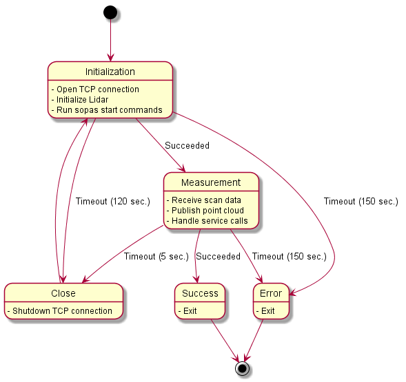
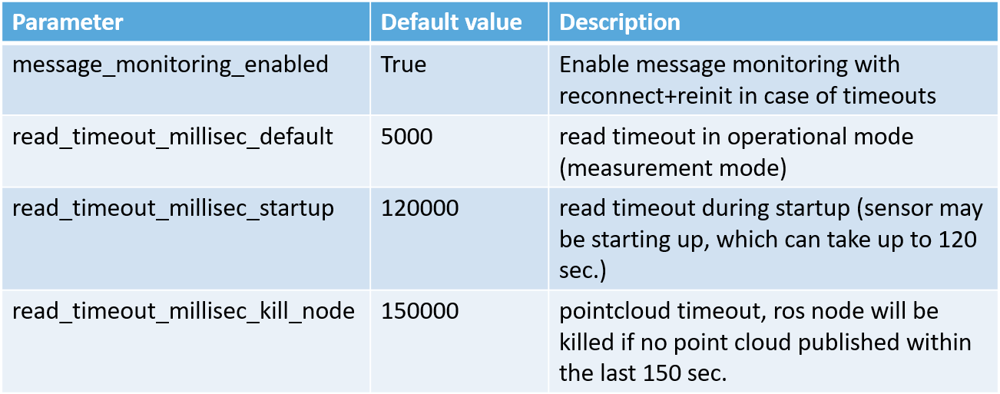

## Run sick_scan_xd driver

The sick_scan_xd driver can be started on the command line by `sick_generic_caller <launchfile> [hostname:=<ip-address>]`. The start process varies slightly depending on the target OS:

- On native Linux without ROS, call

    ```sick_generic_caller <launchfile>```

- On Linux with ROS-1, call

    ```./devel_isolated/setup.bash```

    ```roslaunch sick_scan_xd <launchfile>```

- On Linux with ROS-2, call

    ```source ./install/setup.bash```

    ```ros2 run sick_scan_xd sick_generic_caller ./src/sick_scan_xd/launch/<launchfile>```

- On native Windows without ROS, call

    ```sick_generic_caller <launchfile>```

- On Windows with ROS-2, call

    ```call .\install\setup.bat```

    ```ros2 run sick_scan_xd sick_generic_caller ./src/sick_scan_xd/launch/<launchfile>```

Use the following commands to run the sick_scan_xd driver for a specific scanner type:

- For MRS6124:
    * Linux native:   `sick_generic_caller sick_mrs_6xxx.launch`
    * Linux ROS-1:    `roslaunch sick_scan_xd sick_mrs_6xxx.launch`
    * Linux ROS-2:    `ros2 run sick_scan_xd sick_generic_caller ./src/sick_scan_xd/launch/sick_mrs_6xxx.launch`
    * Windows native: `sick_generic_caller sick_mrs_6xxx.launch`
    * Windows ROS-2:  `ros2 run sick_scan_xd sick_generic_caller ./src/sick_scan_xd/launch/sick_mrs_6xxx.launch`
- For MRS1104:
    * Linux native:   `sick_generic_caller sick_mrs_1xxx.launch`
    * Linux ROS-1:    `roslaunch sick_scan_xd sick_mrs_1xxx.launch`
    * Linux ROS-2:    `ros2 run sick_scan_xd sick_generic_caller ./src/sick_scan_xd/launch/sick_mrs_1xxx.launch`
    * Windows native: `sick_generic_caller sick_mrs_1xxx.launch`
    * Windows ROS-2:  `ros2 run sick_scan_xd sick_generic_caller ./src/sick_scan_xd/launch/sick_mrs_1xxx.launch`
- For LMS1104 with firmware 1.x:
    * Linux native:   `sick_generic_caller sick_lms_1xxx.launch`
    * Linux ROS-1:    `roslaunch sick_scan_xd sick_lms_1xxx.launch`
    * Linux ROS-2:    `ros2 run sick_scan_xd sick_generic_caller ./src/sick_scan_xd/launch/sick_lms_1xxx.launch`
    * Windows native: `sick_generic_caller sick_lms_1xxx.launch`
    * Windows ROS-2:  `ros2 run sick_scan_xd sick_generic_caller ./src/sick_scan_xd/launch/sick_lms_1xxx.launch`
- For LMS1104 with firmware 2.x:
    * Linux native:   `sick_generic_caller sick_lms_1xxx_v2.launch`
    * Linux ROS-1:    `roslaunch sick_scan_xd sick_lms_1xxx_v2.launch`
    * Linux ROS-2:    `ros2 run sick_scan_xd sick_generic_caller ./src/sick_scan_xd/launch/sick_lms_1xxx_v2.launch`
    * Windows native: `sick_generic_caller sick_lms_1xxx_v2.launch`
    * Windows ROS-2:  `ros2 run sick_scan_xd sick_generic_caller ./src/sick_scan_xd/launch/sick_lms_1xxx_v2.launch`
- For TiM240-prototype:
    * Linux native:   `sick_generic_caller sick_tim_240.launch`
    * Linux ROS-1:    `roslaunch sick_scan_xd sick_tim_240.launch`
    * Linux ROS-2:    `ros2 run sick_scan_xd sick_generic_caller ./src/sick_scan_xd/launch/sick_tim_240.launch`
    * Windows native: `sick_generic_caller sick_tim_240.launch`
    * Windows ROS-2:  `ros2 run sick_scan_xd sick_generic_caller ./src/sick_scan_xd/launch/sick_tim_240.launch`
- For TiM5xx-family:
    * Linux native:   `sick_generic_caller sick_tim_5xx.launch`
    * Linux ROS-1:    `roslaunch sick_scan_xd sick_tim_5xx.launch`
    * Linux ROS-2:    `ros2 run sick_scan_xd sick_generic_caller ./src/sick_scan_xd/launch/sick_tim_5xx.launch`
    * Windows native: `sick_generic_caller sick_tim_5xx.launch`
    * Windows ROS-2:  `ros2 run sick_scan_xd sick_generic_caller ./src/sick_scan_xd/launch/sick_tim_5xx.launch`
- For TiM7xx-family (no safety scanner):
    * Linux native:   `sick_generic_caller sick_tim_7xx.launch`
    * Linux ROS-1:    `roslaunch sick_scan_xd sick_tim_7xx.launch`
    * Linux ROS-2:    `ros2 run sick_scan_xd sick_generic_caller ./src/sick_scan_xd/launch/sick_tim_7xx.launch`
    * Windows native: `sick_generic_caller sick_tim_7xx.launch`
    * Windows ROS-2:  `ros2 run sick_scan_xd sick_generic_caller ./src/sick_scan_xd/launch/sick_tim_7xx.launch`
- For TiM7xxS-family (safety scanner):
    * Linux native:   `sick_generic_caller sick_tim_7xxS.launch`
    * Linux ROS-1:    `roslaunch sick_scan_xd sick_tim_7xxS.launch`
    * Linux ROS-2:    `ros2 run sick_scan_xd sick_generic_caller ./src/sick_scan_xd/launch/sick_tim_7xxS.launch`
    * Windows native: `sick_generic_caller sick_tim_7xxS.launch`
    * Windows ROS-2:  `ros2 run sick_scan_xd sick_generic_caller ./src/sick_scan_xd/launch/sick_tim_7xxS.launch`
- For LMS1xx-family:
    * Linux native:   `sick_generic_caller sick_lms_1xx.launch`
    * Linux ROS-1:    `roslaunch sick_scan_xd sick_lms_1xx.launch`
    * Linux ROS-2:    `ros2 run sick_scan_xd sick_generic_caller ./src/sick_scan_xd/launch/sick_lms_1xx.launch`
    * Windows native: `sick_generic_caller sick_lms_1xx.launch`
    * Windows ROS-2:  `ros2 run sick_scan_xd sick_generic_caller ./src/sick_scan_xd/launch/sick_lms_1xx.launch`
- For LMS5xx-family:
    * Linux native:   `sick_generic_caller sick_lms_5xx.launch`
    * Linux ROS-1:    `roslaunch sick_scan_xd sick_lms_5xx.launch`
    * Linux ROS-2:    `ros2 run sick_scan_xd sick_generic_caller ./src/sick_scan_xd/launch/sick_lms_5xx.launch`
    * Windows native: `sick_generic_caller sick_lms_5xx.launch`
    * Windows ROS-2:  `ros2 run sick_scan_xd sick_generic_caller ./src/sick_scan_xd/launch/sick_lms_5xx.launch`
- For LMS4xxx-family:
    * Linux native:   `sick_generic_caller sick_lms_4xxx.launch`
    * Linux ROS-1:    `roslaunch sick_scan_xd sick_lms_4xxx.launch`
    * Linux ROS-2:    `ros2 run sick_scan_xd sick_generic_caller ./src/sick_scan_xd/launch/sick_lms_4xxx.launch`
    * Windows native: `sick_generic_caller sick_lms_4xxx.launch`
    * Windows ROS-2:  `ros2 run sick_scan_xd sick_generic_caller ./src/sick_scan_xd/launch/sick_lms_4xxx.launch`
- For LRS4000:
    * Linux native:   `sick_generic_caller sick_lrs_4xxx.launch`
    * Linux ROS-1:    `roslaunch sick_scan_xd sick_lrs_4xxx.launch`
    * Linux ROS-2:    `ros2 run sick_scan_xd sick_generic_caller ./src/sick_scan_xd/launch/sick_lrs_4xxx.launch`
    * Windows native: `sick_generic_caller sick_lrs_4xxx.launch`
    * Windows ROS-2:  `ros2 run sick_scan_xd sick_generic_caller ./src/sick_scan_xd/launch/sick_lrs_4xxx.launch`
- For LDMRS-family:
    * Linux native:   `sick_generic_caller sick_ldmrs.launch`
    * Linux ROS-1:    `roslaunch sick_scan_xd sick_ldmrs.launch`
    * Linux ROS-2:    `ros2 run sick_scan_xd sick_generic_caller ./src/sick_scan_xd/launch/sick_ldmrs.launch`
    * Note that LDMRS are currently not supported on Windows
- For LRS36x0:
    * Linux native:   `sick_generic_caller sick_lrs_36x0.launch`
    * Linux ROS-1:    `roslaunch sick_scan_xd sick_lrs_36x0.launch`
    * Linux ROS-2:    `ros2 run sick_scan_xd sick_generic_caller ./src/sick_scan_xd/launch/sick_lrs_36x0.launch`
    * Windows native: `sick_generic_caller sick_lrs_36x0.launch`
    * Windows ROS-2:  `ros2 run sick_scan_xd sick_generic_caller ./src/sick_scan_xd/launch/sick_lrs_36x0.launch`
- For LRS36x0 mounted upside down:
    * Linux native:   `sick_generic_caller sick_lrs_36x0_upside_down.launch`
    * Linux ROS-1:    `roslaunch sick_scan_xd sick_lrs_36x0_upside_down.launch`
    * Linux ROS-2:    `ros2 run sick_scan_xd sick_generic_caller ./src/sick_scan_xd/launch/sick_lrs_36x0_upside_down.launch`
    * Windows native: `sick_generic_caller sick_lrs_36x0_upside_down.launch`
    * Windows ROS-2:  `ros2 run sick_scan_xd sick_generic_caller ./src/sick_scan_xd/launch/sick_lrs_36x0_upside_down.launch`
    <br/>For upside down mounted devices, the pointcloud is rotated by 180 deg about the x axis (180 deg roll angle). This additional rotation is configured in the launch file using parameter `add_transform_xyz_rpy` with value `"0,0,0,3.141592,0,0"`.
- For LRS36x1:
    * Linux native:   `sick_generic_caller sick_lrs_36x1.launch`
    * Linux ROS-1:    `roslaunch sick_scan_xd sick_lrs_36x1.launch`
    * Linux ROS-2:    `ros2 run sick_scan_xd sick_generic_caller ./src/sick_scan_xd/launch/sick_lrs_36x1.launch`
    * Windows native: `sick_generic_caller sick_lrs_36x1.launch`
    * Windows ROS-2:  `ros2 run sick_scan_xd sick_generic_caller ./src/sick_scan_xd/launch/sick_lrs_36x1.launch`
- For LRS36x1 mounted upside down:
    * Linux native:   `sick_generic_caller sick_lrs_36x1_upside_down.launch`
    * Linux ROS-1:    `roslaunch sick_scan_xd sick_lrs_36x1_upside_down.launch`
    * Linux ROS-2:    `ros2 run sick_scan_xd sick_generic_caller ./src/sick_scan_xd/launch/sick_lrs_36x1_upside_down.launch`
    * Windows native: `sick_generic_caller sick_lrs_36x1_upside_down.launch`
    * Windows ROS-2:  `ros2 run sick_scan_xd sick_generic_caller ./src/sick_scan_xd/launch/sick_lrs_36x1_upside_down.launch`
    <br/>For upside down mounted devices, the pointcloud is rotated by 180 deg about the x axis (180 deg roll angle). This additional rotation is configured in the launch file using parameter `add_transform_xyz_rpy` with value `"0,0,0,3.141592,0,0"`.
- For LD-OEM15xx:
    * Linux native:   `sick_generic_caller sick_oem_15xx.launch`
    * Linux ROS-1:    `roslaunch sick_scan_xd sick_oem_15xx.launch`
    * Linux ROS-2:    `ros2 run sick_scan_xd sick_generic_caller ./src/sick_scan_xd/launch/sick_oem_15xx.launch`
    * Windows native: `sick_generic_caller sick_oem_15xx.launch`
    * Windows ROS-2:  `ros2 run sick_scan_xd sick_generic_caller ./src/sick_scan_xd/launch/sick_oem_15xx.launch`
- For NAV210 and NAV245:
    * Linux native:   `sick_generic_caller sick_nav_2xx.launch`
    * Linux ROS-1:    `roslaunch sick_scan_xd sick_nav_2xx.launch`
    * Linux ROS-2:    `ros2 run sick_scan_xd sick_generic_caller ./src/sick_scan_xd/launch/sick_nav_2xx.launch`
    * Windows native: `sick_generic_caller sick_nav_2xx.launch`
    * Windows ROS-2:  `ros2 run sick_scan_xd sick_generic_caller ./src/sick_scan_xd/launch/sick_nav_2xx.launch`
- For NAV310:
    * Linux native:   `sick_generic_caller sick_nav_31x.launch`
    * Linux ROS-1:    `roslaunch sick_scan_xd sick_nav_31x.launch`
    * Linux ROS-2:    `ros2 run sick_scan_xd sick_generic_caller ./src/sick_scan_xd/launch/sick_nav_31x.launch`
    * Windows native: `sick_generic_caller sick_nav_31x.launch`
    * Windows ROS-2:  `ros2 run sick_scan_xd sick_generic_caller ./src/sick_scan_xd/launch/sick_nav_31x.launch`
- For NAV350:
    * Linux native:   `sick_generic_caller sick_nav_350.launch`
    * Linux ROS-1:    `roslaunch sick_scan_xd sick_nav_350.launch`
    * Linux ROS-2:    `ros2 run sick_scan_xd sick_generic_caller ./src/sick_scan_xd/launch/sick_nav_350.launch`
    * Windows native: `sick_generic_caller sick_nav_350.launch`
    * Windows ROS-2:  `ros2 run sick_scan_xd sick_generic_caller ./src/sick_scan_xd/launch/sick_nav_350.launch`
- For RMSxxxx-family (RMS1xxx, RMS2xxx):
    * Linux native:   `sick_generic_caller sick_rms_xxxx.launch`
    * Linux ROS-1:    `roslaunch sick_scan_xd sick_rms_xxxx.launch`
    * Linux ROS-2:    `ros2 run sick_scan_xd sick_generic_caller ./src/sick_scan_xd/launch/sick_rms_xxxx.launch`
    * Windows native: `sick_generic_caller sick_rms_xxxx.launch`
    * Windows ROS-2:  `ros2 run sick_scan_xd sick_generic_caller ./src/sick_scan_xd/launch/sick_rms_xxxx.launch`
- For multiScan136 (sick_scansegement_xd):
    * Linux native:   `sick_generic_caller sick_multiscan.launch hostname:=<ip-address> udp_receiver_ip:=<ip-address>`
    * Linux ROS-1:    `roslaunch sick_scan_xd sick_multiscan.launch hostname:=<ip-address> udp_receiver_ip:=<ip-address>`
    * Linux ROS-2:    `ros2 launch sick_scan_xd sick_multiscan.launch.py hostname:=<ip-address> udp_receiver_ip:=<ip-address>`
    * Windows native: `sick_generic_caller sick_multiscan.launch hostname:=<ip-address> udp_receiver_ip:=<ip-address>`
    * Windows ROS-2:  `ros2 launch sick_scan_xd sick_multiscan.launch.py hostname:=<ip-address> udp_receiver_ip:=<ip-address>`
    * `hostname` is the ip-address of the lidar, `udp_receiver_ip` is the ip-address of the receiver (i.e. the ip of the computer running sick_generic_caller).
- For picoScan150:
    * Linux native:   `sick_generic_caller sick_picoscan.launch hostname:=<ip-address> udp_receiver_ip:=<ip-address>`
    * Linux ROS-1:    `roslaunch sick_scan_xd sick_picoscan.launch hostname:=<ip-address> udp_receiver_ip:=<ip-address>`
    * Linux ROS-2:    `ros2 launch sick_scan_xd sick_picoscan.launch.py hostname:=<ip-address> udp_receiver_ip:=<ip-address>`
    * Windows native: `sick_generic_caller sick_picoscan.launch hostname:=<ip-address> udp_receiver_ip:=<ip-address>`
    * Windows ROS-2:  `ros2 launch sick_scan_xd sick_picoscan.launch.py hostname:=<ip-address> udp_receiver_ip:=<ip-address>`
    * `hostname` is the ip-address of the lidar, `udp_receiver_ip` is the ip-address of the receiver (i.e. the ip of the computer running sick_generic_caller).

Common commandline options are

- `hostname:=<ip-address>` to connect to a sensor with a given IP address. Default value is always the factory default IP address of the scanner.

Further (common and scanner specific) options can be set via launchfile, see [Common parameters](#common-parameters) and configure the settings in the launchfile corresponding to the scanner type.

Note: After modifying a launch-file, it has to be installed by running `catkin_make_isolated --install --cmake-args -DROS_VERSION=1 -Wno-dev`
to be located and used by `roslaunch`.

On ROS-2 you can launch sick_generic_caller by python-launchfiles, too. Use
```
ros2 launch sick_scan_xd <name>.launch.py <param>:=<value>
```
E.g. for LMS-5xx: `ros2 launch sick_scan_xd sick_lms_5xx.launch.py hostname:=192.168.0.1`

The launch.py-files on ROS-2 passes the corresponding launch-file to the driver: [sick_lms_5xx.launch.py](launch/sick_lms_5xx.launch.py) gives an example for LMS-5xx. Parameter can be overwritten
* either by commandline, e.g. <br/> `ros2 launch sick_scan_xd sick_lms_5xx.launch.py hostname:=192.168.0.1`, 
* or by passing additional arguments in the launch.py-file, e.g. <br/> `node = Node(package='sick_scan_xd', executable='sick_generic_caller', arguments=[launch_file_path, 'hostname:=192.168.0.1'])`


### Start Multiple Nodes

Multiple nodes can be started to support multiple sensors. In this case, multiple instances of sick_scan_xd have to be started, each node with different name and topic. ROS-1 example to run two TiM 7xx devices with ip address `192.168.0.1` and `192.168.0.2`:

```
roslaunch sick_scan_xd sick_tim_7xx.launch nodename:=sick_tim_7xx_1 hostname:=192.168.0.1 cloud_topic:=cloud_1 &
roslaunch sick_scan_xd sick_tim_7xx.launch nodename:=sick_tim_7xx_2 hostname:=192.168.0.2 cloud_topic:=cloud_2 &
```

On Linux with ROS-1, multiple nodes to support multiple sensors can be started by one launch file, too.
Take the launchfile [sick_tim_5xx_twin.launch](launch/sick_tim_5xx_twin.launch) as an example.
Remapping the scan and cloud topics is essential to distinguish the scandata and provide TF information.

ROS-2 example to run two TiM 7xx devices with ip address `192.168.0.1` and `192.168.0.2`:

```
ros2 run sick_scan_xd sick_generic_caller ./src/sick_scan_xd/launch/sick_tim_7xx.launch nodename:=sick_tim_7xx_1 hostname:=192.168.0.1 cloud_topic:=cloud_1 &
ros2 run sick_scan_xd sick_generic_caller ./src/sick_scan_xd/launch/sick_tim_7xx.launch nodename:=sick_tim_7xx_2 hostname:=192.168.0.2 cloud_topic:=cloud_2 &
```

### Common parameters

For the launch-file settings and the tag/values pairs the following keywords are supported:

| Keyword      |     Meaning     |  Default value |    Hint       |
|--------------|-----------------|----------------|---------------|
| scanner_type |  Scanner family |  ???           | see list above |
| min_ang      |  Start scan angle in [rad] |  -2.3998277           |  |
| max_ang      |  End scan angle in [rad] |  +2.3998277           |  |
| intensity_resolution_16bit | Switch between 8Bit/16Bit| "false" | do not change|
| hostname | Ip address of scanner  | 192.168.0.1 | change to scanner ip address in your network (see faq) |
| port | port number  | 2112 | do not change, check firewall rules if there is blocking traffic  |
| timelimit | Timelimit in [sec]   | 5 | do not change  |

- `scanner_type`
  Name of the used scanner. Usually this is also the name of the launch file. This entry is used to differentiate
  between the various scanner properties within the software code.

- `hostname`
  IP-address of the scanner (default: 192.168.0.1)

- `port`
  IP-port of the scanner (default: 2112)

- `min_ang`
  Start angle in [rad]

- `max_ang`
  End angle in [rad]

- `use_binary_protocol`
  Switch between SOPAS Binary and SOPAS ASCII protocol

- `intensity`
  Enable or disable transport of intensity values

- `intensity_resolution_16bit`
  If true, the intensity values is transferred as 16 bit value. If false, as 8 bit value.

- `min_intensity`
  If min_intensity > 0, all range values in a LaserScan message are set to infinity, if their intensity value is below min_intensity

- `cloud_topic`
  Topic name of the published pointcloud2 data

- `frame_id`
  Frame id used for the published data

Tag/value pairs of the commandline overwrite settings in the launch file.
The use of the parameters can be looked up in the launch files. This is also recommended as a starting point.

### Starting Scanner with Specific Ip Address

To start the scanner with a specific IP address, option `hostname:=<ip-address>` can be used.
The hostname is the ip-address of the scanner, e.g.
```
sick_generic_caller sick_tim_5xx.launch hostname:=192.168.0.71                         # Linux native
roslaunch sick_scan_xd sick_tim_5xx.launch hostname:=192.168.0.71                      # Linux ROS-1
ros2 run sick_scan_xd sick_generic_caller sick_tim_5xx.launch hostname:=192.168.0.71   # Linux ROS-2
sick_generic_caller sick_tim_5xx.launch hostname:=192.168.0.71                         # Windows native
ros2 run sick_scan_xd sick_generic_caller sick_tim_5xx.launch hostname:=192.168.0.71   # Windows ROS-2
```

### Further useful parameters and features

- **Timestamps**: If parameter`sw_pll_only_publish` is true (default), an internal Software PLL is used to sync the scan generation timestamps to system timestamps. See [software_pll.md](./doc/software_pll.md) for details.

- **Angle compensation**: For highest angle accuracy the NAV-Lidar series supports an [angle compensation mechanism](./doc/angular_compensation.md).

- **Angle correction**: MRS-1xxx lidars transmit accurate azimuth angles for each scan point. Therefore, the stride (angle increment) of the MRS-1xxx azimuth angles in polar and cartesian point clouds is not exactly constant. Since laserscan messages assume a constant angle increment, scan points in point cloud and laserscan messages have slightly different azimuth angles.

- **Field monitoring**: The **LMS1xx**, **LMS5xx**, **TiM7xx** and **TiM7xxS** families have [extended settings for field monitoring](./doc/field_monitoring_extensions.md).

- **Radar devices**: For radar devices (RMSxxxx), radar raw targets or radar objects or both can be tracked and transmitted. You can activate parameter transmit_raw_targets, transmit_objects or both in the launchfile:
   ```
   <param name="transmit_raw_targets" type="bool" value="false"/>
   <param name="transmit_objects" type="bool" value="true"/>
   ```
   By default, radar objects are tracked.

- **Coordinate transform**: An optional coordinate transform can be applied to the pointcloud. See [coordinate transforms](./doc/coordinate_transforms.md) for details.

### Lidar specific parameters

Some lidars have specific parameters and options.

- **TiM781S**: For TiM781S lidars, the initial lidar configuration can be deactivated using optional argument initialize_scanner:=0.
  Note that this mode does not initialize the lidar. The mode assumes that the scanner is in an appropriate state corresponding to the properties configured in the launchfile. It is not recommended to use this option unless for specific tasks in a controlled environment.<br/>
   **Do not use this mode except the lidar has been configured properly and initialized successfully and is in the same state as after initialization by the launchfile! This option is for advanced users only!**<br/>
   Example: `roslaunch sick_scan_xd sick_tim_7xxS.launch hostname:=192.168.0.1 initialize_scanner:=0`

### ROS services

On ROS-1 and ROS-2, services can be used to send COLA commands to the sensor. This can be very helpful for diagnosis, e.g. by querying the device status or its id.

Use the following examples to run a cola commond on ROS-1:
```
rosservice call /sick_lms_5xx/ColaMsg "{request: 'sMN IsSystemReady'}"
rosservice call /sick_lms_5xx/ColaMsg "{request: 'sRN SCdevicestate'}"
rosservice call /sick_lms_5xx/ColaMsg "{request: 'sEN LIDinputstate 1'}"
rosservice call /sick_lms_5xx/ColaMsg "{request: 'sEN LIDoutputstate 1'}"
rosservice call /sick_lms_5xx/ColaMsg "{request: 'sMN LMCstartmeas'}"
rosservice call /sick_lms_5xx/SCdevicestate "{}" # query device state
rosservice call /sick_lms_5xx/SCreboot "{}"      # execute a software reset on the device
rosservice call /sick_lms_5xx/SCsoftreset "{}"   # save current parameter and shut down device
```

Use the following examples to run a cola commond on ROS-2:
```
ros2 service call /ColaMsg sick_scan_xd/srv/ColaMsgSrv "{request: 'sMN IsSystemReady'}"
ros2 service call /ColaMsg sick_scan_xd/srv/ColaMsgSrv "{request: 'sRN SCdevicestate'}"
ros2 service call /ColaMsg sick_scan_xd/srv/ColaMsgSrv "{request: 'sEN LIDinputstate 1'}"
ros2 service call /ColaMsg sick_scan_xd/srv/ColaMsgSrv "{request: 'sEN LIDoutputstate 1'}"
ros2 service call /ColaMsg sick_scan_xd/srv/ColaMsgSrv "{request: 'sMN LMCstartmeas'}"
ros2 service call /SCdevicestate sick_scan_xd/srv/SCdevicestateSrv "{}" # query device state
ros2 service call /SCreboot sick_scan_xd/srv/SCrebootSrv "{}"           # execute a software reset on the device
ros2 service call /SCsoftreset sick_scan_xd/srv/SCsoftresetSrv "{}"     # save current parameter and shut down device
```

Use ros service `SickScanExit` to stop the scanner and driver:
```
rosservice call /sick_nav_31x/SickScanExit "{}" # stop scanner and driver on ROS-1
ros2 service call /SickScanExit sick_scan_xd/srv/SickScanExitSrv "{}" # stop scanner and driver on ROS-2
```

Note:
* The COLA commands are sensor specific. See the user manual and telegram listing for further details.
* ROS services require installation of ROS-1 or ROS-2, i.e. services for Cola commands are currently not supported on native Linux or native Windows.
* ROS services are currently not available for the LDMRS.
* Some SOPAS commands like `sMN SetAccessMode 3 F4724744` stop the current measurement. In this case, the driver restarts after a timeout (5 seconds by default). To process those SOPAS commands without restart, you can
   * send `sMN LMCstartmeas` and `sMN Run` to switch again into measurement mode within the timeout, or
   * increase the driver timeout `read_timeout_millisec_default` in the launch-file.

Additional services can be available for specific lidars. Service "GetContaminationResult" is e.g. available for MRS-1xxx, LMS-1xxx and multiScan:
```
# ROS-1 example for service GetContaminationResult (LMS 1xxx)
rosservice call /sick_lms_1xxx/GetContaminationResult "{}"
# ROS-2 example for service GetContaminationResult (LMS 1xxx)
ros2 service call /GetContaminationResult sick_scan_xd/srv/GetContaminationResultSrv "{}"
```

Example sequence with stop and start measurement to set a particle filter (TiM-7xxx on ROS-1):
```
rosservice call /sick_tim_7xx/ColaMsg "{request: 'sMN SetAccessMode 3 F4724744'}"
rosservice call /sick_tim_7xx/ColaMsg "{request: 'sRN LFPparticle'}" # response: "sRA LFPparticle \\x00\\x01\\xf4"
rosservice call /sick_tim_7xx/ColaMsg "{request: 'sWN LFPparticle 0101F4'}" # response: "sWA LFPparticle"
rosservice call /sick_tim_7xx/ColaMsg "{request: 'sMN LMCstartmeas'}"
rosservice call /sick_tim_7xx/ColaMsg "{request: 'sMN Run'}"
```

### Driver states, timeouts

The driver runs in two different states:

1. Initialization: The scanner is initialized and configured by a list of sopas commands

2. Measurement: The scanner is operational, scandata are transmitted and the point cloud is published.
After start, the driver enters initialization mode. After successful initialization, the driver switches automatically into measurement mode.

The communication between driver and scanner is monitored. In case of communication timeouts, e.g. due to network problems, the TCP connection is reset and the scanner is re-initialized. The driver uses 3 different timeouts (i.e time since last message received from lidar):

1. In measurement mode: If no messages arrive for 5 seconds [timeout 0], the TCP/IP connection is closed. After a short delay, the tcp connection is reopened and the driver switches to initialisation mode and reinitialises the Lidar.

2. In initialisation mode: If no messages received after 120 sec [Timeout 1] the TCP/IP connection is closed. After a short delay, the tcp connection is reopened and the driver switches to initialisation mode and reinitialises the Lidar.

3. In any mode: If no messages received after 150 sec [Timeout 2] the driver terminates.

Note: The internal timer is reset on successful communication. i.e. the timeout refers to the time of the last message from the Lidar. If there was no message yet, then the time of programme start is used.

All timeouts can be configured in the launchfile:
```
<param name="message_monitoring_enabled" type="bool" value="True" />      <!-- Enable message monitoring with reconnect+reinit in case of timeouts, default: true -->
<param name="read_timeout_millisec_default" type="int" value="5000"/>     <!-- 5 sec read timeout in operational mode (measurement mode), default: 5000 milliseconds -->
<param name="read_timeout_millisec_startup" type="int" value="120000"/>   <!-- 120 sec read timeout during startup (sensor may be starting up, which can take up to 120 sec.), default: 120000 milliseconds -->
<param name="read_timeout_millisec_kill_node" type="int" value="150000"/> <!-- 150 sec pointcloud timeout, ros node will be killed if no point cloud published within the last 150 sec., default: 150000 milliseconds --> 
```

The following diagram shows the transition between the driver states:



Note: Timeout 2 (i.e. no lidar message after 150 seconds) terminates the driver. By default, the driver does not restart automatically. It is therefor recommended to run the driver within an endless loop, e.g. in bash:

```
while(true) ; do roslaunch sick_scan_xd <launchfile> [<arguments>] ; done
```

The following table summarizes the timeout parameter:



Details of timeout settings:

* message_monitoring_enabled: Enable or disable timeouts and monitoring. Disabling deactivates any error handling in case of network problems. Recommended default value: True

* read_timeout_millisec_default: Read timeout in milliseconds in operational (measurement) mode. If no datagrams are received from lidar within 5 seconds (default), the TCP socket is closed and the lidar is reinitialized.

* read_timeout_millisec_startup: Read timeout in milliseconds during initialization after startup. If SOPAS commands are not responded within 120 seconds (default), the TCP socket is closed and lidar is reinitialized.

* read_timeout_millisec_kill_node: Pointcloud timeout in milliseconds in operational (measurement) mode. If the sick_scan_xd does not publish a pointcloud within the last 150 seconds, the sick_scan_xd process is killed. Should never happen, but is the “last resort” to exit after any kind of error (e.g. socket hangs up and blocks after network trouble).

* All timeouts configured in milliseconds

* To disable timeouts (not recommended):
   * Set message_monitoring_enabled = false, or
   * Set timeouts to "infinite" values, i.e MAX_INT = 2147483647 milliseconds (24.9 days)

* To disable pointcloud monitoring (not recommended):
   * read_timeout_millisec_kill_node <= 0 deactivates pointcloud monitoring

* Parameter read_timeout_millisec_default and read_timeout_millisec_startup: value 0 and negative values are currently NOT mapped to other values, i.e. will cause an immediately timeout error. Use value 2147483647 or message_monitoring_enabled = false to deactivate read timeouts (not recommended)

## Sopas Mode

This driver supports both COLA-B (binary) and COLA-A (ASCII) communication with the laser scanner. Binary mode is activated by default, since this mode generates less network traffic and enables more compatibility to all scanners.
If the communication mode set in the scanner memory is different from that used by the driver, the scanner's communication mode is changed. This requires a restart of the TCP-IP connection, which can extend the start time by up to 30 seconds.
There are two ways to prevent this:
1. Recommended:
   * Set the communication mode with the SOPAS ET software to binary and save this setting in the scanner's EEPROM.
   * Set "use_binary_protocol" to default value "true".
2. Use the parameter "use_binary_protocol" to overwrite the default settings of the driver.

## Tools

Various tools exist in the repository to improve the operation of the scanners. It is also recommended to read the following section "Troubleshooting".
Overview of the tools:

* Search for scanner in the network:
  Use the Python3 tool "sick_generic_device_finder.py" in the tools/sick_generic_device_finder directory.
  The tools will output the IP addresses of the connected scanners and some more information about the scanner.  
  Call it with python3, i.e.
  ``
  python3 sick_generic_device_finder.py
  ``
* Setting new IP address: With the help of the parameter "new_IP" a new IP address can be assigned when calling the node sick_scan_xd.
  The launch file sick_new_ip.launch in the launch directory shows an example of how to use this parameter.
* Converting of pointclouds to images: With the tool pcl_converter.cpp one can convert pointcloud2-data
  to image. That is especial convenient for 24-layers scanners like the MRS6124.
* Setting up a brand new scanner: To set up a brand new scanner,
  it is recommended to use the two tools "sick_generic_device_finder.py" to find the scanner in the network
  and the launch file sick_new_ip.launch to set a new IP address. If further settings are to be saved that cannot be made via ROS   parameters, we recommend using the Windows tool "Sopas ET" from SICK.
* Unit tests: For a quick unit test after installation without the sensor hardware, a test server is provided to simulate a scanner. See [emulator](doc/emulator.md) for further details.
* Testing: The sick_scan_test program was developed for testing the driver. See [test/sick_scan_test.md](test/sick_scan_test.md) for details.

## Simulation

For unittests without sensor hardware, a simple test server is provided. To build the test server, call either cmake with option `-DCMAKE_ENABLE_EMULATOR=1`, or activate cmake option `ENABLE_EMULATOR` in CMakeLists.txt. Then rebuild sick_scan_xd. By default, option `ENABLE_EMULATOR` is switched off.

Please note that this just builds a simple test server for basic unittests of sick_scan_xd drivers. Its purpose is to run basic tests and to help with diagnosis in case of issues. It does not emulate a real scanner!

Simulation requires jsoncpp. Install with `sudo apt-get install libjsoncpp-dev` on Linux and with `vcpkg install jsoncpp:x64-windows` on Windows.

You can find examples to test and run sick_scan_xd in offline mode in folder `test/scripts`. Their purpose is to demonstrate the usage of the sick_scan_xd driver. Please feel free to customize the scripts or use them as a starting point for own projects.

### Simulation on Windows

Run script `run_simu_lms_5xx.cmd` in folder `test/scripts` or execute the following commands:

1. Start the test server:
    ```
    cd .\build
    start "testserver" cmd /k python ../test/emulator/test_server.py --scandata_file=../test/emulator/scandata/20210302_lms511.pcapng.scandata.txt --scandata_frequency=20.0 --tcp_port=2112
    @timeout /t 1
    ```

2. Run sick_generic_caller. On native Windows:
    ```
    .\Debug\sick_generic_caller.exe ../launch/sick_lms_5xx.launch hostname:=127.0.0.1 sw_pll_only_publish:=False
    ```
    On Windows with ROS-2:
    ```
    ros2 run sick_scan_xd sick_generic_caller ./src/sick_scan_xd/launch/sick_lms_5xx.launch hostname:=127.0.0.1 sw_pll_only_publish:=False
    ```

3. Open file `image_viewer.html` in folder `demo` in your browser to view a jpg-image of the current scan.

Note, that python version 3 incl. runtime dlls must be accessable, f.e. by extending the PATH environment variable:
```
set PYTHON_DIR=%ProgramFiles(x86)%/Microsoft Visual Studio/Shared/Python37_64
set PATH=%PYTHON_DIR%;%PYTHON_DIR%/Scripts;c:\vcpkg\installed\x64-windows\bin;%PATH%
```

Further examples are provided in folder `test/scripts`.

### Simulation on Linux

Run script `run_simu_lms_5xx.bash` in folder `test/scripts` or execute the following commands:

1. Start the test server:
    ```
    python3 ./test/emulator/test_server.py --scandata_file=./test/emulator/scandata/20210302_lms511.pcapng.scandata.txt --scandata_frequency=20.0 --tcp_port=2112 &
    sleep 1
    ```

2. Run sick_generic_caller.
    - On native Linux:
         ```
        ./build/sick_generic_caller ./launch/sick_lms_5xx.launch hostname:=127.0.0.1 sw_pll_only_publish:=False &
        ```
    - On Linux with ROS-1:
         ```
        roslaunch sick_scan_xd sick_lms_5xx.launch hostname:=127.0.0.1 sw_pll_only_publish:=False &
        ```
    - On Linux with ROS-2:
         ```
        ros2 run sick_scan_xd sick_generic_caller ./src/sick_scan_xd/launch/sick_lms_5xx.launch hostname:=127.0.0.1 sw_pll_only_publish:=False &
        ```

3. View the point cloud.
    - On native Linux:<br>
         Open file `image_viewer.html` in folder `demo` in a browser (f.e. firefox) to view a jpg-image of the current scan.
    - On Linux with ROS-1:
         ```
        rosrun rviz rviz -d ./src/sick_scan_xd/test/emulator/config/rviz_emulator_cfg_lms5xx.rviz &
        ```
    - On Linux with ROS-2:
         ```
        rviz2 -d ./src/sick_scan_xd/test/emulator/config/rviz2_lms5xx.rviz &
        ```

Further examples are provided in folder `test/scripts`.

