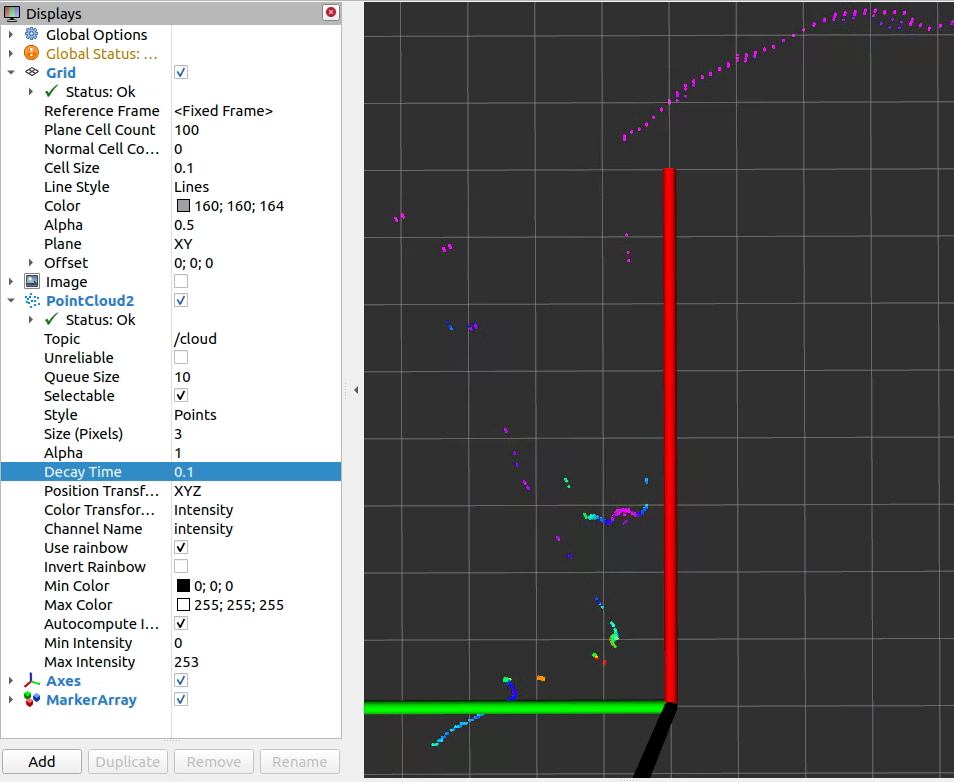
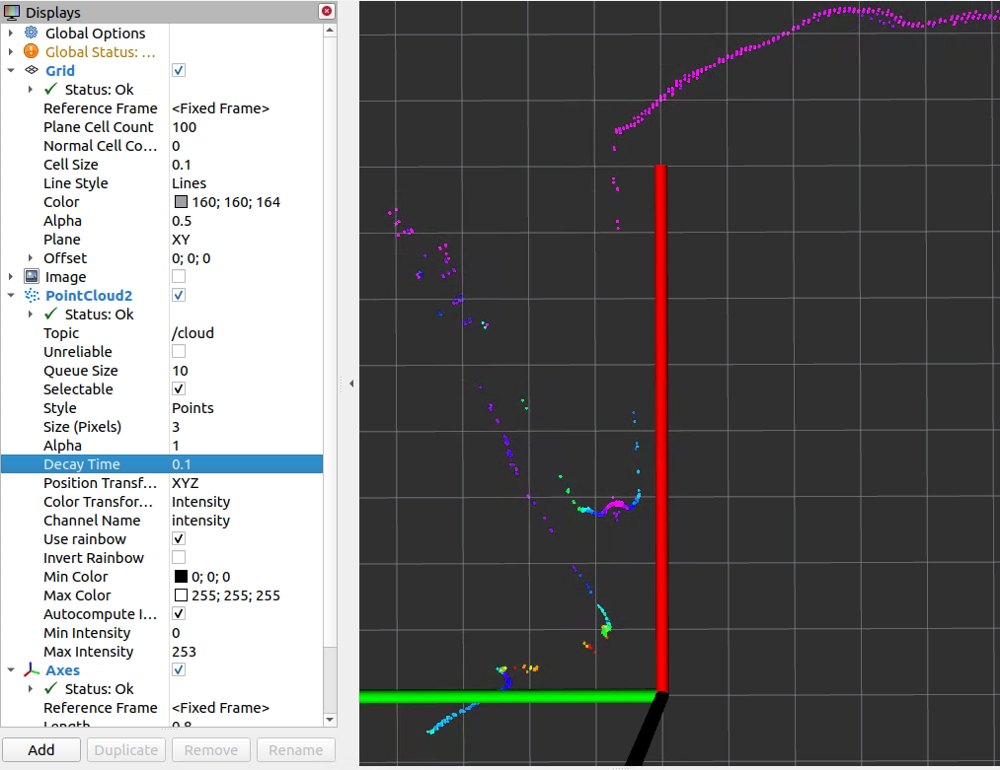
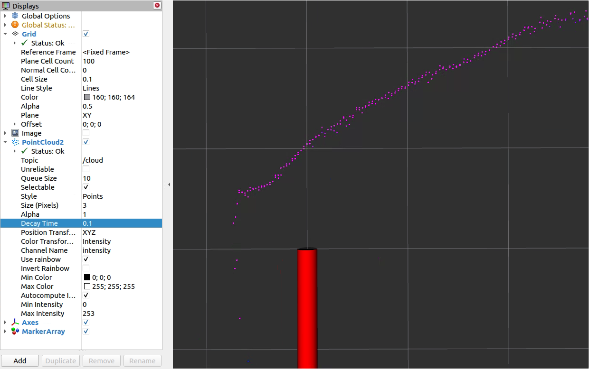

# Interlacing

Most lidars create non interlaced scan data by default, i.e. a scan data telegram contains all scan points measured during a full 360 degree circulation. For MRS-1xxx and LMS-1xxx lidars, parameter `ang_res` can be configured to increase the angular resolution. In this case, the scan data and point clouds are measured and published interlaced.

The following table shows valid combinations of the angular resolution (parameter `ang_res`) and scan frequency (parameter `scan_freq`) for MRS-1xxx and LMS-1xxx lidars:

| lidar | ang_res [deg] | scan_freq [Hz] | interlacing |
| ----- | ----- | ----- | ----- |
| MRS-1xxx | 0.25 | 50 | non-interlaced |
| MRS-1xxx | 0.125 | 25 | 2 x interlaced |
| MRS-1xxx | 0.0625 | 12.5 | 4 x interlaced |
| LMS-1xxx | 0.75 | 150 | non-interlaced |
| LMS-1xxx | 0.375 | 75 | 2 x interlaced |
| LMS-1xxx | 0.1875 | 37.5 | 4 x interlaced |

## MRS-1xxx angular resolution

By default, MRS-1xxx lidars create non-interlaced scans with an angular resolution 0.25 deg.
Using higher resolutions, the MRS-1xxx sends scan data interlaced. 

MRS-1xxx lidars measure 4 consecutive scans with identical starting angles for each of its 4 layers, where each layer has a different elevation angle. This results in (12.5 Hz) * (4 layers) * (360 deg / 0.25 deg) * (275 deg / 360 deg) = 55000 shots per second.

With default configuration ang_res=0.25, the angular resolution of each scan is 0.25 [deg] and scans and point clouds are non-interlaced. The sequence of scan data telegrams is repeating with 4 consecutive telegrams (resp. 4 point cloud messages):
* layer[0] starting at -137.5 deg, angle inc = 0.25 deg
* layer[1] starting at -137.5 deg, angle inc = 0.25 deg
* layer[2] starting at -137.5 deg, angle inc = 0.25 deg
* layer[3] starting at -137.5 deg, angle inc = 0.25 deg

With configuration ang_res=0.125, the angular resolution of each scan is 0.125 [deg] and scans and point clouds are 2 x interlaced. The sequence of scan data telegrams is repeating with 8 consecutive telegrams (resp. 8 point cloud messages):
* layer[0] starting at -137.500 deg, angle inc = 0.25 deg
* layer[1] starting at -137.500 deg, angle inc = 0.25 deg
* layer[2] starting at -137.500 deg, angle inc = 0.25 deg
* layer[3] starting at -137.500 deg, angle inc = 0.25 deg
* layer[0] starting at -137.625 deg, angle inc = 0.25 deg
* layer[1] starting at -137.625 deg, angle inc = 0.25 deg
* layer[2] starting at -137.625 deg, angle inc = 0.25 deg
* layer[3] starting at -137.625 deg, angle inc = 0.25 deg

With configuration ang_res=0.0625, the angular resolution of each scan is 0.0625 [deg] and scans and point clouds are 4 x interlaced. The sequence of scan data telegrams is repeating with 16 consecutive telegrams (resp. 16 point cloud messages):
* layer[0] starting at -137.4375 deg, angle inc = 0.25 deg
* layer[1] starting at -137.4375 deg, angle inc = 0.25 deg
* layer[2] starting at -137.4375 deg, angle inc = 0.25 deg
* layer[3] starting at -137.4375 deg, angle inc = 0.25 deg
* layer[0] starting at -137.5000 deg, angle inc = 0.25 deg
* layer[1] starting at -137.5000 deg, angle inc = 0.25 deg
* layer[2] starting at -137.5000 deg, angle inc = 0.25 deg
* layer[3] starting at -137.5000 deg, angle inc = 0.25 deg
* layer[0] starting at -137.5625 deg, angle inc = 0.25 deg
* layer[1] starting at -137.5625 deg, angle inc = 0.25 deg
* layer[2] starting at -137.5625 deg, angle inc = 0.25 deg
* layer[3] starting at -137.5625 deg, angle inc = 0.25 deg
* layer[0] starting at -137.6250 deg, angle inc = 0.25 deg
* layer[1] starting at -137.6250 deg, angle inc = 0.25 deg
* layer[2] starting at -137.6250 deg, angle inc = 0.25 deg
* layer[3] starting at -137.6250 deg, angle inc = 0.25 deg

To use the full angular resolution of one 360 degree circulation, the point cloud must be accumulated by 8 resp. 16 messages in interlaced mode.

See [Data buffering in MRS 1xxx](https://github.com/SICKAG/sick_scan_xd/blob/develop/doc/timing.md#data-buffering-in-mrs-1xxx) for timing and timestamp.

## LMS-1xxx angular resolution

By default, LMS-1xxx lidars create non-interlaced scans with an angular resolution 0.75 deg.
Using higher resolutions, the LMS-1xxx sends scan data interlaced. 

With configuration ang_res=0.75, the angular resolution of each scan is 0.75 [deg]. This means that each point cloud message also has a resolution of 0.75 [deg]. With configuration ang_res=0.375, the scan is generated interlaced: Each scan still has 0.75 [deg] resolution, but 2 x 4 = 8 consecutive scans are rotated by 0.375 [deg] against each other. I.e. 8 consecutive point cloud messages each have an angular resolution of 0.375 [deg] at half the frequency. Within a point cloud message the angular resolution is still 0.75 [deg].

With ang_res=0.375, scan data are two times interlaced. The sequence of scan data telegrams is repeating with 8 consecutive telegrams:
* 4 scans starting at -138.000 deg, angle inc = 0.75 deg, then
* 4 scans starting at -138.375 deg, angle inc = 0.75 deg

Thus the start angles of the received scan data telegrams are 
{ ..., -138.375, -138.375, -138.375, -138.375, -138.000, -138.000, -138.000, -138.000, ... }

With ang_res=0.1875 the scan is generated quadruple interlaced, i.e. 4 x 4 = 16 consecutive scans are each rotated by 0.1875 [deg]. Each scan is resolved with 0.75 [deg]; 4 x 4 = 16 scans resp. 16 pointclouds together (accumulated) result in a resolution of 0.1875 [deg] at a quarter of the frequency.

With ang_res=0.1875, scan data are four times interlaced. The sequence of scan data telegrams is repeating with 16 consecutive telegrams:
* 4 scans starting at -137.8125 deg, angle inc = 0.75 deg, then
* 4 scans starting at -138.0000 deg, angle inc = 0.75 deg, then
* 4 scans starting at -138.1875 deg, angle inc = 0.75 deg, then
* 4 scans starting at -138.3750 deg, angle inc = 0.75 deg, then

Thus the start angles of the received scan data telegrams are 
{ ..., -137.8125, -137.8125, -137.8125, -137.8125, -138.0000, -138.0000, -138.0000, -138.0000, -138.1875, -138.1875, -138.1875, -138.1875, -138.3750, -138.3750, -138.3750, -138.3750, ... }

You can see this in rviz by increasing the decay time to e.g. 4/75=0.054 or higher. The screenshot shows an example with the default setting ang_res=0.75:



The angular resolution is (just roughly measured) about atan(0.11/0.9) / 9 points = 0.77 [deg]. With ang_res=0.375 and decay=0.1 rviz shows twice the resolution:



Correspondingly, rviz shows four times the resolution with ang_res=0.1875 and decay=0.1:



To use the full angular resolution of one 360 degree circulation, the pointcloud must be accumulated by 8 resp. 16 messages. 

The active configuration can be seen in the log output during scanner initialization, e.g.:
```
[ INFO] [1669294673.078608968]: sRA LMPscancfg: scan frequency = 75 Hz, angular resolution = 0.375 deg.
```

Note: LMS creates 4 consecutive scans with identical starting angles for each of its 4 laser LEDs. The 4 laser LEDs are mounted in one plane. All together, this gives you (4 scans) * (37.5 Hz) * (1 layer) * (360 deg / 0.75 deg) * (275 deg / 360 deg) = 55000 shots per second.
