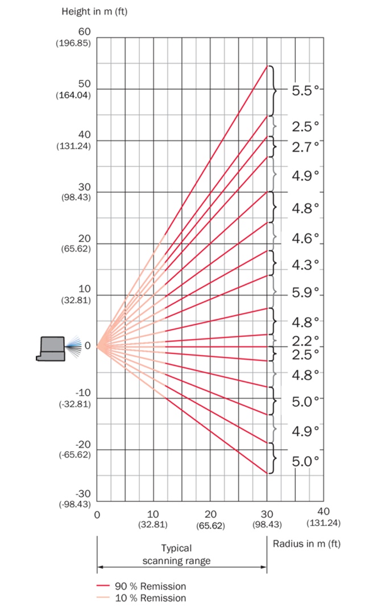
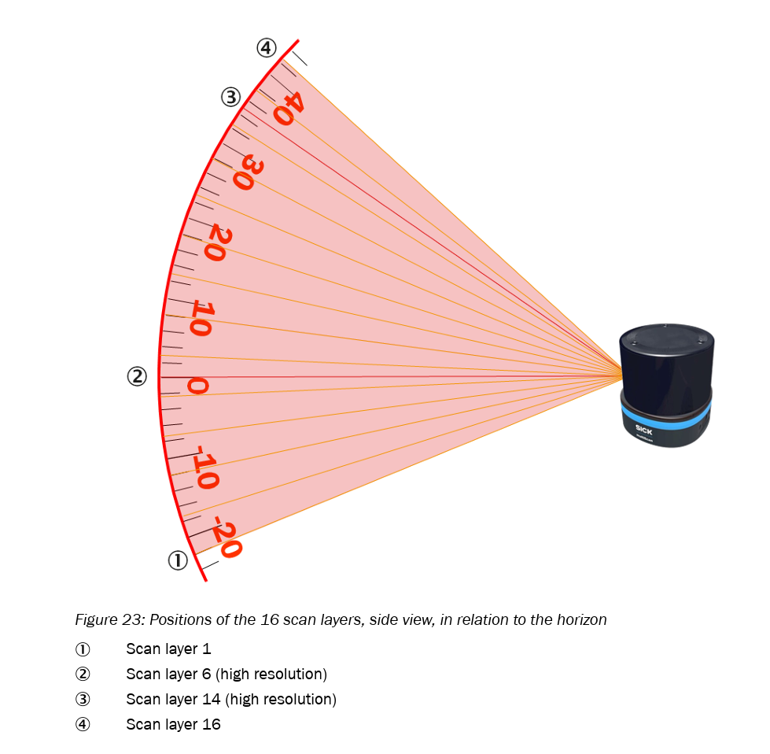
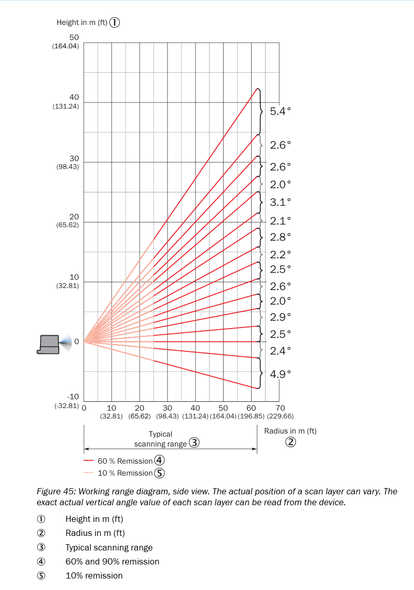
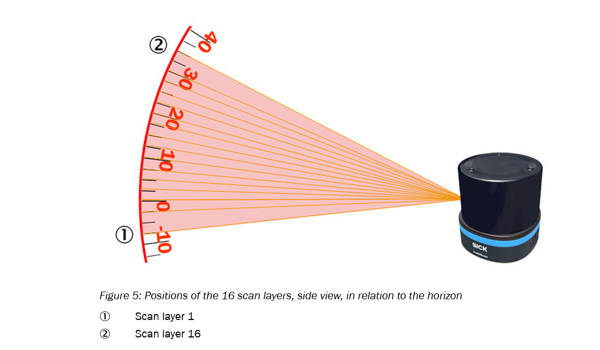

## Layer structure: multiScan136 vs. multiScan165

### Summary table

| Aspect                        | multiScan136                                                | multiScan165                                                   |
|------------------------------|-------------------------------------------------------------|----------------------------------------------------------------|
| Vertical aperture (total)    | **65°**                                                     | **42°**                                                        |
| Vertical angle range (φ)     | +22.5° (up) … −42.5° (down)                                 | +7.5° (up) … −35° (down)                                       |
| Typical vertical spacing     | Approx. 2.5° or 5° between layers (mode-dependent)          | Approx. 2.5° or 5° between layers (mode-dependent)             |
| Horizontal resolutions / layers | 0.125° on **2 high-res layers**, plus 14 layers at 1°; interlaced options: 0.5°/0.125° for 14 layers | 0.125°, 0.25° or 0.5° for **all 16 layers**, interlaced options |
| Extra scan mode              | —                                                           | 40 Hz scan between **layer 4 and 13** (central vertical band)  |

---

### Interpretation of the layer structure

- **Vertical coverage / application focus**
  - **multiScan136**
    - Wider vertical FOV (65°), reaching +22.5° upwards.  
    - Better for applications needing overhead coverage and ground detection.
  - **multiScan165**
    - Narrower vertical FOV (42°), only up to +7.5° upwards.  
    - Focuses its layers where mobile platforms most need detail: horizon and ground region.

- **Horizontal sampling per layer**
  - **multiScan136**
    - Only **2 layers** support the finest resolution of 0.125° (20Hz).  
    - Remaining layers use 1° (20Hz), in interlaced mode: 0.5° (10Hz), 0.25° (5Hz)
  - **multiScan165**
    - All **16 layers** support 0.5° (20Hz); in interlaced mode: 0.25° (10Hz), 0.125° (5Hz) 

- **Dynamic behavior (central layers)**
  - **multiScan165** introduces a **40 Hz** mode limited to layers 4–13 for faster reaction in the main obstacle-detection band.
  - **multiScan136** scans uniformly at 20 Hz on all layers.

---.\install
### Elevation angle table of multiScan 136

| Scan layer           | Measuring module allocation to scan layers | DIN ISO 8855 (data output) | Physical (see following figure for visualization) |
|----------------------|--------------------------------------------|-----------------------------|----------------------------------------------------|
| 1  | Measuring module 0 (looks downwards) | 22.7°  | -22.7° |
| 2  | Measuring module 0 | 17.5°  | -17.5° |
| 3  | Measuring module 0 | 12.5°  | -12.5° |
| 4  | Measuring module 0 | 7.4°   | -7.4°  |
| 5  | Measuring module 0 | 2.5°   | -2.5°  |
| 6 (high resolution)  | Measuring module 0 | 0°     | 0°     |
| 7  | Measuring module 0 | -2.4°  | 2.4°   |
| 8  | Measuring module 0 | -7.3°  | 7.3°   |
| 9  | Measuring module 1 | -12.8° | 12.8°  |
| 10 | Measuring module 1 | -17.3° | 17.3°  |
| 11 | Measuring module 1 | -22°   | 22°    |
| 12 | Measuring module 1 | -26.8° | 26.8°  |
| 13 | Measuring module 1 | -31.9° | 31.9°  |
| 14 (high resolution) | Measuring module 1 | -34.4° | 34.4°  |
| 15 | Measuring module 1 | -37.2° | 37.2°  |
| 16 | Measuring module 1 (looks upwards) | -42.8° | 42.8°  |

See p. 28/29 in [this manual](https://www.sick.com/media/docs/1/11/211/operating_instructions_multiscan136_3d_lidar_sensor_en_im0104211.pdf)

### Elevation angle table of multiScan 165

| Scan layer | Measuring module allocation to scan layers | DIN ISO 8855 (data output) | Physical (see following figure for visualization) |
|------------|--------------------------------------------|------------------------------|----------------------------------------------------|
| 1  | Measuring module 0 (looks downwards) | 7.3°   | -7.3°  |
| 2  | Measuring module 0 | 2.4°   | -2.4°  |
| 3  | Measuring module 0 | 0.0°   | -0.0°  |
| 4  | Measuring module 0 | -2.5°  | 2.5°   |
| 5  | Measuring module 1 | -5.4°  | 5.4°   |
| 6  | Measuring module 0 | -7.4°  | 7.4°   |
| 7  | Measuring module 1 | -10°   | 10°    |
| 8  | Measuring module 0 | -12.5° | 12.5°  |
| 9  | Measuring module 1 | -14.7° | 14.7°  |
| 10 | Measuring module 0 | -17.5° | 17.5°  |
| 11 | Measuring module 1 | -19.6° | 19.6°  |
| 12 | Measuring module 0 | -22.7° | 22.7°  |
| 13 | Measuring module 1 | -24.7° | 24.7°  |
| 14 | Measuring module 1 | -27.3° | 27.3°  |
| 15 | Measuring module 1 | -29.9° | 29.9°  |
| 16 | Measuring module 1 (looks upwards) | -35.3° | 35.3°  |

See p. 27/28 in [this manual](https://www.sick.com/media/docs/3/73/273/operating_instructions_multiscan165_en_im0110273.pdf)

#### Explanation of the 40 Hz Mode (multiScan165)

Each measuring module of the multiScan165 operates at **20 Hz** and transmits **data packets containing 8 scan layers**. However, in the range of **scan layers 4 to 13**, the **vertical fields of view** of the two modules overlap.

In this overlapping elevation region:

- Of the 8 layers transmitted by each module, **5 layers overlap (“interlock”) in elevation** with the corresponding 5 layers of the other module.  
- Since both modules operate **independently at 20 Hz**, but provide measurements in the **same elevation range**, and are **rotated by 180° in azimuth** relative to each other, the system receives **two complementary data streams** for these layers.
- As a result, the overlapping layers are effectively updated at **40 Hz**, because both modules contribute **20 Hz each** for the same set of 5 layers.

**In summary:**  
Each module continues to output **20 Hz × 8 layers**, but **5 of these layers** lie within the shared elevation range. Since both modules deliver 20 Hz for these layers, the effective update rate becomes **20 Hz + 20 Hz = 40 Hz** for this specific vertical segment.

---
### General overview

- Advantages of **multiScan136**:
  - Maximum vertical coverage.
  - General-purpose 3D perception including overhead detection.

- Advantages of **multiScan165**:
  - Uniform fine horizontal resolution across all layers.
  - Faster update rate in the central vertical region (40 Hz mode).