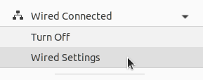

# sick_scan_xd networking FAQ

A TCP connection is needed to receive scan data from a lidar, which requires an appropriate network setup.

Common errors when establishing the TCP connection and possible solutions are described below. If you encounter network errors like "Failed to open TCP connection" when running sick_scan_xd, follow these recommendations.

## Static IP addresses

Most lidars have the default IP address 192.168.0.1. It is highly recommended to use a static IPv4 network with IP addresses 192.168.x.y. PC and lidar should use the same subnet. **Avoid using DHCP.**

Example IP address of the lidar: 192.168.0.1 (default)

Example IP address of the PC running sick_scan_xd: 192.168.0.100

The IP address of the PC running sick_scan_xd and the lidar must not be identical!

Use `ifconfig -a` on Linux resp. `ipconfig /all` on Windows to view network settings and lcoal IP addresses.

1. Try to ping your device:
   ```bash
   ping 192.168.0.1
   ```
2. Disconnect your scanner and retry ping

   ```bash
   ping 192.168.0.1
   ```
   The result of ping contains a pattern like
   ```bash
    ... Destination Host Unreachable
   ```
3. Reconnect your device and try to ping:
   ```bash
   ping 192.168.0.1
   ```

If you do not know the IP addresses, try to find the IP addresses of your PC and your lidar in your subnet:

1. Install fping: `apt-get install fping`

2. Scan your network (for example, subnet 192.168.10.0/24): `fping -a 192.168.0.1\24` to
search for all IP addresses from 192.168.0.0 to 192.168.0.255.

The result is similar to:
```bash
192.168.0.4 is alive
192.168.0.22 is alive
```
and a lot of unreachable entries.
In the example the IP address 192.168.0.4 is the laserscanner MRS1104 and the IP address 192.168.0.22 is the computer running linux. Check this with `ifconfig|grep 192.168.0.22`.

We recommend to use wired Ethernet. On Ubuntu, use the "Wired Settings" menu to check the network profile. Network profiles sometimes change automatically when multiple profiles are in use or the lidar has been switched off and on.




## Network configuration with SOPAS ET

The [SOPAS Engineering Tool](https://www.sick.com/de/en/catalog/digital-services-and-solutions/software/sopas-engineering-tool/p/p367244) (SOPAS ET) allows a detailed lidar configuration incl. network settings. We recommend to use SOPAS ET in case of network problems or to change the lidars network configuration. The operation manual contains further details.

## Diagnostic tools

Network tools can help in case of connection errors. Examples are:

* `ping <lidar-ip-address>` to check if the lidar is reachable
* `fping -a 192.168.0.1\24` to see ip addresses available in the subnet
* `netcat <lidar-ip-address> <lidar-tcp-port>` to read or write network data
* `wireshark` to monitor and record the network traffic between PC and lidar.
* `sudo ufw status` to see if a firewall is active. If active, disable firewalls with `sudo ufw disable`.
