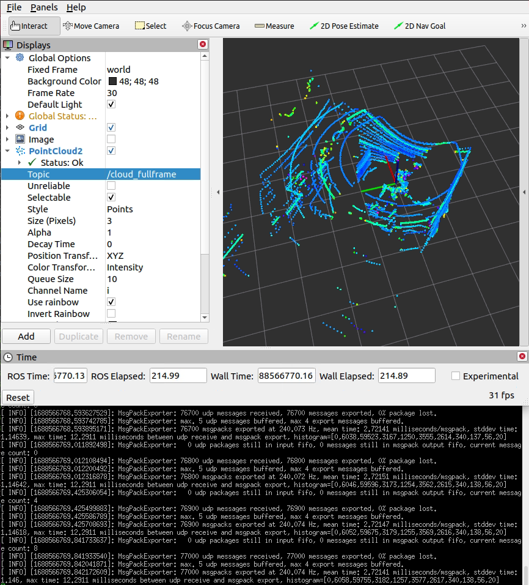
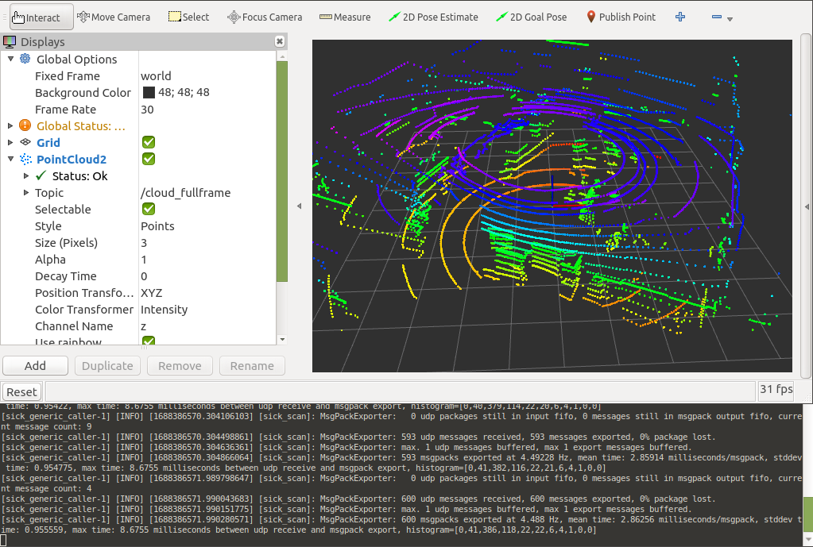
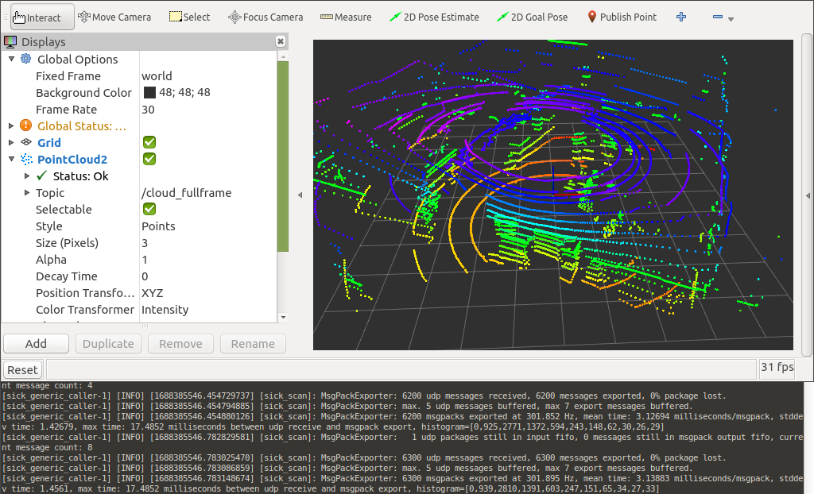

# Raspberry Pi

sick_scan_xd supports Linux on Raspberry Pi 4. Follow the build instructions for Linux to run sick_scan_xd on a Raspberry:
* [Build on Linux generic without ROS](../INSTALL-GENERIC.md#build-on-linux-generic-without-ros)
* [Build on Linux ROS1](../INSTALL-ROS1.md#build-on-linux-ros1)
* [Build on Linux ROS2](../INSTALL-ROS2.md#build-on-linux-ros2)
* [USAGE](USAGE.md)

Cmake option " -DRASPBERRY=1" activates compiler settings for the Raspberry. Laserscan messages and polar pointclouds are not published on the Raspberry due to performance reasons.

## Multiscan example

The following screenshot shows sick_scan_xd running under ROS-1 on a Raspberry Pi 4 connected to a multiscan lidar. A Linux-PC uses rviz to display the fullframe pointcloud generated on the Raspberry. The ssh-terminal shows the sick_scan_xd log messages on the Raspberry:


On a Raspberry Pi 4, sick_scan_xd processes 240 messages/second with a mean latency of 2.7 milliseconds/message.

## Performance

Due to the low power consumption of a Raspberry Pi, performance is critical for applications using sick_scan_xd, especially for multiscan lidars.

Symptoms for performance problems can be e.g.:
* sick_scan_xd reports the loss of UDP packets or message drops
* sick_scan_xd does not publish the fullframe pointcloud
* rviz shows flickering segment pointclouds even with increased decay time
* low frequency of segment or fullframe pointcloud messages
* generally high system load

Performance problems can have very different reasons. Notes to help with the elimination of performance issues:

1. Use the latest Raspberry Pi 4. Previous Raspberry Pi models may work with sick_scan_xd, but are not supported officially.

2. Eliminate multiple echos. For most lidars, the echo filter is activated by default and only the last echo is transmitted. Check the launchfile configuration and set parameter `filter_echos` if not yet done:
    ```
    <param name="filter_echos" type="int" value="2"/> <!-- FREchoFilter settings: 0: first echo, 1: all echos, 2: last echo -->
    ```
    For multican lidars, the echo filter is activated in the launchfile by parameter `host_FREchoFilter`:
    ```
    <param name="host_FREchoFilter" type="int" value="2" />          <!-- Optionally set FREchoFilter with 0 for FIRST_ECHO (default, EchoCount=1), 1 for ALL_ECHOS (EchoCount=3), or 2 for LAST_ECHO (EchoCount=1) -->
    <param name="host_set_FREchoFilter" type="bool" value="True" />  <!-- If true, FREchoFilter is set at startup (default: false) -->
    ```

3. Run a basic performance test on ROS-2 using a tiny sopas test server and a udp player to emulate a multiscan:
    ```
    # Start multiscan emulator (sopas test server)
    python3 ./src/sick_scan_xd/test/python/multiscan_sopas_test_server.py --tcp_port=2111 --cola_binary=0 &
    # Start rviz
    ros2 run rviz2 rviz2 -d ./src/sick_scan_xd/test/emulator/config/rviz2_cfg_multiscan_emu_360_perftest.rviz & 
    sleep 1
    # Start sick_generic_caller with sick_scansegment_xd
    ros2 launch sick_scan sick_multiscan.launch.py hostname:=127.0.0.1 udp_receiver_ip:="127.0.0.1" &
    sleep 3 
    # Play udp packets to emulate multiScan
    python3 ./src/sick_scan_xd/test/python/multiscan_perftest_player.py --udp_port=2115 --repeat=100 --send_rate=100 --verbose=0 --prompt=0
    ```
    The result should look like the follwing screenshot:
    
    If you otherwise observe the loss of UDP packets, message drops, missing pointclouds or mean latency times significantly higher than 6 milliseconds/message, check the system load of your Raspberry and try to eliminate cpu or network intensive processes.

4. Start sick_scan and the sopas test server on the Raspberry as above, but run the udp player `multiscan_perftest_player.py` on another PC in your local subnet, e.g.
    ```
    python3 multiscan_perftest_player.py --dst_ip=192.168.1.27 --udp_port=2115 --repeat=1000 --send_rate=0 --force_delay=3.0e-3 --verbose=0 --prompt=0
    ```
    Replace the example ip adress `192.168.1.27` by the ip adress of your Raspberry. The result should look like the follwing screenshot:
    
    If you otherwise observe the loss of UDP packets, message drops, missing pointclouds or mean latency times significantly higher than 6 milliseconds/message, check the system load of your Raspberry and try to eliminate cpu or network intensive processes. sick_scan_xd (i.e. process sick_generic_caller) should consume ca. 80% of one core resp. cause ca. 20% of the total cpu load.

## Troubleshooting

### Endianess

ARM processors support both little and big endian mode. sick_scan_xd has been tested on Raspberry Pi 4 using ROS1 and ROS2 on Linux in little endian mode. You can check the endianess of your system with `lscpu`.

### Build sick_scan_xd on a Raspberry without internet or github access

Checkout sick_scan_xd and use `scp -rp` to copy files and directories recursively from local host to a Raspberry, e.g.:

On your local Linux PC (Raspberry IP-address is 192.168.178.52 in this example):
```
mkdir -p ./sick_scan_xd_raspberry_pi_pretest/src
pushd ./sick_scan_xd_raspberry_pi_pretest/src
git clone https://github.com/SICKAG/libsick_ldmrs.git
git clone -b master https://github.com/SICKAG/sick_scan_xd.git
popd
scp -rp ./sick_scan_xd_raspberry_pi_pretest 192.168.178.52:/home/rostest/sick_scan_xd_raspberry_pi_pretest
```

On your Raspberry Pi (ROS-1):
```
cd /home/rostest/sick_scan_xd_raspberry_pi_pretest
pushd ./src/sick_scan_xd/test/scripts
chmod a+x ./*.bash
./makeall_ros1.bash
popd
source ./devel_isolated/setup.bash
```

To view the pointcloud on your local Linux PC (with Raspberry IP-address is 192.168.178.52 in this example):
```
export ROS_MASTER_URI=http://192.168.178.52:11311/
rviz
```
