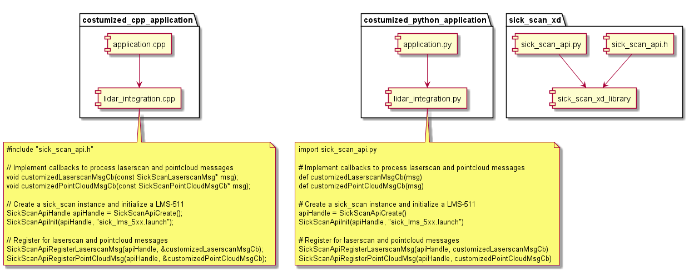
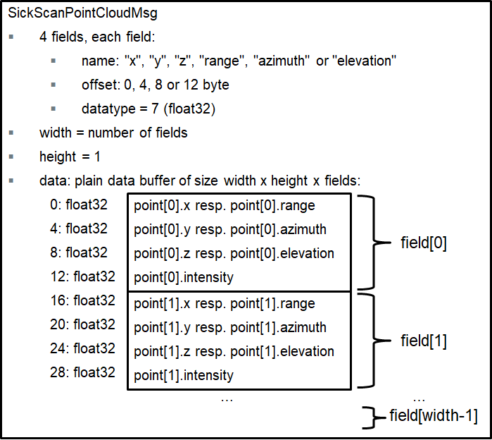
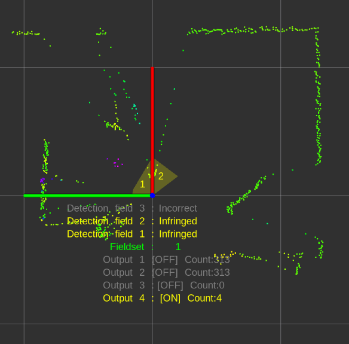
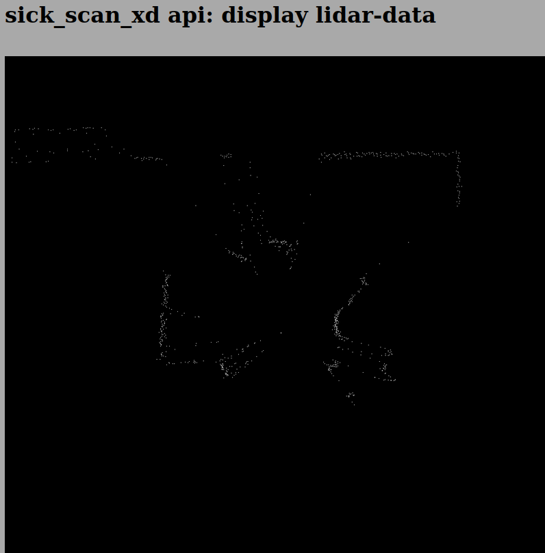
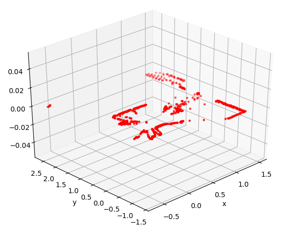

# Generic API for sick_scan_xd

## Overview

A generic API for sick_scan_xd has the following goals:
* Easy integration of sick_scan_xd into customer systems with and without ROS
* Integrate SICK lidars with one API, independent of lidar types or underlying operating system
* Provide the same sick_scan_xd functionality on systems without ROS
* In particular: make the sick_scan_xd functionality available on non-ROS-systems without need to customize sources or configuration files.

The generic sick_scan_xd API provides an interface to all lidars supported by sick_scan_xd. This API can be used in C, C++, Python, or any other language with support of C-bindings.

The generic sick_scan_xd API ships with the API-header, the library (binary or sources) and usage examples for C, C++ and Python. The following component diagram shows the relationship between API, library, lidar and a customized application:



**Note: Running multiple lidars simultaneously in one process is not supported.** Currently the sick_scan_xd API does not support the single or multi-threaded use of 2 or more lidars in one process, since the sick_scan_xd library is not guaranteed to be thread-safe. To run multiple lidars simultaneously, we recommend using ROS or running sick_scan_xd in multiple and separate processes, so that each process serves one sensor.

## Build and test shared library

The shared library, which implements the C-API, is built native on Linux or Windows (i.e. without ROS). Follow the instructions on [Build on Linux generic without ROS](../../INSTALL-GENERIC.md#build-on-linux-generic-without-ros) for Linux resp. [Build on Windows](../../INSTALL-GENERIC.md#build-on-windows) for Windows.

### Build the shared library on Linux

Run the following commands to build the shared library `libsick_scan_xd_shared_lib.so` on Linux:
```
# Clone repositories
git clone https://github.com/SICKAG/libsick_ldmrs.git
git clone -b master https://github.com/SICKAG/sick_scan_xd.git
# Build libsick_ldmrs library
mkdir -p ./build
mkdir -p ./libsick_ldmrs/build
pushd libsick_ldmrs/build
cmake -G "Unix Makefiles" ..
make -j4
sudo make -j4 install    
popd
# Build libsick_scan_xd_shared_lib.so
pushd ./build
export ROS_VERSION=0
cmake -DROS_VERSION=0 -G "Unix Makefiles" ../sick_scan_xd
make -j4
sudo make -j4 install    
# Check build and library dependencies
ls -al ./sick_generic_caller
ls -al ./libsick_scan_xd_shared_lib.so
ls -al ./sick_scan_xd_api_test
ldd -r ./libsick_scan_xd_shared_lib.so
popd
```
After successful build, the shared library `libsick_scan_xd_shared_lib.so` and a tiny test executable `sick_scan_xd_api_test` are created. 

### Build the shared library on Windows

Run the following commands to build the shared library `sick_scan_xd_shared_lib.dll` with Visual Studio 2019 on Windows:
```
# Clone repository sick_scan_xd
git clone -b master https://github.com/SICKAG/sick_scan_xd.git
# Build libraries sick_scan_xd_shared_lib.dll
call "%ProgramFiles(x86)%\Microsoft Visual Studio\2019\Community\Common7\Tools\VsDevCmd.bat" -arch=amd64 -host_arch=amd64
set _os=x64
set _cmake_string=Visual Studio 16
set _msvc=Visual Studio 2019
set _cmake_build_dir=build
cd sick_scan_xd
if not exist %_cmake_build_dir% mkdir %_cmake_build_dir%
pushd %_cmake_build_dir%
cmake -DROS_VERSION=0 -G "%_cmake_string%" ..
if %ERRORLEVEL% neq 0 ( @echo ERROR building %_cmake_string% sick_scan_xd with cmake & @pause )
cmake --build . --clean-first --config Debug
```
After successful build, the shared library `sick_scan_xd_shared_lib.dll` and a tiny test executable `sick_scan_xd_api_test.exe` are created. To install the library and header in the system folder, run `cmake --build . --target install` with admin priviledges. Note that LDMRS is not supported on Windows.

Note: sick_scan_xd builds and runs with both Visual Studio 2019 and 2022. Visual Studio 2019 is recommended, since ROS on Windows requires VS 2019.

Replace `cmake -DROS_VERSION=0 -G "%_cmake_string%" ..` by  `cmake -DROS_VERSION=0 -DCMAKE_ENABLE_EMULATOR=1 -G "%_cmake_string%" ..` to build emulators for unittests without lidar hardware, see [Simulation and unittest](#simulation-and-unittest).

### Test the shared library

The executable file `sick_scan_xd_api_test` provides a minimalistic API test. Run `sick_scan_xd_api_test <launchfile> hostname:=<ip-address>` to test the API against a lidar, e.g. on Linux:
```
# export LD_LIBRARY_PATH=.:./build:$LD_LIBRARY_PATH # append relative path to build folder
export LD_LIBRARY_PATH=.:`pwd`/build:$LD_LIBRARY_PATH  # append absolute path to build folder
./build/sick_scan_xd_api_test ./sick_scan_xd/launch/sick_tim_7xx.launch hostname:=192.168.0.1
```
On Windows, run e.g.
```
set PATH=.;.\build;..\build\Debug;%PATH%
.\build\Debug\sick_scan_xd_api_test.exe launch/sick_lms_5xx.launch hostname:=192.168.0.1
```

The executable binary `sick_scan_xd_api_test` will just load library `libsick_scan_xd_shared_lib.so` resp. `sick_scan_xd_shared_lib.dll`, start the lidar and print a message when receiving lidar messages, e.g. `sick_scan_xd_api_test: pointcloud callback`. Replace `sick_lms_1xx.launch` in the example by the launchfile corresponding to your type of lidar.

To load the library, the build folder has to be included in `LD_LIBRARY_PATH` (Linux) resp. `PATH` (Windows). Set this environment variable to your build folder, e.g. on Linux using
```
# export LD_LIBRARY_PATH=.:./build:$LD_LIBRARY_PATH # append relative path to build folder
export LD_LIBRARY_PATH=.:`pwd`/build:$LD_LIBRARY_PATH  # append absolute path to build folder
```
resp. on Windows
```
set PATH=.;.\build;.\build\Debug;%PATH%
```

## Usage example

The sick_scan_xd API can be used on Linux or Windows in any language with support of C-bindings. There are 3 steps required to use the API:

1. API- and lidar-initialization by
    * SickScanApiLoadLibrary
    * SickScanApiCreate
    * SickScanApiInitByLaunchfile or SickScanApiInitByCli

2. Receive messages by registration of callbacks using `SickScanApiRegister<MsgType>Msg`-functions (recommended) or by polling using `SickScanApiWaitNext<MsgType>Msg`-functions.
   
   Alternative examples to receive lidar scan data as a pointcloud:
   * Register a callback for cartesian pointcloud data using SickScanApiRegisterCartesianPointCloudMsg, or
   * register a callback for polar pointcloud data using SickScanApiRegisterPolarPointCloudMsg.

   The registered callback will be executed whenever the lidar has sent new scan data and receives the (cartesian or polar) pointcloud by a parameter of type SickScanPointCloudMsg. The SickScanPointCloudMsg in sick_scan_xd API corresponds to ROS pointcloud: The cartesian pointcloud  (registered by SickScanApiRegisterCartesianPointCloudMsg) contains the fields (x, y, z, intensity). The polar pointcloud (registered by SickScanApiRegisterPolarPointCloudMsg) contains the fields (range, azimuth, elevation, intensity). Each field contains its name (i.e. x, y, z, range, azimuth, elevation, or intensity) and offset. The scan data is a flat buffer of size width x height fields:

   

   The following python code shows how to convert a cartesian pointcloud to 3D points (x, y, z):
   ```
    # Convert a SickScanCartesianPointCloudMsg to points
    def pySickScanCartesianPointCloudMsgToXYZ(pointcloud_msg):
        # get pointcloud fields
        num_fields = pointcloud_msg.fields.size
        msg_fields_buffer = pointcloud_msg.fields.buffer
        field_offset_x = -1
        field_offset_y = -1
        field_offset_z = -1
        for n in range(num_fields):
            field_name = ctypesCharArrayToString(msg_fields_buffer[n].name)
            field_offset = msg_fields_buffer[n].offset
            if field_name == "x":
                field_offset_x = msg_fields_buffer[n].offset
            elif field_name == "y":
                field_offset_y = msg_fields_buffer[n].offset
            elif field_name == "z":
                field_offset_z = msg_fields_buffer[n].offset
        # Extract x,y,z
        cloud_data_buffer_len = (pointcloud_msg.row_step * pointcloud_msg.height) # length of polar cloud data in byte
        assert(pointcloud_msg.data.size == cloud_data_buffer_len and field_offset_x >= 0 and field_offset_y >= 0 and field_offset_z >= 0)
        cloud_data_buffer = bytearray(cloud_data_buffer_len)
        for n in range(cloud_data_buffer_len):
            cloud_data_buffer[n] = pointcloud_msg.data.buffer[n]
        points_x = np.zeros(pointcloud_msg.width * pointcloud_msg.height, dtype = np.float32)
        points_y = np.zeros(pointcloud_msg.width * pointcloud_msg.height, dtype = np.float32)
        points_z = np.zeros(pointcloud_msg.width * pointcloud_msg.height, dtype = np.float32)
        point_idx = 0
        for row_idx in range(pointcloud_msg.height):
            for col_idx in range(pointcloud_msg.width):
                # Get lidar point in polar coordinates (range, azimuth and elevation)
                pointcloud_offset = row_idx * pointcloud_msg.row_step + col_idx * pointcloud_msg.point_step
                points_x[point_idx] = np.frombuffer(cloud_data_buffer, dtype = np.float32, count = 1, offset = pointcloud_offset + field_offset_x)[0]
                points_y[point_idx] = np.frombuffer(cloud_data_buffer, dtype = np.float32, count = 1, offset = pointcloud_offset + field_offset_y)[0]
                points_z[point_idx] = np.frombuffer(cloud_data_buffer, dtype = np.float32, count = 1, offset = pointcloud_offset + field_offset_z)[0]
                point_idx = point_idx + 1
        return points_x, points_y, points_z
   ```
   Exchange field names ("x", "y", "z") by ("range", "azimuth", "elevation") to get 3D polar points (range, azimuth, elevation).

   For further details, see
   * [Minimalistic usage example in C](#minimalistic-usage-example-in-c)
   * [Minimalistic usage example in C++](#minimalistic-usage-example-in-c-1)
   * [Minimalistic usage example in Python](#minimalistic-usage-example-in-python)
   * [Complete usage example in C++](#complete-usage-example-in-c)
   * [Complete usage example in Python](#complete-usage-example-in-python)

   Note for multiScan and picoScan lidars:

   * The WaitNext-functions of the API return the next received message. For multiScan and picoScan, this can be a scan segment (i.e. a part of the full scan) or a fullframe poincloud (i.e. all scan points of a 360 degree scan). Depending on the timing, you may not receive all messages, i.e. you may e.g. receive scan points of different segments. We therefore recommend to register a message callback instead of a WaitNext-function. With a registered message callback, you will get all fullframe and segment pointcloud messages.

   * For multiScan and picoScan, pointcloud messages can contain a scan segment (i.e. a part of the full scan) or a fullframe poincloud  (i.e. all scan points of a 360 degree scan). The type can be determined by the topic (default: "/cloud_unstructured_segments" for segments, "/cloud_unstructured_fullframe" for fullframe pointclouds) or by segment index (-1 for fullframe, 0 up to 11 for segment pointclouds).


3. Close lidar and API by
    * `SickScanApiDeregister<MsgType>Msg`-functions
    * SickScanApiClose
    * SickScanApiRelease

All functions named `SickScanApi` are implemented within the library file ("sick_scan_xd_shared_lib.dll" on Windows resp. "libsick_scan_xd_shared_lib.so" on Linux). A small wrapper is provided ([sick_scan_xd_api_wrapper.c](../../test/src/sick_scan_xd_api/sick_scan_xd_api_wrapper.c) for C/C++, [sick_scan_api.py](../../python/api/sick_scan_api.py) for python), which loads and unloads the library (functions `SickScanApiLoadLibrary` and `SickScanApiUnloadLibrary`) and delegates the function calls to the binary.

Note: [sick_scan_api.py](../../python/api/sick_scan_api.py) requires python module numpy. On Windows, we recommend to install and use Python either with Visual Studio 2019 or by installing from https://www.python.org/downloads/windows/ (python installer, embedded version not recommended). Otherwise, please install numpy with `python -m pip install numpy` if numpy is not yet installed.


### Minimalistic usage example in C

File [minimum_sick_scan_api_client.c](../../examples/c/minimum_sick_scan_api_client.c) shows a minimalistic example of a C client using the sick_scan_xd API. To build and run this example, open a command shell in folder `examples/scripts` and run `.\build_run_api_examples_linux.bash` on Linux resp. `build_run_api_examples_windows.cmd` on Windows. Make sure, that the shared library `libsick_scan_xd_shared_lib.so` resp. `sick_scan_xd_shared_lib.dll` has been successfully built in the build-folder.

Alternatively, follow the build and run instructions on Linux:
```
cd examples/c
mkdir -p ./build
cd ./build
cmake -G "Unix Makefiles" ..
make -j4
cd ../..
export LD_LIBRARY_PATH=.:./build:$LD_LIBRARY_PATH
./examples/c/build/minimum_sick_scan_api_client <launchfile> hostname:=<lidar-ip-address>
```

Alternatively, follow the build and run instructions on Windows:
```
REM Set environment for Visual Studio 2019 (VS 16)
set _os=x64
set _cmake_string=Visual Studio 16
set _msvc=Visual Studio 2019
set _cmake_build_dir=build
REM Build the minimalistic C usage example
cd examples\c
mkdir %_cmake_build_dir%
cd %_cmake_build_dir%
cmake -G "%_cmake_string%" ..
cmake --build . --clean-first --config Debug
REM Set environment: add build folder to LD_LIBRARY_PATH, add python/api to PYTHONPATH
cd ..\..
set PATH=.;.\build;.\build\Debug;.\build_win64;.\build_win64\Debug;%PATH%
REM Run minimalistic C api example
.\examples\c\build\Debug\minimum_sick_scan_api_client.exe <launchfile> hostname:=<lidar-ip-address>
```

### Minimalistic usage example in C++

File [minimum_sick_scan_api_client.cpp](../../examples/cpp/minimum_sick_scan_api_client.cpp) shows a minimalistic example of a C++ client using the sick_scan_xd API. To build and run this example, open a command shell in folder `examples/scripts` and run `.\build_run_api_examples_linux.bash` on Linux resp. `build_run_api_examples_windows.cmd` on Windows. Make sure, that the shared library `libsick_scan_xd_shared_lib.so` resp. `sick_scan_xd_shared_lib.dll` has been successfully built in the build-folder.

Alternatively, follow the build and run instructions on Linux:
```
cd examples/cpp
mkdir -p ./build
cd ./build
cmake -G "Unix Makefiles" ..
make -j4
cd ../..
export LD_LIBRARY_PATH=.:./build:$LD_LIBRARY_PATH
./examples/cpp/build/minimum_sick_scan_api_client <launchfile> hostname:=<lidar-ip-address>
```

Alternatively, follow the build and run instructions on Windows:
```
REM Set environment for Visual Studio 2019 (VS 16)
set _os=x64
set _cmake_string=Visual Studio 16
set _msvc=Visual Studio 2019
set _cmake_build_dir=build
REM Build the minimalistic C++ usage example
cd examples\cpp
mkdir %_cmake_build_dir%
cd %_cmake_build_dir%
cmake -G "%_cmake_string%" ..
cmake --build . --clean-first --config Debug
REM Set environment: add build folder to LD_LIBRARY_PATH, add python/api to PYTHONPATH
cd ..\..
set PATH=.;.\build;.\build\Debug;.\build_win64;.\build_win64\Debug;%PATH%
REM Run minimalistic C++ api example
.\examples\cpp\build\Debug\minimum_sick_scan_api_client.exe <launchfile> hostname:=<lidar-ip-address>
```

### Minimalistic usage example in Python

File [minimum_sick_scan_api_client.py](../../examples/python/minimum_sick_scan_api_client.py) shows a minimalistic example of a python client using the sick_scan_xd API. To build and run this example, open a command shell in folder `examples/scripts` and run `.\build_run_api_examples_linux.bash` on Linux resp. `build_run_api_examples_windows.cmd` on Windows. Make sure, that the shared library `libsick_scan_xd_shared_lib.so` resp. `sick_scan_xd_shared_lib.dll` has been successfully built in the build-folder.

Alternatively, follow the run instructions on Linux:
```
export LD_LIBRARY_PATH=`pwd`:`pwd`/build:$LD_LIBRARY_PATH
export PYTHONPATH=`pwd`:`pwd`/python/api:$PYTHONPATH
python3 ./examples/python/minimum_sick_scan_api_client.py <launchfile> hostname:=<lidar-ip-address>
```

Alternatively, follow the run instructions on Windows:
```
set PATH=.;.\build;.\build\Debug;.\build_win64;.\build_win64\Debug;%PATH%
set PYTHONPATH=.;.\python\api;%PATH%
python ./examples/python/minimum_sick_scan_api_client.py <launchfile> hostname:=<lidar-ip-address>
```

Note: [sick_scan_api.py](../../python/api/sick_scan_api.py) requires python module numpy. On Windows, we recommend to install and use Python either with Visual Studio 2019 or by installing from https://www.python.org/downloads/windows/ (python installer, embedded version not recommended). Otherwise, please install numpy with `python -m pip install numpy` if numpy is not yet installed.

### Complete usage example in C++

A complete C/C++ usage example is implemented in [sick_scan_xd_api_test.cpp](../../test/src/sick_scan_xd_api/sick_scan_xd_api_test.cpp). Note that the shared library ("sick_scan_xd_shared_lib.dll" on Windows resp. "libsick_scan_xd_shared_lib.so" on Linux) has no dependencies to ROS. The usage example on the other hand supports both ROS-1, ROS-2 and native Linux or Windows. When build on ROS, it converts the SickScanApi-messages into ROS-messages. On ROS, they can be visualized by rviz. The following screenshot shows a pointcloud published by `rosrun sick_scan_xd sick_scan_xd_api_test _sick_scan_args:="./src/sick_scan_xd/launch/sick_tim_7xx.launch"`:



Without ROS, sick_scan_xd_api_test plots a jpeg-file to enable a simple visualization of a pointcloud. E.g.:
```
firefox ./demo/image_viewer_api_test.html &
./build_linux/sick_scan_xd_api_test ./launch/sick_tim_7xx.launch
```


### Complete usage example in Python

A complete python usage example is implemented in [sick_scan_xd_api_test.py](../../test/python/sick_scan_xd_api/sick_scan_xd_api_test.py). It is handy to test the sick_scan_xd library. Like its C++ counterpart [sick_scan_xd_api_test.cpp](../../test/src/sick_scan_xd_api/sick_scan_xd_api_test.cpp), it just loads library `libsick_scan_xd_shared_lib.so` resp. `sick_scan_xd_shared_lib.dll`, starts a lidar and receives the lidar pointcloud and messages via API. On ROS-1, the lidar pointcloud and messages are converted to ROS and published. The lidar pointcloud can be visualized by rviz using topic "/sick_scan_xd_api_test/api_cloud".

Run `python3 sick_scan_xd_api_test.py <launchfile> hostname:=<ip-address>` to test the API against a lidar. 
On Linux e.g.:
```
export PYTHONPATH=`pwd`:`pwd`/src/sick_scan_xd/python/api:$PYTHONPATH
source /opt/ros/noetic/setup.bash # replace by noetic by your ros version
python3 ./src/sick_scan_xd/test/python/sick_scan_xd_api/sick_scan_xd_api_test.py ./src/sick_scan_xd/launch/sick_lms_1xx.launch hostname:=192.168.0.1
```
On Windows e.g.:
```
set PYTHONPATH=.;.\src\sick_scan_xd\python\api;%PYTHONPATH%
python ./src/sick_scan_xd/test/python/sick_scan_xd_api/sick_scan_xd_api_test.py ./src/sick_scan_xd/launch/sick_lms_1xx.launch hostname:=192.168.0.1
```

The pthon usage example [sick_scan_xd_api_test.py](../../test/python/sick_scan_xd_api/sick_scan_xd_api_test.py) imports [sick_scan_api.py](../../python/api/sick_scan_api.py), which contains the python definitions of the sick_scan_xd API. Make sure that sick_scan_api.py can be imported, e.g. by including folder `python/api` in PYTHONPATH by:

`export PYTHONPATH=`pwd`:`pwd`/src/sick_scan_xd/python/api:$PYTHONPATH` on Linux, resp. <br/>
`set PYTHONPATH=.;.\src\sick_scan_xd\python\api;%PYTHONPATH%` on Windows

Note: The shared library ("sick_scan_xd_shared_lib.dll" on Windows resp. "libsick_scan_xd_shared_lib.so" on Linux) works standalone and does not have any ROS dependancies. The usage example [sick_scan_xd_api_test.py](../../test/python/sick_scan_xd_api/sick_scan_xd_api_test.py) converts API- to ROS-messages for visualization and is therefore dependent on ROS, if ROS is installed. 

If ROS is not installed, [sick_scan_xd_api_test.py](../../test/python/sick_scan_xd_api/sick_scan_xd_api_test.py) uses matplotlib to visualize the pointcloud. The following screenshot shows a TiM-7xx pointcloud on Linux without ROS:



Note: [sick_scan_api.py](../../python/api/sick_scan_api.py) requires python module numpy. On Windows without ROS, [sick_scan_xd_api_test.py](../../test/python/sick_scan_xd_api/sick_scan_xd_api_test.py) requires numpy and matplotlib. On Windows, we recommend to install and use Python either with Visual Studio 2019 or by installing from https://www.python.org/downloads/windows/ (python installer, embedded version not recommended). These python distributions provide the necessary packages and tools. Otherwise, please install numpy and matplotlib with `python -m pip install numpy` and `python -m pip install matplotlib` if not yet done.

### Diagnostic

The API provides the following functions for diagnostics:

* SickScanApiRegisterDiagnosticMsg and SickScanApiDeregisterDiagnosticMsg: Register resp. deregister a callback to receive diagnostic messages. Diagnostic messages contain a status code and status message. The status code is one of the following numbers:
   * OK=0 (normal operation)
   * WARN=1 (warning)
   * ERROR=2 (error, should not occure)
   * INIT=3 (initialization after startup or reconnection)
   * EXIT=4 (sick_scan_xd exiting)
   
   The status message is descriptional C-string. 
   
   A typical sequence of the status code is:
   * INIT at startup, then 
   * after lidar initialization is completed: change to OK (normal operation) and run, and
   * EXIT at shutdown.
   Diagnostic messages are generated whenever the status changed or an ERROR occured. Status code 2 (i.e. error) should not occure under normal operation.

* SickScanApiRegisterLogMsg and SickScanApiDeregisterLogMsg: Register resp. deregister a callback to receive log messages. This callback will receive all informational or error messages printed on console. The log messages contain a log level (Info=1, Warn=2, Error=3, Fatal=4) and the log message.

* SickScanApiGetStatus queries the current status. This function returns the current status code (OK=0 i.e. normal operation, WARN=1, ERROR=2, INIT=3 i.e. initialization after startup or reconnection or EXIT=4) and the descriptional status message.

* SickScanApiSendSOPAS sends a SOPAS command (Cola-A) to the lidar and returns the response from the device.
   * C++ example:
      ```
     char sopas_response_buffer[1024] = { 0 };
     SickScanApiSendSOPAS(apiHandle, "sRN SCdevicestate", &sopas_response_buffer[0], (int32_t)sizeof(sopas_response_buffer); // returns "sRA SCdevicestate \x00" in sopas_response_buffer
     ```

   * Python example:
      ```
     sopas_response = SickScanApiSendSOPAS(sick_scan_library, api_handle, "sRN SCdevicestate")` # returns "sRA SCdevicestate \x00". 
      ```
   See the telegram listing for valid SOPAS commands.

* SickScanApiSetVerboseLevel and SickScanApiGetVerboseLevel sets resp. returns the verbose level. The verbose level can be 0=DEBUG, 1=INFO, 2=WARN, 3=ERROR, 4=FATAL or 5=QUIET (equivalent to ros\:\:console\:\:levels). Default verbose level is 1 (INFO), i.e. sick_scan_xd prints informational, warnings and error messages on the console. Logging callbacks registered with SickScanApiRegisterLogMsg will receive all informational, warnings and error messages independant of the verbose level.

To monitor sick_scan_xd resp. the lidar, it is recommended to register a callback for diagnostic messages using SickScanApiRegisterDiagnosticMsg and to display the error message in case for status code 2 (error). See [sick_scan_xd_api_test.cpp](../../test/src/sick_scan_xd_api/sick_scan_xd_api_test.cpp) and [sick_scan_xd_api_test.py](../../test/python/sick_scan_xd_api/sick_scan_xd_api_test.py) for an example.

### Simulation and unittest

sick_scan_xd provides a tiny server for offline tests which simulates a basic lidar. It just accepts TCP connections, responds to sopas requests with predefined responses and sends lidar data from file. See [Simulation](../../USAGE.md#simulation) for further details. Note that the simulation does not emulate or replace a lidar, it just supports basic unittests.

Open a new terminal and run the following steps to test the api against a TiM7xx simulation using the python example mentioned above:

1. Build library `libsick_scan_xd_shared_lib.so` incl. emulator with option `-DCMAKE_ENABLE_EMULATOR=1`:
   ```
   mkdir -p ./src/build
   pushd ./src/build
   rm -rf ./*
   cmake -DROS_VERSION=0 -DCMAKE_ENABLE_EMULATOR=1 -G "Unix Makefiles" ../sick_scan_xd
   make -j4
   ls -al libsick_scan_xd_shared_lib.so sick_scan_xd_api_test sick_generic_caller sick_scan_emulator # list size and date of the binaries
   popd
   ```
   Building sick_scan_xd with option `-DCMAKE_ENABLE_EMULATOR=1` requires jsoncpp. Install libjsoncpp by running "sudo apt-get install libjsoncpp-dev" on Linux resp. "vcpkg install jsoncpp:x64-windows" on Windows (vcpkg required). Run the following steps to install Visual Studios package manager vcpkg on Windows:
      * Download vcpkg-master.zip from https://github.com/microsoft/vcpkg/archive/master.zip and unzip to `c:\vcpkg`. Alternatively, run "git clone https://github.com/microsoft/vcpkg"
      * Install vcpkg by running the following commands:
         ```
        cd c:/vcpkg
        bootstrap-vcpkg.bat
        vcpkg integrate install
        ```
      * Include vcpkg in your path:
         ```
        set PATH=c:\vcpkg\installed\x64-windows\bin;%PATH%
        ```

3. Create a workspace folder, e.g. `sick_scan_ws` (or any other name):


2. Build sick_scan_xd for ROS-1 on Linux, see [Build on Linux ROS1](../../INSTALL-ROS1.md#build-on-linux-ros1)

3. Start the TiM7xx simulator:
   ```
   cp -f ./src/sick_scan_xd/test/emulator/scandata/sopas_et_field_test_1_2_both_010.pcapng.json /tmp/lmd_scandata.pcapng.json
   ./src/build/sick_scan_emulator ./src/sick_scan_xd/test/emulator/launch/emulator_01_default.launch &
   sleep 1
   ```

4. Run sick_scan_xd_api_test.py against the TiM7xx simulator on localhost:
   ```
   export PYTHONPATH=.:./src/sick_scan_xd/python/api:$PYTHONPATH
   python3 ./src/sick_scan_xd/test/python/sick_scan_xd_api/sick_scan_xd_api_test.py ./src/sick_scan_xd/launch/sick_tim_7xx.launch hostname:=127.0.0.1 port:=2111 sw_pll_only_publish:=False
   ```

5. Start rviz and visualize the pointcloud on topic "/sick_scan_xd_api_test/api_cloud".

Note: The shared library ("sick_scan_xd_shared_lib.dll" on Windows resp. "libsick_scan_xd_shared_lib.so" on Linux) works standalone and does not have any ROS dependancies. The usage example [sick_scan_xd_api_test.py](../../test/python/sick_scan_xd_api/sick_scan_xd_api_test.py) uses ROS for visualization.

## C-API

The header file [sick_scan_api.h](../../include/sick_scan_xd_api/sick_scan_api.h) defines the C-interface. It defines all datatypes, messages and functions of the generic sick_scan_xd API. To allow equal operations on all systems, the definition of datatypes and messages is as close as possible to their equivalents currently used on ROS.

Python file [sick_scan_api.py](../../python/api/sick_scan_api.py) defines the same interface in python.

## Useful links

[ctypes](https://docs.python.org/3/library/ctypes.html) is used for data exchange and function calls between Python and C-libraries:
* https://docs.python.org/3/library/ctypes.html
* https://docs.python.org/3/library/ctypes.html#structures-and-unions
* https://docs.python.org/3/library/ctypes.html#callback-functions
