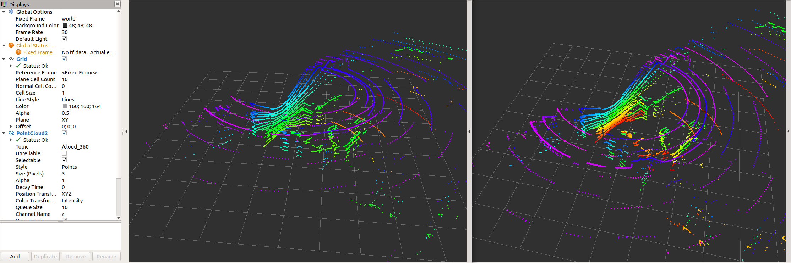
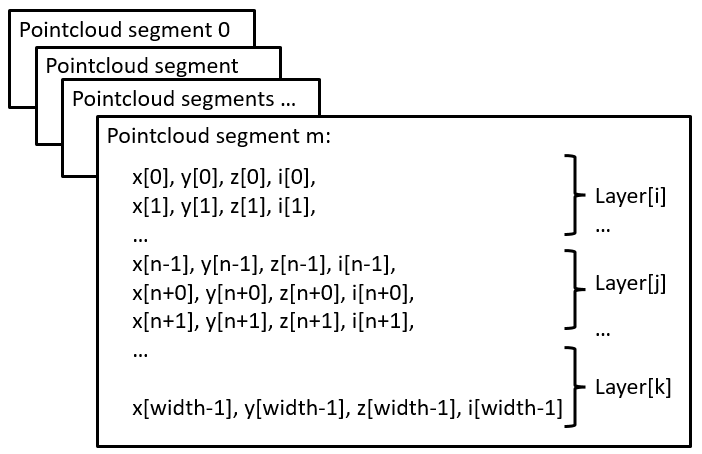
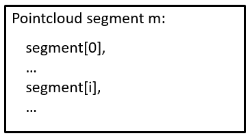
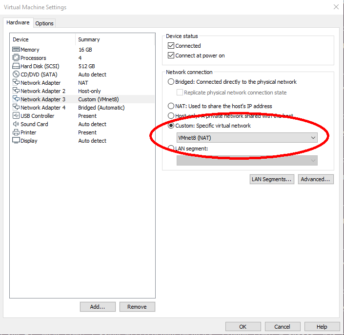

# picoScan100/multiScan100

The multiScan100 and picoScan100 are new lidars from Sick. multiScan100 has a total of 16 lidar units rotating around a vertical axis. The rotation speed is 20 rounds per second.

Scan data are transmitted in msgpack or compact format over UDP.

multiScan100/picoScan100 lidars are supported by sick_scan_xd. See [README](../README.md) for build and run instructions.

The following describes the configuration, validation and test in more detail.

## Configuration

multiScan100 is configured by launch file [sick_multiscan.launch](../launch/sick_multiscan.launch).
picoScan100 is configured by launch file [sick_picoscan.launch](../launch/sick_picoscan.launch).

Modify file [sick_multiscan.launch](../launch/sick_multiscan.launch) resp. [sick_picoscan.launch](../launch/sick_picoscan.launch) to change configuration. Note that the ip address of the udp receiver __must__ be configured on each system. This is the ip address of the computer running sick_scan_xd.

The ip address of the lidar and the udp receiver can be configured in the launch file by e.g.
```
<arg name="hostname" default="192.168.0.1"/>
<arg name="udp_receiver_ip" default="192.168.0.100"/>
```
or by command line by e.g.
```
# Run sick_scansegment_xd generic without ROS:
sick_generic_caller ./launch/sick_multiscan.launch hostname:=192.168.0.1 udp_receiver_ip:=192.168.0.100 
# Run sick_scansegment_xd on ROS-1:
roslaunch sick_scan_xd sick_multiscan.launch hostname:=192.168.0.1 udp_receiver_ip:=192.168.0.100 
# Run sick_scansegment_xd on ROS-2:
ros2 launch sick_scan_xd sick_multiscan.launch.py hostname:=192.168.0.1 udp_receiver_ip:=192.168.0.100 
```

## IMU support

IMU support for multiScan and picoScan is enabled by default and can be configured in the launchfile:
```
<param name="imu_enable" type="bool" value="True"/>  <!-- Enable inertial measurement unit IMU, compact format only -->
<param name="imu_udp_port" type="int" value="7503"/> <!-- udp port for multiScan imu data (if imu_enable is true) -->
<param name="imu_topic" type="string" value="imu"/>  <!-- topic of ros IMU messages -->
```

sick_scan_xd receives IMU data by UDP and publishes [ROS-1 sensor_msgs/Imu](https://docs.ros.org/en/noetic/api/sensor_msgs/html/msg/Imu.html) resp. [ROS-2 sensor_msgs/msg/Imu](https://docs.ros2.org/latest/api/sensor_msgs/msg/Imu.html) messages.

Note: IMU support requires compact format, which is the default. If msgpack communication is configured, imu support is automatically disabled.

IMU support for picoScan requires firmware version 1.1 or newer, see https://www.sick.com/de/en/downloads/media/swp680096 for firmware downloads.

## SOPAS support

On ROS-1 and ROS-2, service `ColaMsg` is provided to send CoLa commands to the lidar. Using this service, filters can be applied during runtime. 

See [sick_scansegment_xd_sopas_examples.md](sick_scansegment_xd_sopas_examples.md) for examples.

See the manual for further information of filter settings and parameter. 


The driver sends the following SOPAS start and stop sequence at program start resp. exit (example with default ip address 192.168.0.1):
```
// Prerequirement: measurement is active, but no UDP data is sent
// Start sending scan data output
sMN SetAccessMode 3 F4724744  // set authorization level for writing settings
sWN ScanDataEthSettings 1 +192 +168 +0 +1 +2115  // configure destination scan data output destination to 192.168.0.52 port 2115
sWN ScanDataFormat 1   // set scan data output format to MSGPACK
sWN ScanDataPreformatting 1 // for multiscan136 only
sWN ScanDataEnable 1   // enable scan data ouput
sMN LMCstartmeas       // start measurement
sMN Run                // apply the settings and logout
// ...
// UDP data is sent
// ...
// Stop sending scan data output
sMN SetAccessMode   3 F4724744   // set authorization level for writing settings
sWN ScanDataEnable 0   // disable scan data output
sMN Run   // apply the settings and logout
// No UDP data is sent anymore      
```

## Visualization

The multiScan100 and picoScan100 scans can be visualized by rviz. The following screenshots show two examples of a multiScan100 pointcloud:




Note that sick_scan_xd publishes 2 pointclouds:
* The pointcloud on topic `/cloud` is published for each scan segment.
* The pointcloud on topic `/cloud_fullframe` collects all segments for a complete 360 degree full scan (360 degree for multiScan100, 276 degree for picoscan100).

Pointcloud callbacks defined in the [API](sick_scan_api/sick_scan_api.md) are called the same way: A callback registered with SickScanApiRegisterPolarPointCloudMsg is called
* with a segment_idx >= 0 for each scan segment, and
* with segment_idx := -1 for the complete 360 degree full scan.

## Pointcloud memory layout

The Multiscan136 scans with 12 segments and 16 layer. For test, development and debugging, knowledge the internal memory layout of the pointclouds can be helpful. 

The pointcloud on topic `/cloud_unstructured_segments` (topic `/cloud` for sick_scan_xd version 2.10 or earlier) is published for each scan segment. Each pointcloud concatenates the layer of that segment. Each layer concatenates the points of that layer and segment. Each point concatenates the cartesian position (x, y, z) and the intensity i of a scan point. Each value of a point (x, y, z, i) is represented by a 4 byte float value. The pointcloud on topic `/cloud_unstructured_fullframe` (topic `/cloud_fullframe` for sick_scan_xd version 2.10 or earlier) collects all segments of a complete 360 degree full scan. Therefore, a total of 13 cartesian pointclouds are published for a 360 degree full scan:

* 12 segment pointclouds. Each segment pointcloud concatenates the points of each layer in this segment in a flat memory layout:<br/>
   

* 1 full scan pointcloud concatenating all 12 segments:<br/>
   

Note that segments and layer are not sorted in ascending order. They are published in the same order as they are received from the lidar.

## Customized pointclouds

Pointclouds can be customized, i.e. the fields and points can be configured by launchfile [sick_multiscan.launch](../launch/sick_multiscan.launch).

Parameter "custom_pointclouds" lists all customized pointclouds to be published. Each pointcloud is given by its name, e.g:
```
<param name="custom_pointclouds" type="string" value="cloud_unstructured_segments cloud_unstructured_fullframe cloud_polar_unstructured_segments cloud_polar_unstructured_fullframe cloud_all_fields_fullframe"/>
```
This example publishes 5 types of pointclouds:
* Pointcloud for each segment in cartesian coordinates (x,y,z,i), named "cloud_unstructured_segments"
* Pointcloud for each fullframe in cartesian coordinates (x,y,z,i), named "cloud_unstructured_fullframe"
* Pointcloud for each segment in polar coordinates (azimuth,elevation,range,i), named "cloud_polar_unstructured_segments"
* Pointcloud for each fullframe in polar coordinates (azimuth,elevation,range,i), named "cloud_polar_unstructured_fullframe"
* Pointcloud for each fullframe with all available fields (x,y,z,i,range,azimuth,elevation,layer,echo,reflector), named "cloud_all_fields_fullframe"

These 5 pointclouds are published by default.

The properties of the pointcloud, i.e. their fields and points, are configured by the pointcloud name, e.g. pointcloud "cloud_unstructured_segments" (i.e. the segment pointcloud in cartesian coordinates):
```
<!-- cloud_unstructured_segments: cartesian coordinates, segmented, all echos, all layers, max. 2700 points, mean ca. 1000 points per cloud -->
<param name="cloud_unstructured_segments" type="string" value="coordinateNotation=0 updateMethod=1 echos=0,1,2 layers=0,1,2,3,4,5,6,7,8,9,10,11,12,13,14,15 reflectors=0,1 infringed=0,1 topic=/cloud_unstructured_segments frameid=world publish=1"/>
```
The cloud property configuration is a list of key-value-pairs, where each key-value-pair specifies a property and its value. E.g. `topic=/cloud_unstructured_segments frameid=world` defines ros topic "/cloud_unstructured_segments" and frame id "world" for the pointcloud named "cloud_unstructured_segments".

The following key-value-pairs of a customized pointcloud are currently supported:
        
* Parameter "coordinateNotation" is an enum to configure pointcloud coordinates:
   * coordinateNotation=0: cartesian (default, pointcloud has fields x,y,z,i), identical to customized with fields=x,y,z,i
   * coordinateNotation=1: polar (pointcloud has fields azimuth,elevation,r,i), identical to customized with fields=azimuth,elevation,range,i
   * coordinateNotation=2: both cartesian and polar (pointcloud has fields x,y,z,azimuth,elevation,r,i), identical to customized with fields=x,y,z,azimuth,elevation,range,i
   * coordinateNotation=3: customized pointcloud fields, i.e. the pointcloud has fields configured by parameter "fields"

* Parameter "updateMethod" is an enum to configure fullframe pointclouds versus segmented pointcloud:
   * updateMethod=0: fullframe pointcloud (default)
   * updateMethod=1: segmented pointcloud

* Parameter "fields" defines the fields of the pointcloud for coordinateNotation == 3 (customized pointcloud fields), e.g. 
   * fields=x,y,z,i: cartesian pointcloud
   * fields=range,azimuth,elevation: polar pointcloud
   * or any other combination of x,y,z,i,range,azimuth,elevation,t,ts,ring,layer,echo,reflector
   
   These fields have the following meaning:
   * field "x": cartesian x coordinate in meter in ROS coordinates (4 byte, float32)
   * field "y": cartesian y coordinate in meter in ROS coordinates (4 byte, float32)
   * field "z": cartesian z coordinate in meter in ROS coordinates (4 byte, float32)
   * field "i": intensity  (4 byte, float32)
   * field "range": polar coordinate range in meter (4 byte, float32)
   * field "azimuth": polar coordinate azimuth in radians  (4 byte, float32)
   * field "elevation": polar coordinate elevation in radians  (4 byte, float32)
   * field "t":  time offset in nano seconds relative to the header timestamp in the point cloud (4 byte, uint32), used by rtabmap for deskewing 
   * field "ts": time offset in seconds relative to the header timestamp (4 byte, float32)
   * field "ring":  layer id (1 byte, int8), identical to field "layer"
   * field "layer": layer (group) index (4 byte, int32), 0 <= layer < 16 for multiScan (16 layer), 0 for picoScan (1 layer)
   * field "echo": echo index (4 byte, int32)
   * field "reflector": optional reflector bit (1 byte, uint8), 0 or 1, default: 0

* Parameter "echos" defines which echos are included in the pointcloud, e.g.
   * echos=0,1,2: all echos
   * echos=2: last echo
   or any other combination of 0,1,2

* Parameter "layers" defines which echos are included in the pointcloud, e.g
   * layers=0,1,2,3,4,5,6,7,8,9,10,11,12,13,14,15 for all layers
   * layers=5 for the 0 degree layer
   or any other combination of 0,1,2,3,4,5,6,7,8,9,10,11,12,13,14,15

* Parameter "reflectors" filters the points by the reflector bit, i.e.
   * reflectors=0,1 for points with reflector bit set or not set
   * reflectors=0 for points with reflector bit not set
   * reflectors=1 for points with reflector bit set

* Parameter "infringed" defines filters the points by infringement, i.e.
   * infringed=0,1 for points with infringement bit set or not set
   * infringed=0 for points with infringement bit not set
   * infringed=1 for points with infringement bit set
   Parameter "infringed" is currently not supported (reserved for future use)

* Parameter "topic" defines the ros topic, e.g. topic=/cloud_fullframe for cartesian fullframe pointclouds

* Parameter "frameid" defines the ros frame of the pointcloud, e.g. frameid=world, frameid=map or frameid=base_link

* Parameter "publish" activates or deactivates the pointcloud, e.g. publish=1 to generate and publish, or publish=0 to deactivate that pointcloud

To add a new pointcloud, define a pointcloud name (e.g. "cloud_layer7_cartesian"), add "cloud_layer7_cartesian" in parameter "custom_pointclouds" and specify a new parameter "cloud_layer7_cartesian" with the new cloud properties, e.g.
```
<!-- cloud_layer7_cartesian: cartesian coordinates, fullframe, first echo, layer7 -->
<param name="cloud_layer7_cartesian" type="string" value="coordinateNotation=0 updateMethod=0 echos=0 layers=7 reflectors=0,1 infringed=0,1 topic=/cloud_layer7_cartesian frameid=world publish=1"/>
```

The following pointclouds are currently predefined in launchfile [sick_multiscan.launch](../launch/sick_multiscan.launch):
```
<!-- cloud_unstructured_segments: cartesian coordinates, segmented, all echos, all layers, max. 2700 points, mean ca. 1000 points per cloud -->
<param name="cloud_unstructured_segments" type="string" value="coordinateNotation=0 updateMethod=1 echos=0,1,2 layers=0,1,2,3,4,5,6,7,8,9,10,11,12,13,14,15 reflectors=0,1 infringed=0,1 topic=/cloud_unstructured_segments frameid=world publish=1"/>

<!-- cloud_unstructured_fullframe: cartesian coordinates, fullframe, all echos, all layers, max. 32400 points, mean ca. 10000 points per cloud -->
<param name="cloud_unstructured_fullframe" type="string" value="coordinateNotation=0 updateMethod=0 echos=0,1,2 layers=0,1,2,3,4,5,6,7,8,9,10,11,12,13,14,15 reflectors=0,1 infringed=0,1 topic=/cloud_unstructured_fullframe frameid=world publish=1"/>

<!-- cloud_polar_unstructured_segments: polar coordinates, segmented, all echos, all layers, max. 2700 points, mean ca. 1000 points per cloud -->
<param name="cloud_polar_unstructured_segments" type="string" value="coordinateNotation=1 updateMethod=1 echos=0,1,2 layers=0,1,2,3,4,5,6,7,8,9,10,11,12,13,14,15 reflectors=0,1 infringed=0,1 topic=/cloud_polar_unstructured_segments frameid=world publish=1"/>

<!-- cloud_polar_unstructured_fullframe: polar coordinates, fullframe, all echos, all layers -->
<param name="cloud_polar_unstructured_fullframe" type="string" value="coordinateNotation=1 updateMethod=0 echos=0,1,2 layers=0,1,2,3,4,5,6,7,8,9,10,11,12,13,14,15 reflectors=0,1 infringed=0,1 topic=/cloud_polar_unstructured_fullframe frameid=world publish=1"/>

<!-- cloud_unstructured_echo1: cartesian coordinates, fullframe, first echo, all layers -->
<param name="cloud_unstructured_echo1" type="string" value="coordinateNotation=0 updateMethod=0 echos=0 layers=0,1,2,3,4,5,6,7,8,9,10,11,12,13,14,15 reflectors=0,1 infringed=0,1 topic=/cloud_unstructured_echo1 frameid=world publish=1"/>

<!-- cloud_unstructured_echo1_segments: cartesian coordinates, segmented, first echo, all layers -->
<param name="cloud_unstructured_echo1_segments" type="string" value="coordinateNotation=0 updateMethod=1 echos=0 layers=0,1,2,3,4,5,6,7,8,9,10,11,12,13,14,15 reflectors=0,1 infringed=0,1 topic=/cloud_unstructured_echo1_segments frameid=world publish=1"/>

<!-- cloud_unstructured_echo2: cartesian coordinates, fullframe, first echo, all layers -->
<param name="cloud_unstructured_echo2" type="string" value="coordinateNotation=0 updateMethod=0 echos=1 layers=0,1,2,3,4,5,6,7,8,9,10,11,12,13,14,15 reflectors=0,1 infringed=0,1 topic=/cloud_unstructured_echo2 frameid=world publish=1"/>

<!-- cloud_unstructured_echo2_segments: cartesian coordinates, segmented, first echo, all layers -->
<param name="cloud_unstructured_echo2_segments" type="string" value="coordinateNotation=0 updateMethod=1 echos=1 layers=0,1,2,3,4,5,6,7,8,9,10,11,12,13,14,15 reflectors=0,1 infringed=0,1 topic=/cloud_unstructured_echo2_segments frameid=world publish=1"/>

<!-- cloud_unstructured_echo3: cartesian coordinates, fullframe, first echo, all layers -->
<param name="cloud_unstructured_echo3" type="string" value="coordinateNotation=0 updateMethod=0 echos=2 layers=0,1,2,3,4,5,6,7,8,9,10,11,12,13,14,15 reflectors=0,1 infringed=0,1 topic=/cloud_unstructured_echo3 frameid=world publish=1"/>

<!-- cloud_unstructured_echo3_segments: cartesian coordinates, segmented, first echo, all layers -->
<param name="cloud_unstructured_echo3_segments" type="string" value="coordinateNotation=0 updateMethod=1 echos=2 layers=0,1,2,3,4,5,6,7,8,9,10,11,12,13,14,15 reflectors=1 infringed=0,1 topic=/cloud_unstructured_echo3_segments frameid=world publish=1"/>

<!-- cloud_unstructured_reflector: cartesian coordinates, fullframe, first echo, all layers -->
<param name="cloud_unstructured_reflector" type="string" value="coordinateNotation=0 updateMethod=0 echos=0,1,2 layers=0,1,2,3,4,5,6,7,8,9,10,11,12,13,14,15 reflectors=1 infringed=0,1 topic=/cloud_unstructured_reflector frameid=world publish=1"/>

<!-- cloud_unstructured_reflector_segments: cartesian coordinates, segmented, first echo, all layers -->
<param name="cloud_unstructured_reflector_segments" type="string" value="coordinateNotation=0 updateMethod=1 echos=0,1,2 layers=0,1,2,3,4,5,6,7,8,9,10,11,12,13,14,15 reflectors=1 infringed=0,1 topic=/cloud_unstructured_reflector_segments frameid=world publish=1"/>

<!-- cloud_structured_hires0: cartesian and polar coordinates, fullframe, all echos, high resolution layer 5, fields=x,y,z,i,range,azimuth,elevation, 12*2880x3=103680 points per cloud -->
<param name="cloud_structured_hires0" type="string" value="coordinateNotation=3 updateMethod=0 fields=x,y,z,i,range,azimuth,elevation echos=0,1,2 layers=5 reflectors=0,1 infringed=0,1 topic=/cloud_structured_hires0 frameid=world publish=1"/>

<!-- cloud_structured_hires0_segments: cartesian and polar coordinates, segments, all echos, high resolution layer 5, fields=x,y,z,i,range,azimuth,elevation, 2880x3=8640 points per cloud -->
<param name="cloud_structured_hires0_segments" type="string" value="coordinateNotation=3 updateMethod=1 fields=x,y,z,i,range,azimuth,elevation echos=0,1,2 layers=5 reflectors=0,1 infringed=0,1 topic=/cloud_structured_hires0_segments frameid=world publish=1"/>

<!-- cloud_structured_hires1: cartesian and polar coordinates, fullframe, all echos, high resolution layer 13, fields=x,y,z,i,range,azimuth,elevation, 12*2880x3=103680 points per cloud -->
<param name="cloud_structured_hires1" type="string" value="coordinateNotation=3 updateMethod=0 fields=x,y,z,i,range,azimuth,elevation echos=0,1,2 layers=13 reflectors=0,1 infringed=0,1 topic=/cloud_structured_hires1 frameid=world publish=1"/>

<!-- cloud_structured_hires1_segments: cartesian and polar coordinates, segments, all echos, high resolution layer 13, fields=x,y,z,i,range,azimuth,elevation, 2880x3=8640 points per cloud -->
<param name="cloud_structured_hires1_segments" type="string" value="coordinateNotation=3 updateMethod=1 fields=x,y,z,i,range,azimuth,elevation echos=0,1,2 layers=13 reflectors=0,1 infringed=0,1 topic=/cloud_structured_hires1_segments frameid=world publish=1"/>

<!-- cloud_structured: cartesian and polar coordinates, fullframe, all echos, low resolution layers 0,1,2,3,4,6,7,8,9,10,11,12,14,15, fields=x,y,z,i,range,azimuth,elevation, 12*360*14*3=181440 points per cloud -->
<param name="cloud_structured" type="string" value="coordinateNotation=3 updateMethod=0 fields=x,y,z,i,range,azimuth,elevation echos=0,1,2 layers=0,1,2,3,4,6,7,8,9,10,11,12,14,15 reflectors=0,1 infringed=0,1 topic=/cloud_structured frameid=world publish=1"/>

<!-- cloud_structured_segments: cartesian and polar coordinates, segments, all echos, low resolution layers 0,1,2,3,4,6,7,8,9,10,11,12,14,15, fields=x,y,z,i,range,azimuth,elevation, 360*14*3=15120 points per cloud -->
<param name="cloud_structured_segments" type="string" value="coordinateNotation=3 updateMethod=1 fields=x,y,z,i,range,azimuth,elevation echos=0,1,2 layers=0,1,2,3,4,6,7,8,9,10,11,12,14,15 reflectors=0,1 infringed=0,1 topic=/cloud_structured_segments frameid=world publish=1"/>

<!-- cloud_all_fields_segments: all fields (x,y,z,i,range,azimuth,elevation,layer,echo,reflector), segments, all echos, all layers -->
<param name="cloud_all_fields_segments" type="string" value="coordinateNotation=3 updateMethod=1 fields=x,y,z,i,range,azimuth,elevation,t,ts,ring,layer,echo,reflector echos=0,1,2 layers=0,1,2,3,4,5,6,7,8,9,10,11,12,13,14,15 reflectors=0,1 infringed=0,1 topic=/cloud_all_fields_segments frameid=world publish=1"/>

<!-- cloud_all_fields_fullframe: all fields (x,y,z,i,range,azimuth,elevation,layer,echo,reflector), fullframe, all echos, all layers -->
<param name="cloud_all_fields_fullframe" type="string" value="coordinateNotation=3 updateMethod=0 fields=x,y,z,i,range,azimuth,elevation,t,ts,ring,layer,echo,reflector echos=0,1,2 layers=0,1,2,3,4,5,6,7,8,9,10,11,12,13,14,15 reflectors=0,1 infringed=0,1 topic=/cloud_all_fields_fullframe frameid=world publish=1"/>
```

Note: The sick_scan_xd API callback functions `SickScanApiRegisterCartesianPointCloudMsg` and `SickScanApiRegisterPolarPointCloudMsg` provide cartesian and polar pointclouds, i.e. pointclouds configured with `coordinateNotation=0` (cartesian) or `coordinateNotation=1` (polar). Pointclouds with `coordinateNotation=2` (cartesian + polar) or `coordinateNotation=3` (customized fields) are currently not supported by the generic API.

### Customized pointclouds on a Raspberry

Performance is critical on a Raspberry. To reduce the cpu load, you may restrict the number of pointclouds to the minimum required for your application. E.g. if you just need the cartesian fullframe pointcloud, you can use
```
<param name="custom_pointclouds" type="string" value="cloud_unstructured_fullframe"/>
```
to decrease the cpu usage. 

## Msgpack validation

A msgpack validation can be activated. This validation checks
1. each incoming msgpack for scan data out of the expected values, and
2. missing scandata after collecting the msgpack data for a full scan (360 degree for multiScan100, 276 degree for picoScan100)

If a msgpack contains scan data out of expected values, the msgpack is discarded and an error message is printed. This should not happen in normal operation mode. If scan data are missing after a full 360 degree scan, an error message is printed. This might happen in case of udp packet drops.

By default, the full range of scan data is expected, i.e. all echos, all segments, all layers and azimuth values covering -180 up to +180 degree. If filters are activated (echo-, layer- or angle-range-filter to reduce network traffic), the msgpack validation should currently be deactivated or configured thoroughly to avoid error messages. In the next release, the filter configuration is queried from  multiScan136 Beta and validation settings are adopted to the multiScan136 Beta filter settings.

The msgpack validation is configured in file [sick_multiscan.launch](../launch/sick_multiscan.launch) resp. [sick_picoscan.launch](../launch/sick_picoscan.launch). To activate or deactivate msgpack validation, set `msgpack_validator_enabled` to True (activated) resp. False (deactivated). 

Msgpack validation leads to error messages in case of udp packet drops. Increase the value `msgpack_validator_check_missing_scandata_interval` to tolerate udp packet drops. Higher values increase the number of msgpacks collected for verification.

## Firewall configuration

By default, UDP communication is allowed on localhosts. To enable udp communication between 2 different machines, firewalls have to be configured.

On Windows: Setup the windows firewall to allow sick_scan_xd to receive udp packages on port 2115.
To pass udp packages from a remote sender, the default rule for incoming udp packages has to be configured in the windows firewall:
1. Run "wf.msc" as admin,
2. Click Inbound Rules and locate the rule(s) for lidar3d_msr100_recv (resp. python to allow python test scripts), and
3. Deactivate the UDP-rule for this process(es) or configure exceptions for remote computers.
4. Alternatively, you can create a new rule allowing udp communication on port 2115.

On Linux: Run the following commands to allow any udp communication on port 2115:
```
sudo iptables -A INPUT -p udp -m udp --dport 2115 -j ACCEPT
sudo iptables -A OUTPUT -p udp -m udp --sport 2115 -j ACCEPT
sudo iptables-save
```
Alternatively, you can also use
```
sudo ufw allow from any to any port 2115 proto udp
```
to allow all udp traffic on port 2115.

Note: If Linux or Windows is running in a virtual machine, make sure UDP port 2115 is forwarded. With VMware Workstation Pro, you can configure port forwarding 
using the Virtual Network Editor. Udp echos, delays, drops and other unexpected errors might occure when more than one network card is configured in VMware. 
Make sure you have only one network adapter activated with custom NAT:


## FAQ

### Visual Studio: Breakpoints in Debug Mode disabled

:question: In Windows debug version the compiler does not stop at breakpoints.

:white_check_mark: Check, that you are using the Debug Version. At '/Zi' to compiler settings. Disable optimization.
(see `https://stackoverflow.com/questions/865546/generating-symbols-in-release-binaries-with-visual-studio` for details).

### Packages lost in benchmark 

:question: sick_scan_xd seems to drop packages, when sending 10000 msgpacks with polarscan_sender_test.py from another computer

:white_check_mark: There can be a number of reasons for dropped messages (udp or msgpacks). Besides slow network connection, there can be other pitfalls depending on the system:

- If Linux or Windows is running in a virtual machine, make sure UDP port 2115 is forwarded. See [Firewall configuration](#firewall__configuration).

- Depending on ROS2 system settings, log messages might be buffered. To really see all log messages of sick_generic_caller, terminate sick_scan_xd/sick_generic_caller (Ctrl-C or kill) and view the ros logfile by `cat ~/.ros/log/sick_scan_*.log`

### Convert pcapng-files to msgpack or json

:question: How can I convert a pcapng-file with scandata to a msgpack- or json-file?

:white_check_mark: Run the following steps:
* Install python msgpack package with `pip install msgpack`
* Play the pcapng-file using multiscan_pcap_player.py
* Receive and convert to msgpack using multiscan_receiver.py
* Convert to json using online-converter https://toolslick.com/conversion/data/messagepack-to-json

Linux example:
```
pushd sick_scan_xd/test/python
python3 python multiscan_receiver.py &
python3 multiscan_pcap_player.py --pcap_filename=../emulator/scandata/20210929_multiscan_token_udp.pcapng
mv ./multiscan_dump_12472.msgpack     20210929_multiscan_token_udp.msgpack
mv ./multiscan_dump_12472.msgpack.hex 20210929_multiscan_token_udp.msgpack.hex 
popd
```
Then paste the content of file `20210929_multiscan_token_udp.msgpack.hex` in https://toolslick.com/conversion/data/messagepack-to-json and save the json-output.

Windows example:
```
pushd sick_scan_xd\test\python
python --version
REM Convert 20220915_multiscan_msgpack_output.pcapng (16-bit RSSI record) to msgpack resp. json
del /f/q multiscan_dump*.msgpack
del /f/q multiscan_dump*.msgpack.hex
start python multiscan_receiver.py
python multiscan_pcap_player.py --pcap_filename=../emulator/scandata/20220915_multiscan_msgpack_output.pcapng --udp_port=2115
move /y .\multiscan_dump_23644.msgpack     20220915_multiscan_msgpack_output.msgpack
move /y .\multiscan_dump_23644.msgpack.hex 20220915_multiscan_msgpack_output.msgpack.hex
REM Convert 20210929_multiscan_token_udp.pcapng (8-bit RSSI record) to msgpack resp. json
del /f/q multiscan_dump*.msgpack
del /f/q multiscan_dump*.msgpack.hex
start python multiscan_receiver.py
python multiscan_pcap_player.py --pcap_filename=../emulator/scandata/20210929_multiscan_token_udp.pcapng --verbose=0
move /y .\multiscan_dump_12472.msgpack     20210929_multiscan_token_udp.msgpack
move /y .\multiscan_dump_12472.msgpack.hex 20210929_multiscan_token_udp.msgpack.hex 
del /f/q multiscan_dump*.msgpack
del /f/q multiscan_dump*.msgpack.hex
popd
```
Then paste the content of files `20220915_multiscan_msgpack_output.msgpack.hex` resp. `20210929_multiscan_token_udp.msgpack.hex` in https://toolslick.com/conversion/data/messagepack-to-json and save the json-output.
