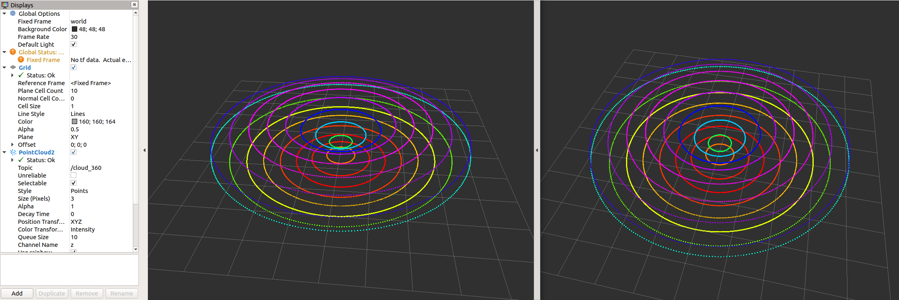

# MultiScan136/sick_scan_segment_xd

The MultiScan136 Beta is a new lidar from Sick with a total of 16 lidar units rotating around a vertical axis. 
The rotation speed is 20 rounds per second.
Scan data are transmitted in msgpack format over UDP.

MultiScan136 / sick_scan_segment_xd lidars are supported by sick_scan_xd. See [README](../README.md) for build and run instructions.

The following describes the configuration, validation and test in more detail.


## Configuration

MultiScan136/sick_scan_segment_xd is configured by launch file [sick_scansegment_xd.launch](../launch/sick_scansegment_xd.launch):
```
    <!-- Launch sick_scansegment_xd -->
    <!-- env name="ROSCONSOLE_CONFIG_FILE" value="/tmp/rosconsole_loglevel_warn.conf" / -->
    <arg name="hostname" default="192.168.0.1"/>  <!-- IP address of multiScan136, overwrites default ip address "192.168.0.1" in sick_scansegment_xd.yaml -->
    <arg name="udp_receiver_ip" default=""/>        <!-- UDP destination IP address (ip address of udp receiver), overwrites default in sick_scansegment_xd.yaml -->
    <arg name="nodename" default="sick_scansegment_xd"/>

    <node name="$(arg nodename)" pkg="sick_scan" type="sick_generic_caller" respawn="false" output="screen" required="true">    
        <param name="scanner_type" type="string" value="sick_scansegment_xd"/>

        <!-- network settings: -->
        <param name="hostname" type="string" value="$(arg hostname)" />                     <!-- IP address of multiScan136 to post start and stop commands, f.e. "192.168.0.1" (default) -->
        <param name="port" type="int" value="2115" />                                       <!-- IP port of multiScan136 to post start and stop commands -->
        <param name="udp_receiver_ip" type="string" value="$(arg udp_receiver_ip)" />       <!-- UDP destination IP address (ip address of udp receiver), f.e. "192.168.0.140" -->

        <!-- sick_scansegment_xd basic settings: -->
        <param name="udp_sender" type="string" value="" />                                  <!-- Use "" (default) to receive msgpacks from any udp sender, use "127.0.0.1" to restrict to localhost (loopback device), or use the ip-address of a MRS100 lidar or MRS100 emulator -->
        <param name="udp_port" type="int" value="2115" />                                   <!-- default udp port for multiScan136 resp. multiScan136 emulator is 2115 -->
        <param name="publish_topic" type="string" value="/cloud" />                         <!-- ros topic to publish received msgpack data converted top PointCloud2 messages, default: "/cloud" -->
        <param name="publish_topic_all_segments" type="string" value="/cloud_360" />        <!-- ros topic to publish PointCloud2 messages of all segments (360 deg), default: "/cloud_360" -->
        <param name="segment_count" type="int" value="12" />                                <!-- number of expected segments in 360 degree, multiScan136: 12 segments, 30 degree per segment -->
        <param name="publish_frame_id" type="string" value="world" />                       <!-- frame id of ros PointCloud2 messages, default: "world" -->
        <param name="udp_input_fifolength" type="int" value="20" />                         <!-- max. udp input fifo length(-1: unlimited, default: 20 for buffering 1 second at 20 Hz), elements will be removed from front if number of elements exceeds the fifo_length -->
        <param name="msgpack_output_fifolength" type="int" value="20" />                    <!-- max. msgpack output fifo length(-1: unlimited, default: 20 for buffering 1 second at 20 Hz), elements will be removed from front if number of elements exceeds the fifo_length -->
        <param name="verbose_level" type="int" value="1" />                                 <!-- verbose_level <= 0: quiet mode, verbose_level == 1: print statistics, verbose_level == 2: print details incl. msgpack data, default: 1 -->
        <param name="measure_timing" type="bool" value="True" />                            <!-- measure_timing == true: duration and latency of msgpack conversion and export is measured, default: true -->
        <param name="export_csv" type="bool" value="False" />                               <!-- export msgpack data to csv file, default: false -->
        <param name="export_udp_msg" type="bool" value="False" />                           <!-- true : export binary udpand msgpack data to file(*.udp and* .msg), default: false -->
        <param name="logfolder" type="string" value="" />                                   <!-- output folder for logfiles, default: "" (no logging) -->
        <param name="send_udp_start" type="bool" value="False" />                           <!-- Send udp start string to multiScan136 -->
        <param name="send_udp_start_string" type="string" value="magicalActivate" />        <!-- udp string to start multiScan136 -->
        <param name="udp_timeout_ms" type="int" value="60000" />                            <!-- Timeout for udp messages in milliseconds, default: 60*1000 -->
        
        <!-- SOPAS settings: -->
        <param name="sopas_tcp_port" type="string" value="2111" />                          <!-- TCP port for SOPAS commands, default port: 2111 -->
        <param name="start_sopas_service" type="bool" value="True" />                       <!-- True: sopas services for CoLa-commands are started (ROS only), default: true -->
        <param name="send_sopas_start_stop_cmd" type="bool" value="True" />                 <!-- True: multiScan136 start and stop command sequence ("sWN ScanDataEnable 0/1" etc.) are sent after driver start and stop, default: true -->
        <param name="sopas_cola_binary" type="bool" value="False" />                        <!-- False: SOPAS uses CoLa-A (ascii, default, recommended), CoLa-B (true, binary) currently experimental -->
        <param name="sopas_timeout_ms" type="int" value="5000" />                           <!-- Timeout for SOPAS response in milliseconds, default: 5000 -->
        <param name="client_authorization_pw" type="string" value="F4724744" />             <!-- Default password for client authorization -->
        
        <!-- MSR100 filter settings -->
        <param name="host_read_filtersettings" type="bool" value="True" />                                    <!-- Read multiScan136 settings for FREchoFilter, LFPangleRangeFilter and LFPlayerFilter at startup, default: true -->
        <param name="host_FREchoFilter" type="int" value="0" />                                               <!-- Optionally set FREchoFilter with 0 for FIRST_ECHO (default, EchoCount=1), 1 for ALL_ECHOS (EchoCount=3), or 2 for LAST_ECHO (EchoCount=1) -->
        <param name="host_set_FREchoFilter" type="bool" value="False" />                                      <!-- If true, FREchoFilter is set at startup (default: false) -->
        <param name="host_LFPangleRangeFilter" type="string" value="0 -180.0 +179.0 -90.0 +90.0 1" />         <!-- Optionally set LFPangleRangeFilter to "<enabled> <azimuth_start> <azimuth_stop> <elevation_start> <elevation_stop> <beam_increment>" with azimuth and elevation given in degree -->
        <param name="host_set_LFPangleRangeFilter" type="bool" value="False" />                               <!-- If true, LFPangleRangeFilter is set at startup (default: false) -->
        <param name="host_LFPlayerFilter" type="string" value="0 1 1 1 1 1 1 1 1 1 1 1 1 1 1 1 1" />          <!-- Optionaly set LFPlayerFilter to "<enabled> <layer0-enabled> <layer1-enabled> <layer2-enabled> ... <layer15-enabled>" with 1 for enabled and 0 for disabled -->
        <param name="host_set_LFPlayerFilter" type="bool" value="False" />                                    <!-- If true, LFPlayerFilter is set at startup (default: false) -->
        
        <!-- Msgpack validation -->
        <param name="msgpack_validator_enabled" type="bool" value="False" />                                  <!-- true: check msgpack data for out of bounds and missing scan data, false: no msgpack validation (default) -->
        <param name="msgpack_validator_verbose" type="int" value="1" />                                       <!-- 0: print error messages, 1: print error and informational messages, 2: print error and all messages -->
        <param name="msgpack_validator_discard_msgpacks_out_of_bounds" type="bool" value="True" />            <!-- true: msgpacks are discarded if scan data out of bounds detected, false: error message if a msgpack is not validated -->
        <param name="msgpack_validator_check_missing_scandata_interval" type="int" value="12" />              <!-- check msgpack for missing scandata after collecting N msgpacks, default: N = 12 segments. Increase this value to tolerate udp packet drops. Use 12 to check each full scan. -->
        <param name="msgpack_validator_required_echos" type="string" value="0" />                             <!-- default: echo count = 1 -->
        <param name="msgpack_validator_azimuth_start" type="double" value="-180.0" />                         <!-- default for full scan: -180 degree -->
        <param name="msgpack_validator_azimuth_end" type="double" value="+180.0" />                           <!-- default for full scan: +180 degree -->
        <param name="msgpack_validator_elevation_start" type="double" value="-90.0" />                        <!-- default for full scan: -90 degree -->
        <param name="msgpack_validator_elevation_end" type="double" value="+90.0" />                          <!-- default for full scan: +-90 degree -->
        <param name="msgpack_validator_valid_segments" type="string" value="0 1 2 3 4 5 6 7 8 9 10 11" />     <!-- indices of valid segmentes, default for full scan: 12 segments -->
        <param name="msgpack_validator_layer_filter" type="string" value="1 1 1 1 1 1 1 1 1 1 1 1 1 1 1 1" /> <!-- default for full scan: 16 layer active, i.e. "1 1 1 1 1 1 1 1 1 1 1 1 1 1 1 1" -->

    </node>
```

Modify file [sick_scansegment_xd.launch](../launch/sick_scansegment_xd.launch) to change configuration. Note that the ip adress of the udp receiver __must__ be configured on each system. This is the ip address of the computer running sick_scan_xd.

The ip adress of the lidar and the udp receiver can be configured in the launch file by e.g.
```
<arg name="hostname" default="192.168.0.1"/>
<arg name="udp_receiver_ip" default="192.168.0.100"/>
```
or by command line by e.g.
```
hostname:=192.168.0.1 udp_receiver_ip:=192.168.0.100
```

## SOPAS support

On ROS-1 and ROS-2, service `ColaMsg` is provided to send CoLa commands to the lidar. Using this service, filters can be applied during runtime. See the manual for further information of filter settings and parameter. 

Examples on ROS-1:
```
rosservice list
rosservice call /sick_scansegment_xd/ColaMsg "{request: 'sMN IsSystemReady'}"                             # response: "sAN IsSystemReady 1"
rosservice call /sick_scansegment_xd/ColaMsg "{request: 'sMN SetAccessMode 3 F4724744'}"                  # response: "sAN SetAccessMode 1"
rosservice call /sick_scansegment_xd/ColaMsg "{request: 'sWN ScanDataEthSettings 1 +127 +0 +0 +1 +2115'}" # response: "sWA ScanDataEthSettings"
rosservice call /sick_scansegment_xd/ColaMsg "{request: 'sWN ScanDataFormatSettings 1 1'}"                # response: "sWA ScanDataFormatSettings"
rosservice call /sick_scansegment_xd/ColaMsg "{request: 'sWN ScanDataEnable 1'}"                          # response: "sWA ScanDataEnable"
rosservice call /sick_scansegment_xd/ColaMsg "{request: 'sMN LMCstartmeas'}"                              # response: "sAN LMCstartmeas"
rosservice call /sick_scansegment_xd/ColaMsg "{request: 'sMN Run'}"                                       # response: "sAN Run 1"
rosservice call /sick_scansegment_xd/ColaMsg "{request: 'sRN FREchoFilter'}"                                                # response: "sRA FREchoFilter 1"
rosservice call /sick_scansegment_xd/ColaMsg "{request: 'sRN LFPangleRangeFilter'}"                                         # response: "sRA LFPangleRangeFilter 0 C0490FF9 40490FF9 BFC90FF9 3FC90FF9 1"
rosservice call /sick_scansegment_xd/ColaMsg "{request: 'sRN LFPlayerFilter'}"                                              # response: "sRA LFPlayerFilter 0 1 1 1 1 1 1 1 1 1 1 1 1 1 1 1 1"
rosservice call /sick_scansegment_xd/ColaMsg "{request: 'sMN SetAccessMode 3 F4724744'}"                                    # response: "sAN SetAccessMode 1"
rosservice call /sick_scansegment_xd/ColaMsg "{request: 'sWN FREchoFilter 1'}"                                              # response: "sWA FREchoFilter"
rosservice call /sick_scansegment_xd/ColaMsg "{request: 'sWN LFPangleRangeFilter 0 C0490FF9 40490FF9 BFC90FF9 3FC90FF9 1'}" # response: "sWA LFPangleRangeFilter"
rosservice call /sick_scansegment_xd/ColaMsg "{request: 'sWN LFPlayerFilter 0 1 1 1 1 1 1 1 1 1 1 1 1 1 1 1 1'}"            # response: "sWA LFPlayerFilter"
rosservice call /sick_scansegment_xd/ColaMsg "{request: 'sMN Run'}"                                                         # response: "sAN Run 1"
rosservice call /sick_scansegment_xd/ColaMsg "{request: 'sRN FREchoFilter'}"                                                # response: "sRA FREchoFilter 1"
rosservice call /sick_scansegment_xd/ColaMsg "{request: 'sRN LFPangleRangeFilter'}"                                         # response: "sRA LFPangleRangeFilter 0 C0490FF9 40490FF9 BFC90FF9 3FC90FF9 1"
rosservice call /sick_scansegment_xd/ColaMsg "{request: 'sRN LFPlayerFilter'}"                                              # response: "sRA LFPlayerFilter 0 1 1 1 1 1 1 1 1 1 1 1 1 1 1 1 1"
```

Examples on ROS-2:
```
ros2 service list
ros2 service call /ColaMsg sick_scan/srv/ColaMsgSrv "{request: 'sMN IsSystemReady'}"                             # response: "sAN IsSystemReady 1"
ros2 service call /ColaMsg sick_scan/srv/ColaMsgSrv "{request: 'sMN SetAccessMode 3 F4724744'}"                  # response: "sAN SetAccessMode 1"
ros2 service call /ColaMsg sick_scan/srv/ColaMsgSrv "{request: 'sWN ScanDataEthSettings 1 +127 +0 +0 +1 +2115'}" # response: "sWA ScanDataEthSettings"
ros2 service call /ColaMsg sick_scan/srv/ColaMsgSrv "{request: 'sWN ScanDataFormatSettings 1 1'}"                # response: "sWA ScanDataFormatSettings"
ros2 service call /ColaMsg sick_scan/srv/ColaMsgSrv "{request: 'sWN ScanDataEnable 1'}"                          # response: "sWA ScanDataEnable"
ros2 service call /ColaMsg sick_scan/srv/ColaMsgSrv "{request: 'sMN LMCstartmeas'}"                              # response: "sAN LMCstartmeas"
ros2 service call /ColaMsg sick_scan/srv/ColaMsgSrv "{request: 'sMN Run'}"                                       # response: "sAN Run 1"
ros2 service call /ColaMsg sick_scan/srv/ColaMsgSrv "{request: 'sRN FREchoFilter'}"                                                # response: "sRA FREchoFilter 1"
ros2 service call /ColaMsg sick_scan/srv/ColaMsgSrv "{request: 'sRN LFPangleRangeFilter'}"                                         # response: "sRA LFPangleRangeFilter 0 C0490FF9 40490FF9 BFC90FF9 3FC90FF9 1"
ros2 service call /ColaMsg sick_scan/srv/ColaMsgSrv "{request: 'sRN LFPlayerFilter'}"                                              # response: "sRA LFPlayerFilter 0 1 1 1 1 1 1 1 1 1 1 1 1 1 1 1 1"
ros2 service call /ColaMsg sick_scan/srv/ColaMsgSrv "{request: 'sMN SetAccessMode 3 F4724744'}"                                    # response: "sAN SetAccessMode 1"
ros2 service call /ColaMsg sick_scan/srv/ColaMsgSrv "{request: 'sWN FREchoFilter 1'}"                                              # response: "sWA FREchoFilter"
ros2 service call /ColaMsg sick_scan/srv/ColaMsgSrv "{request: 'sWN LFPangleRangeFilter 0 C0490FF9 40490FF9 BFC90FF9 3FC90FF9 1'}" # response: "sWA LFPangleRangeFilter"
ros2 service call /ColaMsg sick_scan/srv/ColaMsgSrv "{request: 'sWN LFPlayerFilter 0 1 1 1 1 1 1 1 1 1 1 1 1 1 1 1 1'}"            # response: "sWA LFPlayerFilter"
ros2 service call /ColaMsg sick_scan/srv/ColaMsgSrv "{request: 'sMN Run'}"                                                         # response: "sAN Run 1"
ros2 service call /ColaMsg sick_scan/srv/ColaMsgSrv "{request: 'sRN FREchoFilter'}"                                                # response: "sRA FREchoFilter 1"
ros2 service call /ColaMsg sick_scan/srv/ColaMsgSrv "{request: 'sRN LFPangleRangeFilter'}"                                         # response: "sRA LFPangleRangeFilter 0 C0490FF9 40490FF9 BFC90FF9 3FC90FF9 1"
ros2 service call /ColaMsg sick_scan/srv/ColaMsgSrv "{request: 'sRN LFPlayerFilter'}"                                              # response: "sRA LFPlayerFilter 0 1 1 1 1 1 1 1 1 1 1 1 1 1 1 1 1"
```

The driver sends the following SOPAS start and stop sequence at program start resp. exit (example with default ip address 192.168.0.1):
```
// Prerequirement: measurement is active, but no UDP data is sent
// Start sending scan data output
sMN SetAccessMode   3 F4724744   // set authorization level for writing settings
sWN ScanDataEthSettings 1 +192 +168 +0 +1 +2115   // configure destination scan data output destination to 192.168.0.52 port 2115
sWN ScanDataFormatSettings 1 1   // set scan data output format to MSGPACK
sWN ScanDataEnable 1   // enable scan data ouput
sMN LMCstartmeas // start measurement
sMN Run   // apply the settings and logout
// ...
// UDP data is sent
// ...
// Stop sending scan data output
sMN SetAccessMode   3 F4724744   // set authorization level for writing settings
sWN ScanDataEnable 0   // disable scan data output
sMN Run   // apply the settings and logout
// No UDP data is sent anymore      
```

## Visualization

The Multiscan136 scans can be visualized by rviz. The following screenshots show two examples of a Multiscan136 pointcloud:




Note that sick_scan_xd publishes 2 pointclouds:
* The pointcloud on topic `/cloud` is published for each scan segment.
* The pointcloud on topic `/cloud_360` collects all segments for a complete 360 degree full scan.

## Msgpack validation

A msgpack validation can be activated. This validation checks
1. each incoming msgpack for scan data out of the expected values, and
2. missing scandata after collecting the msgpack data for a full scan (360 degree)

If a msgpack contains scan data out of expected values, the msgpack is discarded and an error message is printed. This should not happen in normal operation mode. If scan data are missing after a full 360 degree scan, an error message is printed. This might happen in case of udp packet drops.

By default, the full range of scan data is expected, i.e. all echos, all segments, all layers and azimuth values covering -180 up to +180 degree. If filters are activated (echo-, layer- or angle-range-filter to reduce network traffic), the msgpack validation should currently be deactivated or configured thoroughly to avoid error messages. In the next release, the filter configuration is queried from  MultiScan136 Beta and validation settings are adopted to the MultiScan136 Beta filter settings.

The msgpack validation is configured in file [sick_scansegment_xd.launch](../launch/sick_scansegment_xd.launch). To activate or deactivate msgpack validation, set `msgpack_validator_enabled` to True (activated) resp. False (deactivated). 

Msgpack validation leads to error messages in case of udp packet drops. Increase the value `msgpack_validator_check_missing_scandata_interval` to tolerate udp packet drops. Higher values increase the number of msgpacks collected for verification.

Note: A Multiscan136 can be simulated by the SICK emulator (Windows only). If the scans are visualized with an internet browser using Sopas Air, the visualization can cause high cpu usage leading to udp package drops or errors on msgpack validation. Make sure that Sopas Air is minimized and its cpu usage is normal.

## Firewall configuration

By default, UDP communication is allowed on localhosts. To enable udp communication between 2 different machines, firewalls have to be configured.

On Windows: Setup the windows firewall to allow lidar3d_msr100_recv to receive udp packages on port 2115.
By default, lidar3d_msr100_recv can receive udp data from localhost. To pass udp packages from a remote sender, the default rule for incoming udp packages has to be configured in the windows firewall:
1. Run "wf.msc" as admin,
2. Click Inbound Rules and locate the rule(s) for lidar3d_msr100_recv (resp. python to allow python test scripts), and
3. Deactivate the UDP-rule for this process(es) or configure exceptions for remote computers.
4. Alternatively, you can create a new rule allowing udp communication on port 2115.

On Linux: Run the following commands to allow any udp communication on port 2115:
```
sudo iptables -A INPUT -p udp -m udp --dport 2115 -j ACCEPT
sudo iptables -A OUTPUT -p udp -m udp --sport 2115 -j ACCEPT
sudo iptables-save
sudo ufw allow from any to any port 2115 proto udp
```

Note: If Linux or Windows is running in a virtual machine, make sure UDP port 2115 is forwarded. With VMware Workstation Pro, you can configure port forwarding 
using the Virtual Network Editor. Udp echos, delays, drops and other unexpected errors might occure when more than one network card is configured in VMware. 
Make sure you have only one network adapter activated with custom NAT:


## FAQ

### Visual Studio: Breakpoints in Debug Mode disabled

:question: In Windows debug version the compiler does not stop at breakpoints.

:white_check_mark: Check, that you are using the Debug Version. At '/Zi' to compiler settings. Disable optimization.
(see `https://stackoverflow.com/questions/865546/generating-symbols-in-release-binaries-with-visual-studio` for details).

### Packages lost in benchmark 

:question: lidar3d_mrs100_recv seems to drop packages, when sending 10000 msgpacks with polarscan_sender_test.py from another computer

:white_check_mark: There can be a number of reasons for dropped messages (udp or msgpacks). Besides slow network connection, there can be other pitfalls depending on the system:

- If Linux or Windows is running in a virtual machine, make sure UDP port 2115 is forwarded. See [Firewall configuration](#firewall__configuration).

- Depending on ROS2 system settings, log messages might be buffered. To really see all log messages of sick_generic_caller, terminate sick_scan_xd/sick_generic_caller 
(Ctrl-C or kill) and view the ros logfile by `cat ~/.ros/log/sick_scan_*.log`
