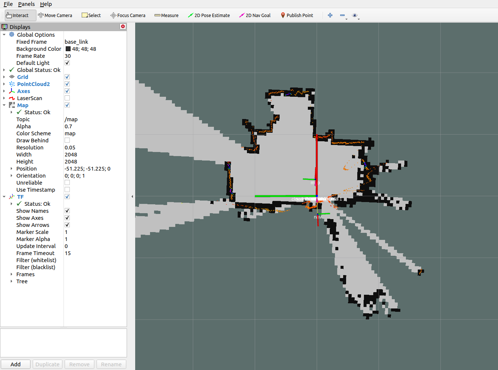
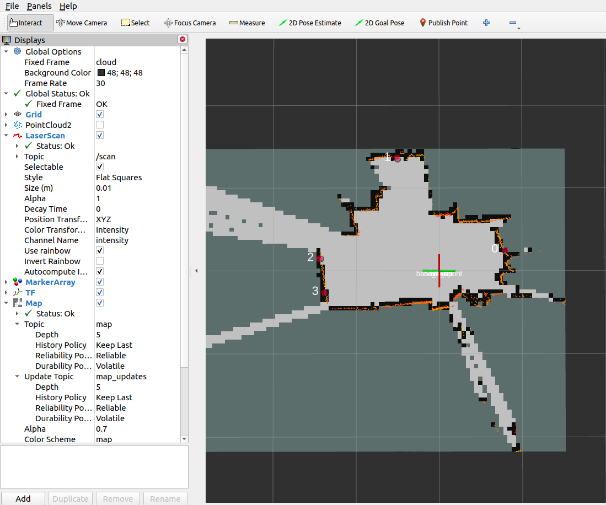
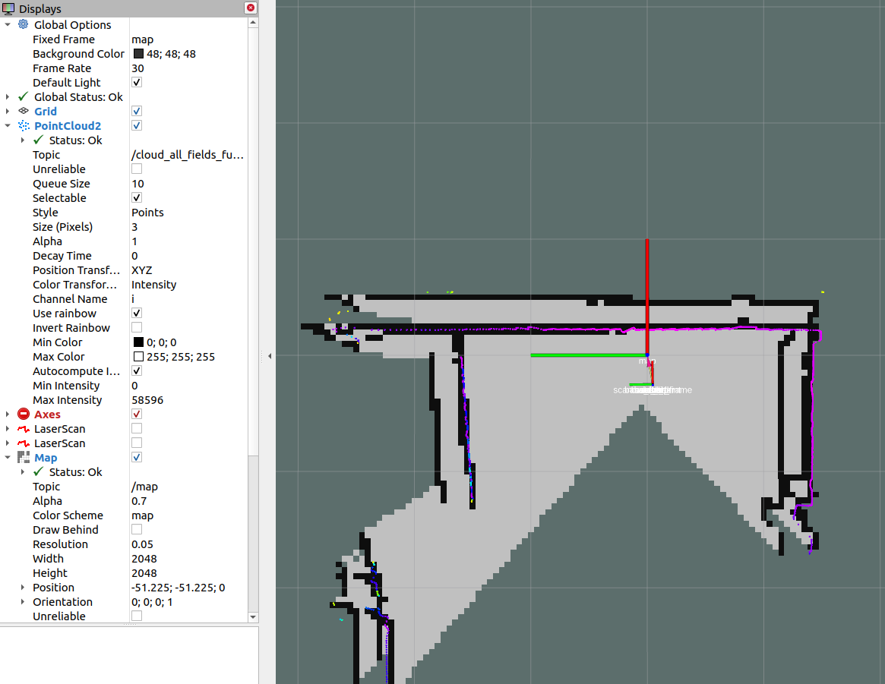
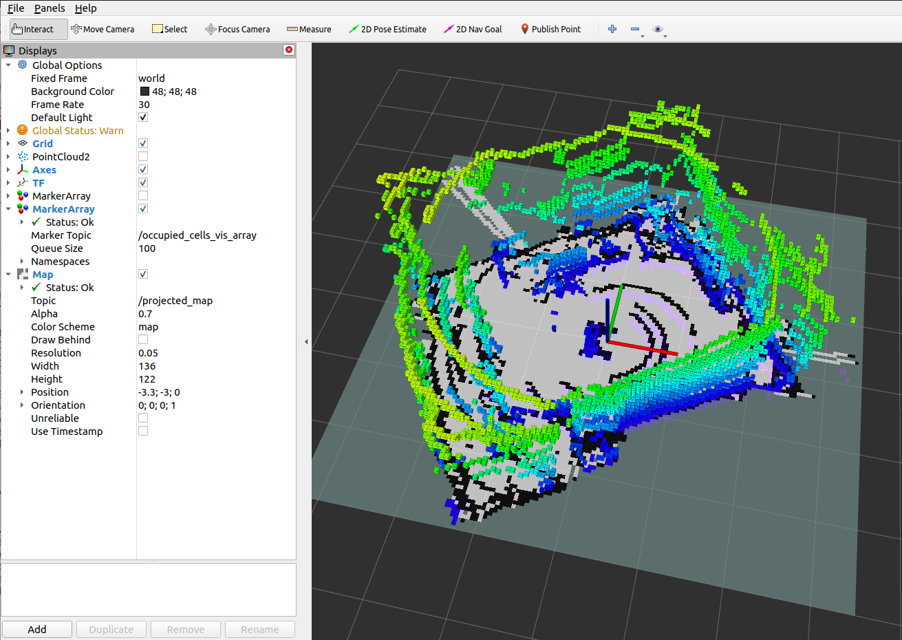
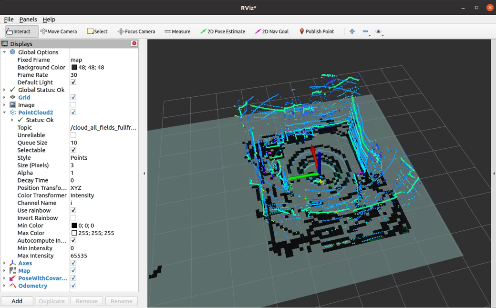
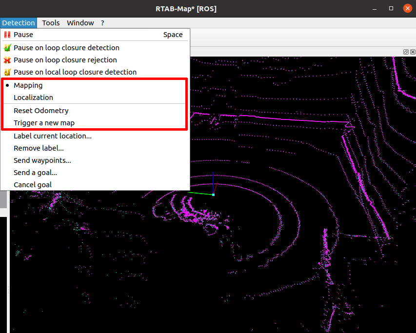

# Slam

## Table of contents

- [Introduction](#introduction)
- [Principle](#measuring-principle)
- [NAV-350 ROS-1 SLAM example](#nav-350-ros-1-slam-example)
- [NAV-350 ROS-2 SLAM example](#nav-350-ros-2-slam-example)
- [picoScan ROS-1 SLAM example](#picoscan-ros-1-slam-example)
- [MRS-1104 SLAM support](#mrs-1104-slam-support)
- [Google Cartographer](#google-cartographer)
- [OctoMap](#octomap)
- [RTAB-Map](#rtab-map)

## Introduction

In robotic mapping and navigation, simultaneous localization and mapping (SLAM) is the computational problem of constructing 
or updating a map of an unknown environment while simultaneously keeping track of an agent's location within it. 
For further details please refer to https://en.wikipedia.org/wiki/Simultaneous_localization_and_mapping.

## Measuring Principle

The following assumes that the SLAM algorithm works with a laser scanner mounted on a mobile base. The mobile base (e.g. a robot) records the environment while driving and creates the map from it. The mobile base usually has a so-called intertial measurement unit (IMU). In principle, however, it is also possible to estimate the direction of movement from the chronological sequence of the laser scans by means of correlation observations.
The laser scanner then virtually takes over the task of the IMU and other components (e.g. counting the wheel revolutions). The method of estimating the position and orientation (position estimation) of a mobile system based on data from its driving system is called odometry (cf. https://en.wikipedia.org/wiki/Odometry).

The SLAM algorithm hector_slam (http://wiki.ros.org/hector_slam) supports odometry estimation directly from the laser scans and is therefore used as a reference implementation in the following.

Other widely used SLAM algorithms such as gmapping (cf. http://wiki.ros.org/gmapping ) do not have this option. They depend on the data of an IMU. One possibility to use Gmapping nevertheless is the integration of the project laser_scan_matcher (https://answers.ros.org/question/63457/gmapping-without-odom/ and http://wiki.ros.org/laser_scan_matcher ).  Here, however, the pose must still be converted into an odometry message (see https://answers.ros.org/question/12489/obtaining-nav_msgsodometry-from-a-laser_scan-eg-with-laser_scan_matcher/ ).

## NAV-350 ROS-1 SLAM example

Build hector_slam and sick_scan_xd:
```
cd src
git clone -b master https://github.com/SICKAG/sick_scan_xd.git
git clone https://github.com/tu-darmstadt-ros-pkg/hector_slam.git
cd ..
catkin_make_isolated --install --cmake-args -DROS_VERSION=1 -DCMAKE_ENABLE_EMULATOR=1 -Wno-dev
```

Run rviz, sick_scan_xd with NAV-350 and hector_slam:
```
source ./devel_isolated/setup.bash
rosrun rviz rviz -d ./src/sick_scan_xd/test/emulator/config/rviz_slam_nav350.rviz &
roslaunch sick_scan sick_nav_350.launch hostname:=192.168.0.1 tf_publish_rate:=0 &
roslaunch sick_scan test_200_slam_ros1_hector.launch scan_topic:=/scan scan_layer_0_frame_id:=cloud_POS_000_DIST1 cloud_frame_id:=cloud &
```

**Note:** By default, sick_scan_xd publishes transform (TF) messages, which map frame id "map" to the point cloud frame id. To avoid conflicts with hector SLAM, it is recommended to disable these TF messages by commandline parameter **`tf_publish_rate:=0`** or by setting `<param name="tf_publish_rate" type="double" value="0"/>` in the launchfile.

The following rviz screenshot shows an example of a NAV-350 pointcloud created by sick_scan_xd and its map generated by hector_slam on ROS1:



## NAV-350 ROS-2 SLAM example

Install ths ROS2 slam-toolbox with `sudo apt install ros-foxy-navigation2 ros-foxy-nav2-bringup ros-foxy-slam-toolbox` (replace `foxy` by your ros distribution).

Build sick_scan_xd for ROS-2 as described in [INSTALL-ROS2.md](../INSTALL-ROS2.md)

Run rviz2, sick_scan_xd, slam_toolbox and static transforms:
```
source ./install/setup.bash
ros2 run rviz2 rviz2 -d ./src/sick_scan_xd/test/emulator/config/rviz2_slam_nav350.rviz &
ros2 launch sick_scan sick_nav_350.launch.py hostname:=192.168.0.1 tf_publish_rate:=0 &
ros2 run tf2_ros static_transform_publisher 0 0 0 0 0 0 base_link cloud  &
ros2 run tf2_ros static_transform_publisher 0 0 0 0 0 0 base_footprint base_link  &
ros2 run tf2_ros static_transform_publisher 0 0 0 0 0 0 odom base_footprint  &
ros2 launch nav2_bringup navigation_launch.py &
ros2 launch slam_toolbox online_async_launch.py &
```

Note: Laserscan messages need to be remapped to topic `/scan` (default is `/sick_nav_350/scan`). Use `remappings=[ ('/sick_nav_350/scan', '/scan'), ]` in the launchfile, e.g.:
```
node = Node(
    package='sick_scan',
    executable='sick_generic_caller',
    output='screen',
    remappings=[ ('/sick_nav_350/scan', '/scan'), ], # remap laserscan messages to topic /scan
)
```

The following rviz2 screenshot shows an example of a NAV-350 laserscan created by sick_scan_xd and its map generated by slam_toolbox on ROS2:



## picoScan ROS-1 SLAM example

Run rviz, sick_scan_xd with picoScan and hector_slam:
```
source ./devel_isolated/setup.bash
rosrun rviz rviz -d ./src/sick_scan_xd/test/emulator/config/rviz_slam_multiscan.rviz &
roslaunch sick_scan sick_nav_350.launch hostname:=192.168.0.1 hostname:=127.0.0.1 udp_receiver_ip:=192.168.0.100 tf_publish_rate:=0 &
roslaunch sick_scan test_200_slam_ros1_hector.launch scan_topic:=/sick_picoscan/scan_fullframe scan_layer_0_frame_id:=world_1 cloud_frame_id:=world &
```
Replace ip address `192.168.0.100` with the ip address of your local machine running sick_scan_xd.

The following rviz screenshot shows an example of a picoScan pointcloud created by sick_scan_xd and its map generated by hector_slam on ROS1:




## MRS-1104 SLAM support

MRS-1104 provides 4 layers covering elevation angles at -2.5°, 0.0°, 2.5° and 5.0°. The layer with 0.0° is used for SLAM by default. 

The following rviz screenshot shows an example of a MRS1104 pointcloud created by sick_scan_xd and its map generated by hector_slam on ROS1:


Since Hector-Slam expects only one laser scan frame with a unique identifier for the laser scans, the following parameters were added to the driver.

slam_echo: The name of the echo is entered here, which is filtered out of all possible 12 echoes. This should be "laser_POS_000_DIST1". This exports the first hit in the position with an elevation angle of 0°. If you want to use the layers with elevation angles -2.5°, 2.5° and 5.0°, you can set another flag with the name slam_bundle to True. If this flag is set, the oblique distances are multiplied by the cosine in this direction to obtain the projection onto the XY plane. This quadruples the number of points and increases the scan rate from 12.5 Hz to 50 Hz. However, for oblique impact surfaces (i.e. no vertical walls) this method can lead to larger estimation errors. In this case slam_bundle should be set to false.

## Google Cartographer

The support of Google Cartographer was made possible by a number of extensions to the driver. On the driver side, the MRS1104 is prepared to support the Google Cartographer. The Google Cartographer expects data packets at a high recording density (several hundred packets per second) to perform the SLAM algorithm. For this reason, an option has been introduced that allows the scans to be chopped into small angular ranges. The time stamps for these small ranges were converted accordingly. You can find results and further information [here](./google_cartographer.md)

## OctoMap

[OctoMap](https://github.com/OctoMap) models a 3D occupancy map. The octomap_server builds and distributes volumetric 3D occupancy maps from a 3D point cloud. Tutorials and examples can be found e.g. in
[3D Mapping with OctoMap](https://www.arminhornung.de/Research/pub/hornung13roscon.pdf), 
[octomap_tutorial](https://github.com/tejalbarnwal/octomap_tutorial) and
[Basic usage of octomap_mapping](https://www.youtube.com/watch?v=dF2mlKJqkUg). Note that OctoMap is not a fully SLAM algorithm, but it can create 2D and 3D maps from point clouds.

Run the following steps to build and run OctoMap and sick_scan_xd with a multiScan lidar on ROS-1:
1. Clone OctoMap + sick_scan_xd:
    ```
    pushd src
    git clone https://github.com/SICKAG/sick_scan_xd.git
    git clone https://github.com/OctoMap/octomap_ros.git
    git clone https://github.com/OctoMap/octomap_msgs.git
    git clone https://github.com/OctoMap/octomap_mapping.git
    popd
    ```
2. Set topic and frame_id for multiScan in octomap_mapping.launch:
    ```
    <param name="frame_id" type="string" value="world" />
    <remap from="cloud_in" to="/cloud_unstructured_fullframe" />
    ```
3. Build:
    ```
    rm -rf ./build ./devel ./install ./build_isolated ./devel_isolated ./install_isolated ./log
    catkin_make_isolated --install --cmake-args -DROS_VERSION=1 -Wno-dev
    ```
4. Run OctoMap + sick_scan_xd:
    ```
    # Run sick_scan_xd + multiScan 
    roslaunch sick_scan_xd sick_multiscan.launch hostname:="192.168.0.1" udp_receiver_ip:=" 192.168.0.100"
    # Run octomap_server
    roslaunch octomap_server octomap_mapping.launch
    ```
    Replace parameter "hostname" with the ip address of the multiScan lidar and "udp_receiver_ip" with the ip address of the PC running sick_scan_xd.
5. Visualize OctoMap with rviz:
    * Add MarkerArray topic "/occupied_cells_vis_array“ (colored voxels)
    * Add Map topic "/projected_map“ (gray 2D Projection)
6. Save the OctoMap:
    ```
    rosrun octomap_server octomap_saver -f ./octomap_multiscan.bt
    ```
7. Publish the saved OctoMap:
    ```
    rosrun octomap_server octomap_server_node ./octomap_multiscan.bt
    ```
The following screenshot shows an example of an octomap created from a multiScan point cloud:



## RTAB-Map

[RTAB-Map](https://introlab.github.io/rtabmap/) (Real-Time Appearance-Based Mapping) is a RGB-D, Stereo and Lidar Graph-Based SLAM approach, which can be used for 3D-SLAM in combination with multiScan or other SICK lidars. sick_scan_xd provides a 3D-SLAM example using RTAB-Map with the multiScan lidar. The following section describes how to install and run RTAB-Map with sick_scan_xd and a multiScan.

### Install on ROS-1

Run the following steps to build rtabmap and sick_scan_xd with on ROS-1:

1. Build the prerequisites for RTAB-Map:
    ```
    sudo apt-get install libboost-all-dev
    sudo apt-get install libeigen3-dev
    sudo apt-get install libsdl-image1.2-dev
    sudo apt-get install libsdl-dev
    sudo apt-get install ros-noetic-nav-msgs
    sudo apt-get install ros-noetic-tf2-sensor-msgs
    sudo apt-get install ros-noetic-imu-filter-madgwick
    sudo apt-get install python3-wstool
    sudo apt-get install ros-noetic-scan-tools
    pushd /tmp
    mkdir -p libnabo/build && pushd libnabo/build
    cmake ..
    cmake --build .
    sudo cmake --build . --target install
    popd  
    mkdir -p libpointmatcher/build && pushd libpointmatcher/build
    cmake ..
    make -j4
    sudo make install
    popd
    sudo ldconfig    
    mkdir -p rtabmap/build && pushd rtabmap/build
    cmake ..
    make -j4
    sudo make install
    popd
    sudo ldconfig
    popd
    ```
2. Build RTAB-Map and sick_scan_xd in your workspace:
    ```
    pushd src
    git clone https://github.com/ros-planning/navigation.git
    git clone https://github.com/ros-planning/navigation_msgs.git
    git clone https://github.com/introlab/rtabmap_ros.git
    git clone https://github.com/SICKAG/sick_scan_xd.git
    popd
    rm -rf ./build ./devel ./install ./build_isolated ./devel_isolated ./install_isolated ./log
    catkin_make_isolated --install --cmake-args -DROS_VERSION=1 -Wno-dev
    sudo ldconfig
    ```

Run `sudo ldconfig` if you encounter errors while loading shared libraries.

Note that building rtabmap with libpointermatch is highly recommended.

### Run RTAB-MAP and multiScan on ROS-1

[sick_multiscan_rtabmap.launch](../launch/sick_multiscan_rtabmap.launch) provides a launchfile to run 3D-SLAM using rtabmap and sick_scan_xd with a multiScan lidar. The SLAM parameters are just examples taken from [rtabmap_examples/launch/test_ouster.launch](https://github.com/introlab/rtabmap_ros/blob/master/rtabmap_examples/launch/test_ouster.launch). Run `rosrun rtabmap_slam rtabmap --params` to see all RTAB-Map options, parameters and their meaning and adopt launchfile [sick_multiscan_rtabmap.launch](../launch/sick_multiscan_rtabmap.launch) if required.

Run the following command to start rtabmap and sick_scan_xd with a multiscan lidar:
```
source ./install_isolated/setup.bash
roslaunch sick_scan_xd sick_multiscan_rtabmap.launch hostname:="191.168.0.1" udp_receiver_ip:=" 191.168.0.100"
```
Replace parameter "hostname" with the ip address of the multiScan lidar and "udp_receiver_ip" with the ip address of the PC running sick_scan_xd.

The following screenshot shows an example of RTAB-MAP and a multiScan point cloud:



To visualize SLAM results, add e.g. topics `/rtabmap/grid_map`, `/rtabmap/localization_pose` and `/rtabmap/odom` in rviz. 

rtabmap provides services to switch to mapping or localization mode:
```
rosservice call /rtabmap/resume                # resume after pause
rosservice call /rtabmap/trigger_new_map       # start a new map
rosservice call /rtabmap/set_mode_mapping      # set mapping mode
rosservice call /rtabmap/set_mode_localization # set localization mode
```

Alternatively, you can use the options in rtabmap-viz:



### Install on ROS-2

Building rtabmap and sick_scan_xd on ROS-2 is similar to ROS-1. Run the following steps to build rtabmap and sick_scan_xd with on ROS-2:

1. Build the prerequisites for RTAB-Map:
    ```
    sudo apt-get install libboost-all-dev
    sudo apt-get install libeigen3-dev
    sudo apt-get install libsdl-image1.2-dev
    sudo apt-get install libsdl1.2-dev
    sudo apt-get install ros-humble-nav-msgs
    sudo apt-get install ros-humble-tf2-sensor-msgs
    sudo apt-get install ros-humble-imu-filter-madgwick
    sudo apt-get install python3-wstool
    sudo apt-get install ros-humble-scan-tools
    sudo apt install ros-humble-pcl-ros
    pushd /tmp
    git clone https://github.com/introlab/rtabmap.git rtabmap
    git clone https://github.com/ethz-asl/libnabo.git libnabo
    git clone https://github.com/ethz-asl/libpointmatcher.git libpointmatcher  
    mkdir -p libnabo/build && pushd libnabo/build
    cmake ..
    cmake --build .
    sudo cmake --build . --target install
    popd  
    mkdir -p libpointmatcher/build && pushd libpointmatcher/build
    cmake ..
    make -j4
    sudo make install
    popd
    sudo ldconfig    
    mkdir -p rtabmap/build && pushd rtabmap/build
    cmake ..
    make -j4
    sudo make install
    popd  
    sudo ldconfig
    popd
    ```
2. Build RTAB-Map and sick_scan_xd in your workspace:
    ```
    pushd src
    git clone --branch ros2 https://github.com/introlab/rtabmap_ros.git rtabmap_ros
    git clone https://github.com/SICKAG/sick_scan_xd.git
    popd
    rosdep update && rosdep install --from-paths src --ignore-src -r -y
    rm -rf ./build ./devel ./install ./build_isolated ./devel_isolated ./install_isolated ./log
    colcon build --symlink-install --cmake-args " -DROS_VERSION=2" " -DCMAKE_ENABLE_EMULATOR=1" "-DCMAKE_BUILD_TYPE=Release" --event-handlers console_direct+
    sudo ldconfig
    ```

### Run RTAB-MAP and multiScan on ROS-2

[sick_multiscan_rtabmap.launch.py](../launch/sick_multiscan_rtabmap.launch.py) provides a launchfile to run 3D-SLAM using rtabmap and sick_scan_xd with a multiScan lidar. The SLAM parameters are examples taken from [rtabmap_examples/launch/test_ouster.launch](https://github.com/introlab/rtabmap_ros/blob/master/rtabmap_examples/launch/test_ouster.launch).

Run the following command to start rtabmap and sick_scan_xd with a multiscan lidar:
```
source ./install/setup.bash
ros2 launch sick_scan_xd sick_multiscan_rtabmap.launch.py hostname:="191.168.0.1" udp_receiver_ip:=" 191.168.0.100"
```
Replace parameter "hostname" with the ip address of the multiScan lidar and "udp_receiver_ip" with the ip address of the PC running sick_scan_xd.

rtabmap provides services to switch to mapping or localization mode:
```
ros2 service call /rtabmap/resume std_srvs/srv/Empty                # resume after pause
ros2 service call /rtabmap/trigger_new_map std_srvs/srv/Empty       # start a new map
ros2 service call /rtabmap/set_mode_mapping std_srvs/srv/Empty      # set mapping mode
ros2 service call /rtabmap/set_mode_localization std_srvs/srv/Empty # set localization mode
```

